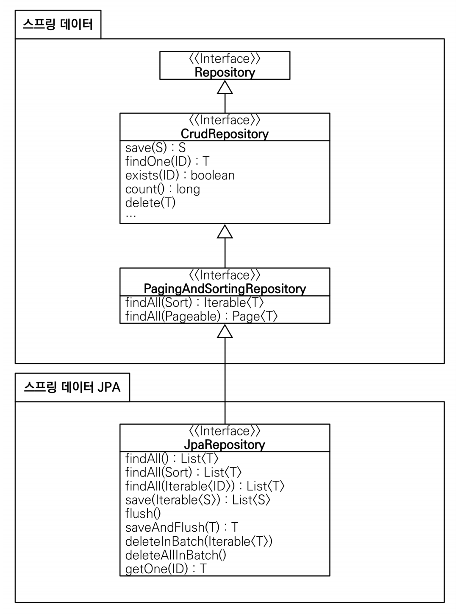
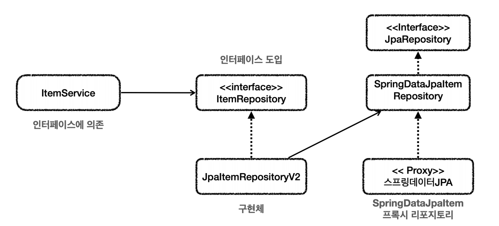

# 스프링 데이터 JPA
> JPA를 편리하게 사용할 수 있도록 도와주는 라이브러리



- `JpaRepository` 인터페이스를 통해서 기본적인 CRUD 기능을 제공한다.
- 공통화 가능한 기능이 거의 모두 포함되어 있다.
- 메서드 이름을 분석해서 쿼리를 자동으로 만들고 실행해주는 기능을 제공한다.
  - [쿼리 메서드 필터 조건](https://docs.spring.io/spring-data/jpa/reference/jpa/query-methods.html#jpa.query-methods.query-creation)

<br>

- 적용 `build.gradle`
```properties
implementation 'org.springframework.boot:spring-boot-starter-data-jpa'
```
여기에는 `JPA`,`하이버네이트`,`스프링 데이터 JPA`,스프링 JDBC 관련 기능도 모두 포함되어 있다.

- JpaRepository
```java
public interface SpringDataJpaItemRepository extends JpaRepository<Item, Long> {

    List<Item> findByItemNameLike(String itemName);

    List<Item> findByPriceLessThanEqual(Integer price);

    //쿼리 메서드(아래와 동일)
    List<Item> findByItemNameLikeAndPriceLessThanEqual(String itemName, Integer price);

    //쿼리 직접 실행
    @Query("select i from Item i where i.itemName like :itemName and i.price <= :price")
    List<Item> findItems(@Param("itemName") String itemName, @Param("price") Integer price);
}
```

- Repository
```java
@Repository
@Transactional
@RequiredArgsConstructor
public class JpaItemRepositoryV2 implements ItemRepository {

    private final SpringDataJpaItemRepository repository;

    @Override
    public Item save(Item item) {
        return repository.save(item);
    }

    @Override
    public void update(Long itemId, ItemUpdateDto updateParam) {
        Item findItem = repository.findById(itemId).orElseThrow();
        findItem.setItemName(updateParam.getItemName());
        findItem.setPrice(updateParam.getPrice());
        findItem.setQuantity(updateParam.getQuantity());
    }

    @Override
    public Optional<Item> findById(Long id) {
        return repository.findById(id);
    }

    @Override
    public List<Item> findAll(ItemSearchCond cond) {
        String itemName = cond.getItemName();
        Integer maxPrice = cond.getMaxPrice();

        if (StringUtils.hasText(itemName) && maxPrice != null) {
//            return repository.findByItemNameLikeAndPriceLessThanEqual(itemName, maxPrice);
            return repository.findItems("%" + itemName + "%", maxPrice);
        } else if (StringUtils.hasText(itemName)) {
            return repository.findByItemNameLike("%" + itemName + "%");
        } else if (maxPrice != null) {
            return repository.findByPriceLessThanEqual(maxPrice);
        } else {
            return repository.findAll();
        }
    }
}
```
`ItemServices`는 `ItemRepository` 인터페이스를 의존하기 때문에 `ItemRepository`를 구현하기 위해 `SpringDataJpaItemRepository`를 사용하는 레포지토리를 하나 만들었다.



- Config
```java
@Configuration
@RequiredArgsConstructor
public class SpringDataJpaConfig {

    private final SpringDataJpaItemRepository repository;

    @Bean
    public ItemService itemService() {
        return new ItemServiceV1(itemRepository());
    }

    @Bean
    public ItemRepository itemRepository() {
        return new JpaItemRepositoryV2(repository);
    }
}

@Slf4j
@Import(SpringDataJpaConfig.class)
@SpringBootApplication(scanBasePackages = "hello.itemservice.web")
public class ItemServiceApplication {

    public static void main(String[] args) {
        SpringApplication.run(ItemServiceApplication.class, args);
    }
}
```