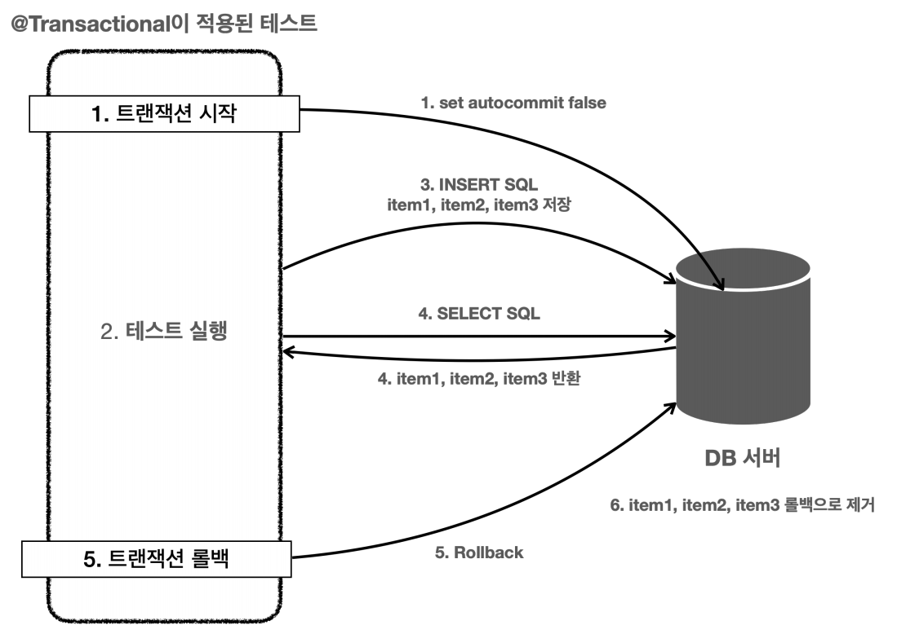

# DB 분리, 롤백

## DB 분리
> 로컬에서 사용하는 DB와 테스트에서 사용하는 DB를 분리한다.

가장 단순한 방법은 테스트 전용 DB를 별도로 운영하는 것이다.
- `jdbc:h2:tcp://localhost/~/test` : local 서버 전용 DB
- `jdbc:h2:tcp://localhost/~/testcase` : 테스트 케이스 전용 DB


- main - application.properties
```properties
spring.profiles.active=local
spring.datasource.url=jdbc:h2:tcp://localhost/~/test
spring.datasource.username=sa
```

- test - application.properties
```properties
spring.profiles.active=local
spring.datasource.url=jdbc:h2:tcp://localhost/~/testcase
spring.datasource.username=sa
```

테스트의 중요한 원칙
- **테스트는 다른 테스트와 격리해야 한다.**
- **테스트는 반복해서 실행할 수 있어야 한다.**

<br>

## 롤백
> 트랜잭션을 사용하여 테스트가 끝나고 나서 데이터를 깔끔하게 원래 상태로 되돌릴 수 있다.

- 테스트 코드
```java
@SpringBootTest
class ItemRepositoryTest {

    @Autowired
    ItemRepository itemRepository;

    @Autowired
    PlatformTransactionManager transactionManager;
    TransactionStatus status;

    @BeforeEach
    void beforeEach() {
        // 트랜잭션 시작
        status = transactionManager.getTransaction(new DefaultTransactionDefinition());
    }

    @AfterEach
    void afterEach() {
        //MemoryItemRepository 의 경우 제한적으로 사용
        if (itemRepository instanceof MemoryItemRepository) {
            ((MemoryItemRepository) itemRepository).clearStore();
        }
        // 트랜잭션 롤백
        transactionManager.rollback(status);
    }

    @Test
    void save() {
        //given
        Item item = new Item("itemA", 10000, 10);

        //when
        Item savedItem = itemRepository.save(item);

        //then
        Item findItem = itemRepository.findById(item.getId()).get();
        assertThat(findItem).isEqualTo(savedItem);
    }

    @Test
    void updateItem() {
        //given
        Item item = new Item("item1", 10000, 10);
        Item savedItem = itemRepository.save(item);
        Long itemId = savedItem.getId();

        //when
        ItemUpdateDto updateParam = new ItemUpdateDto("item2", 20000, 30);
        itemRepository.update(itemId, updateParam);

        //then
        Item findItem = itemRepository.findById(itemId).get();
        assertThat(findItem.getItemName()).isEqualTo(updateParam.getItemName());
        assertThat(findItem.getPrice()).isEqualTo(updateParam.getPrice());
        assertThat(findItem.getQuantity()).isEqualTo(updateParam.getQuantity());
    }

    @Test
    void findItems() {
        //given
        Item item1 = new Item("itemA-1", 10000, 10);
        Item item2 = new Item("itemA-2", 20000, 20);
        Item item3 = new Item("itemB-1", 30000, 30);

        itemRepository.save(item1);
        itemRepository.save(item2);
        itemRepository.save(item3);

        //둘 다 없음 검증
        test(null, null, item1, item2, item3);
        test("", null, item1, item2, item3);

        //itemName 검증
        test("itemA", null, item1, item2);
        test("temA", null, item1, item2);
        test("itemB", null, item3);

        //maxPrice 검증
        test(null, 10000, item1);

        //둘 다 있음 검증
        test("itemA", 10000, item1);
    }

    void test(String itemName, Integer maxPrice, Item... items) {
        List<Item> result = itemRepository.findAll(new ItemSearchCond(itemName, maxPrice));
        assertThat(result).containsExactly(items);
    }
}
```

**스프링은 위와 같은 방식을 `@Transactional`어노테이션 하나로 깔끔하게 해결해준다.** 트랜잭션과 관련된 코드들을 지우고 `@Transactional`만 적용해도 된다.

### @Transactional 원리
> 스프링이 제공하는 `@Transactional` 어노테이션은 로직이 성공적으로 수행되면 `커밋`하도록 동작한다. 그런데 어노테이션이 테스트에 있으면 스프링은
> 테스트를 트랜잭션 안에서 실행하고 테스트가 끝나면 트랜잭션을 자동으로 `롤백`시켜 버린다.



테스트 케이스의 메서드나 클래스의 `@Transactional`을 직접 붙여서 사용할 때만 이렇게 동작한다. 그리고 트랜잭션을 테스트에서 시작하기 때문에 서비스, 레포지토리에 있는
`@Transactional`로 **테스트에서 시작한 트랜잭션에 참여한다.**

만약 DB에 데이터가 잘 들어갔는지 눈으로 확인하고 싶다면 클래스 또는 메서드의 `@Commit` 또는 `@Rollback(false)`를 사용할 수 있다.