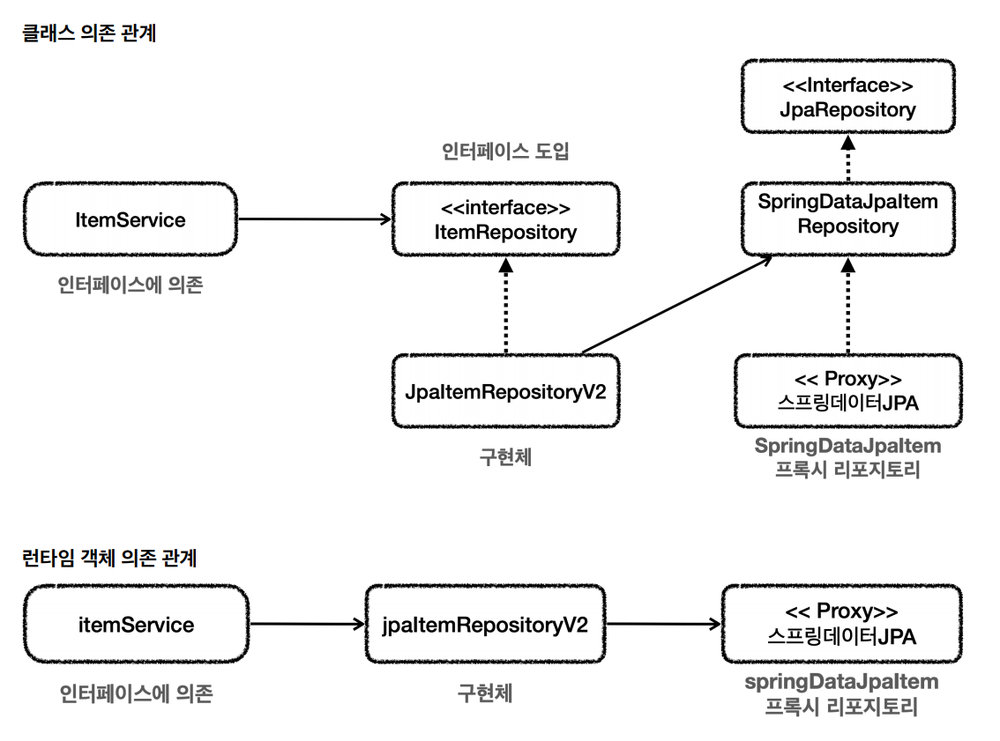
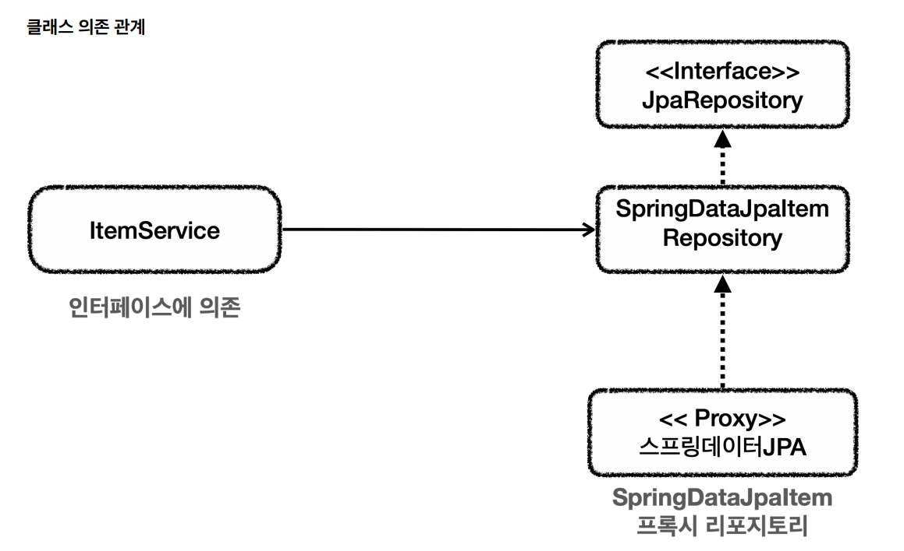
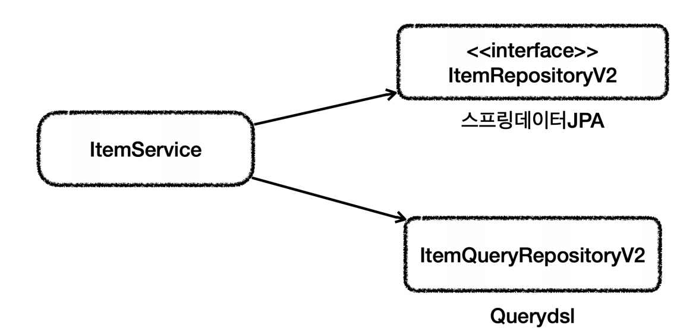

# 활용 방안



중간에서 `JpaItemRepositoryV2`가 어댑터 역할을 해준 덕분에 클라이언트인 `MemberService`가 사용하는 `ItemRepository`인터페이스를 그대로 유지할 수 있고
클라이언트인 `MemberService`의 코드를 변경하지 않아도 된다는 장점이 있었다.

하지만 구조를 맞추기 위해서 중간에 어댑터(`JpaItemRepositoryV2`)가 들어가면서 전체적인 구조가 복잡해졌고 사용하는 클래스도 많아지는 단점이 생겼다.

유지보수 관점에서 `ItemService`를 변경하지 않고 `ItemRepository`의 구현체를 변경할 수 있는 장점이 있다.(`DI`,`OCP`원칙을 지킬 수 있다.) 하지만 구조가 복잡해지면서
어댑터 코드와 실제 코드까지 함께 유지보수 해야 하는 어려움도 동시에 발생한다.

`ItemService` 코드를 일부 고쳐서 직접 `스프링 데이터 JPA`를 사용하는 방법도 있다. `DI`,`OCP` 원칙을 포기하는 대신 복잡한 어댑터를 포기하고 구조를 단순하게 가져갈 수 있는 장점이 있다.<br>
하지만 단점은 향후 변경 유연성이 떨어진다는 것이다.



이런 것이 **트레이드 오프**인데, *구조의 안정성과 단순화 구조, 개발성 편리 사이의 선택이다.*

물론 정답이 있는 것은 아니며 상황에 따라 다르다. 개발은 항상 자원이 무한하지 않다. 그리고 어설픈 추상화는 오히려 독이 되고, 추상화는 **비용이 든다.**
여기서 말하는 비용은 유지보수 관점에서 비용을 뜻한다. 이 추상화 비용을 넘어설 만큼 효과가 있을 때 추상화를 도입하는 것이 실용적일 수 있다.

<br>

## 실용적인 구조


`ItemService`를 수정하여 기본 CRUD와 단순 조회는 `스프링 데이터 JPA`, 복잡한 조회 쿼리는 `Querydsl`이 담당하는 것으로 만들어본다.

- `ItemRepositoryV2`
```java
public interface ItemRepositoryV2  extends JpaRepository<Item, Long> {
}
```
- `ItemQueryRepositoryV2`
```java
@Repository
@RequiredArgsConstructor
public class ItemQueryRepositoryV2 {

    private final JPAQueryFactory query;

    public List<Item> findAll(ItemSearchCond cond) {
        String itemName = cond.getItemName();
        Integer maxPrice = cond.getMaxPrice();

        return query.select(item)
                    .from(item)
                    .where(likeItemName(itemName), maxPrice(maxPrice))
                    .fetch();
    }

    private BooleanExpression likeItemName(String itemName) {
        if (StringUtils.hasText(itemName)) {
            return item.itemName.like("%" + itemName + "%");
        }
        return null;
    }

    private BooleanExpression maxPrice(Integer maxPrice) {
        if (maxPrice != null) {
            return item.price.loe(maxPrice);
        }
        return null;
    }
}
```
- `ItemServiceV2`
```java
@Service
@Transactional
@RequiredArgsConstructor
public class ItemServiceV2 implements ItemService{

    private final ItemRepositoryV2 repository;
    private final ItemQueryRepositoryV2 queryRepository;

    @Override
    public Item save(Item item) {
        return repository.save(item);
    }

    @Override
    public void update(Long itemId, ItemUpdateDto updateParam) {
        Item findItem = repository.findById(itemId).orElseThrow();
        findItem.setItemName(updateParam.getItemName());
        findItem.setPrice(updateParam.getPrice());
        findItem.setQuantity(updateParam.getQuantity());
    }

    @Override
    public Optional<Item> findById(Long id) {
        return repository.findById(id);
    }

    @Override
    public List<Item> findItems(ItemSearchCond itemSearch) {
        return queryRepository.findAll(itemSearch);
    }
}
```
- Config
```java
@Configuration
@RequiredArgsConstructor
public class V2Config {

    private final EntityManager em;
    private final ItemRepositoryV2 itemRepositoryV2; // SpringDataJpa

    @Bean
    public ItemService itemService() {
        return new ItemServiceV2(itemRepositoryV2, itemQueryRepositoryV2());
    }

    @Bean
    public JPAQueryFactory query() {
        return new JPAQueryFactory(em);
    }

    @Bean
    public ItemQueryRepositoryV2 itemQueryRepositoryV2() {
        return new ItemQueryRepositoryV2(query());
    }

    @Bean
    public ItemRepository itemRepository() {
        return new JpaItemRepositoryV3(em,query());
    }
}

@Import(V2Config.class)
@SpringBootApplication(scanBasePackages = "hello.itemservice.web")
public class ItemServiceApplication {

    public static void main(String[] args) {
        SpringApplication.run(ItemServiceApplication.class, args);
    }
}
```