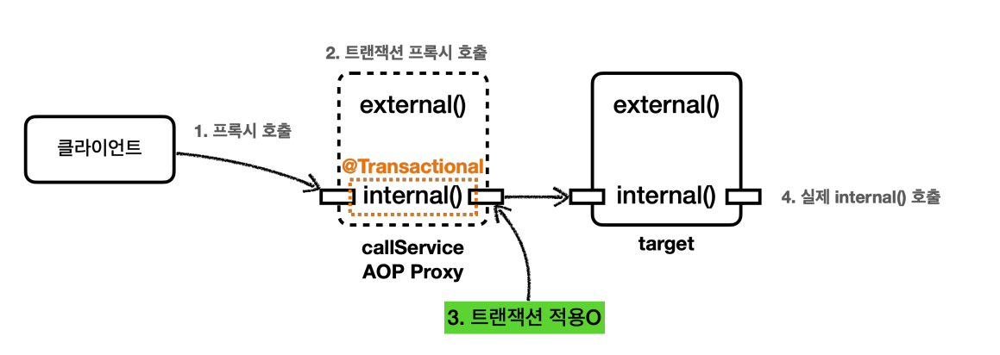
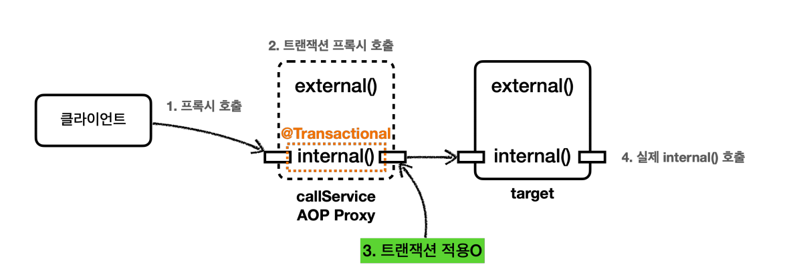
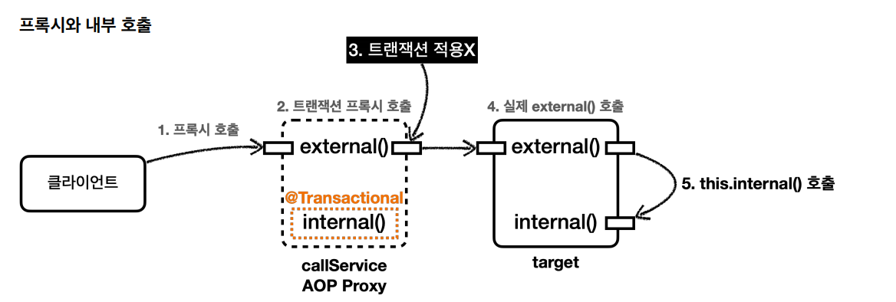
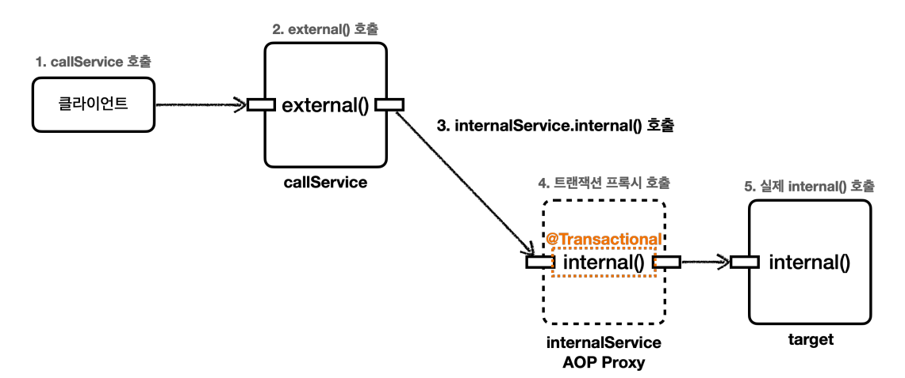

# 트랜잭션 AOP 주의 사항

## 프록시 내부 호출 1
> `@Transactional`을 사용하면 스프링의 트랜잭션 AOP가 적용되고 트랜잭션 AOP는 기본적으로 **프록시 방식**의 AOP를 사용한다.<br>
> `@Transactional`을 적용하면 프록시 객체가 요청을 먼저 받아서 트랜잭션을 처리하고 실제 객체를 호출 해주기 때문에 트랜잭션을 적용하려면 **항상 프록시를 통해서
> 대상 객체(`Target`)을 호출해야 한다.** 이렇게 해야 프록시에서 먼저 트랜잭션을 적용하고 이후에 대상 객체를 호출하게 된다. **만약 프록시를 거치지 않고 대상 객체를 직접
> 호출하게 되면 AOP가 적용되지 않고 트랜잭션도 적용되지 않는다.**



- AOP를 적용하면 스프링은 대상 객체 대신에 **프록시를 스프링 빈으로 등록한다.** 따라서 스프링은 의존관계 주입 시에 항상 실제 객체 대신에 프록시 객체를 주입한다.
  그렇기 때문에 대상 객체를 직접 호출하는 문제는 일반적으로 발생하지는 않는다. **하지만 대상 객체의 내부에서 메서드 호출이 발생하면 프록시를 거치지 않고 대상 객체를
  직접 호출하는 문제가 발생한다.** 이렇게 되면 `@Transactional`이 있어도 트랜잭션이 적용되지 않는다.

<br>

- 테스트 코드
```java
@Slf4j
@SpringBootTest
public class InternalCallV1Test {

    @Autowired CallService callService;

    @Test
    void printProxy() {
        log.info("callService class={}", callService.getClass());
    }

    @Test
    void internalCall() {
        callService.internal();
    }

    @Test
    void externalCall() {
        callService.external();
    }

    @TestConfiguration
    static class InternalCallV1TestConfig{

        @Bean
        CallService callService() {
            return new CallService();
        }
    }

    @Slf4j
    static class CallService{

        public void external() {
          log.info("call external");
          printTxInfo();
          internal();
        }

        @Transactional
        public void internal() {
            log.info("call internal");
            printTxInfo();
        }

        private void printTxInfo() {
            boolean txActive = TransactionSynchronizationManager.isActualTransactionActive();
            log.info("tx active={}",txActive);
        }
    }
}
```
`internalCall()`
- 트랜잭션이 있는 코드인 `internal()`을 호출한다.
- `callService`의 트랜잭션 프록시가 호출된다.
- `internal()`에 `@Transactional`이 있으므로 트랜잭션 프록시는 트랜잭션을 적용한다.
- 트랜잭션 적용 후 실제 객체 인스턴스(`callService`)의 메서드(`internal()`)를 호출한다.
- 실제 객체가 처리를 완료하면 응답이 트랜잭션 프록시로 돌아오고 트랜잭션 프록시는 트랜잭션을 완료한다.



실행 로그
```java
TransactionInterceptor         : Getting transaction for [hello.springtx.apply.InternalCallV1Test$CallService.internal]
InternalCallV1Test$CallService : call internal
InternalCallV1Test$CallService : tx active=true
TransactionInterceptor         : Completing transaction for [hello.springtx.apply.InternalCallV1Test$CallService.internal]
```

`externalCall()`
- 트랜잭션이 없는 코드인 `external()`을 호출한다.
- `@Transactional`이 없기 때문에 트랜잭션 없이 시작한다. 그런데 내부에서 ` @Transactional`이 있는 `internal()`을 호출한다.
- 당연히 `internal()`에서는 트랜잭션이 적용되는 것 처럼 보인다.

실행 로그
```java
CallService     : call external
CallService     : tx active=false
CallService     : call internal
CallService     : tx active=false
```
로그를 보면 트랜잭션 관련 코드는 전혀 보이지 않고 프록시가 아닌 실제 객체(`CallService`)에서 남긴 로그만 확인된다. `tx active`도 `false`다.



`external()`이 *내부에서* `internal()`을 호출할 때 문제가 발생한다.

> 자바 언어에서 메서드 앞에 별도의 참조가 없으면 `this`라는 뜻으로 자기 자신의 인스턴스를 가리킨다. 그래서 `this.internal()`이 호출 되는데 여기서 `this`는
> 자기 자신을 가리키므로 실제 대상 객체(`target`)의 인스턴스를 뜻한다. 이러한 내부 호출은 프록시를 거치지 않기 때문에 트랜잭션을 적용할 수 없다.
> 
> 결과적으로 `target`안에 있는 메서드를 직접 호출한 것이다.

**프록시를 사용하면 메서드 내부 호출에 프록시를 적용할 수 없다.**

<br>

## 프록시 내부 호출 2
> `internal()`메서드를 별도의 클래스로 분리하여 해결한다.

```java
@Slf4j
@SpringBootTest
public class InternalCallV2Test {

    @Autowired CallService callService;

    @Test
    void printProxy() {
        log.info("callService class={}", callService.getClass());
    }

    @Test
    void externalCall() {
        callService.external();
    }

    @TestConfiguration
    static class InternalCallV2TestConfig{

        @Bean
        CallService callService() {
            return new CallService(internalService());
        }

        @Bean
        InternalService internalService() {
            return new InternalService();
        }
    }

    @Slf4j
    @RequiredArgsConstructor
    static class CallService{
        private final InternalService internalService;

        public void external() {
          log.info("call external");
          printTxInfo();
          internalService.internal();
        }

        private void printTxInfo() {
            boolean txActive = TransactionSynchronizationManager.isActualTransactionActive();
            log.info("tx active={}",txActive);
        }
    }

    @Slf4j
    static class InternalService{

        @Transactional
        public void internal() {
            log.info("call internal");
            printTxInfo();
        }

        private void printTxInfo() {
            boolean txActive = TransactionSynchronizationManager.isActualTransactionActive();
            log.info("tx active={}",txActive);
        }
    }
}
```



실행 로그
```java
// CallService.external()
InternalCallV2Test$CallService     : call external
InternalCallV2Test$CallService     : tx active=false
        
// internalService.internal()
TransactionInterceptor             : Getting transaction for [hello.springtx.apply.InternalCallV2Test$InternalService.internal]
InternalCallV2Test$InternalService : call internal
InternalCallV2Test$InternalService : tx active=true
TransactionInterceptor             : Completing transaction for [hello.springtx.apply.InternalCallV2Test$InternalService.internal]
```

이렇게 별도의 클래스로 분리하는 방법을 주로 사용한다.

<br>

## 초기화 시점
> 스프링 초기화 시점에는 트랜잭션 AOP가 적용되지 않을 수 있다.

```java
@SpringBootTest
public class InitTxTest {

    @Autowired Hello hello;

    @Test
    void go() {
        //초기화 코드는 스프링이 초기화 시점에 호출한다.
    }

    @TestConfiguration
    static class InitTxTestConfig{
        @Bean
        Hello hello() {
            return new Hello();
        }
    }

    @Slf4j
    static class Hello{

        @PostConstruct
        @Transactional
        public void initV1() {
            boolean isActive = TransactionSynchronizationManager.isActualTransactionActive();
            log.info("Hello init @PostConstruct tx Axtive={}", isActive);
        }

        @EventListener(ApplicationReadyEvent.class)
        @Transactional
        public void initV2() {
            boolean isActive = TransactionSynchronizationManager.isActualTransactionActive();
            log.info("Hello init ApplicationReadyEvent tx Axtive={}", isActive);
        }
    }
}
```

실행 로그
```java
// initV1()
hello.springtx.apply.InitTxTest$Hello    : Hello init @PostConstruct tx Axtive=false
        
// initV2()
hello.springtx.apply.InitTxTest          : Started InitTxTest in 4.964 seconds (process running for 6.326)
o.s.t.i.TransactionInterceptor           : Getting transaction for [hello.springtx.apply.InitTxTest$Hello.initV2]
hello.springtx.apply.InitTxTest$Hello    : Hello init ApplicationReadyEvent tx Axtive=true
o.s.t.i.TransactionInterceptor           : Completing transaction for [hello.springtx.apply.InitTxTest$Hello.initV2]
```
초기화 코드(`@PostConstruct`)와 `@Transactional`을 함께 사용하면 트랜잭션이 적용되지 않는다.

초기화 코드가 먼저 호출되고 그 다음에 트랜잭션 AOP가 적용되기 때문에 초기화 시점에는 해당 메서드에서 트랜잭션을 획득할 수 없다.

가장 확실한 대안은 `ApplicationReadyEvent` 이벤트를 사용하는 것으로 이 이벤트는 트랜잭션 AOP를 포함한 스프링이 컨테이너가 완전히 생성되고 난 다음에
이벤트가 붙은 메서드를 호출해주기 때문에 트랜잭션이 적용된다.