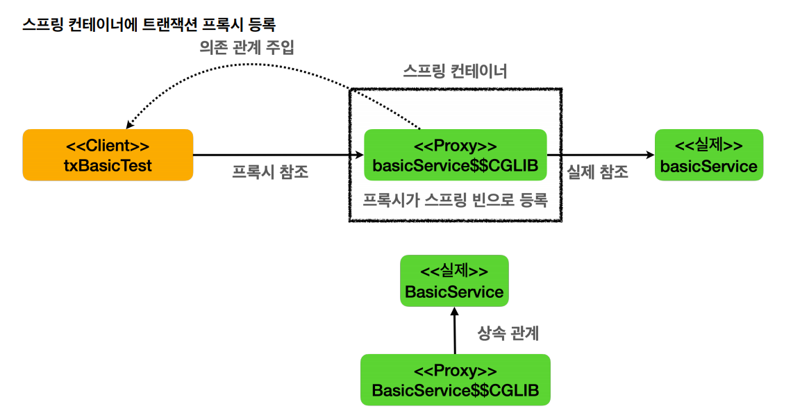
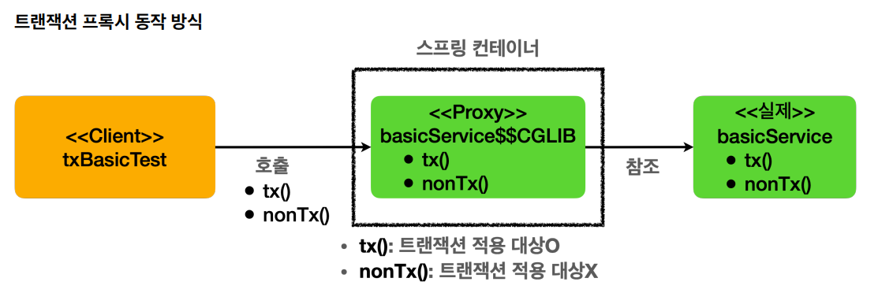

# 트랜잭션 적용

## 트랜잭션 적용 확인
> `@Transactional`을 통해 선언전 트랜잭션 방식을 사용하면 어노테이션 하나로 트랜잭션을 적용할 수 있다. 그런데 이 기능은 트랜잭션 관련 코드가 눈에 보이지 않고
> AOP를 기반으로 동작하기 때문에 실제 트랜잭션이 적용되고 있는지 확인하기가 어렵다. 확인하는 방법을 알아보자.

- 테스트 코드
```java
@Slf4j
@SpringBootTest
public class TxBasicTest {

    @Autowired BasicService basicService;

    @Test
    void proxyCheck() {
        log.info("aop class={}", basicService.getClass());
        assertThat(AopUtils.isAopProxy(basicService)).isTrue();
    }

    @Test
    void txTest() {
        basicService.tx();
        basicService.nonTx();
    }

    @TestConfiguration
    static class TxApplyBasicConfig{
        @Bean
        BasicService basicService() {
            return new BasicService();
        }
    }

    @Slf4j
    static class BasicService{

        @Transactional
        public void tx() {
            log.info("call tx");
            boolean txActive = TransactionSynchronizationManager.isActualTransactionActive();
            log.info("tx active={}", txActive);
        }

        public void nonTx() {
            log.info("call nonTx");
            boolean txActive = TransactionSynchronizationManager.isActualTransactionActive();
            log.info("tx active={}", txActive);
        }
    }
}
```
**proxyCheck()**
- `AopUtils.isAopProxy()` : `@Transactional`을 메서드나 클래스에 붙이면 해당 객체는 AOP 적용의 대상이 되고 실제 객체 대신에 트랜잭션을 처리해주는
프록시 객체가 스프링 빈에 등록된다. 주입을 받을 때도 실제 객체 대신에 프록시 객체가 주입된다.
- 실행 결과
  - ```java
    aop class=class hello.springtx.apply.TxBasicTest$BasicService$$SpringCGLIB$$0
    ```



- `@Transactional`어노테이션이 특정 클래스나 메서드에 하나라도 있으면 트랜잭션 AOP는 프록시를 만들어서 스프링 컨테이너에 등록한다. 그리고 실제 객체 대신에
`{객체 이름}$$CGLIB`를 스프링 빈에 등록한다. 그리고 프록시는 내부에 실제 객체를 참조하게 된다. **실제 객체 대신에 프록시가 스프링 컨테이너에 등록이 되는 것이다.**
- 클라이언트 코드는 DI를 할 때 스프링 컨테이너에는 실제 객체 대신에 프록시가 스프링 빈으로 등록되어 있기 때문에 프록시를 주입한다.
- 프록시는 실제 객체를 상속해서 만들어지기 때문에 **다형성을 활용할 수 있다.**



- 로그 확인 설정
```properties
logging.level.org.springframework.transaction.interceptor=TRACE
```
트랜잭션 프록시가 호출하는 트랜잭션의 시작과 종료를 명확하게 로그로 확인할 수 있다.

`basicService.tx()` 호출
- 클라이언트가 이 메서드를 호출하면 프록시의 메서드가 호출되고 여기서 프록시는 메서드가 트랜잭션을 사용할 수 있는지 확인해본다. `@Transactional`이 붙어있으므로 트랜잭션 적용 대상이다.
- 트랜잭션을 시작한 다음에 실제 객체의 메서드를 호출한다.
- 그리고 실제 객체의 호출이 끝나서 프록시로 리턴 되면 프록시는 트랜잭션 로직을 **커밋하거나 롤백 해서 트랜잭션을 종료한다.**

`basicService.nonTx()` 호출
- 마찬가지로 이 메서드가 트랜잭션을 사용할 수 있는지 확인해본다. `@Transactional`이 없으므로 트랜잭션 적용 대상이 아니다.
- 트랜잭션을 시작하지 않고 실제 객체의 메서드를 호출하고 종료한다.

`TransactionSynchronizationManager.isActualTransactionActive();` : 현재 쓰레드에 트랜잭션이 적용되어 있는지 확인할 수 있다.

실행 결과
```java
// tx()
TransactionInterceptor   : Getting transaction for [hello.springtx.apply.TxBasicTest$BasicService.tx]
TxBasicTest$BasicService : call tx
TxBasicTest$BasicService : tx active=true
TransactionInterceptor   : Completing transaction for [hello.springtx.apply.TxBasicTest$BasicService.tx]
// nonTx()
TxBasicTest$BasicService : call nonTx
TxBasicTest$BasicService : tx active=false
```

<br>

## 트랜잭션 적용 위치
> 스프링에서 우선순위는 항상 **더 구체적이고 더 자세한 것이 높은 우선순위를 가진다.** 메서드와 클래스 중 더 구체적인 메서드가 더 높은 우선순위를 가진다.

- 테스트 코드
```java
@SpringBootTest
public class TxLevelTest {

    @Autowired LevelService levelService;

    @Test
    void orderTest() {
        levelService.write();
        levelService.read();
    }

    @TestConfiguration
    static class TxLevelTestConfig{
        @Bean
        LevelService levelService() {
            return new LevelService();
        }
    }

    @Slf4j
    @Transactional(readOnly = true)
    static class LevelService{

        @Transactional(readOnly = false)
        public void write() {
            log.info("call write");
            printTxInfo();
        }

        public void read() {
            log.info("call read");
            printTxInfo();
        }

        private void printTxInfo() {
            boolean txActive = TransactionSynchronizationManager.isActualTransactionActive();
            log.info("tx active={}",txActive);
            boolean readOnly = TransactionSynchronizationManager.isCurrentTransactionReadOnly();
            log.info("tx readOnly={}", readOnly);
        }
    }
}
```
스프링의 `@Transactional` 2가지 규칙
1. 우선순위 규칙
   - 트랜잭션을 사용할 때는 다양한 옵션을 사용할 수 있는데 `LevelService`에 클래스와 메서드에 다른 옵션이 붙어있다. 클래스 보다는 메서드가 더 구체적이므로
     `write()`에는 `readOnly=false` 옵션이 적용이 된다.
2. 클래스에 적용하면 메서드는 자동 적용
   - `read()`메서드에는 `@Transactional`이 없기 때문에 더 상위인 클래스를 확인한다. 클래스에 `readOnly=true`이 적용되어 있기 때문에 `read()`메서드도 따라서 받게 된다.
- `readOnly=false`가 default값이다.
- `TransactionSynchronizationManager.isCurrentTransactionReadOnly();` : 현재 트랜잭션에 적용된 `readOnly`옵션 값을 반환한다.

실행 결과
```java
// write()
TransactionInterceptor   : Getting transaction for [hello.springtx.apply.TxLevelTest$LevelService.write]
TxLevelTest$LevelService : call write
TxLevelTest$LevelService : tx active=true
TxLevelTest$LevelService : tx readOnly=false
TransactionInterceptor   : Completing transaction for [hello.springtx.apply.TxLevelTest$LevelService.write]
// read()
TransactionInterceptor   : Getting transaction for [hello.springtx.apply.TxLevelTest$LevelService.read]
TxLevelTest$LevelService : call read
TxLevelTest$LevelService : tx active=true
TxLevelTest$LevelService : tx readOnly=true
TransactionInterceptor   : Completing transaction for [hello.springtx.apply.TxLevelTest$LevelService.read]
```

## 인터페이스 @Transactional 
인터페이스에 적용 시 우선순위

1. 클래스의 메서드
2. 클래스 타입
3. 인터페이스의 메서드
4. 인터페이스 타입

구체적인 것이 더 높은 우선순위를 가진다고 생각하면 이해하기 쉽다.


