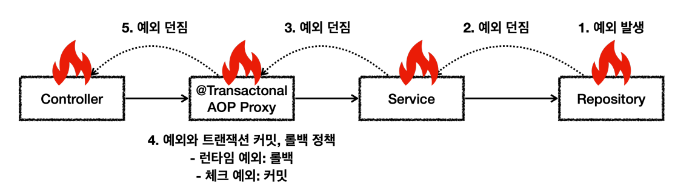

# 예외와 트랜잭션 커밋, 롤백



예외 발생 시 스프링 트랜잭션 AOP는 예외의 종류에 따라 트랜잭션을 커밋하거나 롤백한다.
- 언체크 예외인 `RuntimeException`, `Error`와 그 하위 예외가 발생하면 트랜잭션은 롤백한다.
- 체크 예외인 `Exception`과 그 하위 예외가 발생하면 트랜잭션은 커밋한다.
- 정상 응답(리턴)하면 트랜잭션을 커밋한다.

테스트 코드
```java
@SpringBootTest
public class RollbackTest {

    @Autowired RollbackService rollbackService;

    @Test
    void runtimeException() {
        assertThatThrownBy(rollbackService::runtimeException)
                .isInstanceOf(RuntimeException.class);
    }

    @Test
    void checkedException() {
        assertThatThrownBy(rollbackService::checkedException)
                .isInstanceOf(MyException.class);
    }

    @Test
    void rollbackFor() {
        assertThatThrownBy(rollbackService::rollbackFor)
                .isInstanceOf(MyException.class);
    }

    @TestConfiguration
    static class RollbackTestConfig{

        @Bean
        RollbackService rollbackService() {
            return new RollbackService();
        }
    }

    @Slf4j
    static class RollbackService{
        //런타임 예외 발생 : 롤백
        @Transactional
        public void runtimeException() {
            log.info("call runtimeException");
            throw new RuntimeException();
        }

        //체크 예외 발생 : 커밋
        @Transactional
        public void checkedException() throws MyException {
            log.info("call checkedException");
            throw new MyException();
        }

        //체크 예외 rollbackFor 지정 : 롤백
        @Transactional(rollbackFor = MyException.class)
        public void rollbackFor() throws MyException {
            log.info("call checkedException");
            throw new MyException();
        }
    }

    static class MyException extends Exception {
    }

}
```
- application.properties
```properties
logging.level.org.springframework.transaction.interceptor=TRACE
logging.level.org.springframework.jdbc.datasource.DataSourceTransactionManager=DEBUG

logging.level.org.springframework.orm.jpa.JpaTransactionManager=DEBUG
logging.level.org.hibernate.resource.transaction=DEBUG
```
트랜잭션이 커밋 되었는지 롤백 되었는지 로그로 확인할 수 있다. 지금은 JPA를 사용하므로 트랜잭션 매니저로 `JpaTransactionManager`가 실행된다.

- **runtimeException() 실행 결과**
```java
jpa.JpaTransactionManager    : Creating new transaction with name [hello.springtx.exception.RollbackTest$RollbackService.runtimeException]: PROPAGATION_REQUIRED,ISOLATION_DEFAULT
jpa.JpaTransactionManager    : Opened new EntityManager [SessionImpl(561370431<open>)] for JPA transaction
jpa.JpaTransactionManager    : Exposing JPA transaction as JDBC [org.springframework.orm.jpa.vendor.HibernateJpaDialect$HibernateConnectionHandle@3f78a5ed]
TransactionInterceptor       : Getting transaction for [hello.springtx.exception.RollbackTest$RollbackService.runtimeException]
RollbackTest$RollbackService : call runtimeException
TransactionInterceptor       : Completing transaction for [hello.springtx.exception.RollbackTest$RollbackService.runtimeException] after exception: java.lang.RuntimeException
JpaTransactionManager        : Initiating transaction rollback
JpaTransactionManager        : Rolling back JPA transaction on EntityManager [SessionImpl(561370431<open>)]
JpaTransactionManager        : Closing JPA EntityManager [SessionImpl(561370431<open>)] after transaction
```
`Initiating transaction rollback` : `RuntimeException`이 발생하므로 트랜잭션이 롤백된다.

- **checkedException() 실행 결과**
```java
JpaTransactionManager        : Creating new transaction with name [hello.springtx.exception.RollbackTest$RollbackService.checkedException]: PROPAGATION_REQUIRED,ISOLATION_DEFAULT
JpaTransactionManager        : Opened new EntityManager [SessionImpl(1183205098<open>)] for JPA transaction
JpaTransactionManager        : Exposing JPA transaction as JDBC [org.springframework.orm.jpa.vendor.HibernateJpaDialect$HibernateConnectionHandle@31de8099]
TransactionInterceptor       : Getting transaction for [hello.springtx.exception.RollbackTest$RollbackService.checkedException]
RollbackTest$RollbackService : call checkedException
TransactionInterceptor       : Completing transaction for [hello.springtx.exception.RollbackTest$RollbackService.checkedException] after exception: hello.springtx.exception.RollbackTest$MyException
JpaTransactionManager        : Initiating transaction commit
JpaTransactionManager        : Committing JPA transaction on EntityManager [SessionImpl(1183205098<open>)]
JpaTransactionManager        : Closing JPA EntityManager [SessionImpl(1183205098<open>)] after transaction
```
`Initiating transaction commit` : `Exception`을 상속받은 `MyException`은 체크 예외이므로 트랜잭션이 커밋된다.

- **rollbackFor() 실행 결과**
```java
jpa.JpaTransactionManager    : Creating new transaction with name [hello.springtx.exception.RollbackTest$RollbackService.rollbackFor]: PROPAGATION_REQUIRED,ISOLATION_DEFAULT,-hello.springtx.exception.RollbackTest$MyException
jpa.JpaTransactionManager    : Opened new EntityManager [SessionImpl(108767749<open>)] for JPA transaction
jpa.JpaTransactionManager    : Exposing JPA transaction as JDBC [org.springframework.orm.jpa.vendor.HibernateJpaDialect$HibernateConnectionHandle@5d373794]
TransactionInterceptor       : Getting transaction for [hello.springtx.exception.RollbackTest$RollbackService.rollbackFor]
RollbackTest$RollbackService : call checkedException
TransactionInterceptor       : Completing transaction for [hello.springtx.exception.RollbackTest$RollbackService.rollbackFor] after exception: hello.springtx.exception.RollbackTest$MyException
JpaTransactionManager        : Initiating transaction rollback
JpaTransactionManager        : Rolling back JPA transaction on EntityManager [SessionImpl(108767749<open>)]
JpaTransactionManager        : Closing JPA EntityManager [SessionImpl(108767749<open>)] after transaction
```
`Initiating transaction rollback` : `rollbackFor`옵션을 사용해 체크 예외를 지정했으므로 기본 정책과 무관하게 특정 체크 예외도 강제로 롤백이 됐다.

<br>

## 스프링이 체크 예외를 커밋하는 이유

스프링은 기본적으로 `체크 예외`는 비즈니스 의미가 있을 때 사용하고 `런타임(언체크)` 예외는 복구 불가능한 예외로 가정한다.

꼭 이런 정책을 따를 필요는 없고 필요할 때는 `rollbackFor` 옵션을 사용하여 체크 예외도 롤백하면 된다.

그렇다면 비즈니스 의미가 있는 **비즈니스 예외**라는 것은 무엇일까? 

주문을 하는데 상황에 따라 다음과 같이 조치한다.
1. **정상** : 주문시 결제를 성공하면 주문 데이터를 저장하고 결제 상태를 `완료`로 처리한다.
2. **시스템 예외** : 주문시 내부에 복구 불가능한 예외가 발생하면 전체 데이터를 롤백한다.
3. **비즈니스 예외** : 주문시 결제 잔고가 부족하면 주문 데이터를 저장하고 결제 상태를 `대기`로 처리한다.
   - **이 경우 고객에게 잔고 부족을 알려야 한다.**

만약 결제 잔고가 부족해서 `NotEnoughMoneyException`이 발생한다면 이 예외는 시스템에 문제가 있어서 발생하는 시스템 예외가 아니라 비즈니스 상황에서 문제가 되기 때문에
발생한 예외이다. 고객의 잔고가 부족한 것은 시스템에 문제가 있는 것은 아니기 때문에 시스템은 문제 없이 동작한 것이고 비즈니스 상황이 예외인 것이다.

이런 예외를 **비즈니스 예외**라 하고 비즈니스 예외는 매우 중요하다. 반드시 처리해야 하는 경우가 많으므로 `체크 예외`를 고려할 수 있다.

- `NotEnoughMoneyException`
```java
/**
 * 체크 예외 - Exception을 상속받았기 때문
 */
public class NotEnoughMoneyException extends Exception{
    public NotEnoughMoneyException(String message) {
        super(message);
    }
}
```
- Order 엔티티
```java
@Entity
@Table(name = "orders")
@Getter @Setter
public class Order {

    @Id @GeneratedValue
    private Long id;

    private OrderStatus orderStatus; //정상, 예외, 잔고부족
    private PayStatus payStatus; //대기, 완료

    @Getter
    @AllArgsConstructor
    public enum OrderStatus{
        NORMAL("정상"),
        EXCEPTION("예외"),
        INSUFFICIENT_BALANCE("잔고 부족");

        private final String message;
    }

    @Getter
    @AllArgsConstructor
    public enum PayStatus{
        WAITING("대기"),
        COMPLETED("완료");

        private final String message;
    }
}
```
- OrderRepository
```java
public interface OrderRepository extends JpaRepository<Order, Long> {
}
```
간단한 CRUD만 사용하므로 스프링 데이터 JPA를 사용한다.

- OrderService
```java
import static hello.springtx.order.Order.OrderStatus.*;
import static hello.springtx.order.Order.PayStatus.*;

@Slf4j
@Service
@RequiredArgsConstructor
public class OrderService {

    private final OrderRepository orderRepository;

    // JPA는 트랜잭션 커밋 시점에 Order 데이터를 DB에 반영한다.
    @Transactional
    public void order(Order order) throws NotEnoughMoneyException {
        log.info("order 호출");
        orderRepository.save(order);

        log.info("결제 프로세스 진입");
        if (order.getOrderStatus().equals(EXCEPTION)) {
            log.info("시스템 예외 발생");
            throw new RuntimeException("시스템 예외");
            
        } else if (order.getOrderStatus().equals(INSUFFICIENT_BALANCE)) {
            log.info("잔고 부족 비즈니스 예외 발생");
            order.setPayStatus(WAITING);
            throw new NotEnoughMoneyException("잔고가 부족합니다.");
            
        } else {
            // 정상 승인
            log.info("정상 승인");
            order.setPayStatus(COMPLETED);
        }
        
        log.info("결제 프로세스 완료");
    }
}
```
`OrderStatus`에 따라 처리 프로세스가 다르다.
- `기본` : `payStatus`를 `완료` 상태로 처리하고 정상 처리된다.
- `예외` : 런타임 예외가 발생한다.
- `잔고 부족` : `payStatus`를 `대기`상태로 처리 후 체크 예외가 발생한다. 체크 예외가 발생하지만 커밋되기를 기대한다.

테스트 코드
```java
@Slf4j
@SpringBootTest
class OrderServiceTest {

    @Autowired OrderService orderService;
    @Autowired OrderRepository orderRepository;

    @Test
    @DisplayName("프로세스 정상 수행")
    void complete() throws NotEnoughMoneyException {
        // given
        Order order = new Order();
        order.setOrderStatus(NORMAL);
        // when
        orderService.order(order);
        // then
        Order findOrder = orderRepository.findById(order.getId()).get();

        assertThat(findOrder.getPayStatus()).isEqualTo(COMPLETED);
    }

    @Test
    @DisplayName("런타임 예외로 롤백이 되므로 order 데이터는 비어있다.")
    void runtimeException() throws NotEnoughMoneyException {
        // given
        Order order = new Order();
        order.setOrderStatus(EXCEPTION);
        // when
        assertThatThrownBy(() -> orderService.order(order))
                .isInstanceOf(RuntimeException.class);

        // then
        Optional<Order> orderOptional = orderRepository.findById(order.getId());
        assertThat(orderOptional.isEmpty()).isTrue();
    }

    @Test
    @DisplayName("체크 예외로 커밋 되므로 `대기` 상태로 저장된다.")
    void bizException() {
        // given
        Order order = new Order();
        order.setOrderStatus(INSUFFICIENT_BALANCE);
        // when
        try {
            orderService.order(order);
        } catch (NotEnoughMoneyException e) {
            log.info("고객에게 잔고 부족을 알리고 별도의 계죄로 입금하도록 안내");
        }

        // then
        Order findOrder = orderRepository.findById(order.getId()).get();
        assertThat(findOrder.getPayStatus()).isEqualTo(WAITING);
    }
}
```
```properties
logging.level.org.hibernate.SQL=DEBUG
```
JPA(하이버네이트)가 실행하는 SQL을 로그로 확인할 수 있다.

`NotEnoughMoneyException`은 시스템에 문제가 발생한 것이 아니라 비즈니스 문제 상황을 예외를 통해 알려준다. 마치 예외가 리턴 값 처럼 사용된 것이다.
이 경우에는 트랜잭션을 커밋하는 것이 맞으며 롤백하면 데이터가 사라지게 된다. 롤백하면 잔고 부족을 알리고 다른 대안으로 안내해도 주문 데이터 자체가 사라지기 때문에 문제가 된다.

비즈니스 상황에 따라 체크 예외의 경우에도 롤백을 하고 싶다면 `rollbackFor`옵션을 사용하면 된다.