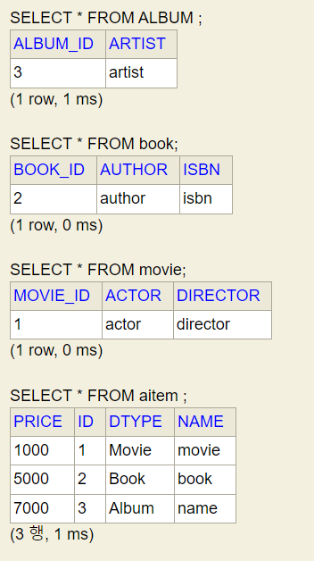
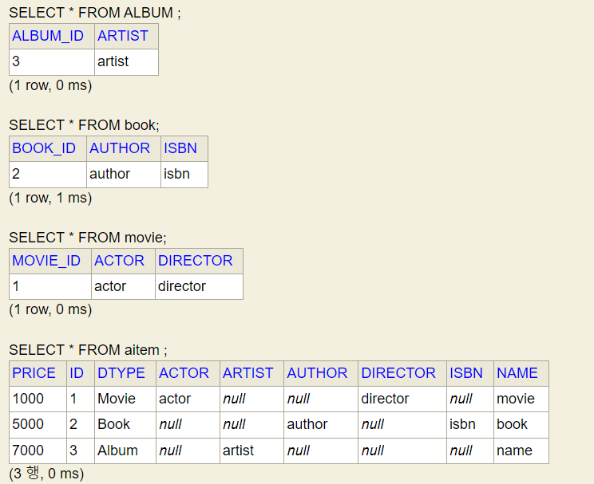
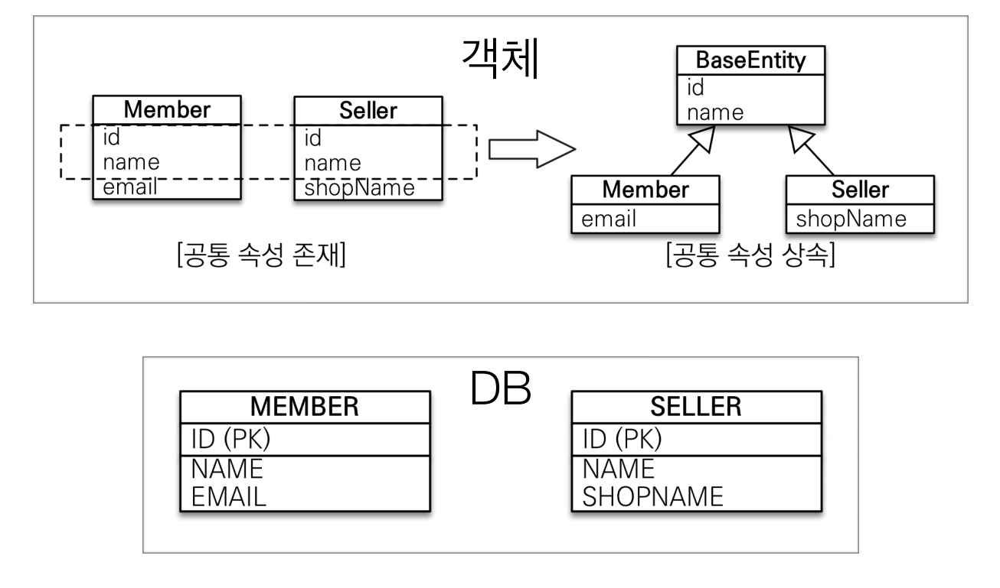

# 상속관계 매핑
관계형 DB에는 객체지향 언어에서 다루는 `상속`이라는 개념이 없고 대신 '슈퍼타입 서브타입 관계'라는 모델링 기법이 객체의 상속 개념과 가장 유사하다.

- **각각의 테이블로 변환** : 각각을 모두 테이블로 만들고 조회할 때 조인을 사용한다. JPA에서는 `조인 전략`이라고 한다.
- **통합 테이블로 변환** : 테이블을 하나만 통합해서 사용한다. JPA에서는 `단일 테이블 전략`이라고 한다.
- **서브타입 테이블로 변환** : 서브 타입마다 하나의 테이블을 만든다. JPA에서는 `구현 클래스마다 테이블 전략`이라고 한다.

## 조인 전략
> 엔티티 각각을 모두 테이블로 만들고 자식 테이블이 부모 테이블의 기본 키를 받아서 `기본 키 + 외래 키`로 사용하는 전략이다. 조회할 때 조인을 자주 사용한다.
> 
> 주의할 점은 객체는 타입으로 구분할 수 있지만 테이블은 타입의 개념이 없다. 그래서 타입을 구분하는 컬럼을 추가해야 한다.(예: `DTYPE`)


```java
@Entity
@Inheritance(strategy = InheritanceType.JOINED)
@DiscriminatorColumn(name = "DTYPE")
public abstract class Item {
    @Id @GeneratedValue
    private Long id;

    private String name;
    private int price;
}

@Entity
@DiscriminatorValue("Album")
@PrimaryKeyJoinColumn(name = "album_id")
public class Album extends Item {
    private String artist;
}

@Entity
@DiscriminatorValue("Movie")
@PrimaryKeyJoinColumn(name = "movie_id")
public class Movie extends Item{
    private String director;
    private String actor;
}

@Entity
@DiscriminatorValue("Book")
@PrimaryKeyJoinColumn(name = "book_id")
public class Book extends Item{
    private String author;
    private String isbn;
}
```
- `@Inheritance(strategy = InheritanceType.JOINED)` : 부모 클래스에 매핑 전략을 조인 전략을 지정했다.
- `@DiscriminatorColumn(name = "DTYPE")` : 부모 클래스에 구분 컬럼을 지정한다. 기본값이 `DTYPE`이다.
- `@DiscriminatorValue` : 엔티티를 저장할 때 구분 컬럼에 입력할 값을 지정한다.
- `@PrimaryKeyJoinColumn` : 자식 테이블은 부모 테이블의 ID 컬렴명을 그대로 사용하는 게 기본값인데, 재정의를 할 수 있다.



**조인 전략**
- **장점**
  - 테이블이 정규화 된다.
  - 외래 참조 무결성 제약조건을 활용할 수 있다.
  - 저장공간을 효율적으로 사용한다.
- **단점**
  - 조회할 때 조인을 많이 사용하므로 성능이 저하될 수 있다.
  - 조회 쿼리가 복잡하다.
  - 데이터를 등록할 `INSERT SQL`을 두 번 실행한다.

<br>

## 단일 테이블 전략
> 이름 그대로 테이블을 하나만 사용한다. 구분 컬럼(`DTYPE`)으로 어떤 자식 데이터가 저장되었는지 구분한다.


```java
@Entity
@Inheritance(strategy = InheritanceType.SINGLE_TABLE)
@DiscriminatorColumn(name = "DTYPE")
public abstract class AItem {...}
```
`@Inheritance(strategy = InheritanceType.SINGLE_TABLE)` : 전략을 단일 테이블로 지정하고 변경한 것은 없다.



**단일 테이블 전략**
- **장점**
  - 조인이 필요 없으므로 일반적으로 조회 성능이 빠르다.
  - 조회 쿼리가 단순하다.
- **단점**
  - 자식 엔티티가 매핑한 컬럼은 모두 `null`을 허용해야 한다.
  - 단일 테이블에 모든 것을 저장하므로 테이블이 커질 수 있다. 상황에 따라서는 조회 성능이 오히려 느려질 수 있다.
- **특징**
  - 구분 컬럼이 필수이기에 `@DiscriminatorColumn`을 꼭 설정해야 한다.(생략 시 `DTYPE`자동 설정)
  - 자식 엔티티에 `@DiscriminatorValue`를 지정하지 않으면 기본으로 엔티티 이름을 사용한다.

<br>

## 구현 클래스마다 테이블 전략
> 자식 엔티티마다 테이블을 만든다. 그리고 자식 테이블 각각에 필요한 컬럼이 모두 있다.


```java
@Entity
@Inheritance(strategy = InheritanceType.TABLE_PER_CLASS)
public abstract class Item {
    @Id @GeneratedValue
    private Long id;

    private String name;
    private int price;
}

@Entity
public class Album extends Item {
    private String artist;
}

@Entity
public class Movie extends Item {
    private String director;
    private String actor;
}

@Entity
public class Book extends Item {
    private String author;
    private String isbn;
}
```
`@Inheritance(strategy = InheritanceType.TABLE_PER_CLASS)` : 구현 클래스마다 테이블 전략을 사용한다.

**구현 클래스마다 테이블 전략**
- **장점**
  - 서브 타입을 구분해서 처리할 때 효과적이다.
  - `not null` 제약조건을 사용할 수 있다.
- **단점**
  - **여러 자식 테이블을 함께 조회할 때 성능이 느리다.(`UNION`을 사용해 조회한다.)**
  - 자식 테이블을 통합해서 쿼리하기 어렵다.
- **특징**
  - 구분 컬럼을 사용하지 않는다.
  - **이 전략은 일반적으로 추천하지 않고 조인이나 단일 테이블 전략을 사용하는 것이 좋다.**

<br>

# @MappedSuperClass
> 부모 클래스는 테이블과 매핑하지 않고 부모 클래스를 상속 받는 자식 클래스에 매핑 정보만 제공하고 싶을 때 사용한다.



```java
import javax.annotation.processing.Generated;

@MappedSuperClass
public abstract class BaseEntity {
    @Id @GeneratedValue
    private Long id;
    private String name;
}

@Entity
public class Member extends BaseEntity{
    //Id, name 상속
    private String email;
}

@Entity
public class Seller extends BaseEntity {
    //Id, name 상속
    private String shopName;
}
```

부모로부터 물려 받은 매핑 정보를 재정의하려면 `@AttributeOverrides`나 `@AttributeOverride`를 사용하고, 연관관계를 재정의하려면 `@AssociationOverrides`나 `@AssociationOverride`를 사용한다.
```java
//한 컬럼을 재정의
@Entity
@AttributeOverride(name = "id", column = @Column(name = "member_id"))
public class Member extends BaseEntity{...}

//컬럼 여러 개를 재정의
@Entity
@AttributeOverrides(
    @AttributeOverride(name = "id", column = @Column(name = "member_id"))
    @AttributeOverride(name = "name", column = @Column(name = "member_name"))
)
public class Member extends BaseEntity{...}
```

- **@MappedSuperClass 특징**
  - 테이블과 매핑하지 않고 자식 클래스에 엔티티의 매핑 정보를 상속하기 위해 사용한다.
  - `@MappedSuperClass`로 지정한 클래스는 엔티티가 아니므로 조회, 검색이 안 된다.
  - 직접 생성해서 사용할 일은 거의 없으므로 추상 클래스로 사용하는 것이 좋다.
  - **등록일자, 수정일자, 등록자, 수정자 같은 여러 엔티티에서 공통으로 사용하는 속성을 효과적으로 관리할 수 있다.**