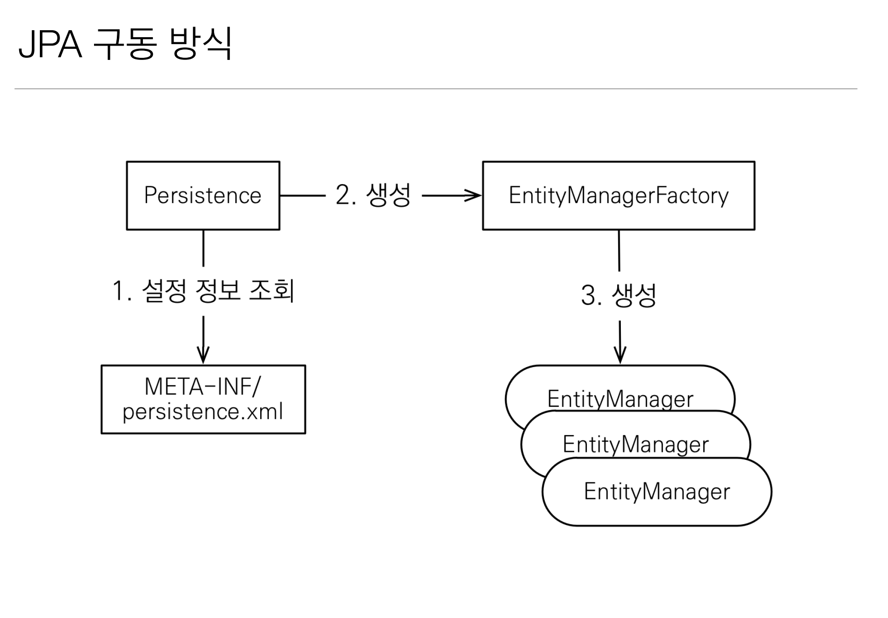
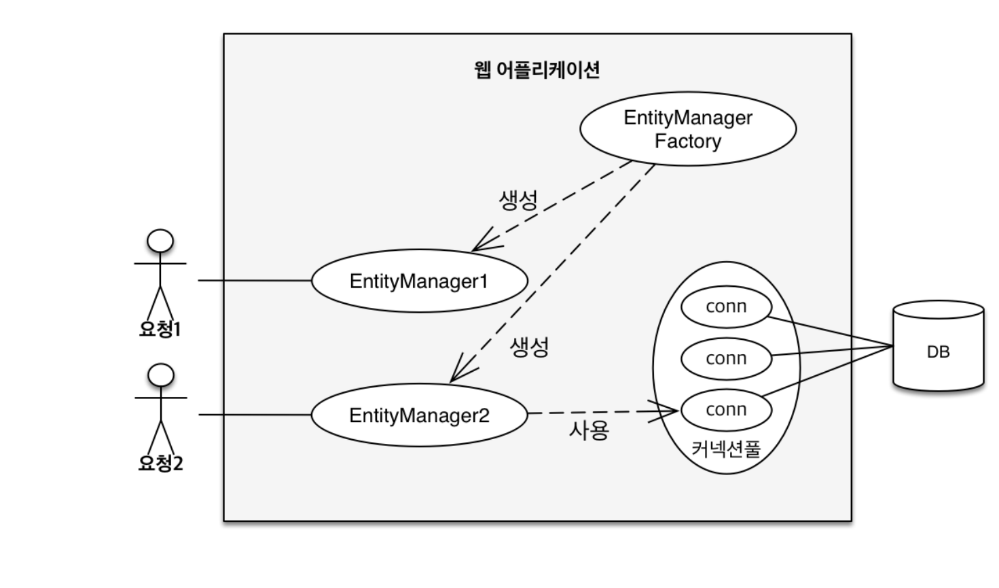

# 엔티티 매니저 팩토리와 엔티티 매니저



데이터베이스를 하나만 사용하는 애플리케이션은 일반적으로 `EntityManagerFactory`를 하나만 생성한다.

```java
EntityManagerFactory emf = Persistence.createEntityManagerFactory("hello");
```
엔티티 매니저 팩토리를 생성하는 코드다. `META-INF/persistence.xml`에 있는 정보를 바탕으로 `EntityManagerFactory`를 생성한다.
```xml
<!--persistence.xml-->
<persistence-unit name="hello">
        <properties>
            <property name="jakarta.persistence.jdbc.driver" value="org.h2.Driver"/>
            <property name="jakarta.persistence.jdbc.user" value="sa"/>
            <property name="jakarta.persistence.jdbc.password" value=""/>
            <property name="jakarta.persistence.jdbc.url" value="jdbc:h2:tcp://localhost/~/jpa"/>
            ...
</persistence-unit>
```
이제 필요할 때마다 엔티티 매니저 팩토리에서 엔티티 매니저를 생성할 수 있다.
```java
EntityManager em = emf.createEntityManager();
```

엔티티 매니저 팩토리는 이름 그대로 엔티티 매니저를 생산하는 공장인데 **공장을 만드는 비용은 상당히 크다.** 따라서 한 개만 만들어서 애플리케이션 전체에서 공유하도록
설계되어 있다. 반면에 공장에서 엔티티 매니저를 생성하는 비용은 거의 들지 않는다.

**엔티티 매니저 팩토리는 여러 쓰레드가 동시에 접근해도 안전하므로 서로 다른 쓰레드 간에 공유해도 되지만,<br>
엔티티 매니저는 여러 쓰레드가 동시에 접근하면 동시성 문제가 발생하므로 쓰레드 간에 절대 공유하면 안 된다.**



그림을 보면 하나의 `EntityManagerFactory`에서 다수의 엔티티 매니저를 생성했다. `EntityManager1`은 아직 DB 커넥션을
사용하지 않는데 엔티티 매니저는 DB 연결이 꼭 필요한 시점까지 커넥션을 얻지 않는다. `EntityManager2`는 커넥션을 사용 중인데
보통 트랜잭션을 시작할 때 커넥션을 획득한다.

하이버네이트를 포함한 JPA 구현체들은 `EntityManagerFactory`를 생성할 때 커넥션 풀도 만든다.(`persistence.xml`을 보면 DB 접속 정보가 있다.)