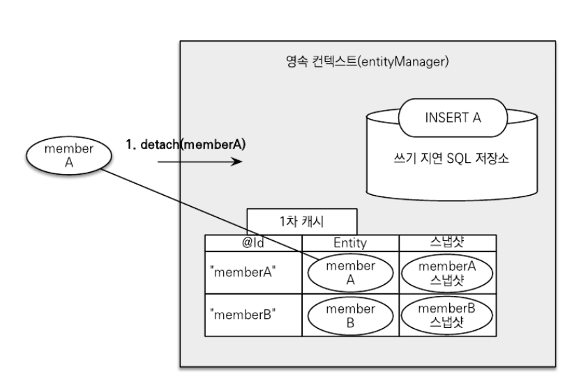
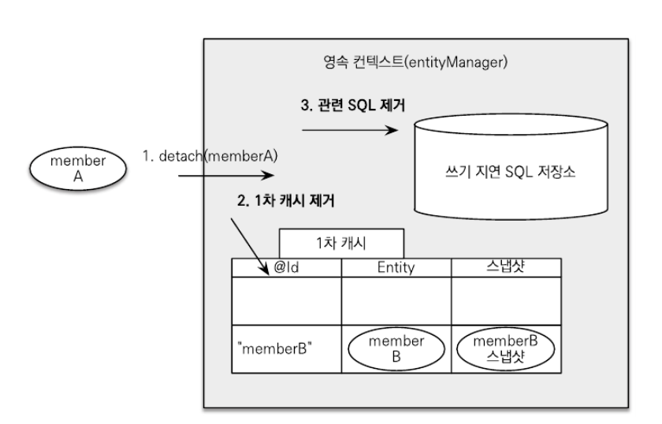
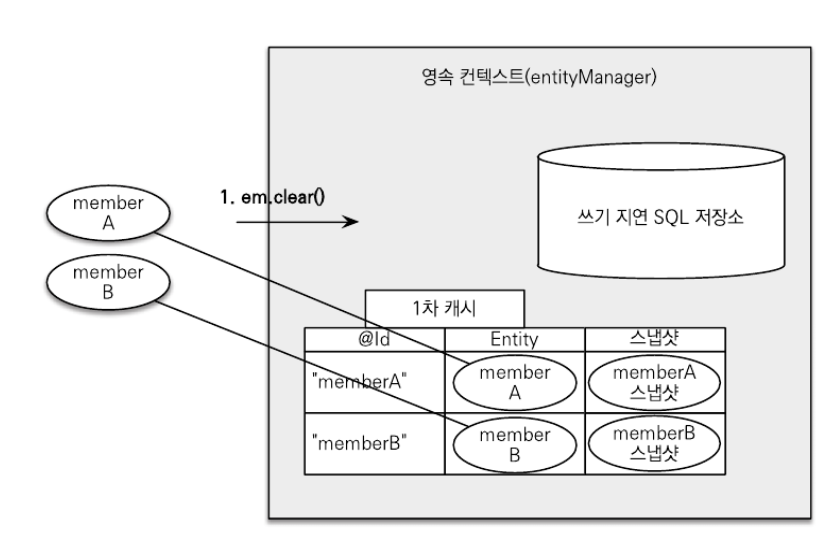
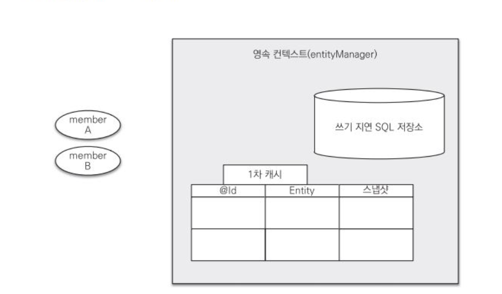
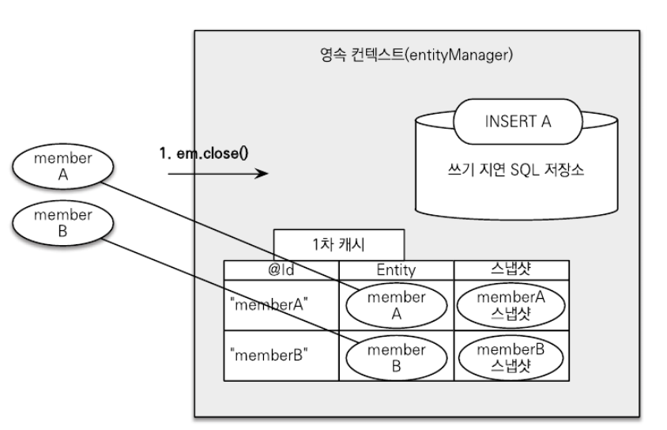
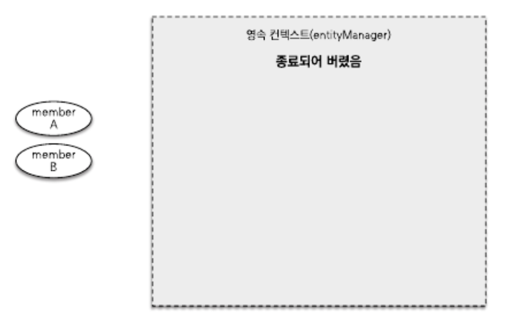
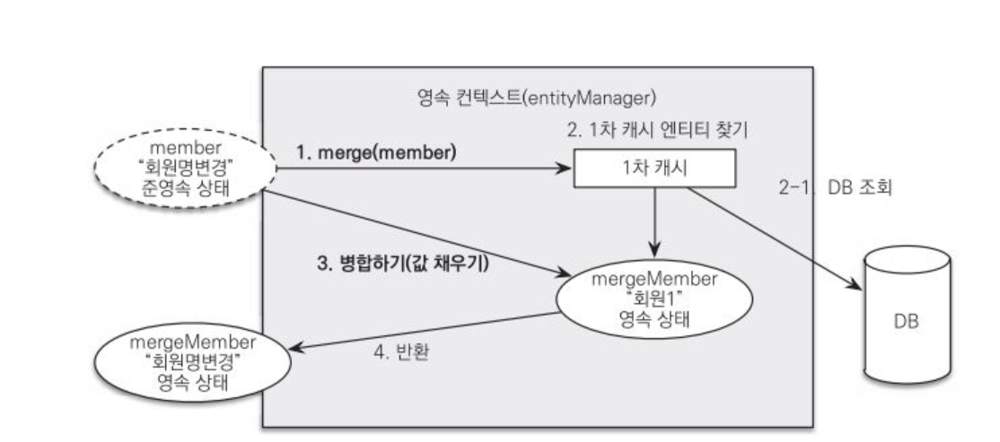

# 플러시
> 영속성 컨텍스트의 변경 내용을 데이터베이스에 반영한다.

플러시를 실행하면
1. 변경 감지가 동작해서 영속성 컨텍스트에 있는 모든 엔티티를 스냅샷과 비교해서 수정된 엔티를 찾는다. 수정된 엔티티는 수정 쿼리를 만들어 쓰기 지연
   SQL 저장소에 등록한다.
2. 쓰기 지연 SQL 저장소의 쿼리를 DB에 전송한다.(등록, 수정, 삭제 쿼리)

영속성 컨텍스트를 플러시하는 방법
1. `em.flush()` : 직접 호출
   - 강제로 플러시한다. 거의 사용하지 않는다.
2. `트랜잭션 커밋 시` : 자동 호출
   - DB에 변경 내용을 SQL로 전달하지 않고 트랜잭션만 커밋하면 어떤 데이터도 DB에 반영되지 않는다. 트랜잭션을 커밋하기 전에 꼭 플러시를 호출해서 영속성 컨텍스트의
     변경 내용을 DB에 반영해야 한다. JPA는 이런 문제를 예방하기 위해 트랜잭션을 커밋할 때 플러시를 자동으로 호출한다.
3. `JPQL 쿼리 실행 시` : 자동 호출

### 플러시 모드 옵션
- `em.setFlushMode(FlushModeType.AUTO)` : 커밋이나 쿼리를 실행할 때 플러시(기본값), 대부분 사용
- `em.setFlushMode(FlushModeType.COMMIT)` : 커밋할 때만 플러시

> **플러시는 영속성 컨텍스트의 보관된 엔티티를 지우지 않는다. 영속성 컨텍스트의 변경 내용을 DB에 동기화하는 것이 플러시다.**
> 
> DB와 동기화를 최대한 늦추는 것이 가능한 이유는 트랜잭션이라는 작업 단위가 있기 때문이다. 트랜잭션 커밋 직전에만 변경 내용을 DB에 보내 동기화하면 된다.

<br>

# 준영속 
> 영속성 컨텍스트가 관리하는 영속 상태의 엔티티가 영속성 컨텍스트에서 분리된 상태다.
> 
> 준영속 상태의 엔티티는 영속성 컨텍스트가 제공하는 기능을 사용할 수 없다.

영속 상태의 엔티티를 준영속 상태로 만드는 방법
1. `em.detach(entity)` : 특정 엔티티만 준영속 상태로 변환
2. `em.clear()` : 영속성 컨텍스트를 완전히 초기화
3. `em.close()` : 영속성 컨텍스트를 종료

### em.detach()
```java
em.persist(member); // 영속 상태

em.detach(member); // 영속성 컨텍스트에서 분리, 준영속 상태

transaction.commit(); // 커밋
```
`em.detach()`는 영속성 컨텍스트에게 해당 엔티티를 더 이상 관리하지 말라는 의미이다. 이 메서드를 호출하는 순간 1차 캐시부터 쓰기 지연 SQL 저장소까지 해당
엔티티를 관리하기 위한 모든 정보가 제거된다.

- detach() 실행 전



- detach() 실행 후



### em.clear()
> `em.detach()`가 특정 엔티티 하나를 준영속 상태로 만들었다면 `em.clear()`는 영속성 컨텍스트를 초기화해서 해당 영속성 컨텍스트의 모든 엔티티를 
> 준영속 상태로 만든다.
```java
Member member = em.find(Member.class, "memberA");// 엔티티 조회, 영속 상태

em.clear(); // 영속성 컨텍스트 초기화

member.setName("hello"); // 준영속 상태에서 변경 시도
```

- 영속성 컨텍스트 초기화 전



- 영속성 컨텍스트 초기화 후



영속성 컨텍스트에 있는 모든 것이 초기화 됐다. 영속성 컨텍스트를 제거하고 새로 만든 것과 같다. 이제 `memberA`와 `memberB`는 준영속 상태다.
준영속 상태이므로 영속성 컨텍스트가 지원하는 변경 감지는 동작하지 않기 때문에 이름을 변경해도 DB에 반영되지 않는다.

### em.close()
> 영속성 컨텍스트를 종료하면 해당 영속성 컨텍스트가 관리하던 영속 상태의 엔티티가 모두 준영속 상태가 된다.
```java
transaction.begin(); // 트랜잭션 시작
        
Member memberA = em.find(Member.class, "memberA");
Member memberB = em.find(Member.class, "memberB");

transaction.commit(); // 트랜잭션 커밋

em.close; // 영속성 컨텍스트 닫기(종료)
```

- 영속성 컨텍스트 제거 전



- 영속성 컨텍스트 제거 후



영속성 컨텍스트가 종료되어 더는 `memberA`, `memberB`가 관리되지 않는다.

> 영속 상태의 엔티티는 주로 영속성 컨텍스트가 종료되면서 준영속 상태가 된다. 보통은 개발자가 직접 준영속 상태로 만드는 일은 없다.

### 준영속 상태 특징
- **비영속 상태에 가깝다.**
  - 영속성 컨텍스트가 관리하지 않으므로 1차 캐시, 쓰기 지연, 변경 감지, 지연 로딩을 포함한 영속성 컨텍스트가 제공하는 어떠한 기능도 동작하지 않는다.
- **식별자 값을 가지고 있다.**
  - 비영속 상태는 식별자 값이 없을 수도 있지만 준영속 상태는 이미 한 번 영속 상태였으므로 반드시 식별자 값을 가지고 있다.
- **지연 로딩을 할 수 없다.**
  - `지연 로딩(Lazy Loagind)`은 실제 객체 대신 프록시 객체를 로딩해두고 해당 객체를 실제 사용할 때 영속성 컨텍스트를 통해 데이터를 불러오는 방법이다.
  - 준영속 상태는 영속성 컨텍스트가 더는 관리하지 않으므로 지연 로딩 시 문제가 발생한다.

### 병합: merge()
> 준영속 상태의 엔티티를 다시 영속 상태로 변경하려면 병합을 사용한다. `merge()` 메서드는 준영속 상태의 엔티티를 받아서 그 정보로 새로운 영속 상태의 
> 엔티티를 반환한다.
```java
public class MergeExample {

    static EntityManagerFactory emf =
            Persistence.createEntityManagerFactory("hello");

    public static void main(String[] args) {
        // 1
        Member member = createMember("회원1");

        // 2. 준영속 상태에서 변경
        member.setName("회원명 변경");

        // 3
        mergeMember(member);
    }

    static Member createMember(String username) {
        // 영속성 컨텍스트 1 시작
        EntityManager em1 = emf.createEntityManager();
        EntityTransaction tx1 = em1.getTransaction();
        tx1.begin();

        Member member = new Member(username);

        em1.persist(member);
        tx1.commit();

        em1.close();
        /**
         * 영속성 컨텍스트1 종료
         * member 엔티티는 준영속 상태가 된다.
         */
        return member;
    }

    static void mergeMember(Member member) {
        // 영속성 컨텍스트2 시작
        EntityManager em2 = emf.createEntityManager();
        EntityTransaction tx2 = em2.getTransaction();

        tx2.begin();
        Member mergeMember = em2.merge(member);
        tx2.commit();

        // 준영속 상태
        System.out.println("member.getName() = " + member.getName());

        // 영속 상태
        System.out.println("mergeMember.getName() = " + mergeMember.getName());

        System.out.println("em2.contains(member) = " + em2.contains(member));
        System.out.println("em2.contains(mergeMember) = " + em2.contains(mergeMember));

        em2.close(); // 영속성 컨텍스트2 종료
    }
}
```
- 출력 결과
```java
member.getName() = 회원명 변경
mergeMember.getName() = 회원명 변경
em2.contains(member) = false
em2.contains(mergeMember) = true
```

1. `Member member = createMember("hello");`
   - member 엔티티는 `createMember()`메서드의 영속성 컨텍스트1에서 영속 상태였다가 영속성 컨텍스트1이 종료 되면서 준영속 상태가 되었다.
   - `createMember()`메서드는 준영속 상태의 member 엔티티를 반환한다.
2. ` member.setName("회원명 변경");`
   - 회원 이름을 변경했지만 준영속 상태인 member 엔티티를 관리하는 영속성 컨텍스트가 더는 존재하지 않으므로 수정 사항을 DB에 반영할 수 없다.
3. `mergeMember(member);`
   - 준영속 상태의 엔티티를 수정하려면 준영속 상태를 다시 영속 상태로 변경해야 하는데 이때 병합(`merge()`)을 사용한다.
   - 새로운 영속성 컨텍스트2를 시작하고 `merge(member)`를 호출해서 준영속 상태의 엔티티를 영속 상태로 변경했다.
   - 영속 상태이므로 트랜잭션을 커밋할 때 수정했던 내용이 DB에 반영된다.
   - 정확히는 member 엔티티가 준영속 -> 영속 상태로 변경된 것은 아니고 `mergeMember`라는 새로운 영속 상태의 엔티티가 반환된 것이다.

`merge()` 동작 방식



1. `merge()` 실행
2. 파라미터로 넘어온 준영속 엔티티의 식별자 값으로 1차 캐시에서 엔티티 조호
   - 만약 1차 캐시에 엔티티가 없으면 DB에서 엔티티를 조회하고 1차 캐시에 저장한다.
3. 조회한 영속 엔티티(`mergeMember`)에 member 엔티티의 값을 채워 넣는다.
   - member 엔티티의 모든 값을 `mergeMember`에 밀어 넣는다. 이때 `mergeMember`의 "회원1"이 "회원명 변경"으로 바뀐다.
4. `mergeMember`를 반환한다.

`em2.contains(member) = false`를 보면 파라미터로 넘어온 member 엔티티는 준영속 상태이므로 `false`,<br>
`em2.contains(mergeMember) = true`를 보면 새롭게 병합된 영속 상태의 엔티티는 `true`이다.<br>
즉, 준영속 상태인 `member` 엔티티와 영속 상태인 `mergeMember` 엔티티는 서로 완전히 다른 인스턴스다. 준영속 상태인 `member` 엔티티는 이제 사용할
필요가 없기 때문에 준영속 엔티티를 참조하던 변수를 영속 엔티티를 참조하도록 변경하는 것이 안전하다.(덮어씌운다.)
```java
// Member mergeMember = em2.merge(member); 아래 코드로 변경
member = em2.merge(member);
```

- **비영속 병합**

병합(`merge()`)은 비영속 엔티티도 영속 상태로 만들 수 있다.
```java
Member member = new MembeR();
Member newMember = em.merge(member); // 비영속 병합
transaction.commit();
```

병합은 파라미터로 넘어온 엔티티의 식별자 값으로 영속성 컨텍스트를 조회하고 찾는 엔티티가 없으면 DB에서 조회한다. DB에서도 발견하지 못하면 새로운 엔티티를
생성해서 병합한다. 

병합은 준영속, 비영속을 신경 쓰지 않고 식별자 값으로 조회할 수 있으면 불러서 병합하고 조회할 수 없으면 새로 생성해서 병합한다.<br>
병합은 `save or update`기능을 수행한다.


