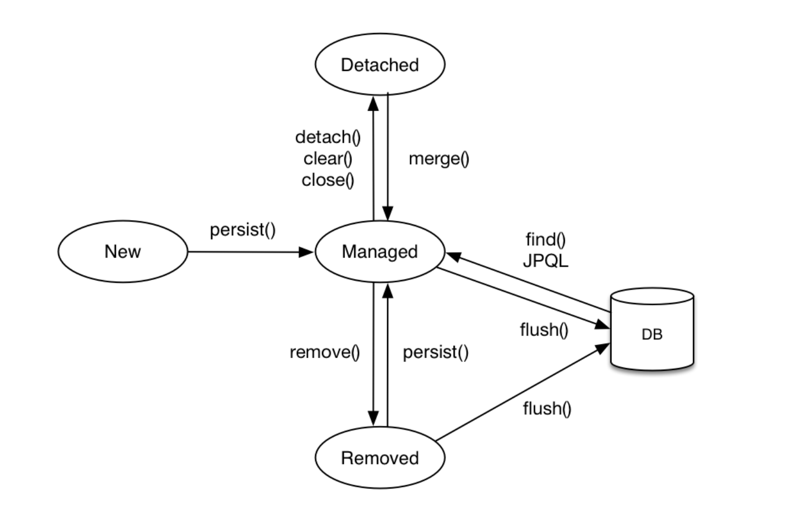
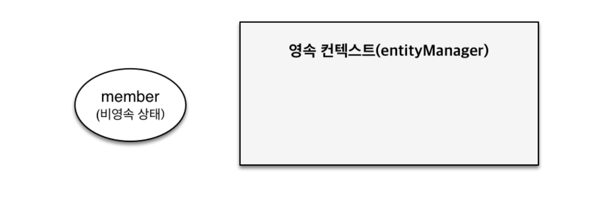
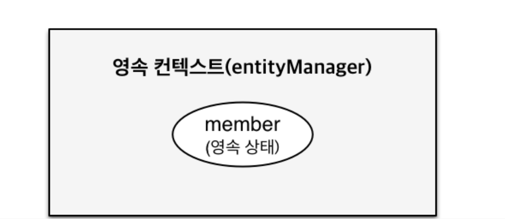
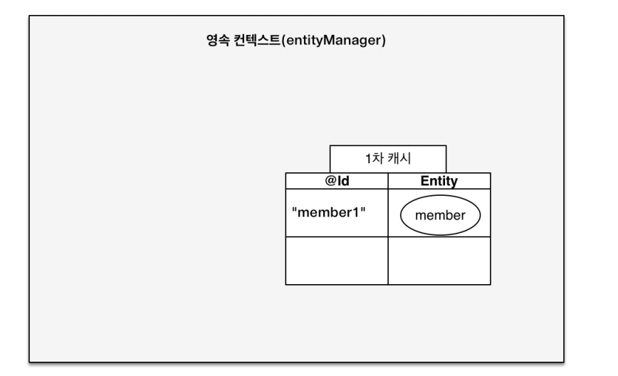
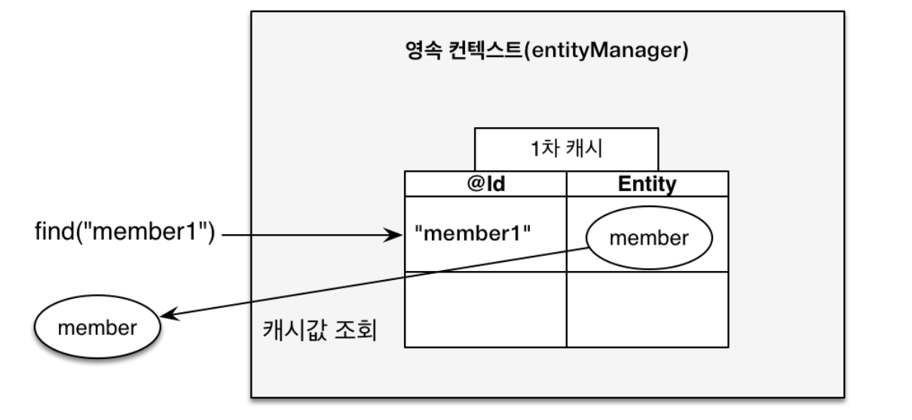
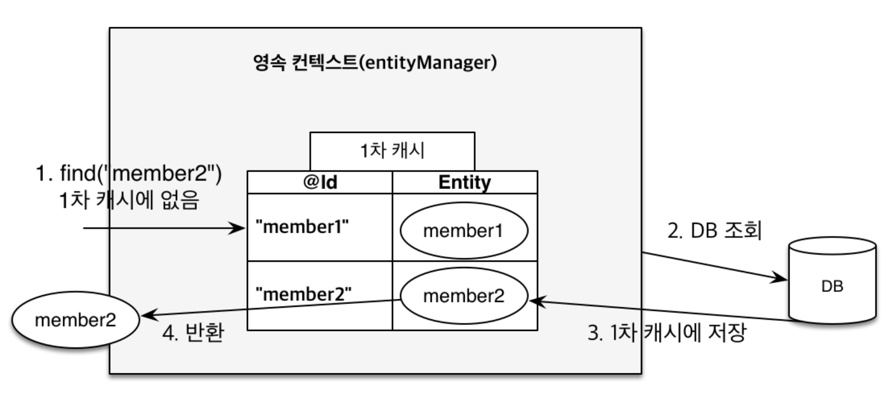
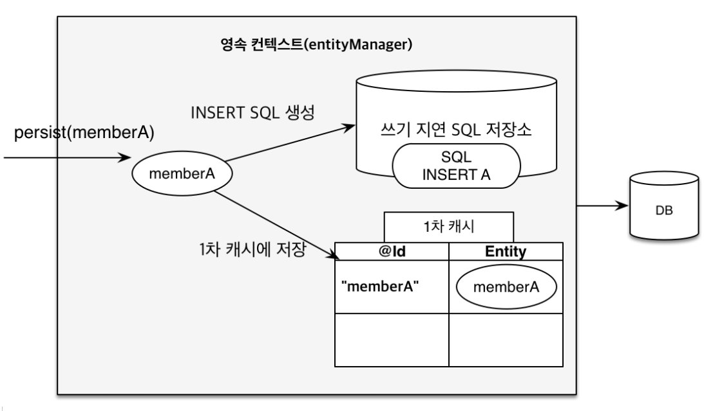
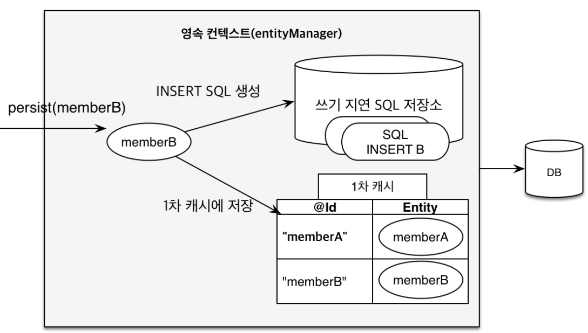
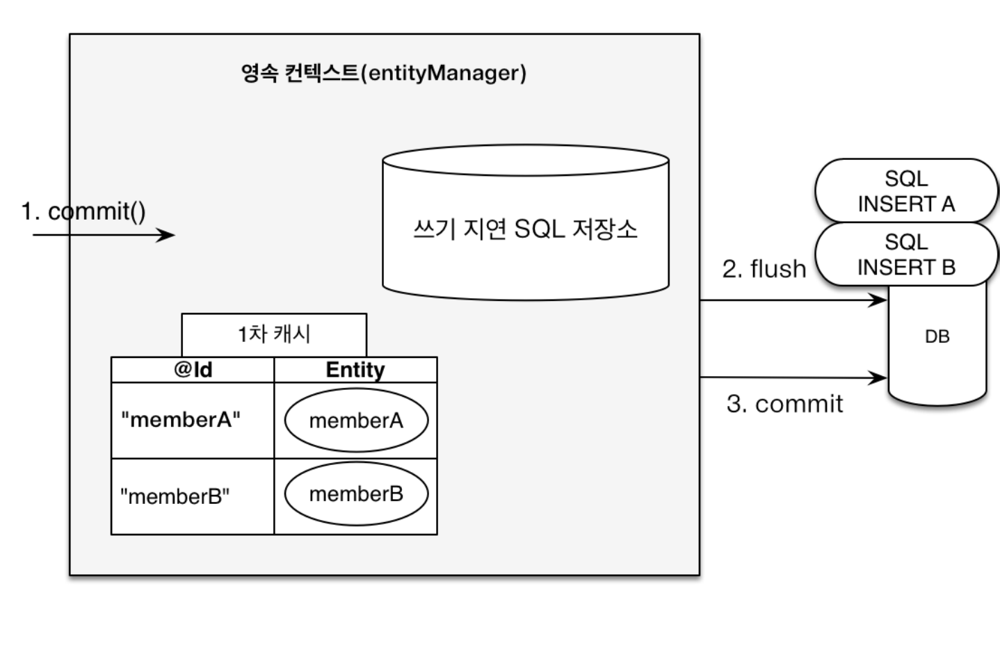
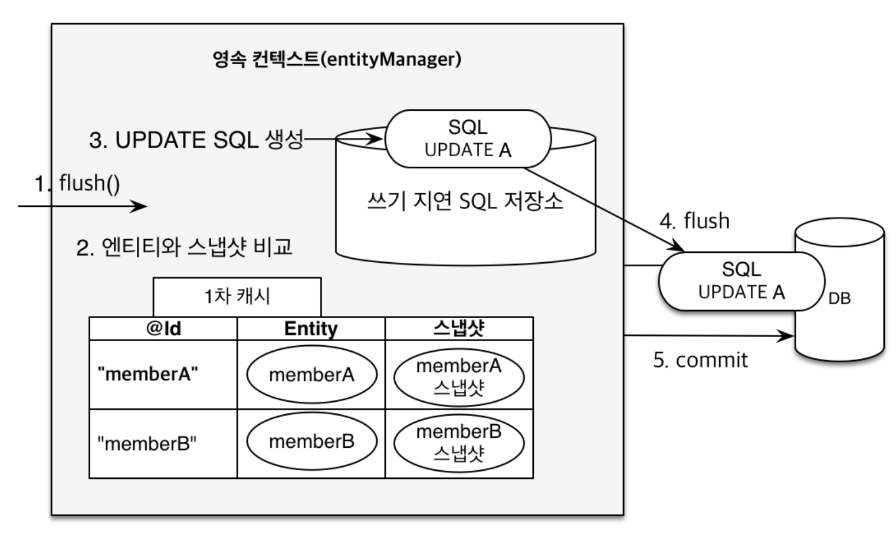

# 영속성 컨텍스트

## 영속성 컨텍스트란?
> `JPA`를 이해하는 데 가장 중요한 용어는 **영속성 컨텍스트(persistence conetxt)이다. `엔티티를 영구 저장하는 환경`이라는 뜻이다.**
> 
> 엔티티 매니저로 엔티티를 저장하거나 조회하면 엔티티 매니저는 영속성 컨텍스트에 엔티티를 보관하고 관리한다.
> 
> `em.persist(member);`가 정확히는 **엔티티 매니저를 사용해서 회원 엔티티를 영속성 컨텍스트에 저장하는 것이다.** 논리적인 개념이고 눈으로 확인할 수 없다.
> 
> 영속성 컨텍스트는 엔티티 매니저를 생성할 때 하나 만들어지고 엔티티 매니저를 통해서 영속성 컨텍스트에 접근할 수 있고 관리할 수 있다.

## 엔티티의 생명 주기
- **비영속(new/transient)** : 영속성 컨텍스트와 전혀 관계가 없는 새로운 상태
- **영속(managed)** : 영속성 컨텍스트에 저장된 상태
- **준영속(detached)** : 영속성 컨텍스트에 저장되었다가 분리된 상태
- **삭제(removed)** : 삭제된 상태



### 비영속
> 엔티티 객체를 생성했다. 순수한 객체 상태이며 아직 저장하지 않았다. 영속성 컨텍스트나 DB와는 전혀 관련이 없는 상태이다.
> ```java
> Member member = new Member();
> member.setId(1L);
> member.setName("member1");
> ```


### 영속
> 엔티티 매니저를 통해서 엔티티를 영속성 컨텍스트에 저장했다. 이렇게 **영속성 컨텍스트가 관리하는 엔티티를 영속 상태라 한다. 영속 상태라는 것은 영속성 컨텍스트에
> 의해 관리된다는 뜻이다.**<br>
> `em.find()`나 JPQL을 사용해서 조회한 엔티티도 영속성 컨텍스트가 관리하는 영속 상태다.<br>
> **중요한 점은 `persist()`하는 순간에 DB에 쿼리가 나가지 않는다.**
> ```java
> em.persist(member);
> ```


### 준영속
> 영속성 컨텍스트가 관리하면 영속 상태의 엔티티를 영속성 컨텍스트가 관리하지 않으면 준영속 상태가 된다. 
> ```java
> em.detach(member); // 또는
> em.close(); // 영속성 컨텍스트를 닫는다. 또는
> em.clear(); // 영속성 컨텍스트를 초기화한다.
> ```

### 삭제
> 엔티티를 영속성 컨텍스트와 DB에서 삭제한다.
> ```java
> em.remove(member);
> ```

<br>

## 영속성 컨텍스트 특징
- 영속성 컨텍스트와 식별자 값
  - 영속성 컨텍스트는 엔티티를 식별자 값(`@Id`)으로 구분하기 때문에 **영속 상태는 식별자 값이 반드시 있어야 한다. 없으면 예외가 발생한다.**
- DB 저장
  - 트랜잭션을 커밋하는 순간 영속성 컨텍스트에 새로 저장된 엔티티를 DB에 반영한다. 이것을 `플러시(flush)`라 한다.
- 영속성 컨텍스트가 엔티티를 관리할 때 얻을 수 있는 이점
  - 1차 캐시
  - 동일성 보장
  - 트랜잭션을 지원하는 쓰기 지연
  - 변경 감지
  - 지연 로딩

### 엔티티 조회
> 영속성 컨텍스트는 내부에 캐시를 가지고 있는데 이것을 `1차 캐시`라 한다. 영속 상태에 있는 엔티티는 모두 이곳에 저장된다. 영속성 컨텍스트 내부에 `Map`형태로
> 키는 `@Id`, 값은 엔티티 인스턴스가 된다.

```java
// 비영속 상태
Member member = new Member();
member.setName("member1");
// 영속 상태
em.persiste(member);
```
위 코드를 실행하면 그림처럼 1차 캐시에 회원 엔티티를 저장한다.(아직 DB에는 저장되지 않았다.)



영속성 컨텍스트에 데이터를 저장하고 조회하는 모든 기준은 DB 기본 키(`PK`) 값이다.

**이번에는 엔티티를 조회 해보자.**
```java
em.find(Member.class, 1L);
```
엔티티 클래스 타입과 식별자 값을 파라미터로 받는다.

`em.find()`를 호출하면 **먼저 1차 캐시에서 엔티티를 찾고 만약 찾는 엔티티가 1차 캐시에 없으면 그 때 DB에서 조회한다.**

- 1차 캐시에 있는 엔티티를 조회한 경우


- 1차 캐시에 없는 엔티티를 조회한 경우


조회한 엔티티가 1차 캐시에 없으면 엔티티 매니저는 DB를 조회해서 엔티티를 생성하고 1차 캐시에 저장한 후에 영속 상태의 엔티티를 반환한다.

이제 `member1`, `member2` 엔티티 인스턴스는 1차 캐시에 있기 때문에 이후에 이 엔티티를 조회하면 메모리에 있는 1차 캐시에서 바로 불러온다. 약간의 성능상 이점을 얻을 수 있다.

### 영속 엔티티 동일성 보장
`em.find(Member.class, 1L);`를 반복해서 호출해도 영속성 컨텍스트는 1차 캐시에 있는 같은 엔티티 인스턴스를 반환하기 때문에 **엔티티의 동일성을 보장한다.**
```java
Member findMember1 = em.find(Member.class, 1L);
Member findMember2 = em.find(Member.class, 1L);
// 동일성 비교, true
System.out.println("(findMember1 == findMember2) = " + (findMember1 == findMember2));
```
- 동일성(identity) : 실제 인스턴스가 같다. 참조 값을 비교하는 `==` 비교의 값이 같다.
- 동등성(equality) : 실제 인스턴스는 다를 수 있지만 인스턴스가 가지고 있는 값이 같다. 자바에서는 `equals()`로 동등성일 비교한다.

<br>

### 엔티티 등록
> 엔티티 매니저는 트랜잭션을 커밋하기 직전까지 DB에 엔티티를 저장하지 않고 내부 쿼리 저장소에 INSERT SQL을 모아두다가 **트랜잭션을 커밋하는 순간** 모아둔 쿼리를
> DB에 보낸다. 이것을 트랜잭션을 지원하는 **쓰기 지연**이라고 한다.



`memberA`를 영속화했다. 영속성 컨텍스트는 1차 캐시에 회원 엔티티를 저장하면서 동시에 쓰기 지연 SQL 저장소에 등록 쿼리를 보관한다. 아직 DB에는 저장이 안됐다.



다음 `memberB`를 영속화했다. `memberA`와 마찬가지로 1차 캐시에 저장하고 등록 쿼리는 쓰기 지연 저장소 SQL에 보관한다. 현재 쓰기 지연 SQL 저장소에는 등록 쿼리가 2건 저장되었다.



마지막으로 트랜잭션을 `커밋`하면 엔티티 매니저는 우선 영속성 컨텍스트를 `플러시`라는 영속성 컨텍스트의 변경 내용을 DB에 동기화하는 작업을 한다. 이 때 등록, 수정, 삭제한 엔티티를
DB에 반영한다. 쓰기 지연 SQL 저장소에 모인 쿼리를 DB에 보낸 것이다. 이렇게 영속성 컨텍스트에 변경 내용을 DB에 동기화 한 후에 실제 DB 트랜잭션을 커밋한다.

### 엔티티 수정
> `JPA`로 엔티티를 수정할 때는 엔티티를 조회해서 데이터를 변경하고 트랜잭션 커밋 직전에 `em.update()` 메서드를 실행해야 할 것 같은데 이런 메서드는 없다.
> 
> JPA에서는 엔티티의 변경 사항을 DB에 자동으로 반영하는데 이것을 **변경 감지(dirty checking)** 라고 한다.



JPA는 엔티티를 영속성 컨텍스트에 보관할 때 최초 상태를 복사해서 저정하는데 이것을 `스냅샷`이라 한다. 그리고 플러시 시점에 스냅샷과 엔티티를 비교해서 변경된 엔티티를 찾는다.

1. 트랜잭션을 커밋하면 엔티티 매니저 내부에서 먼저 `플러시(flush())`가 호출된다.
2. 엔티티와 스냅샷을 비교해서 변경된 엔티티를 찾는다.
3. 변경된 엔티티가 있으면 수정 쿼리를 생성해서 쓰기 지연 SQL 저장소에 보낸다.
4. 쓰기 지연 저장소의 SQL을 DB에 보낸다.
5. DB 트랜잭션을 커밋한다.

**변경 감지는 영속성 컨텍스트가 관리하는 영속 상태의 엔티티에만 적용된다.**

그리고 JPA의 기본 전략은 엔티티의 모든 필드를 업데이트 한다. 변경한 필드만 동적으로 수정 쿼리를 생성하지 않고 내가 수정하지 않은 필드도 수정 쿼리에 포함되서 생성이 되는 것이다.<br>
모든 필드를 사용하면 DB에 보내는 데이터 전송량이 증가하는 단점이 있지만 몇 가지 장점이 있다.
- 모든 필드를 사용하면 수정 쿼리가 항상 같다(바인딩되는 데이터를 다를 수 있다.). 애플리케이션 로딩 시점에 수정 쿼리를 미리 생성해두고 재사용할 수 있다.
- DB에 동일한 쿼리를 보내면 DB는 이전에 한 번 파싱된 쿼리를 재사용할 수 있다.

필드가 많거나 저장되는 내용이 너무 크면 수정된 데이터만 사용해서 동적으로 `UPDATE SQL`을 생성할 수 있다. 하이버네이트 확장 기능을 사용하면 된다.

`@DynamicUpdate`, `@DynamicInsert` 어노테이션을 엔티티 클래스에 사용하면 수정하거나 등록할 때 수정되거나 존재하는 필드만으로 쿼리를 동적으로 생성한다.

### 엔티티 삭제
엔티티를 삭제하려면 먼저 `em.find()`로 삭제 대상 엔티티를 조회 후 `em.remove()`에 엔티티를 넘겨주면 된다. 즉시 삭제하는 것이 아니라 엔티티 등록과 비슷하게
삭제 쿼리를 쓰기 지연 SQL 저장소에 등록한다. 이후 트랜잭션을 커밋해서 플러시를 호출하면 실제 DB에 삭제 쿼리를 전달한다.

`em.remove()`를 통해 삭제된 엔티티는 영속성 컨텍스트에서 제거되는데 이렇게 삭제된 엔티티는 재사용하지 말고 자연스럽게 가비지 컬렉션의 대상이 되도록 두는 것이 좋다.