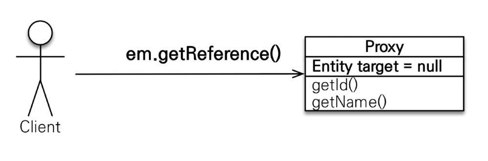
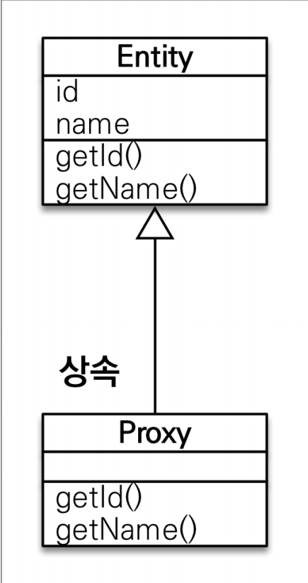
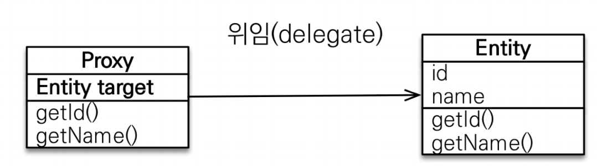
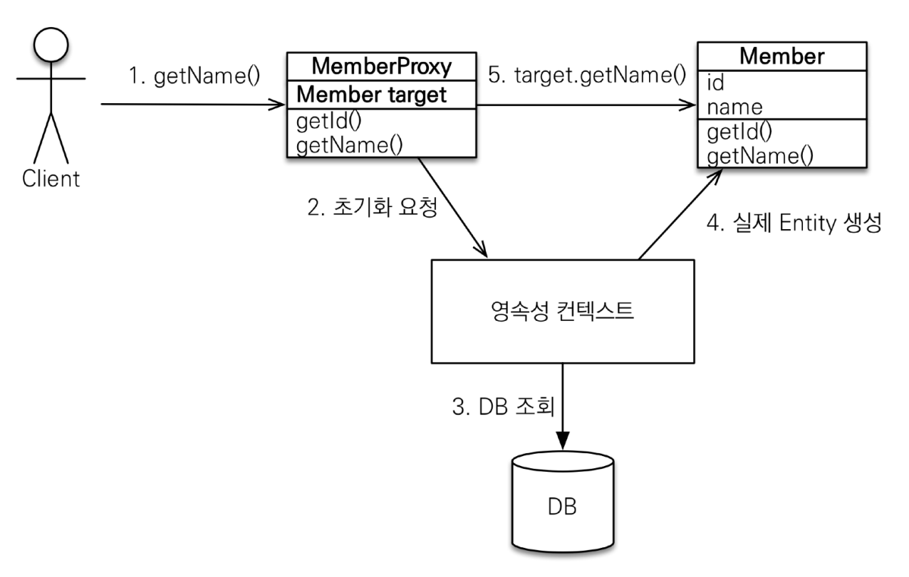
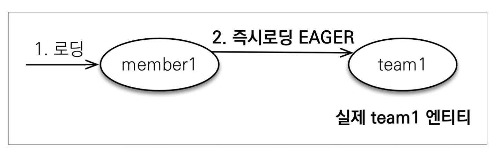
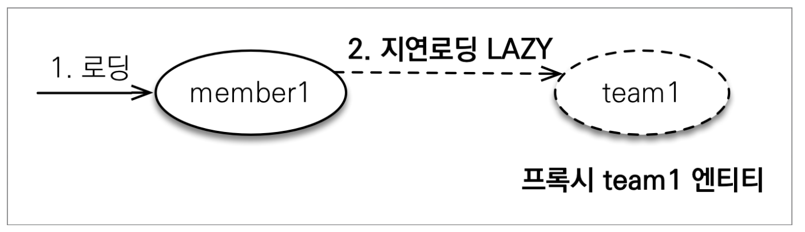
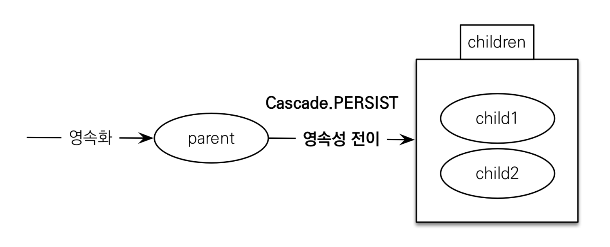

# 프록시

엔티티를 조회할 때 연관된 엔티티들이 항상 사용되는 것은 아니다. 예를 들어 회원을 조회할 때 연관된 팀은 비즈니스 로직에 따라
사용될 때도 있지만 그렇지 않을 때도 있다.

JPA는 엔티티가 실제 사용될 때까지 DB 조회를 지연하는 `지연 로딩`이라는 방법을 제공한다.<br>
`지연 로딩`기능을 사용하려면 실제 엔티티 객체 대신에 DB 조회를 지연할 수 있는 가짜 객체가 필요한데 이것을 **프록시 객체**라 한다.

**`em.fid()` vs `em.getReference()`**
- `em.fid()` : 영속성 컨텍스트에 엔티티가 없으면 DB를 조회한다. 엔티티를 직접 조회하면 조회한 엔티티를 실제 사용하든 안 하든 DB를 조회한다.
- `em.getReference()` : 엔티티를 실제 사용하는 시점까지 DB 조회를 미룬다. DB 접근을 위임한 프록시 객체를 반환한다.



프록시 클래스는 실제 클래스를 상속 받아서 만들어지므로 실제 클래스와 겉 모양이 같다. **사용하는 입장에서는 이것이 진짜 객체인지 프록시 객체인지 구분하지 않고 사용하면 된다.**



프록시 객체는 실제 객체에 대한 참조(`target`)을 보관한다. 그리고 프록시 객체의 메서드를 호출하면 프록시 객체는 실제 객체의 메서드를 호출한다.



**프록시 객체는 실제 사용될 때 DB를 조회해서 실제 엔티티 객체를 생성하는 데 이것을 `프록시 객체의 초기화`라 한다.**



### 프록시 특징
- 프록시 객체는 처음 사용할 때 한 번만 초기화된다.
- 프록시 객체를 초기화한다고 프록시 객체가 실제 엔티티로 바뀌는 것은 아니다. 프록시 객체가 초기화되면 프록시 객체를 통해서 실제 엔티티에 접근하는 것이다.
- 프록시 객체는 원본 엔티티를 상속 받은 객체이므로 타입 체크 시에 주의해야 한다.(`==`비교 X, `instance of` 사용)
- 영속성 컨텍스트에 찾는 엔티티가 이미 있으면 DB를 조회할 필요가 없으므로 `em.getReference()`를 호출해도 프록시가 아닌 실제 엔티티가 반환된다.
- 초기화는 영속성 컨텍스트의 도움을 받아야 가능하다. 영속성 컨텍스트의 도움을 받을 수 없는 `준영속`상태의 프록시를 초기화하면 하이버네이트에서 `org.hibernate.LazyInitializationExcetpion`예외를 발생시킨다.

### 프록시 확인
- `emf.PersistenceUnitUtil.isLoaded(Object entity)` : 프록시 인스턴스의 초기화 여부를 확인할 수 있다.(boolean)
- `entity.getClass().getName()` : 조회한 엔티티가 진짜 엔티티인지 프록시로 조회한 것인지 확인하려면 클래스명을 직접 출력해볼 수 있다.
- `Hibernate.initialize(entity)` : 프록시를 강제로 초기화 한다.

<br>

# 즉시 로딩과 지연 로딩

## 즉시 로딩(EAGER)
> 엔티티를 조회할 때 연관된 엔티티도 함께 조회한다.



**JPA 구현체는 가능하면 조인을 사용해서 SQL 한 번에 함께 조회한다.**

## 지연 로딩(LAZY)
> 연관된 엔티티를 **실제 사용할 때 조회한다.**
> 
> 연관된 엔티티를 처음 조회할 때는 **프록시로 조회한다.** 이후 프록시를 실제 사용할 때 초기화하면서 DB를 조회한다.



> **JPA 기본 페치 전략**
> 
> - `@ManyToOne`, `@OneToOne`: 즉시 로딩(`FetchType.EAGER`)
> - `@OneToMany`, `@ManyToMany`: 지연 로딩(`FetchType.LAZY`)
> 
> JPA는 연관된 엔티티가 하나면 즉시 로딩을, 컬렉션이면 지연 로딩을 사용한다. 컬렉션을 로딩하는 것은 비용이 많이 들고 잘못하면 너무 많은 데이터를 로딩할 수 있기 때문이다.
> 예를 들어 한 회원이 연관된 컬렉션에 수 많은 데이터를 등록했는데 페치 전략이 즉시 로딩이면 해당 회원을 로딩하는 순간 수 많은 데이터도 함께 로딩된다.(`N+1`)<br>
> 즉시 로딩은 JPQL에서도 `N+1`문제를 일으킬 수 있다.
> 
> **웬만하면 모든 연관관계에는 `지연 로딩`을 사용하고 함께 조회해야 할 일이 많으면 그때 `fetch join`이나 `엔티티 그래프`를 사용하여 해결하는 것이 좋다.**

<br>

# 영속성 전이 CASCADE
> 특정 엔티티를 영속 상태로 만들 때 연관된 엔티티도 함께 영속 상태로 만들고 싶을 때 영속성 전이 기능을 사용할 수 있다.
> 
> 부모 엔티티를 저장할 때 자식 엔티티도 함께 저장할 수 있는 것이다.

```java
@Entity
@Getter @Setter
public class Parent {

    @Id @GeneratedValue
    private Long id;

    @OneToMany(mappedBy = "parent")
    private List<Child> children = new ArrayList<>();

    public void addChild(Child child) {
        children.add(child);
        child.setParent(this);
    }
}

@Entity
@Getter @Setter
public class Child {

    @Id @GeneratedValue
    private Long id;

    @ManyToOne
    private Parent parent;
}
```
영속성 전이 기능 없이 부모 1명에 자식 2명을 저장한다면 이렇게 코드가 작성될 것이다.
```java
Parent parent = new Parent();

Child child1 = new Child();
Child child2 = new Child();

parent.addChild(child1);
parent.addChild(child2);

em.persist(parent);
em.persist(child1);
em.persist(child2);
```
**JPA에서 엔티티를 저장할 때 연관된 모든 엔티티는 영속 상태여야 한다.** 그래서 부모 엔티티를 영속 상태로 만들고 자식 엔티티도 각각 영속 상태로 만든다.

영속성 전이 기능을 사용해보자.
```java
@OneToMany(mappedBy = "parent", cascade = CascadeType.PERSIST)
private List<Child> children = new ArrayList<>();
```
부모 엔티티에 `CasCadeType`을 `PERSIST`로 지정하면 부모를 영속화할 때 자식 엔티티도 함께 영속화를 한다.

이제 `em.persist(parent)`만 호출해도 자식 엔티티까지 함께 영속화해서 DB에 저장한다.



## CASCADE 종류
```java
public enum CascadeType {
    ALL, // 모두 적용
    PERSIST, // 영속
    MERGE, // 병합
    REMOVE,  // 삭제
    REFRESH,
    DETACH;
}
```

> **`CASCADE`를 사용할 때 주의할 점은 단일 엔티티에만 종속적일 때 사용해야 하는 것이다. 예를 들어 현재는 `Parent`만 `Child`를 알고 있기 때문에 문제 없지만
> 만약에 제3의 엔티티가 `Child`를 알고 관리하게 된다면 문제가 될수 있다.**
> 
> **즉, `단일 소유자`일때와 생명주기(등록, 삭제 등)가 거의 똑같을 때 써야 한다.**
> 
> **영속성 전이는 연관관계를 매핑하는 것과는 아무 관련이 없고 단지 엔티티를 영속화할 때 연관된 엔티티도 같이 영속화한다는 편리함을 제공할 뿐이다.**

<br>

# 고아 객체
> JPA는 부모 엔티티와 연관관계가 끊어진 자식 엔티티를 자동으로 삭제하는 기능을 제공하는데 이것을 `고아 객체 제거`라 한다. 
> 
> **부모 엔티티의 컬렉션에서 자식 엔티티의 참조만 제거하면 자식 엔티티가 자동으로 삭제된다.**

```java
@OneToMany(mappedBy = "parent", orphanRemoval = true)
private List<Child> children = new ArrayList<>();
```

`orphanRemoval = true`로 설정하면 컬렉션에서 제거한 엔티티는 자동으로 삭제된다.

고아 객체 제거는 **참조가 제거된 엔티티는 다른 곳에서 참조하지 않는 고아 객체로 보고 삭제하는 기능이다.** 그래서 이 기능은 **참조하는 곳이 하나일 때, 즉 
특정 엔티티가 개인 소유하는 엔티티에만 이 기능을 적용해야 한다.** 만약 삭제한 엔티티가 다른 곳에서도 참조한다면 문제가 발생한다. 그래서 `orphanRemoval`은
`@OneToOne`,`@OneToMany`에만 사용할 수 있다.

고아 객체 제거 개념은 **부모를 제거하면 자식은 고아가 되기 때문에 부모를 제거하면 자식도 같이 제거된다.** 라는 개념인데 이것은 `CascadeType.REMOVE`를 설정한 것과 같다.

<br>

- **CascadeType.ALL과 orphanRemoval = true를 동시에 사용하면?**
  - 스스로 생명주기를 관리하는 엔티티는 `em.persist()`를 통해 영속화되고 `em.remove()`를 통해 제거된다. 
  - **두 옵션을 모두 활성화하면 부모 엔티티를 통해서 자식의 생명주기를 관리할 수 있다.**
  - 자식을 등록하려면 부모만 등록하면 되고, 자식을 삭제하려면 부모만 삭제하면 된다.
  - 결과적으로 자식 엔티티를 위한 `DAO`, `Repository`가 필요없게 된다. 