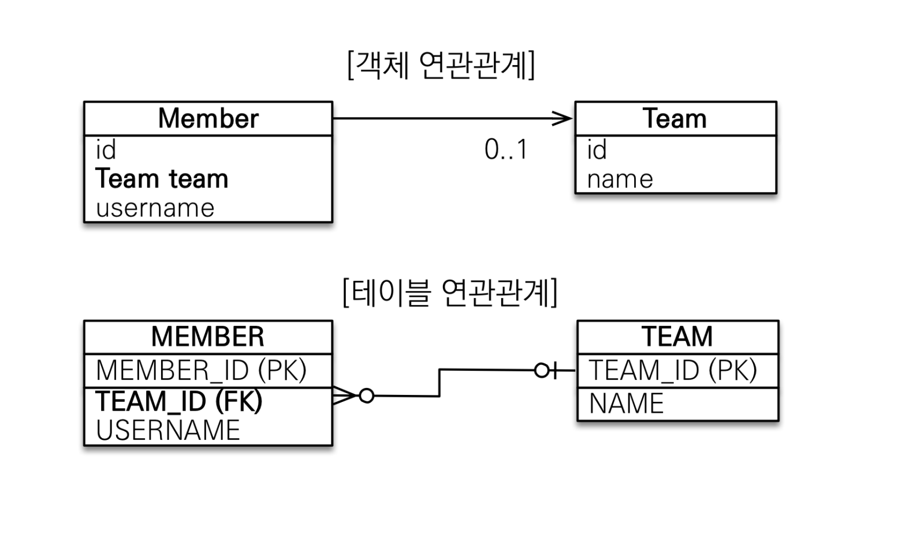
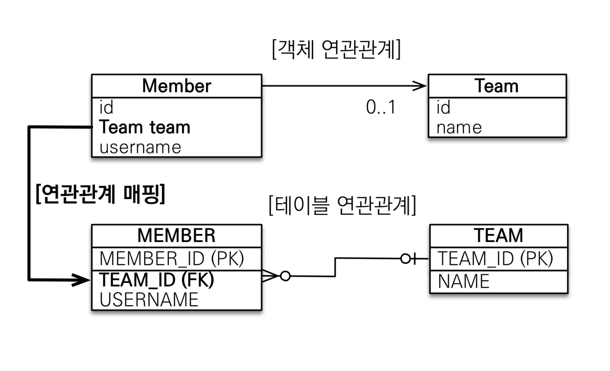
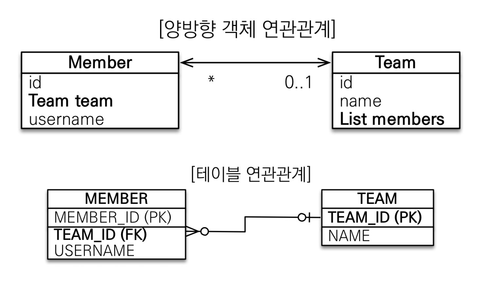
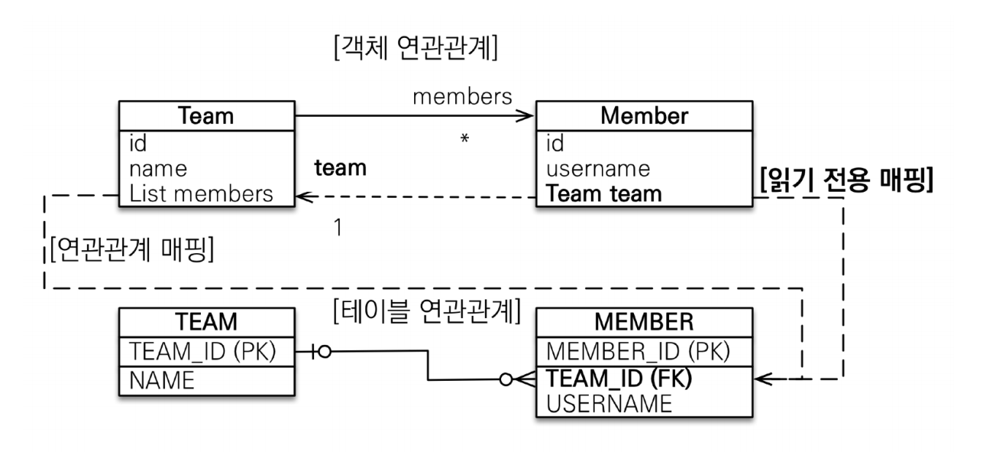
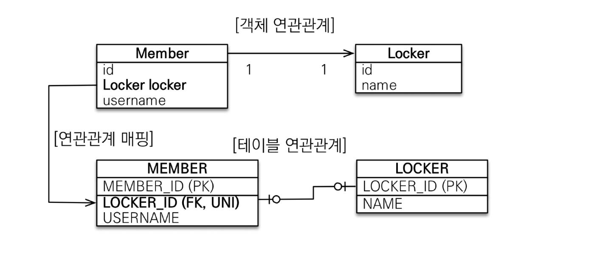
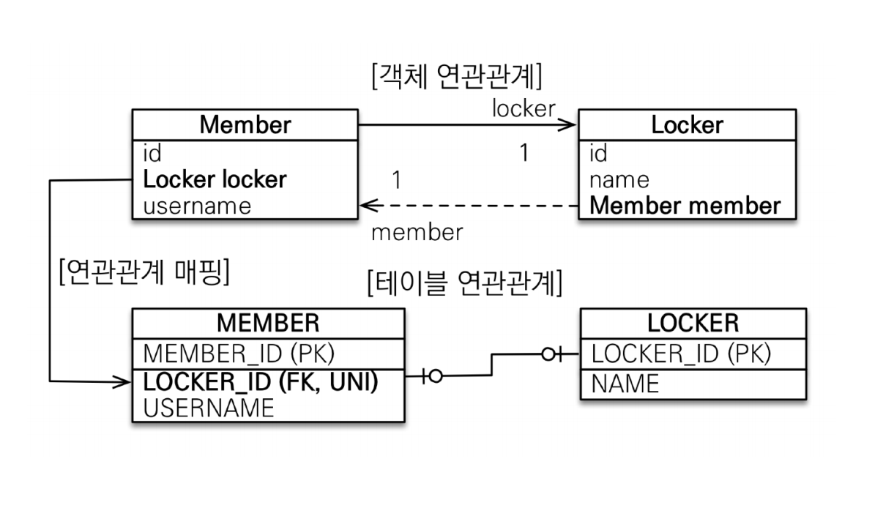
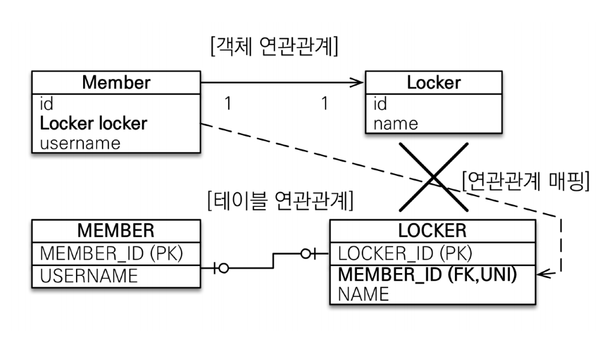
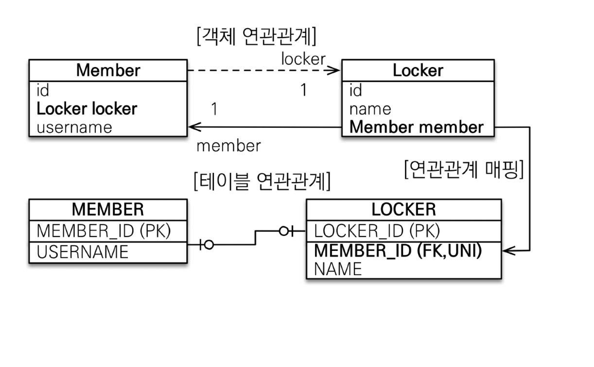
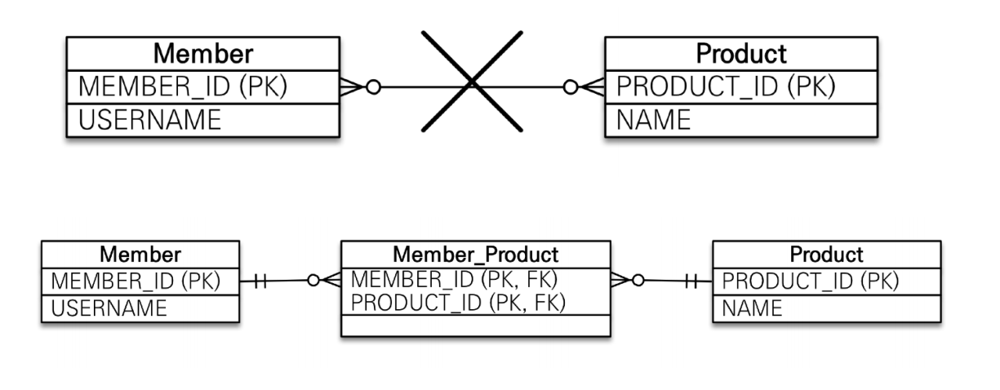
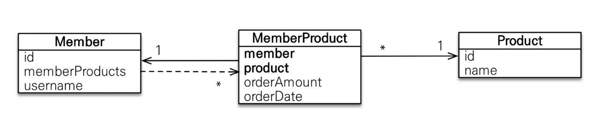

# 다양한 연관관계
> 전제조건 : 다중성은 왼쪽을 연관관계의 주인으로 한다.(다대일 -> `다`가 주인, `일대다` -> `일`이 주인)
## 다대일
> `다대일` 관계의 반대 방향은 항상 `일대다` 관계고 `일대다` 관계의 반대는 항상 `다대일` 관계다. DB 테이블의 `일(1)`, `다(N)`관계에서 외래 키(`FK`)는 항상
> `다`쪽에 있다. 따라서 객체 양방향 관계에서 연관관계의 주인은 항상 `다`쪽이다. 

### 다대일 단방향



```java
@Entity
public class Member {

    @Id  @GeneratedValue
    @Column(name = "member_id")
    private Long id;

    private String name;
    
    @ManyToOne
    @JoinColumn(name = "team_id")
    private Team team;
}
```
`@JoinColumn`을 사용해서 `team`필드를 `team_id` 외래 키와 매핑했기 때문에 `Member.team`필드로 회원 테이블의 외래 키를 관리한다.

### 다대일 양방향



실선이 연관관계의 주인이고 점선이 연관관계의 주인이 아니다.

```java
@Entity
public class Member {

    @Id  @GeneratedValue
    @Column(name = "member_id")
    private Long id;

    private String name;
    
    @ManyToOne
    @JoinColumn(name = "team_id")
    private Team team;

    public void setTeam(Team team) {
        if (this.team != null) {
            this.team.getMembers().remove(this);
        }
        this.team = team;
        team.getMembers().add(this);
    }
}

@Entity
public class Team {

    @Id @GeneratedValue
    @Column(name = "team_id")
    private Long id;

    private String name;

    @OneToMany(mappedBy = "team")
    private List<Member> members = new ArrayList<>();
}
```

- **양방향은 외래 키가 있는 쪽이 연관관계의 주인이다.**
  - `일대다`와 `다대일` 연관관계는 항상 다(N)에 외래 키가 있다. JPA는 외래 키를 관리할 때 연관관계의 주인만 사용한다. 
- **양방향 연관관계는 항상 서로를 참조해야 한다.**
  - 어느 한 쪽만 참조하면 양방향 연관관계가 성립하지 않기 때문에 `Member`의 `setTeam()`같은 연관관계 편의 메서드를 만들어서 항상 서로를 참조하게 할 수 있다.
  - 편의 메서드는 양쪽에 다 만들 필요는 없고 한 곳에만 작성해서 관리하는 것이 좋다.

<br>

## 일대다
> `일대다` 관계는 엔티티를 하나 이상 참조할 수 있으므로 자바 컬렉션인 `Collection`, `List`, `Set`, `Map` 중에 하나를 사용해야 한다.

### 일대다 단방향



일대다 단방향 관계는 약간 특이한데 보통 자신이 매핑한 테이블의 외래 키를 관리하는데 이 매핑은 반대쪽 테이블에 있는 외래 키를 관리한다.

```java
@Entity
public class Team {

    @Id @GeneratedValue
    @Column(name = "team_id")
    private Long id;

    private String name;

    @OneToMany
    @JoinColumn(name = "team_id")
    private List<Member> members = new ArrayList<>();
}
```

**일대다 단방향 관계의 단점은 매핑한 객체가 관리하는 외래 키가 다른 테이블에 있다는 점이다. 본인 테이블에 외래 키가 있으면 엔티티의 저장과 연관관계 처리를
`INSERT SQL`한 번으로 끝낼 수 있지만 다른 테이블에 외래 키가 있으면 연관관계 처리를 위한 `UPDATE SQL`을 추가로 실행해야 한다.**

### 일대다 양방향
> 일대다 양방향 매핑은 존재하지 않고 대신 다대일 양방향 매핑을 사용해야 한다.



일대다 양방향 매핑을 하기 위해서는 `@ManyToOne`에 `mappedBy` 속성을 설정해야 하는데 `@ManyToOne`에는 `mappedBy` 속성이 없다. 그래서 약간 억지로 
일대다 단방향 매핑 반대편에 같은 외래 키를 사용하는 다대일 단방향 매핑을 **읽기 전용**으로 하나 추가할 수 있다.

```java
@Entity
public class Team {

    @Id @GeneratedValue
    @Column(name = "team_id")
    private Long id;

    private String name;

    @OneToMany
    @JoinColumn(name = "team_id")
    private List<Member> members = new ArrayList<>();
}

@Entity
public class Member {

    @Id  @GeneratedValue
    @Column(name = "member_id")
    private Long id;

    private String name;

    @ManyToOne
    @JoinColumn(name = "team_id", insertable = false, updatable = false)
    private Team team;
}
```

> **일대다 관계는 웬만하면 다대일을 사용하도록 하자.**

<br>

## 일대일
> 양쪽이 서로 하나의 관계를 가진다.

- 일대일 관계는 그 반대도 일대일 관계다.
- 일대일 관계는 주 테이블이나 대상 테이블 둘 중 어느 곳이나 외래 키를 가질 수 있다.

### 주 테이블 외래키 - 단방향



```java
@Entity
public class Member {

    @Id  @GeneratedValue
    @Column(name = "member_id")
    private Long id;

    private String name;

    @OneToOne
    @JoinColumn(name = "locker_id")
    private Locker locker;
}

@Entity
public class Locker {

    @Id @GeneratedValue
    @Column(name = "locker_id")
    private Long id;
    private String name;
}
```
`@OneToOne`을 사용하고 DB에는 `locker_id`외래 키에 유니크 제약 조건을 추가한다. 다대일 단방향과 거의 비슷하다.

### 주 테이블 외래키 - 양방향



```java
@Entity
public class Member {

    @Id  @GeneratedValue
    @Column(name = "member_id")
    private Long id;

    private String name;

    @OneToOne
    @JoinColumn(name = "locker_id")
    private Locker locker;
}

@Entity
public class Locker {

    @Id @GeneratedValue
    @Column(name = "locker_id")
    private Long id;
    private String name;
    
    @OneToOne(mappedBy = "locker")
    private Member member;
}
```
양방향이므로 `mappedBy` 속성으로 연관관계의 주인을 정했다.

### 대상 테이블 외래키 - 단방향
> 대상 테이블에 외래 키가 있는 단방향 관계는 JPA에서 지원하지 않는다.



### 대상 테이블 외래키 - 양방향



```java
@Entity
public class Member {

    @Id  @GeneratedValue
    @Column(name = "member_id")
    private Long id;

    private String name;

    @OneToOne(mappedBy = "member")
    private Locker locker;
}

@Entity
public class Locker {

  @Id @GeneratedValue
  @Column(name = "locker_id")
  private Long id;
  private String name;

  @OneToOne
  @JoinColumn(name = "member_id")
  private Member member;
}
```
- **주 테이블의 외래 키**
  - 주 객체가 대상 객체의 참조를 가지는 것처럼 주 테이블의 외래 키를 두고 대상 테이블을 찾는다.
  - **장점** : JPA 매핑이 편리하고 주 테이블만 조회해도 대상 테이블에 데이터가 있는지 확인 가능하다.
  - **단점** : 값이 없으면 외래 키에 `null`을 허용한다.
- **대상 테이블의 외래 키**
  - 대상 테이블의 외래 키가 존재한다.
  - **장점** : 주 테이블과 대상 테이블을 일대일에서 일대다로 변경할 때 테이블 구조를 유지할 수 있다.
  - **단점** : 프록시 기능의 한계로 **지연 로딩으로 설정해도 항상 즉시 로딩 된다.**

<br>

## 다대다
> 관계형 DB는 정규화된 테이블 2개로 다대다 관계를 표현할 수 없다. 그래서 보통 다대다 관계를 일대다, 다대일 관계로 풀어내는 연결 테이블을 사용한다.

### 다대다 단방향



```java
@Entity
public class Member {

    @Id @GeneratedValue
    @Column(name = "member_id")
    private Long id;
    private String name;

    @ManyToMany
    @JoinTable(name = "member_product",
               joinColumns = @JoinColumn(name = "member_id"),
               inverseJoinColumns = @JoinColumn(name = "product_id"))
    private List<Product> products = new ArrayList<>();
}

@Entity
public class Product {

  @Id @GeneratedValue
  @Column(name = "product_id")
  private Long id;

  private String name;
}
```
 
### 다대다 양방향
```java
@Entity
public class Product {

  @Id @GeneratedValue
  @Column(name = "product_id")
  private Long id;
  private String name;
  
  //추가
  @ManyToMany(mappedBy = "products")
  private List<Member> members = new ArrayList<>();
}
```

**다대다 관계는 여러가지 한계가 많으니 연결 엔티티를 사용해서 다대일, 일대다 관계로 풀어내자.**



```java
@Entity
public class MemberProduct {

    @Id @GeneratedValue
    private Long id;

    @ManyToOne
    @JoinColumn(name = "member_id")
    private Member member;

    @ManyToOne
    @JoinColumn(name = "product_id")
    private Product product;
}

@Entity
public class Member {

  @Id  @GeneratedValue
  @Column(name = "member_id")
  private Long id;
  private String name;
  
  @OneToMany(mappedBy = "member")
  private List<MemberProduct> memberProducts = new ArrayList<>();
}

@Entity
public class Product {

  @Id @GeneratedValue
  @Column(name = "product_id")
  private Long id;
  private String name;

  @OneToMany(mappedBy = "product")
  private List<MemberProduct> memberProducts = new ArrayList<>();
}
```
