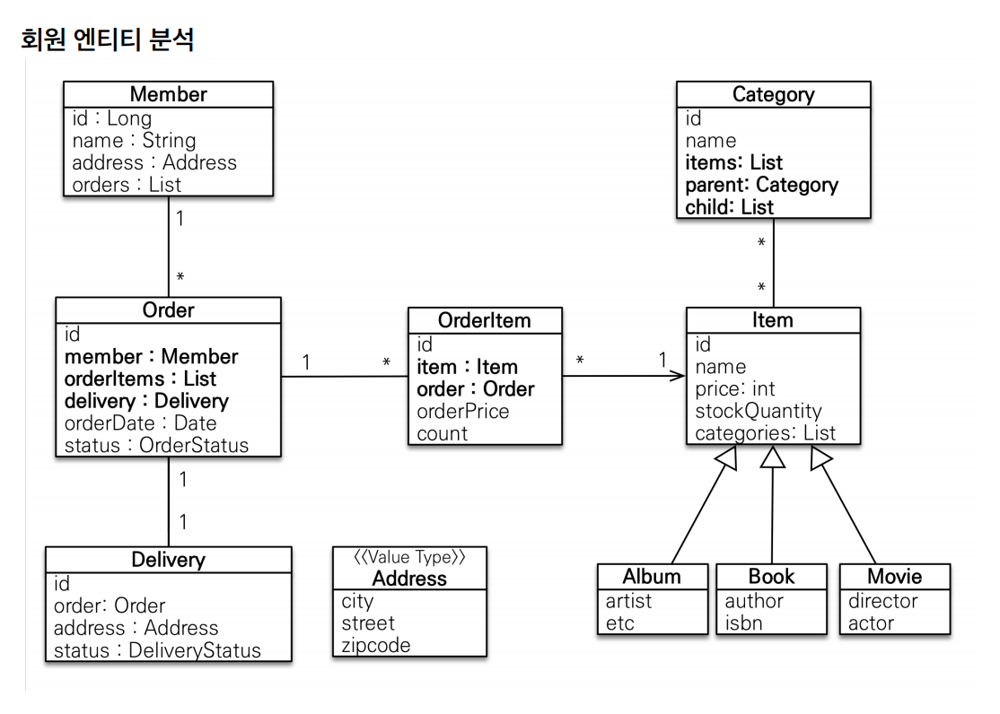

# 설계

- 회원
  - 등록
  - 조회
- 상품
  - 등록
  - 수정
  - 조회
- 주문
  - 상품 주문
  - 주문 내역 조회
  - 주문 취소
- 기타
  - 상품은 재고 관리가 필요하다.
  - 상품의 종류는 도서, 음반, 영화가 있다.
  - 상품을 카테고리로 구분할 수 있다.
  - 상품 주문 시 배송 정보를 입력할 수 있다.


**회원, 주문, 상품의 관계**
- 회원은 여러 상품을 주문할 수 있다.
- 한 번 주문할 때 여러 상품을 선택할 수 있으므로 주문과 상품은 다대다 관계다.
- 하지만 다대다 관계는 RDB는 물론 엔티티에서도 거의 사용하지 않는다.
- 그래서 주문상품 이라는 엔티티를 추가해서 다대다 관계를 일대다, 다대일 관계로 풀어낸다.

**상품 분류**
- 상품은 도서, 음반, 영화로 구분된다.
- 상품이라는 공통 속성을 사용하여 상속 구조로 표현한다.



**회원(Member)**
- 이름과 임베디드 타입인 주소, 그리고 주문 리스트를 가진다.

**주문(Order)**
- 한 번 주문시 여러 상품을 주문할 수 있으므로 주문과 주문상품(`OrderItem`)은 일대다 관계다ㅏ.
- 주문은 상품을 주문한 회원과 배송정보, 주문 날짜, 주문 상태를 가지고 있다.
- 주문 상태는 열거형(`ENUM`)을 사용한다.

**주문 상품(OrderItem)**
- 주문한 상품 정보와 주문 금액, 주문 수량 정보를 가진다.

**상품(Item)**
- 이름, 가격, 재고 수량을 가진다.
- 상품을 주문하면 재고수량이 줄어든다.
- 상품의 종류로 도서, 음반, 영화가 있는데 각각 사용하는 속성이 다르다.

**배송(Delivery)**
- 주문시 하나의 배송 정보를 생성한다.
- 주문과 배송은 일대일 관계다.

**카테고리(Category)**
- 상품과 다대다 관계를 맺는다.
- `parent`, `child`로 부모, 자식 카테고리를 연결한다.

**주소(Address)**
- 값 타입(임베디드 타입)이다.
- 회원과 배송에서 사용한다.

> 회원이 주문을 하는 거니까 회원이 주문리스트를 가지는 것은 잘 설계한 것 같지만, 객체 세상은 실제 세계와는 다르다.<br>
> 실무에서는 회원이 주문을 참조하지 않고, 주문이 회원을 참조하는 것으로 충분하다.


**MEMBER**
- 회원 엔티티의 `Address` 임베디드 타입 정보가 회원 테이블에 그대로 들어간다.(`DELIVERY`테이블도 마찬가지)

**ITEM**
- 앨범, 도서, 영화 타입을 통합해서 하나의 테이블로 만든다.([싱글테이블 전략](https://github.com/genesis12345678/TIL/blob/main/Spring/jpa/inheritance/inheritance.md#%EB%8B%A8%EC%9D%BC-%ED%85%8C%EC%9D%B4%EB%B8%94-%EC%A0%84%EB%9E%B5))
- `DTYPE` 컬럼으로 타입을 구분한다.

**ORDERS**
- `order by`라는 예약어가 있기 때문에 `ORDER`를 사용하지 않는다.

### 연관관계 매핑 분석

**회원과 주문**
- 일대다, 다대일의 양방향 관계다.
- 연관관계의 주인을 정해야 하는데 외래 키(`FK`)가 있는 주문을 연관관계의 주인으로 정하는 것이 좋다.
- `Order.member`를 `ORDERS.MEMBER_ID` 외래 키와 매핑한다.

**주문상품과 주문**
- 다대일 양방향 관계다.
- 외래 키가 주문상품에 있으므로 주문상품이 연관관계의 주인이다.
- `OrderItem.order`를 `ORDER_ITEM.ORDER_ID` 외래 키와 매핑한다.

**주문상품과 상품**
- 다대일 양방향 관계다.
- `OrderItem.item`을 `ORDER_ITEM.ITEM_ID` 외래 키와 매핑한다.

**주문과 배송**
- 일대일 양방향 관계다.
- `Order.delivery`를 `ORDERS.DELIVERY_ID` 외래 키와 매핑한다.

**카테고리와 상품**
- `@ManyToMany`를 사용해서 매핑한다.
- **실무에서는 `@ManyToMany`를 사용하지 말자.**

## 엔티티 클래스 개발

- [회원 엔티티](https://github.com/genesis12345678/TIL/blob/main/Spring/jpa/use_1/entity/Member.md)
- [주문 엔티티](https://github.com/genesis12345678/TIL/blob/main/Spring/jpa/use_1/entity/Orders.md#%EC%A3%BC%EB%AC%B8-%EC%97%94%ED%8B%B0%ED%8B%B0)
- [주문상품 엔티티](https://github.com/genesis12345678/TIL/blob/main/Spring/jpa/use_1/entity/OrderItem.md#%EC%A3%BC%EB%AC%B8%EC%83%81%ED%92%88-%EC%97%94%ED%8B%B0%ED%8B%B0)
- [상품 엔티티](https://github.com/genesis12345678/TIL/blob/main/Spring/jpa/use_1/entity/Item.md#%EC%83%81%ED%92%88-%EC%97%94%ED%8B%B0%ED%8B%B0)
- [배송 엔티티](https://github.com/genesis12345678/TIL/blob/main/Spring/jpa/use_1/entity/Delivery.md#%EB%B0%B0%EC%86%A1-%EC%97%94%ED%8B%B0%ED%8B%B0)
- [카테고리 엔티티](https://github.com/genesis12345678/TIL/blob/main/Spring/jpa/use_1/entity/Category.md#%EC%B9%B4%ED%85%8C%EA%B3%A0%EB%A6%AC-%EC%97%94%ED%8B%B0%ED%8B%B0)
- [주소 값 타입](https://github.com/genesis12345678/TIL/blob/main/Spring/jpa/use_1/entity/Address.md#%EC%A3%BC%EC%86%8C-%EA%B0%92-%ED%83%80%EC%9E%85)

## 엔티티 설계 주의점

### 엔티티의 식별자
- 위 엔티티 클래스 개발에서 엔티티의 식별자는 `id`를 사용하고 PK 컬럼명은 `{클래스명}_id`를 사용했다.
- 엔티티는 타입이 있으므로 `id`필드만으로 쉽게 구분할 수 있다. 테이블은 타입이란 게 없으므로 구분이 어렵다.
- 테이블은 관례상 `테이블명 + id`를 많이 사용한다.
- 객체에서 `id` 대신에 `{클래스명}Id`을 사용해도 된다. **중요한 것은 일관성이다.**

### 엔티티에는 Setter를 사용하지 말자.
- `Setter`가 열려있으면 변경 포인트가 너무 많아서 유지보수가 어려워진다.
- 엔티티를 변경할 때는 `Setter` 대신에 변경 지점이 명확하도록 변경을 위한 비즈니스 메서드를 별도로 제공해야 한다.

### 모든 연관관계는 지연로딩 설정
- 즉시로딩(`EAGER`)은 예측이 어렵고, 어떤 SQL이 실행될지 추적하기 어렵다. 특히 `JPQL`을 실행할 때 `N + 1`문제가 자주 발생한다.
- **실무에서 모든 연관관계는 지연로딩(`LAZY`)으로 설정해야 한다.**
- 연관된 엔티티를 함께 DB에서 조회해야 하면 `fetch join`이나 엔티티 그래프 기능을 사용한다.
- `@XToOne(OneToOne, ManyToOne)` 관계는 기본값이 즉시로딩 이므로 직접 지연로딩으로 설정해야 한다.

### 컬렉션은 필드에서 바로 초기화 하는 것이 안전하다.
- `null`문제에서 안전하다.
- 하이버네이트는 엔티티를 영속화할 때, 컬렉션을 감싸서 하이버네이트가 제공하는 내장 컬렉션으로 변경한다.
- 만약 임의의 메서드에서 컬렉션을 잘못 생성하면 하이버네이트 내부 메커니즘에 문제가 발생할 수 있다.
- 필드레벨에서 생성하는 것이 가장 안정하고 코드도 간결하다.

```java
Member member = new Member();
System.out.println(member.getOrders().getClass()); 
em.persist(member);//영속화
System.out.println(member.getOrders().getClass()); 

//출력 결과
class java.util.ArrayList
class org.hibernate.collection.internal.PersistentBag
```

### 실무에서는 `@ManyToMany`를 사용하지 말자.
- `@ManyToMany`는 편리한 것 같지만 중간 테이블에 컬럼을 추가할 수 없고 세밀하게 쿼리를 실행하기 어렵기 때문에 실무에서 사용하기에는 한계가 있다.
- 대신 다대다 매핑을 일대다, 다대일 매핑으로 풀어내서 중간 엔티티로 매핑해서 사용한다.

### 값 타입은 변경 불가능하게 설계해야 한다.
- 값 타입은 `Setter`대신 생성자에서 값을 모두 초기화해서 변경 불가능한 클래스로 만들어야 한다.
- **JPA 스펙상 엔티티나 임베디드 타입은 자바 기본 생성자를 `public` 또는 `protected`로 설정해야 한다.**
- `public`보다는 `protected`로 설정하는 것이 그나마 더 안전하다.
- JPA가 이런 제약을 두는 이유는 JPA 구현 라이브러리가 객체를 생성할 때 리플렉션 같은 기술을 사용할 수 있또록 지원해야 하기 때문이다.