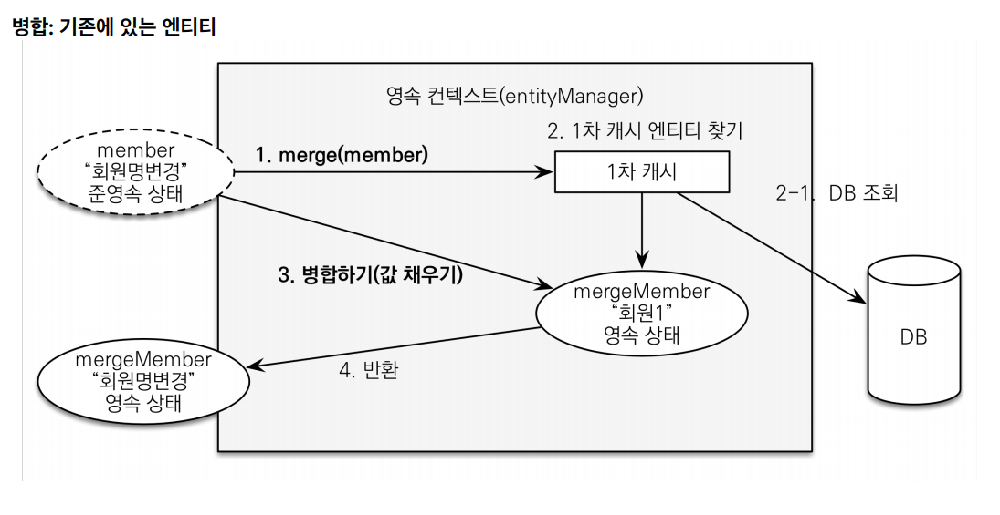

# 상품 웹 계층 개발

### DTO
```java
@Getter @Setter
public class BookForm {

    private Long id;

    private String name;
    private int price;
    private int stockQuantity;

    private String author;
    private String isbn;
}
```

### 컨트롤러
```java
@Controller
@RequiredArgsConstructor
public class ItemController {

    private final ItemService itemService;

    /**
     * 상품 등록 뷰
     */
    @GetMapping("/items/new")
    public String createForm(Model model) {
        model.addAttribute("form", new BookForm());
        return "items/createItemForm";
    }

    /**
     * 상품 등록 뷰에서 넘어온 데이터로 상품 저장
     */
    @PostMapping("/items/new")
    public String create(BookForm form) {
        Book book = new Book();

        book.setName(form.getName());
        book.setPrice(form.getPrice());
        book.setStockQuantity(form.getStockQuantity());
        book.setIsbn(form.getIsbn());
        book.setAuthor(form.getAuthor());

        itemService.saveItem(book);

        return "redirect:/";
    }

    /**
     * 상품 목록
     */
    @GetMapping("/items")
    public String list(Model model) {
        model.addAttribute("items", itemService.findItems());
        return "items/itemList";
    }

    /**
     * 상품 수정 뷰
     */
    @GetMapping("/items/{itemId}/edit")
    public String updateItemFrom(@PathVariable("itemId") Long itemId, Model model) {
        Book item = (Book) itemService.findOne(itemId);//Book은 Item 하위 타입

        BookForm form = new BookForm();
        form.setId(item.getId());
        form.setName(item.getName());
        form.setPrice(item.getPrice());
        form.setStockQuantity(item.getStockQuantity());
        form.setAuthor(item.getAuthor());
        form.setIsbn(item.getIsbn());

        model.addAttribute("form", form);

        return "items/updateItemForm";
    }

    /**
     * 상품 수정 뷰에서 넘어온 데이터로 상품 수정
     * 상품 수정, 권장 코드
     */
    @PostMapping(value = "/items/{itemId}/edit")
    public String updateItem(@PathVariable("itemId") Long itemId, @ModelAttribute("form") BookForm form) {
        itemService.updateItem(itemId, form.getName(), form.getPrice(), form.getStockQuantity());
        return "redirect:/items";
    }

/*
    @PostMapping("/items/{itemId}/edit")
    public String updateItem(@ModelAttribute("form") BookForm form, @PathVariable("itemId") String itemId) {
        Book book = new Book();

        book.setId(form.getId());
        book.setName(form.getName());
        book.setPrice(form.getPrice());
        book.setStockQuantity(form.getStockQuantity());
        book.setAuthor(form.getAuthor());
        book.setIsbn(form.getIsbn());

        itemService.saveItem(book);
        return "redirect:/items";
    }
*/
}
```

### 변경 감지와 병합

**[준영속 엔티티란?](https://github.com/genesis12345678/TIL/blob/main/Spring/jpa/persistenceContext/flush_detach/flush_detach.md#%EC%A4%80%EC%98%81%EC%86%8D)**
- 영속성 컨텍스트가 더는 관리하지 않는 엔티티
- 위에서 주석처리된 코드에서 `itemService.saveItem(book)`에서 수정을 시도하는 `Book`객체다.
- `Book` 객체는 이미 DB에 한번 저장되어서 식별자가 존재한다. 이렇게 임의로 만들어낸 엔티티도 기존 식별자를 가지고 있으면 준영속 엔티티로 볼 수 있다.

**준영속 엔티티를 수정하는 2가지 방법**
1. 변경 감지 기능 사용
2. 병합(`merge`) 사용

**변경 감지 기능 사용**
```java
@Transactional
void update(Item itemParam) { //itemParam: 파리미터로 넘어온 준영속 상태의 엔티티
    Item findItem = em.find(Item.class, itemParam.getId()); //같은 엔티티를 조회한다. 
    findItem.setPrice(itemParam.getPrice()); //데이터를 수정한다.
}
```
- 영속성 컨텍스트에서 엔티티를 다시 조회한 후에 데이터를 수정하는 방법
- 트랜잭션 안에서 엔티티를 다시 조회 후 변경할 값을 선택하면 트랜잭션 커밋 시점에 변경 감지(Dirty Checking)가 동작해서 DB에 `UPDATE SQL`을 수행한다.

**병합 사용**
```java
@Transactional
void update(Item itemParam) { //itemParam: 파리미터로 넘어온 준영속 상태의 엔티티 
    Item mergeItem = em.merge(itemParam);
}
```
- 병합은 준영속 상태의 엔티티를 영속 상태로 변경할 때 사용하는 기능이다.

**[병합 동작 방식](https://github.com/genesis12345678/TIL/blob/main/Spring/jpa/persistenceContext/flush_detach/flush_detach.md#%EB%B3%91%ED%95%A9-merge)**



1. `merge()` 실행
2. 파라미터로 넘어온 준영속 엔티티의 식별자 값으로 1차 캐시에서 엔티티 조회
   - 만약 1차 캐시에 엔티티가 없으면 DB에서 엔티티를 조회하고, 1차 캐시에 저장한다.
3. **조회한 영속 엔티티(`mergeMember`)에 `member`엔티티의 값을 채워 넣는다.**
   - `member` 엔티티의 모든 값을 `mergeMember`에 밀어 넣는다. 
   - 이때 `mergeMember`의 "회원1" 이라는 이름이 "회원명변경"으로 바뀐다.
4. 영속 상태인 `mergeMember`를 반환한다.

**정리하면**
1. 준영속 엔티티의 식별자 값으로 영속 엔티티를 조회한다.
2. 영속 엔티티의 값을 준영속 엔티티의 값으로 모두 교체한다.(병합한다.)
3. 트랜잭션 커밋 시점에 변경 감지 기능이 동작해서 DB에 `UPDATE SQL`을 실행한다.

> **주의** : 변경 감지 기능을 사용하면 원하는 속성만 선택해서 변경할 수 있지만, 병합을 사용하면 모든 속성이 변경된다. 즉, 병합 시 값이 없으면
> `null`로 업데이트 될 위험이 있다.(병합은 모든 필드를 교체한다.)

`ItemService.saveItem()`은 `ItemRepository.save()`를 호출한다.
```java
@Repository
@RequiredArgsConstructor
public class ItemRepository {

    private final EntityManager em;

    /**
     * 상품 저장
     * id가 없으면 신규로 보고 persist()를 실행
     * id가 있으면 이미 DB에 저장된 엔티티를 수정한다고 보고 merge()를 실행
     */
    public void save(Item item) {
        if (item.getId() == null) {
            em.persist(item);
        } else {
            em.merge(item);
        }
    }
    ...
}
```
- 이 메서드 하나로 저장과 수정(병합)을 다 처리한다.
- 코드를 보면 식별자 값이 없으면 새로운 엔티티로 판단해서 `persist()`로 영속화하고, 식별자 값이 있으면 이미 한번 영속화 되었던 엔티티로 판단해서 `merge()`로 수정(병합)한다.
- 결국 여기서 저장(`save)`이라는 의미는 신규 데이터를 저장하는 것뿐만 아니라 변경된 데이터의 저장이라는 의미도 포함된다.
- 이렇게 함으로써 이 메서드를 사용하는 클라이언트는 저장과 수정을 구분하지 않아도 되므로 클라이언트의 로직이 단순해진다.

여기서 사용하는 수정(병합)은 준영속 상태의 엔티티를 수정할 때 사용한다. 영속 상태의 엔티티는 변경 감지 기능이 동작해서 트랜잭션을 커밋할 때 자동으로
수정되므로 수정 메서드를 호출할 필요가 없고 그런 메서드도 없다.

> `save()`메서드는 식별자를 자동 생성해야 정상 동작한다. 여기서 사용한 `Item` 엔티티의 식별자는 `@GeneratedValue`를 선언했다.<br>
> 따라서 식별자 없이 `save()`를 호출하면 `persist()`가 호출되면서 식별자 값이 자동으로 할당된다. 반면에 `@Id`만 선언했다면 식별자를 직접 할당하지 않고
> `save()`를 호출하면 식별자가 없는 상태로 `persist()`를 호출한다. 그러면 식별자가 없다는 예외가 발생한다.

> 실무에서는 보통 업데이트 기능이 매우 제한적이다. 그런데 병합은 모든 필드를 변경해버리고 데이터가 없으면 `null`로 업데이트 해버린다.<br>
> 병합을 사용하면서 이 문제를 해결하려면 변경 폼 화면에서 모든 데이터를 항상 유지해야 한다. 실무에서는 보통 변경가능한 데이터만 노출하기 때문에
> 병합을 사용하는 것이 오히려 번거롭다.

**가장 좋은 해결 방법은 엔티티를 변경할 때는 항상 변경 감지를 사용하는 것이다.**
- 컨트롤러에서 어설프게 엔티티를 생성하지 말자.
- 트랜잭션이 있는 서비스 계층에 식별자(`id`)와 변경할 데이터를 명확하게 전달하자.(파라미터 또는 dto)
- 트랜잭션이 있는 서비스 계층에서 영속 상태의 엔티티를 조회하고, 엔티티의 데이터를 직접 변경하자.
- 트랜잭션 커밋 시점에 변경 감지가 실행된다.

그래서 위에 있는 권장 코드를 사용하는 것이 좋다.
```java
...
/**
 * 상품 수정 뷰에서 넘어온 데이터로 상품 수정
 * 상품 수정, 권장 코드
 */
@PostMapping(value = "/items/{itemId}/edit")
public String updateItem(@PathVariable("itemId") Long itemId, @ModelAttribute("form") BookForm form) {
        itemService.updateItem(itemId, form.getName(), form.getPrice(), form.getStockQuantity());
        return "redirect:/items";
}
...
```
```java
@Service
@Transactional(readOnly = true)
@RequiredArgsConstructor
public class ItemService {

    private final ItemRepository itemRepository;

    /**
     * 영속성 컨텍스트가 자동으로 변경
     */
    @Transactional
    public void updateItem(Long itemId, String name, int price, int stockQuantity) {
        Item findItem = itemRepository.findOne(itemId);
        findItem.setName(name);
        findItem.setPrice(price);
        findItem.setStockQuantity(stockQuantity);
    }
    ...
}
```