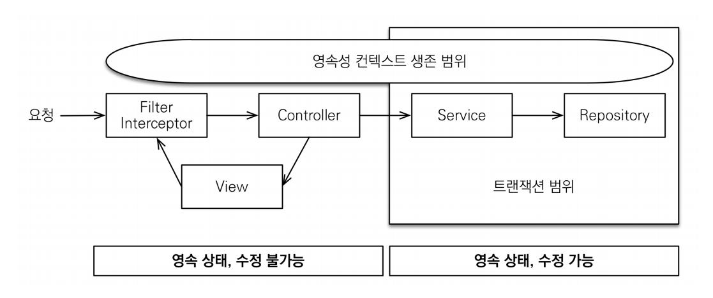
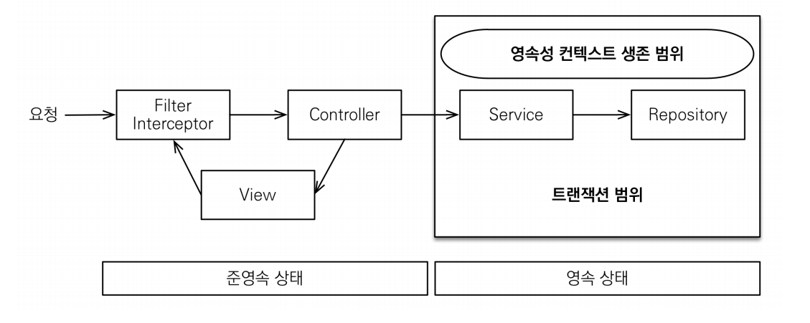

# OSIV(Open Session In View)

## OSIV ON

- `spring.jpa.open-in-view: true` (기본값)

- `OSIV` 전략은 트랜잭션 시작처럼 최초 데이터베이스 커넥션 시작 시점부터 API 응답이 끝날 때까지 영속성 컨텍스트와 데이터베이스 커넥션을 유지한다.
- 그래서 `View Template`이나 `API 컨트롤러`에서 지연 로딩이 가능한 것이다.
- **장점**
  - 지연 로딩은 영속성 컨텍스트가 살아있어야 가능하고, 영속성 컨텍스트는 기본적으로 데이터베이스 커넥션을 유지한다는 자체가 큰 장점이다.
- **단점**
  - 너무 오랜시간동안 데이터베이스 커넥션 리소스를 사용하기 때문에 실시간 트래픽이 중요한 애플리케이션에서는 커넥션이 모자랄 수 있다. (결국 장애로 이어진다.)
  - 예를 들어 컨트롤러에서 외부 API를 호출하면 외부 API 대기 시간 만큼 커넥션 리소스를 반환하지 못하고 유지해야 한다.

## OSIV OFF

- `spring.jpa.open-in-view: false`

- `OSIV` 전략을 끄면 트랜잭션을 종료할 때 영속성 컨텍스트를 닫고 데이터베이스 커넥션도 반환한다. 따라서 커넥션 리소스를 낭비하지 않는다.
- **단점**
  - `OSIV`를 끄면 모든 지연로딩을 트랜잭션 안에서 처리해야 하기 때문에 지금까지 개발한 지연 로딩 코드를 트랜잭션 안으로 넣어야 한다.
  - `view template`에서 지연 로딩이 동작하지 않는다. 
  - 트랜잭션이 끝나기 전에 지연 로딩을 강제로 호출해 두어야 하는 것이다.

**실무에서 OSIV를 끈 상태로 복잡성을 관리하는 좋은 방법**

- **`Command`와 `Query` 분리**
  - 보통 비즈니스 로직은 특정 엔티티 몇 개를 등록하거나 수정하는 것이므로 성능이 크게 문제가 되지 않는다.
  - 그런데 복잡한 화면을 출력하기 위한 쿼리는 화면에 맞추어 성능을 최적화 하는 것이 중요하다. 하지만 그 복잡성이 비해 핵심 비즈니스 로직에 큰 영향을 주는 것은 아니다.
  - 그래서 크고 복잡한 애플리케이션을 개발한다면, 이 둘의 관심사를 명확하게 분리한다면 유지보수 관점에서 좋을 것이다.
  - 예를 들어 `OrderService`를 분리한다면
    - `OrderService` : 핵심 비즈니스 로직
    - `OrderQueryService` : 화면이나 API에 맞춘 서비스(주로 읽기 전용 트랜잭션 사용)
