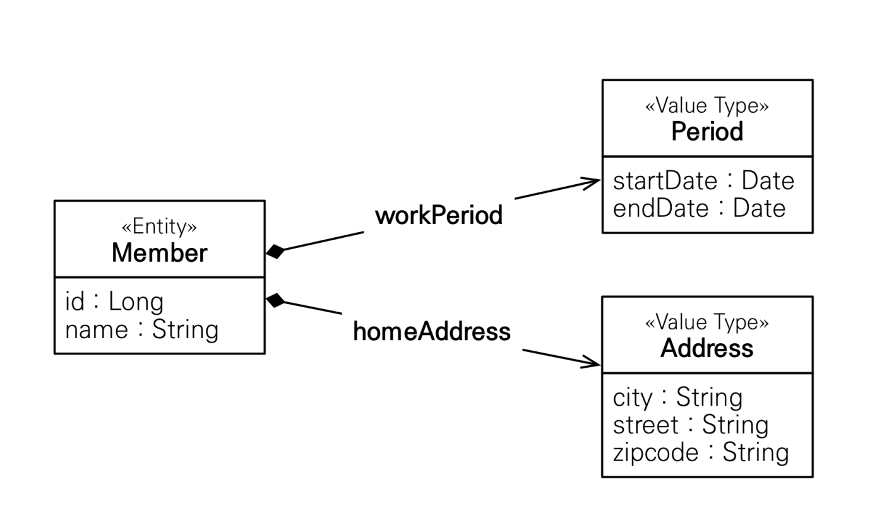
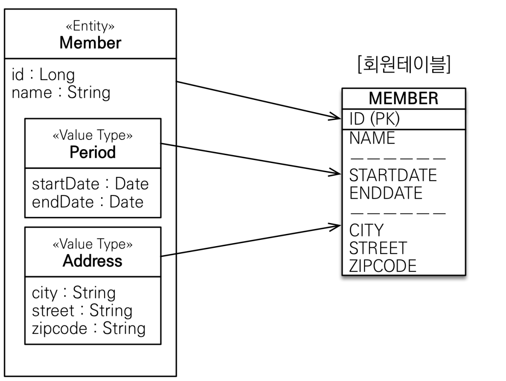
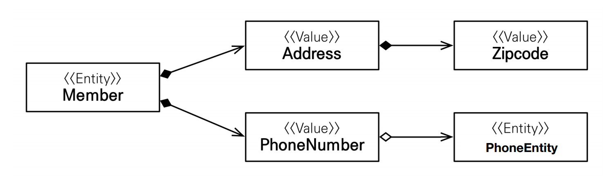
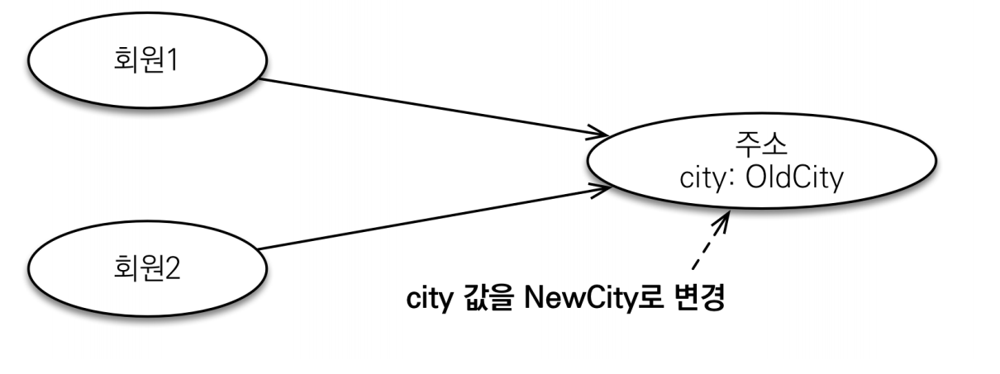
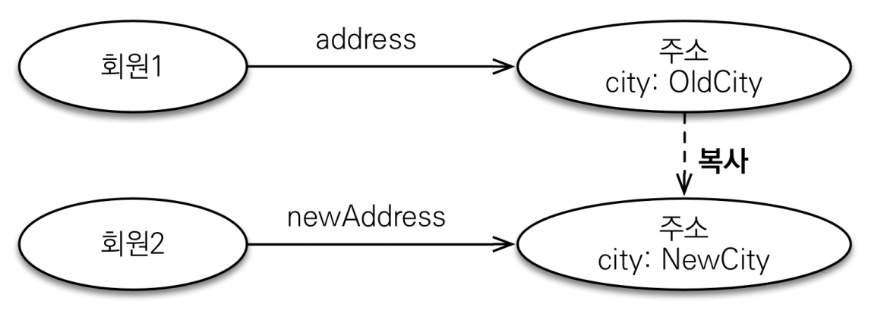
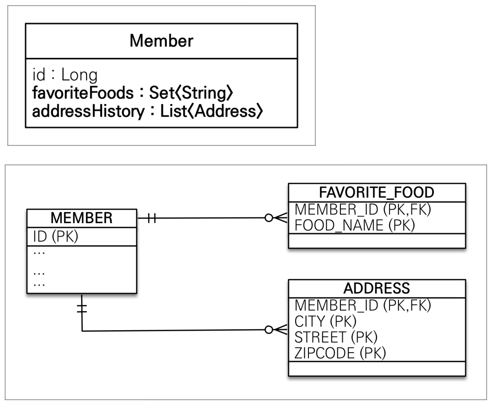

# 값 타입

JPA의 데이터 타입을 크게 분류하면 `엔티티 타입`과 `값 타입`으로 나눌 수 있다.

엔티티 타입은 `@Entity`로 정의하는 객체이고, 값 타입은 `int`, `Integer`, `String`처럼 단순히 값으로 사용하는 자바 기본 타입이나 객체를 말한다.<br>
**엔티티 타입은 식별자를 통해 지속해서 추적할 수 있지만, 값 타입은 식별자가 없고 숫자나 문자같은 속성만 있으므로 추적할 수 없다.**

값 타입은 3가지로 나눌 수 있다.
- **기본 값 타입**
  - 자바 기본 타입(`int`, `double` 등)
  - 래퍼 클래스(`Integer` 등)
  - `String`
- **임베디드 타입**(복합 값 타입)
- **컬렉션 값 타입**

## 기본 값 타입
```java
@Entity
public class Member{
    @Id
    private Long id;
    private String name;
    private int age;
}
```
Member에서 `String`,`int` 가 값 타입이다. Member 엔티티는 `id`라는 식별자 값도 가지고 생명주기도 있지만 값 타입인 `name`,`age` 속성은 식별자 값도
없고 생명주기도 회원 엔티티에 의존한다. **회원 엔티티 인스턴스를 제거하면 기본 값도 제거된다.** 그리고 값 타입은 절대 공유하면 안 된다.

> 자바에서 `int`, `double`같은 기본 타입(primitive type)은 값을 복사하기 때문에 절대 공유되지 않는다. `Integer`같은 래퍼 클래스나 `String`같은
> 특수한 클래스는 공유 가능한 객체이지만 변경을 할 수는 없다.

## 임베디드 타입
> 새로운 값 타입을 직접 정의할 수 있다. 주로 기본 **값 타입**을 모아서 만들어서 복합 값 타입이라고도 한다.

회원이 상세한 데이터를 그대로 가지고 있는 것은 객체지향적이지 않으며 응집력만 떨어뜨린다. 

예를 들어 '회원 엔티티는 이름, 근무 시작일, 근무 종료일, 도시, 번지, 우편번호를 가진다' 라는 설명보다 '회원 엔티티는 이름, 근무 기간, 주소를 가진다.'라는 설명이 더욱 명확하고 직관적이다.

`임베디드 타입`을 사용하여 이를 표현할 수 있다.
```java
@Embeddable
public class Period {
    private LocalDateTime startDate;
    private LocalDateTime endDate;
}

@Embeddable
public class Address {
  private String city;
  private String street;
  private String zipCode;
}

@Entity
public class Member {

  @Id @GeneratedValue
  private Long id;
  private String name;

  @Embedded
  private Period workPeriod;
  @Embedded
  private Address homeAddress;
```



이렇게 새로 정의한 값 타입들은 재사용이 가능하고 응집도도 아주 높다. 또 해당 값 타입만 사용할 수 있는 의미 있는 메서드를 만들 수도 있다.
- `@Embeddable` : 값 타입을 정의하는 곳에 표시
- `@Embedded` : 값 타입을 사용하는 곳에 표시

어노테이션 둘 중 하나는 생략해도 되며, 임베디드 타입은 기본 생성자가 필수다.<br>
**임베디드 타입을 포함한 모든 값 타입은 값 타입을 소유한 엔티티에 생명주기를 의존한다.**

### 임베디드 타입과 테이블 매핑



> 임베디드 타입은 엔티티의 값일 뿐이기 때문에 값이 속한 엔티티의 테이블에 매핑된다. 
> 
> **임베디드 타입을 사용하기 전과 후에 매핑하는 테이블은 같다.**
> 
> 임베디드 타입을 사용하면 객체와 테이블을 아주 세밀하게 매핑하는 것이 가능해진다. **잘 설계한 ORM 애플리케이션은 매핑한 테이블의 수보다 클래스의 수가 많다.**

### 임베디드 타입과 연관관계
> 임베디드 타입은 값 타임을 포함하거나 엔티티를 참조할 수 있다.



값 타입인 `Address`가 값 타입인 `ZipCode`를 포함하고, 값 타입인 `PhoneNumber`가 엔티티 타입을 참조한다.

### 속성 재정의
> 임베디드 타입은 한 엔티티에서 여러 개 사용가능한데 문제는 테이블에 매핑하는 컬럼명이 중복되는 것이다. `@AttributeOverrieds`를 사용해서 매핑정보를 재정의 할 수 있다.

```java
@Embeddable
public class Address {
  private String city;
  private String street;
  private String zipCode;
}

@Entity
public class Member {
    @Id @GeneratedValue
    private Long id;
    private String name;

    @Embedded
    @AttributeOverrides({
            @AttributeOverride(name = "city", column = @Column(name = "home_city")),
            @AttributeOverride(name = "address", column = @Column(name = "home_address")),
            @AttributeOverride(name = "zipCode", column = @Column(name = "home_zipCode"))
    })
    private Address homeAddress;

    @Embedded
    @AttributeOverrides({
            @AttributeOverride(name = "city", column = @Column(name = "work_city")),
            @AttributeOverride(name = "address", column = @Column(name = "work_address")),
            @AttributeOverride(name = "zipCode", column = @Column(name = "work_zipCode"))
    })
    private Address workAddress;
}
```

<br>

## 값 타입과 불변 객체

### 값 타입 공유 참조
> 임베디드 타입 같은 값 타입을 여러 엔티티에서 공유하면 위험하다.



그림을 코드로 나타내면
```java
member1.setHomeAddress(new Address("OldCity"));
Address address = member1.getHomeAddress();

address.setCity("NewCity");// 회원1의 address 값을 공유해서 사용
member2.setHomeAddress(address);
```

회원2에 새로운 주소를 할당하려고 회원1의 주소를 그대로 `참조`해서 사용했다. 이 코드를 그대로 실행하면 **회원1과 회원2 모두 "NewCity"로 변경되어 버린다.**
회원1과 회원2 모두 같은 `address` 인스턴스를 참조하기 때문이다. 영속성 컨텍스트는 회원1과 회원2 둘 다 city 속성이 변경된 것으로 판단해서 각각 `UPDATE SQL`을 실행한다.

**이러한 공유 참조로 인해 발생하는 버그는 정말 찾아내기 어렵다.** 이런 부작용을 막으려면 **값을 복사해서 사용해야 한다.**

### 값 타입 복사
> 값 타입의 실제 인스턴스인 값을 공유하는 것은 위험하다. 대신에 값(인스턴스)을 복사해서 사용해야 한다.



```java
member1.setHomeAddress(new Address("OldCity"));
Address address = member1.getHomeAddress();

Address copyAddress = address.clone();

copyAddress.setCity("NewCity");
member2.setHomeAddress(copyAddress);
```
회원2에 새로운 주소를 할당하기 위해 `clone()`메서드를 만들어 자신을 복사해서 반환하도록 구현한다. 이 코드는 의도한 대로 회원2의 주소만 변경된다.

이렇게 항상 값을 복사해서 사용하면 공유 참조로 인해 발생하는 부작용을 피할 수 있다.

**문제는 임베디드 타입처럼 직접 정의한 값 타입은 자바의 기본 타입이 아니라 객체 타입이라는 것이다.**

자바 기본 타입에 값을 대입하면 값을 복사하고, **객체 타입은 참조 값을 직접 대입하는 것을 막을 방법이 없다.** 자바는 대입하려는 것이 값 타입인지 아닌지는 신경 쓰지 않고 단지
자바 기본 타입이면 값을 복사해서 넘기고 객체면 참조를 넘길 뿐이다. 때문에 **객체의 공유 참조는 피할 수 없다.**

```java
// 기본 타입
int a = 10;
int b = a;//기본 타입은 값을 복사
b= 4;

// 객체 타입
Address a = new Address("Old");
Address b = a;//객체 타입은 항상 참조 값을 전달
b.setCity("New");//b.city만 변경하려 했지만 a.city도 변경된다.
```

항상 값을 복사해서 넘기면 문제는 없겠지만 실수로 복사를 하지 않고 참조를 넘기게 된다면 큰 문제가 발생할 것이다.

그래서 애초에 **불변 객체**로 만들어서 사용하는 것이 좋다.

### 불변 객체
> 값 타입은 부작용 걱정 없이 사용할 수 있어야 한다.
> 
> **객체를 불변하게 만들면 값을 수정할 수 없으므로 부작용을 원천 차단할 수 있다.**(불변 객체: 생성 시점 이후 절대 값을 변경할 수 없는 객체)
> 
> 생성자로만 값을 설정하고 수정자(`Setter`)를 만들지 않으면 된다.

```java
@Embeddable
@Getter
@AllArgsConstructor // 생성자로 초기값을 설정한다.
@NoArgsConstructor(access = AccessLevel.PROTECTED)// JPA에서 기본 생성자는 필수다.
public class Address {
    private String city;
}

Address address = member1.getHomeAddress();
//회원1의 주소값을 조회해서 새로운 주소값을 생성
Address newAddress = new Address(address.getCity());
member2.setHomdeAddress(newAddress);
```

이제 값을 수정할 수 없으므로 공유해도 부작용이 발생하지 않는다. 값을 수정해야 하면 이렇게 새로운 객체를 생성해서 사용해야 한다.

**불변이라는 작은 제약으로 부작용이라는 큰 재앙을 막을 수 있다...!**

<br>

## 값 타입의 비교
> 값 타입은 인스턴스가 달라도 그 안에 값이 같으면 같은 것으로 봐야 한다.

자바가 제공하는 객체 비교 2가지
- **동일성 비교** : 인스턴스의 `참조` 값을 비교, `==`사용
- **동등성 비교** : 인스턴스의 값을 비교, `equals()` 사용

값 타입은 인스턴스가 달라도 그 안에 값이 같으면 같은 것으로 봐야 하기 때문에 값 타입은 `a.equals(b)`로 동등성 비교를 해야 한다.

값 타입의 `equals()`메서드를 재정의 하거나 `@EqualsAndHashCode`를 사용하면 된다. 값 타입의 `equals()`메서드를 재정의할 때는 보통 모든 필드의 값을 비교하도록 구현한다.

> 자바에서 `equlas()`를 재정의 하면 `hashCode()`도 재정의하는 것이 안전하다. 그렇지 않으면 해시를 사용하는 컬렉션(`HashSet`, `HashMap`)이 정상 동작하지 않는다.

<br>

## 값 타입 컬렉션
> `@ElementCollection`, `@CollectionTable`을 사용해서 값 타입을 하나 이상 컬렉션에 저장할 수 있다.



```java
@Entity
public class Member {
  @Id @GeneratedValue
  private Long id;
  
  @Embedded
  private Address homeAddress;

  @ElementCollection
  @CollectionTable(name = "address", joinColumns = @JoinColumn(name = "member_id"))
  private List<Address> addressHistory = new ArrayList<>();

  @ElementCollection
  @CollectionTable(name = "favorite_foods", joinColumns = @JoinColumn(name = "member_id"))
  @Column(name = "food_name")
  private Set<String> favoriteFoods = new HashSet<>();
}

@Embeddable
public class Address {
  private String city;
  private String street;
  private String zipCode;
}
```
값 타입 컬렉션을 사용하는 필드에 `@ElementCollection`를 지정한다.

관계형 DB에서 테이블은 컬럼 안에 컬렉션을 포함하는 구조를 만들 수 없기 때문에 별도의 테이블을 추가하고 `@CollectionTable`를 사용해서 추가한 테이블을 매핑해야 한다.
그리고 `favoriteFoods`처럼 값으로 사용되는 컬럼이 하나면 `@Column`으로 컬럼명을 지정할 수 있다.

### 값 타입 컬렉션 사용

- 등록
```java
Member member = new Member();
member.setName("member1");
member.setHomeAddress(new Address("city", "street", "zipCode"));

member.getFavoriteFoods().add("치킨");
member.getFavoriteFoods().add("족발");
member.getFavoriteFoods().add("피자");

member.getAddressHistory().add(new Address("new1", "street", "zipCode"));
member.getAddressHistory().add(new Address("new2", "street", "zipCode"));

em.persist(member);

tx.commit();
```

`em.persise(member)`만 호출해도 JPA는 값 타입도 함께 저장한다.
> 값 타입 컬렉션은 영속성 전이(Cascade) + 고아 객체 제거(OrphanRemoval) 기능을 필수로 가진다고 볼 수 있다.

- 조회

**값 타입 컬렉션도 조회할 때 페치 전략을 선택할 수 있는데 기본값은 `LAZY`다.**
- `@ElementCollection(fetch = FetchType.LAZY)`

<br>

- 수정
```java
Member findMember = em.find(Member.class, member.getId());
//1. 임베디드 값 타입 수정
findMember.setHomeAddress(new Address("new", "new", "new"));

//2. 기본값 타입 컬렉션 수정
findMember.getFavoriteFoods().remove("치킨");
findMember.getFavoriteFoods().add("탕수육");

//3. 임베디드 값 타입 컬렉션 수정
findMember.getAddressHistory().remove(new Address("new1", "street", "zipCode"));
findMember.getAddressHistory().add(new Address("change", "street", "zipCode"));
```
1. 임베디드 값 타입 수정
   - 임베디드 값 타입은 테이블과 매핑했으므로 테이블만 `UPDATE`한다.
2. 기본값 타입 컬렉션 수정
   - 자바의 `String`타입은 수정할 수 없다. 직접 제거하고 추가해야 한다.
3. 임베디드 값 타입 컬렉션 수정
   - 값 타입은 불변해야 한다. 컬렉션에서 기존 주소를 삭제하고 새로운 주소를 등록한다.
   - **값 타입에 `equals`, `hashcode`가 꼭 구현되어 있어야 한다.**

### 값 타입 컬렉션 제약사항
> 값 타입은 엔티티와 다르게 식별자가 없기 때문에 값을 변경해버리면 추적이 어렵다.
> 
> 값 타입 컬렉션에 변경 사항이 발생하면 값 타입 컬렉션이 매핑된 **테이블의 연관된 모든 데이터를 삭제하고 현재 값 타입 컬렉션 객체 있는 모든 값을 DB에 다시 저장한다.**
> 
> 값 타입 컬렉션을 사용하는 대신 새로운 엔티티를 만들어서 일대다 관계로 설정해서 해결할 수 있다. 그리고  `Cascade` + `OrphanRemoval`을 적용하면 값 타입
> 컬렉션처럼 사용할 수 있다.
> 
> ```java
> @Entity
> public class AddressEntity {
>    @Id @GeneratedValue
>    private Long id;
>
>    @Embedded
>    private Address address;
> }
> 
> //Member 설정
> @OneToMany(cascade = CascadeType.ALL, orphanRemoval = true)
> @JoinColumn(name = "member_id")
> private List<AddressEntity> addressHistory = new ArrayList<>();
>```