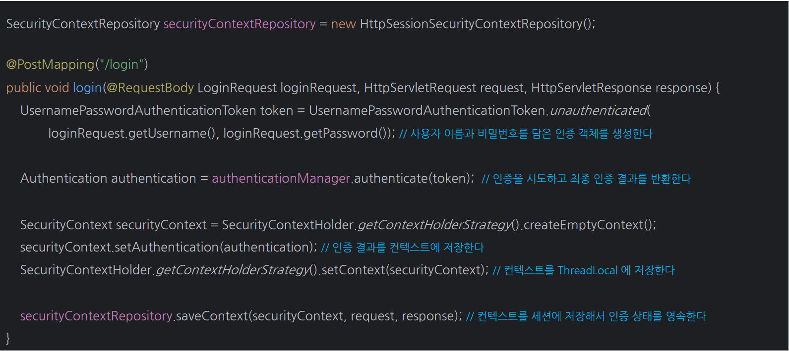

# 스프링 MVC 인증 구현

- 스프링 시큐리티 필터에 의존하는 대신 수동으로 사용자를 인증하는 경우 스프링 MVC 컨트롤러 엔드포인트를 사용할 수 있다.
- 요청 간에 인증을 저장하고 싶다면 `HttpSessionSecurityContextRepository`를 사용하여 인증 상태를 저장할 수 있다.



---

```java
@Data
public class LoginRequest {
    private String username;
    private String password;
}
```
```java
@RestController
@RequiredArgsConstructor
public class LoginController {

    private final AuthenticationManager authenticationManager;
    private final HttpSessionSecurityContextRepository securityContextRepository = new HttpSessionSecurityContextRepository();

    @PostMapping("/login")
    public Authentication login(@RequestBody LoginRequest loginRequest, HttpServletRequest request, HttpServletResponse response) {
        UsernamePasswordAuthenticationToken token =
                UsernamePasswordAuthenticationToken.unauthenticated(loginRequest.getUsername(), loginRequest.getPassword());
        Authentication authentication = authenticationManager.authenticate(token);

        SecurityContext securityContext = SecurityContextHolder.getContextHolderStrategy().createEmptyContext();
        securityContext.setAuthentication(authentication);

        SecurityContextHolder.getContextHolderStrategy().setContext(securityContext);

        securityContextRepository.saveContext(securityContext, request, response);

        return authentication;
    }
}
```
```java
@Configuration
@EnableWebSecurity
public class SecurityConfig {

    @Bean
    public SecurityFilterChain securityFilterChain(HttpSecurity http) throws Exception {
        
        http
                .authorizeHttpRequests(auth -> auth
                        .requestMatchers("/login").permitAll()
                        .anyRequest().authenticated())
//                .formLogin(Customizer.withDefaults())
                .csrf(AbstractHttpConfigurer::disable)
        ;

        return http.build();
    }

    @Bean
    public AuthenticationManager authenticationManager(AuthenticationConfiguration configuration) throws Exception {
        return configuration.getAuthenticationManager();
    }
}
```

- `formLogin`과 `csrf`를 비활성화 하지 않으면 스프링 시큐리티의 폼 인증 필터가 요청을 먼저 가로채어 컨트롤러 요청은 무시된다.