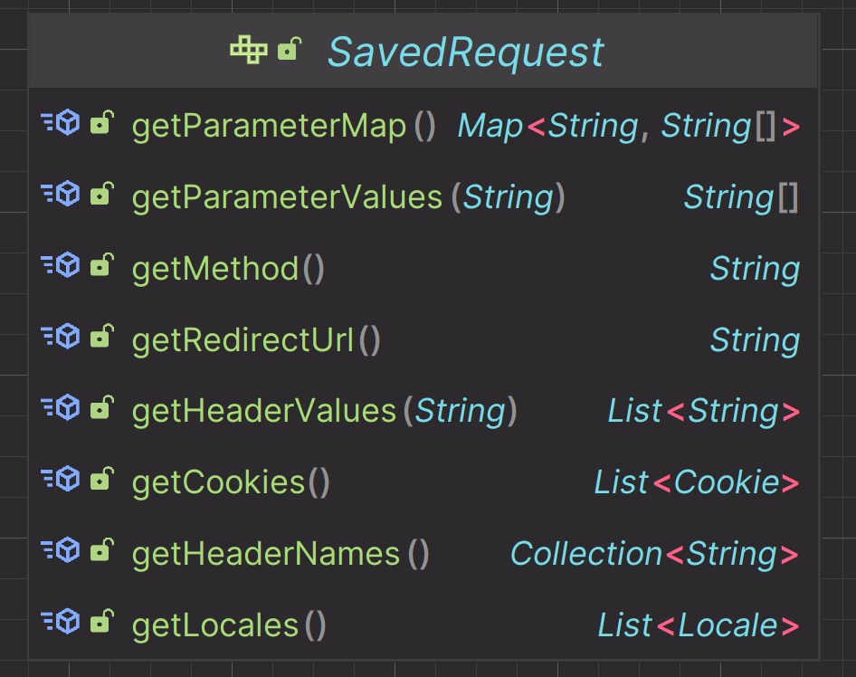
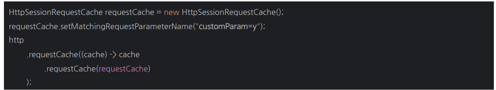
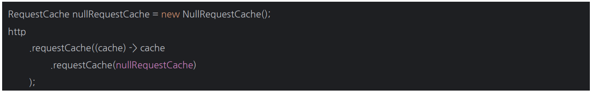
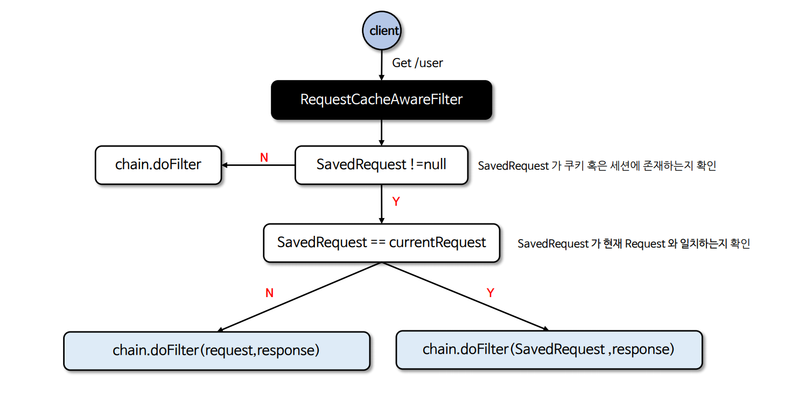

# 요청 캐시

---

## RequestCache

- 인증 절차 문제로 리다이렉트 된 후에 이전에 했던 요청 정보를 담고 있는 `SavedRequest` 객체를 쿠키 또는 세션에 저장하고 필요 시 다시 가져와 실행하는 캐시 메커니즘


- 구현체로 `CookieRequestCache`, `HttpSessionRequestCache`, `NullRequestCache`가 있다.

---

## SavedRequest

- 로그인과 같은 인증 절차 후 사용자를 인증 이전의 원래 페이지로 안내하여 이전 요청과 관련된 여러 정보를 저장한다.



- 구현체로 `DefaultSavedReqeust`와 `SimpleSavedRequest`가 있다.

---


---

## requestCache()

- 다음과 같이 설정 하면 요청 URL에 쿼리 스트링으로 `customParam=y`라는 값이 있을 때만 `HttpSession`에 저장된 `SavedRequest` 를 꺼내오도록 설정할 수 있다.(기본값은 `continue`)



- 요청을 저장하지 않도록 하려면 `NullRequestCache` 구현을 사용한다.



---

## RequestCacheAwareFilter

- 이전에 저장했던 웹 요청(`SavedRequest`)을 다시 불러오는 역할을 한다.
- `SavedRequest`가 현재 Request와 일치하면 이 요청을 필터 체인의 `doFilter` 메서드에 전달하고, `SavedRequest`가 없으면 필터는 원래 Request를 그대로 진행시킨다.



---

```java
@Configuration
@EnableWebSecurity
public class SecurityConfig {

    @Bean
    public SecurityFilterChain securityFilterChain(HttpSecurity http) throws Exception {

        HttpSessionRequestCache requestCache = new HttpSessionRequestCache();
        requestCache.setMatchingRequestParameterName("customParam=y");

        http
                .authorizeHttpRequests(auth -> auth
                        .requestMatchers("/logoutSuccess").permitAll()
                        .anyRequest().authenticated()
                )
                .formLogin(form -> form
                        .successHandler((request, response, authentication) -> {
                            SavedRequest savedRequest = requestCache.getRequest(request, response);
                            String redirectUrl = savedRequest.getRedirectUrl();
                            response.sendRedirect(redirectUrl);
                        }))

                .requestCache(cache -> cache.requestCache(requestCache));

        return http.build();
    }
}
```
```java
@GetMapping("/")
public String index(@RequestParam("customParam") String customParam) {
    if (customParam != null) {
        return "customPage";
    } else {
        return "index";
    }
}
```

---

[이전 ↩️ - ]()

[메인 ⏫](https://github.com/genesis12345678/TIL/blob/main/Spring/security/main.md)