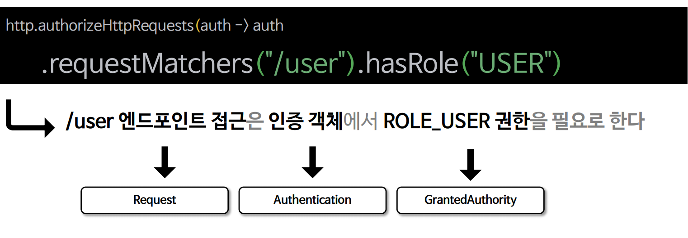
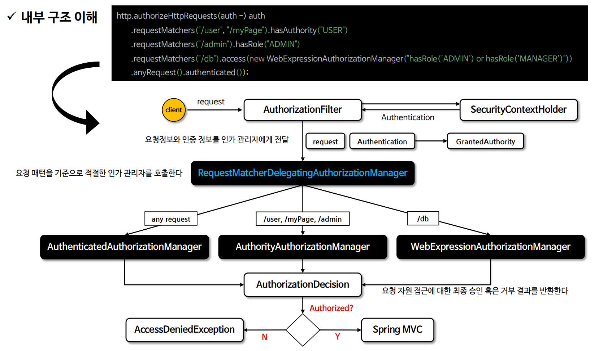
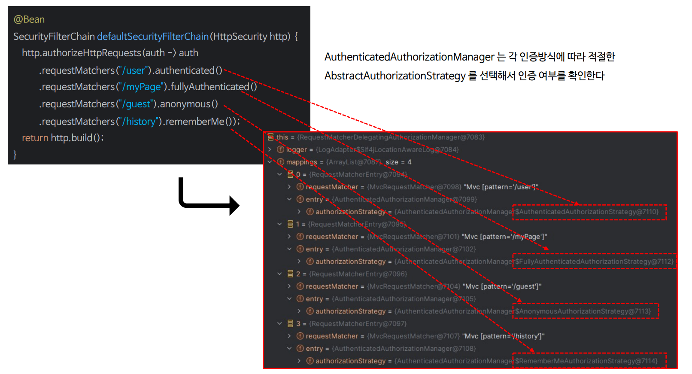
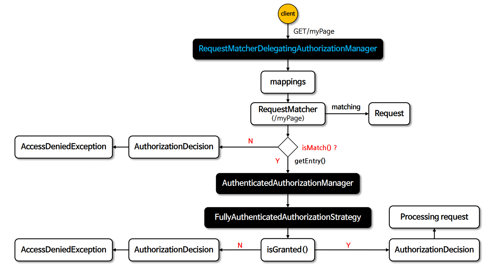
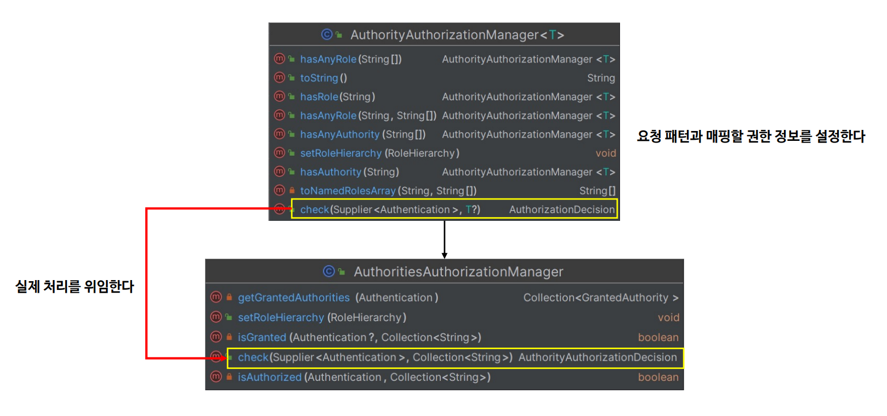
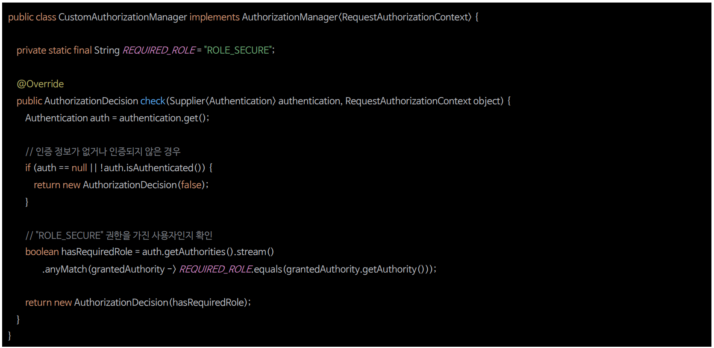

# 요청 기반 인가 관리자

- 스프링 시큐리티는 요청 기반의 인증된 사용자 및 특정 권한을 가진 사용자의 자원 접근 허용여부를 결정하는 인가 관리자 클래스들을 제공한다.
- 대표적으로 `AuthorityAuthorizationManger`, `AuthenticatedAuthorizationManager`와 대리자인 `RequestMatcherDelegatingAuthorizationManager`가 있다.

**스프링 시큐리티 인가처리**





---

## AuthenticatedAuthorizationManager 구조


- `AuthenticatedAuthorizationManager`는 내부적으로 네 개의 `AbstractAuthorizationStrategy` 구현을 통해 인증 여부 확인 전략을 세운다.

---

## AuthenticatedAuthorizationManager 매핑



---

## AuthenticatedAuthorizationManager 흐름도



---

## AuthorityAuthorizationManger 구조



- `AuthorityAuthorizationManger`는 내부적으로 `AuthoritiesAuthorizationManger` 를 사용하여 권한 여부 결정을 위임한다.

---

## AuthorityAuthorizationManger 매핑


---

## AuthorityAuthorizationManger 흐름도


---

## 요청 기반 Custom AuthorizationManager

- 스프링 시큐리티 인가 설정 시 선언적 방식이 아닌 프로그래밍 방식으로 구현할 수 있으며 **access(`AuthorizationManager`)** API를 사용하면 된다.
- `access()`에는 **AuthorizationManager< RequestAuthorizationContext >** 타입의 객체를 전달할 수 있으며 사용자의 요청에 대한 권한 검사를 `access()`에 지정한 **AuthorizationManager**가 처리하게 된다.
- `access()`에 지정한 **AuthorizationManager** 객체는 `RequestMatcherDelegatingAuthorizationManager`의 매핑 속성에 저장된다.


- 특정한 엔드포인트에 대한 권한 검사를 수행하기 위해 `AuthorizationManager`를 구현하여 설정한다.
- `/user`, `/myPage`, `/admin` 요청 패턴의 권한 검사는 `AuthorityAuthorizationManager`가 처리한다.
- `/api` 요청 패턴의 권한 검사는 **CustomAuthorizationManager**가 처리한다.

---

## 요청 기반 CustomAuthorizationManager



---

```java
@Configuration
@EnableWebSecurity
public class SecurityConfig {

    @Bean
    public SecurityFilterChain securityFilterChain(HttpSecurity http) throws Exception {

        http
                .authorizeHttpRequests(authorize -> authorize
                        .requestMatchers("/user").hasRole("USER")
                        .requestMatchers("/db").access(new WebExpressionAuthorizationManager("hasRole('DB')"))
                        .requestMatchers("/admin").hasAuthority("ROLE_ADMIN")
                        .requestMatchers("/secure").access(new CustomAuthorizationManager())
                        .anyRequest().authenticated())
                .formLogin(Customizer.withDefaults())
                .csrf(AbstractHttpConfigurer::disable)
        ;
        return http.build();
    }

   @Bean
    public UserDetailsService userDetailsService() {
        UserDetails user = User.withUsername("user")
                .password("{noop}1111")
                .authorities("MYPREFIX_USER")
                .build();

        UserDetails manager = User.withUsername("db")
                .password("{noop}1111")
                .roles("DB")
                .build();

       UserDetails admin = User.withUsername("admin")
               .password("{noop}1111")
               .roles("ADMIN", "SECURE")
               .build();

        return new InMemoryUserDetailsManager(user, manager, admin);
    }
}
```
```java
public class CustomAuthorizationManager implements AuthorizationManager<RequestAuthorizationContext> {

    private static final String REQUIRED_ROLE = "ROLE_SECURE";
    
    @Override
    public AuthorizationDecision check(Supplier<Authentication> authentication, RequestAuthorizationContext object) {
        Authentication auth = authentication.get();

        if (auth == null || !auth.isAuthenticated() || auth instanceof AnonymousAuthenticationToken) {
            return new AuthorizationDecision(false);
        }

        boolean hasRequiredRole = auth.getAuthorities().stream()
                .anyMatch(grantedAuthority -> REQUIRED_ROLE.equals(grantedAuthority.getAuthority()));

        return new AuthorizationDecision(hasRequiredRole);
    }
}
```