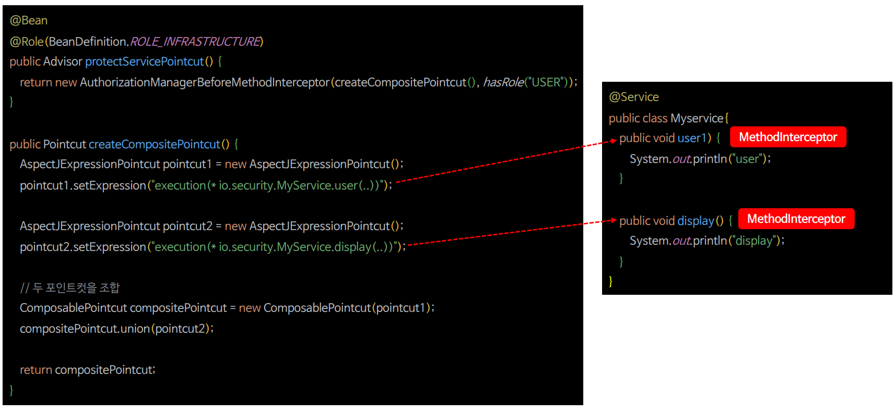

# 포인트컷 메서드 보안

- 메서드 보안은 AOP를 기반으로 구축되었기 때문에 어노테이션이 아닌 패턴 형태로 권한 규칙을 선언할 수 있으며 이는 요청 수준의 인가와 유사한 방식이다.
- 자체 어드바이저(`Advisor`)를 발행하거나 포인트컷(`Pointcut`)을 사용하여 AOP 표현식을 애플리케이션의 인가 규칙에 맞게 매칭할 수 있으며 이를 통해 어노테이션을
    사용하지 않고도 메소드 수준에서 보안 정책을 구현할 수 있다.

---

## 빈 정의 - 단일 포인트컷


---

## 빈 정의 - 다중 포인트컷



---

```text
implementation 'org.springframework.boot:spring-boot-starter-aop'
```

```java
@Configuration
@EnableWebSecurity
public class SecurityConfig {

    @Bean
    public SecurityFilterChain securityFilterChain(HttpSecurity http) throws Exception {

        http
                .authorizeHttpRequests(authorize -> authorize
                        .anyRequest().authenticated())
                .formLogin(Customizer.withDefaults())
                .csrf(AbstractHttpConfigurer::disable)
        ;
        return http.build();
    }

   @Bean
    public UserDetailsService userDetailsService() {
        UserDetails user = User.withUsername("user")
                .password("{noop}1111")
                .roles("USER")
                .build();

        UserDetails manager = User.withUsername("db")
                .password("{noop}1111")
                .roles("DB")
                .build();

       UserDetails admin = User.withUsername("admin")
               .password("{noop}1111")
               .roles("ADMIN", "SECURE")
               .build();

        return new InMemoryUserDetailsManager(user, manager, admin);
    }
}
```
```java
@Configuration
@EnableMethodSecurity(prePostEnabled = false)
public class MethodSecurityConfig {

    /**
     * 단일 포인트컷
     */
    @Bean
    @Role(BeanDefinition.ROLE_INFRASTRUCTURE)
    public Advisor pointCutAdvisor() {
        AspectJExpressionPointcut pattern = new AspectJExpressionPointcut();
        pattern.setExpression("execution(* io.security.springsecuritymaster.DataService.getUser(..))");
        AuthorityAuthorizationManager<MethodInvocation> manager = AuthorityAuthorizationManager.hasRole("USER");

        return new AuthorizationManagerBeforeMethodInterceptor(pattern, manager);
    }

    /**
     * 다중 포인트컷
     */
    @Bean
    @Role(BeanDefinition.ROLE_INFRASTRUCTURE)
    public Advisor pointCutAdvisor2() {
        AspectJExpressionPointcut pattern1 = new AspectJExpressionPointcut();
        pattern1.setExpression("execution(* io.security.springsecuritymaster.DataService.getUser(..))");

        AspectJExpressionPointcut pattern2 = new AspectJExpressionPointcut();
        pattern2.setExpression("execution(* io.security.springsecuritymaster.DataService.getOwner(..))");

        ComposablePointcut composablePointcut = new ComposablePointcut((Pointcut) pattern1);
        composablePointcut.union((Pointcut) pattern2);

        AuthorityAuthorizationManager<MethodInvocation> manager = AuthorityAuthorizationManager.hasRole("USER");

        return new AuthorizationManagerBeforeMethodInterceptor(composablePointcut, manager);
    }
}
```
```java
@Service
public class DataService {

    public String getUser() {
        return "user";
    }

    public Account getOwner(String name) {
        return new Account(name, false);
    }

    public String display() {
        return "display";
    }
}
```

- 포인트컷을 지정했기 때문에 어노테이션이 필요 없다.