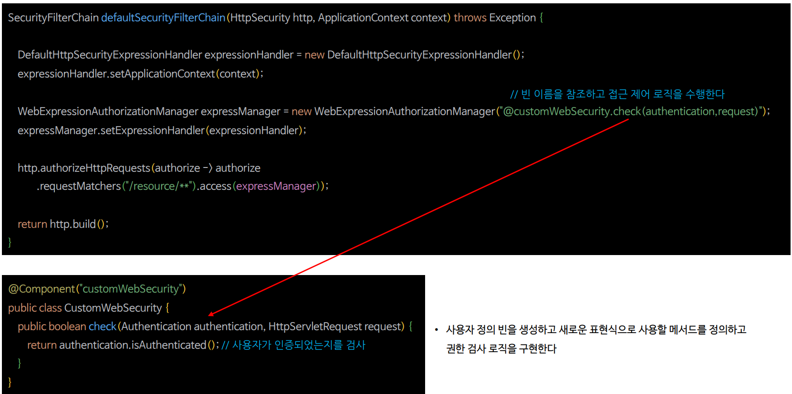
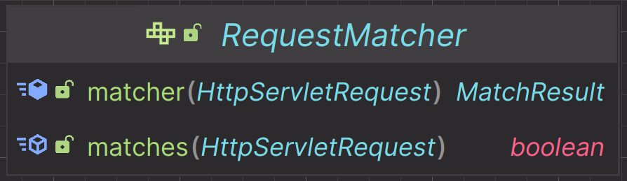
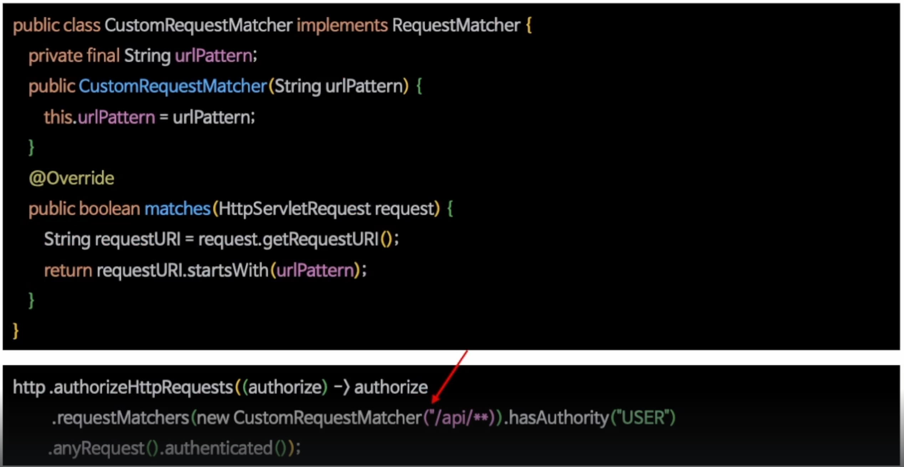

# 표현식 및 커스텀 권한 구현

---

## 표현식 권한 규칙 설정

- 스프링 시큐리티는 표현식을 사용해서 권한 규칙을 설정하도록 **WebExpressionAuthorizationManager**를 제공한다.
- 표현식은 시큐리티가 제공하는 권한 규칙을 사용하거나 사용자가 표현식을 커스텀하게 구현해서 설정 가능하다.

```text
requestMatchers().access(new WebExpressionAuthorizationManager("expression"))
```


---

## 커스텀 권한 표현식



--- 

## 커스텀 RequestMatcher 구현



- **RequestMatcher**의 `matcher` 및 `matches` 메서드를 사용하여 클라이언트의 요청 객체로부터 값을 검증하도록 커스텀한 **RequestMatcher**를 구현하고 `requestMatchers()` 메서드에 설정한다.



---

## 표현식

```java
@Configuration
@EnableWebSecurity
public class SecurityConfig {
    
    @Bean
    public SecurityFilterChain securityFilterChain(HttpSecurity http) throws Exception {

        http
                .authorizeHttpRequests(authorize -> authorize
                        .requestMatchers("/user/{name}")
                        .access(new WebExpressionAuthorizationManager("#name == authentication.name"))

                        .requestMatchers("/admin/db")
                        .access(new WebExpressionAuthorizationManager("hasAnyAuthority('ROLE_DB') or hasAnyAuthority('ROLE_ADMIN')"))

                        .anyRequest().authenticated())
                .formLogin(Customizer.withDefaults())
        ;
        return http.build();
    }
    
    @Bean
    public UserDetailsService userDetailsService() {
        UserDetails user = User.withUsername("user")
                .password("{noop}1111")
                .roles("USER")
                .build();

        UserDetails manager = User.withUsername("manager")
                .password("{noop}1111")
                .roles("DB")
                .build();

        UserDetails admin = User.withUsername("admin")
                .password("{noop}1111")
                .roles("ADMIN", "SECURE")
                .build();

        return new InMemoryUserDetailsManager(user, manager, admin);
    }
}
```
```java
@RestController
public class IndexController {

    @GetMapping("/")
    public String index(){
        return "index";
    }

    @GetMapping("/custom")
    public String custom(){
        return "custom";
    }

    @GetMapping("/user/{name}")
    public String userName(@PathVariable(value = "name") String name){
        return name;
    }

    @GetMapping("/admin/db")
    public String admin(){
        return "admin";
    }
}
```

- **`user`로 로그인**
  - `/user/user` 가능
  - `/admin/db` 불가능
- **`db`로 로그인**
  - `/user/db` 가능
  - `/admin/db` 가능
- **`admin`으로 로그인**
  - `/user/admin` 가능
  - `/admin/db` 가능

---

## 커스텀 표현 권한식

```java
@Configuration
@EnableWebSecurity
public class SecurityConfig {
  @Bean
  public SecurityFilterChain securityFilterChain(HttpSecurity http, ApplicationContext context) throws Exception {

    DefaultHttpSecurityExpressionHandler expressionHandler = new DefaultHttpSecurityExpressionHandler();
    expressionHandler.setApplicationContext(context);

    WebExpressionAuthorizationManager authorizationManager =
            new WebExpressionAuthorizationManager("@customWebSecurity.check(authentication, request)");

    authorizationManager.setExpressionHandler(expressionHandler);

    http
            .authorizeHttpRequests(authorize -> authorize
                    .requestMatchers("/custom/**").access(authorizationManager)
                    .anyRequest().authenticated())
            .formLogin(Customizer.withDefaults())
    ;
    return http.build();
  }
}
```
```java
@Component("customWebSecurity")
public class CustomWebSecurity {

    public boolean check(Authentication authentication, HttpServletRequest request){
        return authentication.isAuthenticated();
    }
}
```

---

## 커스텀 RequestMatcher

```java
public class CustomRequestMatcher implements RequestMatcher {

    private final String urlPattern;

    public CustomRequestMatcher(String urlPattern) {
        this.urlPattern = urlPattern;
    }

    @Override
    public boolean matches(HttpServletRequest request) {
        String requestURI = request.getRequestURI();
        return requestURI.startsWith(urlPattern);
    }
}
```
```java
@Configuration
@EnableWebSecurity
public class SecurityConfig {
  @Bean
  public SecurityFilterChain securityFilterChain(HttpSecurity http, ApplicationContext context) throws Exception {

    http
            .authorizeHttpRequests(authorize -> authorize
                    .requestMatchers(new CustomRequestMatcher("/admin")).hasAuthority("ROLE_ADMIN")
                    .anyRequest().authenticated())
            .formLogin(Customizer.withDefaults())
    ;
    return http.build();
  }
}
```