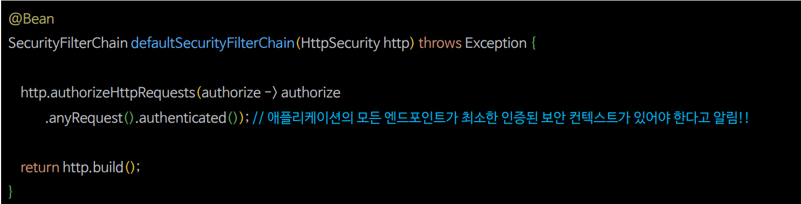
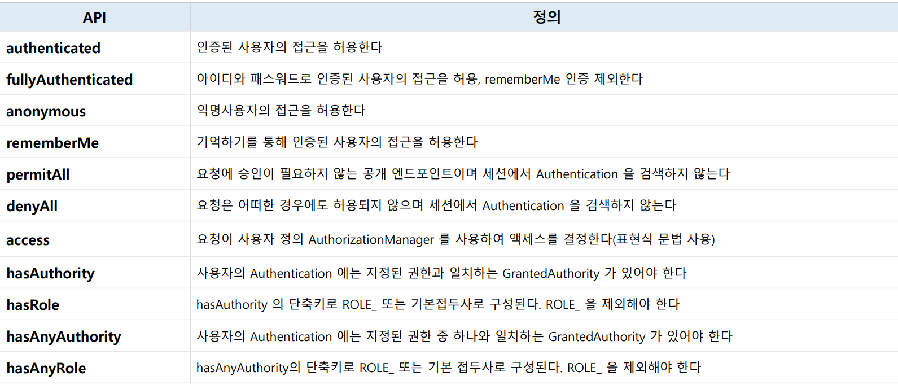

# 요청 기반 권한 부여

- Spring Security는 요청 기반 권한 부여(**Request Based Authorization**)와 메서드 기반 권한 부여(**Method Based Authorization**)를 통해 자원에 대한 심층적인 방어를 제공한다.
- 요청 기반 권한 부여는 클라이언트의 요청, 즉 `HttpServletRequest`에 대한 권한 부여를 모델링 하는 것이며 이를 위해 `HttpSecurity` 인스턴스를 사용하여 권한 규칙을 선언할 수 있다.

---

## HttpSecurity.authorizeRequests()



- `authorizeRequests()`는 사용자의 자원 접근을 위한 요청 엔드포인트와 접근에 필요한 권한을 매핑시키기 위한 규칙을 설정하는 것으로, 서블릿 기반 엔드포인트에 접근하려면
  `authorizeRequests()`에 해당 규칙들을 포함해야 한다.
- `authorizeRequests()`를 통해 요청과 권한 규칙이 설정되면 내부적으로 **AuthorizationFilter**가 요청에 대한 권한 검사 및 승인 작업을 수행한다.

---

## authorizeRequests() API

### requestMatchers()

- `requestMatchers` 메서드는 HTTP 요청의 URL 패턴, HTTP 메서드, 요청 파라미터 등을 기반으로 어떤 요청에 대해서는 특정 보안 설정을 적용하고 다른 요청에 대해서는 적용하지 않도록 세밀하게 제어할 수 있게 해준다.
- 예를 들어 특정 API 경로에만 `CSRF` 보호를 적용하거나, 특정 경로에 대해 인증을 요구하지 않도록 설정할 수 있다. 
- 이를 통해 애플리케이션의 보안 요구 사항에 맞춰서 유연한 보안 정책을 구성할 수 있다.

> 1. **requestMatchers(String... urlPatterns)**
>    - 보호가 필요한 자원 경로를 한 개 이상 정의한다.
> 2. **requestMatchers(RequestMatcher... requestMatchers)**
>    - 보호가 필요한 자원 경로를 한 개 이상 정의한다.
>    - `AntPathRequestMatcher`, `MvcRequestMatcher` 등의 구현체를 사용할 수 있다.
> 3. **requestMatchers(HttpMethod method, String... urlPatterns)**
>    - `Http Method`와 보호가 필요한 자원 경로를 한 개 이상 정의한다.

- **엔드 포인트와 권한 부여**


---

## 보호 자원과 권한 규칙 설정


- **주의 사항**
  - 스프링 시큐리티는 클라이언트의 요청에 대하여 위에서 아래로 나열된 순서대로 처리하며 요청에 대하여 첫 번째 일치만 적용되고 다음 순서로 넘어가지 않는다.
  - 예를 들어 `/admin/**`가 `/admin/db` 요청을 포함하므로 의도한 대로 권한 규칙이 적용 되지 않을 수 있다. 때문에 엔드 포인트 설정 시 좁은 범위의 경로를 먼저 정의하고
    그것보다 큰 범위의 경로를 다음 설정으로 정의해야 한다.

---

## 권한 규칙 종류



- 권한 규칙은 내부적으로 `AuthorizationManager` 클래스에 의해 재구성되며 모든 요청은 여러 종류의 `AuthorizationManager`에 설정된 권한 규칙에 따라 승인 혹은 거부된다.

---

```java
@Configuration
@EnableWebSecurity
public class SecurityConfig {

    @Bean
    public SecurityFilterChain securityFilterChain(HttpSecurity http, HandlerMappingIntrospector introspector) throws Exception {

        http
                .authorizeHttpRequests(authorize -> authorize
                        .requestMatchers("/","/login").permitAll()
                        .requestMatchers("/user").hasAuthority("ROLE_USER") // "/user" 엔드포인트에 대해 "USER" 권한을 요구합니다.
                        .requestMatchers("/myPage/**").hasRole("USER") // "/mypage" 및 하위 디렉터리에 대해 "USER" 권한을 요구합니다. Ant 패턴 사용.
                        .requestMatchers(HttpMethod.POST).hasAuthority("ROLE_WRITE") // POST 메소드를 사용하는 모든 요청에 대해 "write" 권한을 요구합니다.
                        .requestMatchers(new AntPathRequestMatcher("/manager/**")).hasAuthority("ROLE_MANAGER") // "/manager" 및 하위 디렉터리에 대해 "MANAGER" 권한을 요구합니다. AntPathRequestMatcher 사용.
                        .requestMatchers(new MvcRequestMatcher(introspector, "/admin/payment")).hasAuthority("ROLE_ADMIN") // "/manager" 및 하위 디렉터리에 대해 "MANAGER" 권한을 요구합니다. AntPathRequestMatcher 사용.
                        .requestMatchers("/admin/**").hasAnyAuthority("ROLE_ADMIN", "ROLE_MANAGER") // "/admin" 및 하위 디렉터리에 대해 "ADMIN" 또는 "MANAGER" 권한 중 하나를 요구합니다.
                        .requestMatchers(new RegexRequestMatcher("/resource/[A-Za-z0-9]+", null)).hasAuthority("ROLE_MANAGER") // 정규 표현식을 사용하여 "/resource/[A-Za-z0-9]+" 패턴에 "MANAGER" 권한을 요구합니다.
                        .anyRequest().authenticated())// 위에서 정의한 규칙 외의 모든 요청은 인증을 필요로 합니다.
                .formLogin(Customizer.withDefaults())
                .csrf(AbstractHttpConfigurer::disable);

        return http.build();
    }


   @Bean
    public UserDetailsService userDetailsService() {
        UserDetails user = User.withUsername("user")
                .password("{noop}1111")
                .roles("USER")
                .build();

        UserDetails manager = User.withUsername("manager")
                .password("{noop}1111")
                .roles("MANAGER")
                .build();

       UserDetails admin = User.withUsername("admin")
               .password("{noop}1111")
               .roles("ADMIN", "WRITE")
               .build();

        return new InMemoryUserDetailsManager(user, manager, admin);
    }
}
```
```html
<!DOCTYPE html>
<html xmlns:th="http://www.thymeleaf.org">
<head>
    <meta charset="UTF-8">
    <title>Spring Security Test Page</title>
</head>
<body>
<h2>Spring Security 요청 테스트</h2>
<a href="/login">로그인</a>
<a href="/logout">로그아웃</a>
<button onclick="fetchAndDisplay('/user')">User 페이지 접근</button>
<button onclick="fetchAndDisplay('/myPage/points')">MyPage 페이지 접근</button>
<button onclick="fetchAndDisplay('/manager')">Manager 페이지 접근</button>
<button onclick="fetchAndDisplay('/admin/payment')">Admin Payment 접근</button>
<button onclick="fetchAndDisplay('/admin')">Admin 페이지 접근</button>
<button onclick="fetchAndDisplay('/resource/address_01')">인증자 페이지 접근</button>
<button onclick="fetchAndDisplay('/resource/address01')">Manager 페이지 접근</button>
<button onclick="sendPostRequest()">POST 요청 보내기</button>

<script>
    function fetchAndDisplay(url) {
        fetch(url)
            .then(response => {
                if (!response.ok) throw new Error('Request failed');
                return response.text();
            })
            .then(data => alert('Response: ' + data))
            .catch(error => alert('Error: ' + error));
    }

    function sendPostRequest() {
        fetch('/post', {
            method: 'POST',
            headers: {
                'Content-Type': 'application/json',
                // 'Authorization': 'Bearer YOUR_TOKEN_HERE' // 필요한 경우 인증 토큰 추가
            },
            body: JSON.stringify({ data: 'yourDataHere' })
        })
            .then(response => {
                if (!response.ok) throw new Error('Post request failed');
                return response.text();
            })
            .then(data => alert('Post Response: ' + data))
            .catch(error => alert('Post Error: ' + error));
    }
</script>
</body>
</html>
```
```java
@RestController
public class RequestController {

    @GetMapping("/user")
    public String user(){
        return "user";
    }

    @GetMapping("/myPage/points")
    public String myPage(){
        return "myPage";
    }

    @GetMapping("/manager")
    public String manager(){
        return "manager";
    }

    @GetMapping("/admin")
    public String admin(){
        return "admin";
    }

    @GetMapping("/admin/payment")
    public String adminPayment(){
        return "adminPayment";
    }

    @GetMapping("/resource/address_01")
    public String address_01(){
        return "address_01";
    }

    @GetMapping("/resource/address01")
    public String address01(){
        return "address01";
    }

    @PostMapping("/post")
    public String post(){
        return "post";
    }

}
```

- `http://localhost:8080`


- **`user`로 로그인**
  - User 페이지 접근(`/user`) : 가능
  - MyPage 페이지 접근(`/myPage/points`) : 가능
  - Manager 페이지 접근(`/manager`) : 불가능(권한 부족)
  - Admin Payment 페이지 접근(`/admin/payment`) : 불가능(권한 부족)
  - Admin 페이지 접근(`/admin`) : 불가능(권한 부족)
  - 인증자 페이지 접근(`/resource/address_01`) : 가능
  - Manager 페이지 접근(`/resource/address01`) : 불가능(권한 부족)
  - POST 요청 보내기(`/post`) : 불가능(권한 부족)
- **`manager`로 로그인**
  - User 페이지 접근(`/user`) : 불가능(User만 가능)
  - MyPage 페이지 접근(`/myPage/points`) : 불가능(User만 가능)
  - Manager 페이지 접근(`/manager`) : 가능
  - Admin Payment 페이지 접근(`/admin/payment`) : 불가능(권한 부족)
  - Admin 페이지 접근(`/admin`) : 가능
  - 인증자 페이지 접근(`/resource/address_01`) : 가능
  - Manager 페이지 접근(`/resource/address01`) : 가능
  - POST 요청 보내기(`/post`) : 불가능(권한 부족)
- **`admin`으로 로그인**
  - User 페이지 접근(`/user`) : 불가능(User만 가능)
  - MyPage 페이지 접근(`/myPage/points`) : 불가능(User만 가능)
  - Manager 페이지 접근(`/manager`) : 불가능(Manager만 가능)
  - Admin Payment 페이지 접근(`/admin/payment`) : 가능
  - Admin 페이지 접근(`/admin`) : 가능
  - 인증자 페이지 접근(`/resource/address_01`) : 가능
  - Manager 페이지 접근(`/resource/address01`) : 불가능(Manager만 가능)
  - POST 요청 보내기(`/post`) : 가능