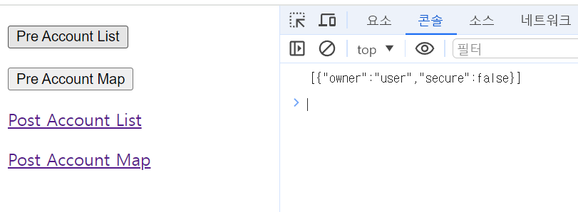
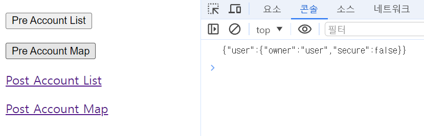

# 메서드 기반 권한 부여

---

## @PreFilter

- `@PreFilter` 어노테이션은 메서드가 실행되기 전에 메서드에 전달된 컬렉션 타입의 파라미터에 대한 필터링을 수행하는 데 사용된다.
- `@PreFilter` 어노테이션은 주로 사용자가 보내온 컬렉션(배열, 리스트, 맵, 스트림 등) 내의 객체들을 특정 기준에 따라 필터링하고 그 중 보안 조건을 만족하는
    객체들에 대해서만 메서드가 처리하도록 할 때 사용된다.


---

## @PostFilter

- `@PostFilter` 어노테이션은 메서드가 반환하는 컬렉션 타입의 결과에 대해 필터링을 수행하는 데 사용된다.
- `@PostFilter` 어노테이션은 메서드가 컬렉션을 반환할 때 반환되는 각 객체가 특정 보안 조건을 충족하는지 확인하고 조건을 만족하지 않는 객체들을 결과에서 제거한다.


---

```java
@Configuration
@EnableWebSecurity
@EnableMethodSecurity
public class SecurityConfig {

    @Bean
    public SecurityFilterChain securityFilterChain1(HttpSecurity http) throws Exception {

        http
                .authorizeHttpRequests(authorize -> authorize
                        .anyRequest().authenticated())
                .formLogin(Customizer.withDefaults())
                .csrf(AbstractHttpConfigurer::disable)
        ;
        return http.build();
    }


   @Bean
    public UserDetailsService userDetailsService() {
        UserDetails user = User.withUsername("user")
                .password("{noop}1111")
                .roles("USER")
                .build();

        UserDetails db = User.withUsername("db")
                .password("{noop}1111")
                .roles("DB")
                .build();

       UserDetails admin = User.withUsername("admin")
               .password("{noop}1111")
               .roles("ADMIN", "SECURE")
               .build();

        return new InMemoryUserDetailsManager(user, db, admin);
    }
}
```
```java
@RestController
@RequiredArgsConstructor
public class MethodController {

    private final DataService dataService;

    @GetMapping("/")
    public String index(){
        return "index";
    }

    @PostMapping("/writeList")
    public List<Account> writeList(@RequestBody List<Account> data) {

        return dataService.writeList(data);
    }

    @PostMapping("/writeMap")
    public Map<String, Account> writeMap(@RequestBody List<Account> data) {
        
        Map<String, Account> dataMap = data.stream()
                .collect(Collectors.toMap(Account::getOwner, account -> account));
        
        return dataService.writeMap(dataMap);
    }

    @GetMapping("/readList")
    public List<Account> readList() {
        return dataService.readList();
    }

    @GetMapping("/readMap")
    public Map<String, Account> readMap() {
        return dataService.readMap();
    }
}
```
```java
@Service
public class DataService {

    @PreFilter("filterObject.owner == authentication.name")
    public List<Account> writeList(List<Account> data) {
        return data;
    }

    @PreFilter("filterObject.value.owner == authentication.name")
    public Map<String, Account> writeMap(Map<String, Account> data) {
        return data;
    }

    @PostFilter("filterObject.owner == authentication.name")
    public List<Account> readList() {
        return new ArrayList<>(List.of(
                new Account("user", false),
                new Account("db", false),
                new Account("admin", false)
        ));
    }

    @PostFilter("filterObject.value.owner == authentication.name")
    public Map<String, Account> readMap() {
        return new HashMap<>(Map.of(
                "user", new Account("user", false),
                "db", new Account("db", false),
                "admin", new Account("admin", false)
        ));
    }
}
```
```java
@Getter
@Setter
@NoArgsConstructor
@AllArgsConstructor
public class Account {
    private String owner;
    private boolean isSecure;
}
```
```html
<!DOCTYPE html>
<html xmlns:th="http://www.thymeleaf.org">
<head>
    <meta charset="UTF-8">
    <meta name="viewport" content="width=device-width, initial-scale=1.0">
    <title>Button Click Example</title>
    <script>
        function sendRequest(url) {

            const dataItems = [
                { "owner": "user", "isSecure": "N" },
                { "owner": "admin", "isSecure": "Y" },
                { "owner": "db", "isSecure": "N" }
            ];

            fetch(url, {
                method: 'POST',
                headers: {
                    'Content-Type': 'application/json'
                },
                body: JSON.stringify(dataItems),
            })
                .then(response => {
                    if (response.ok) {
                        return response.text();
                    }
                    throw new Error('Network response was not ok.');
                })
                .then(text => console.log(text))
                .catch(error => console.error('There was a problem with your fetch operation:', error));
        }
    </script>
</head>
<body>

<p><button onclick="sendRequest('/writeList')">Pre Account List</button></p>
<p><button onclick="sendRequest('/writeMap')">Pre Account Map</button></p>
<p><a href="/readList">Post Account List</a></p>
<p><a href="/readMap">Post Account Map</a></p>

</body>
</html>
```

`user`로 로그인

- `Pre Account List`



- `Pre Account Map`



- `Post Account List`(`http://localhost:8080/readList`)


- `Post Account Map`(`http://localhost:8080/readMap`)

