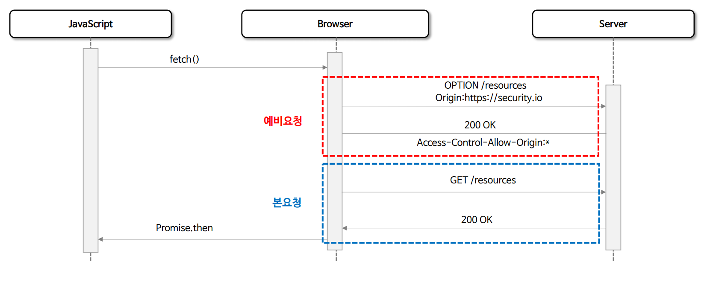
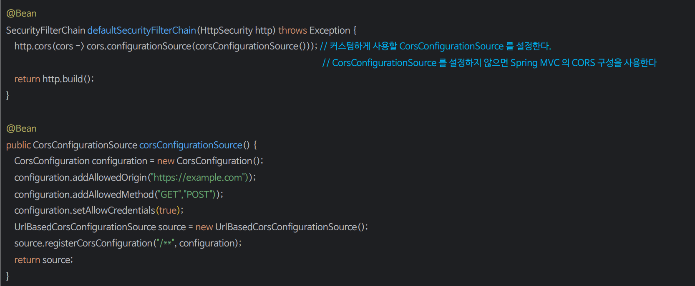
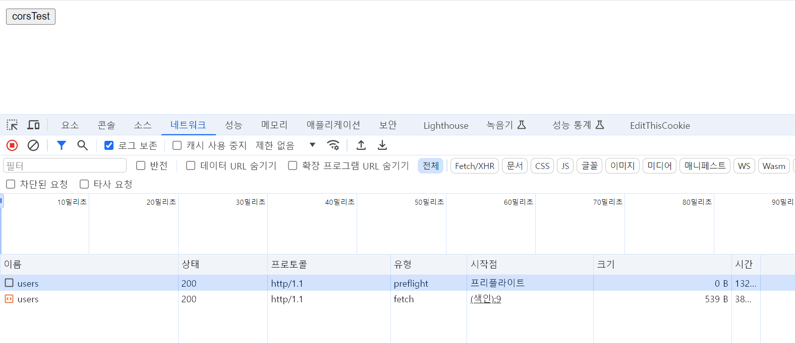
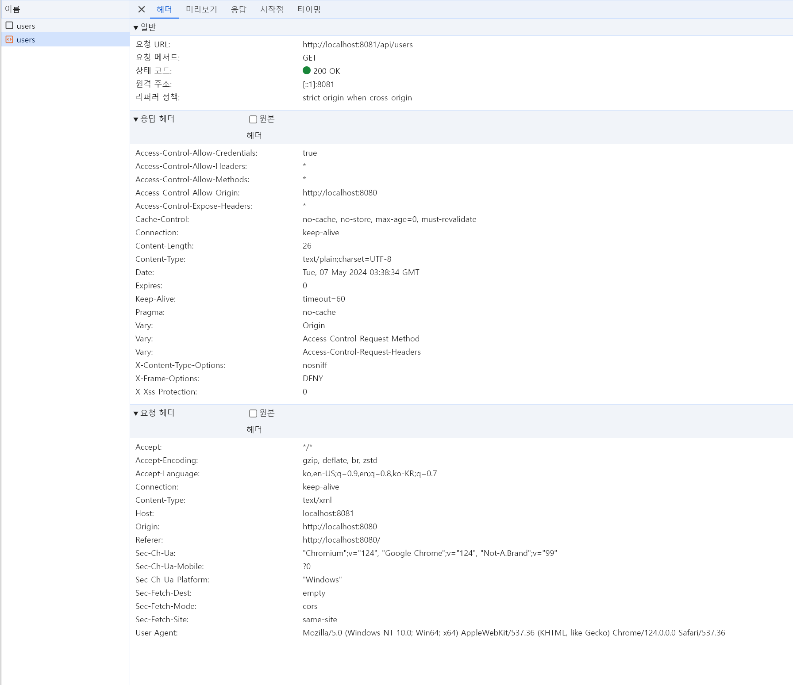
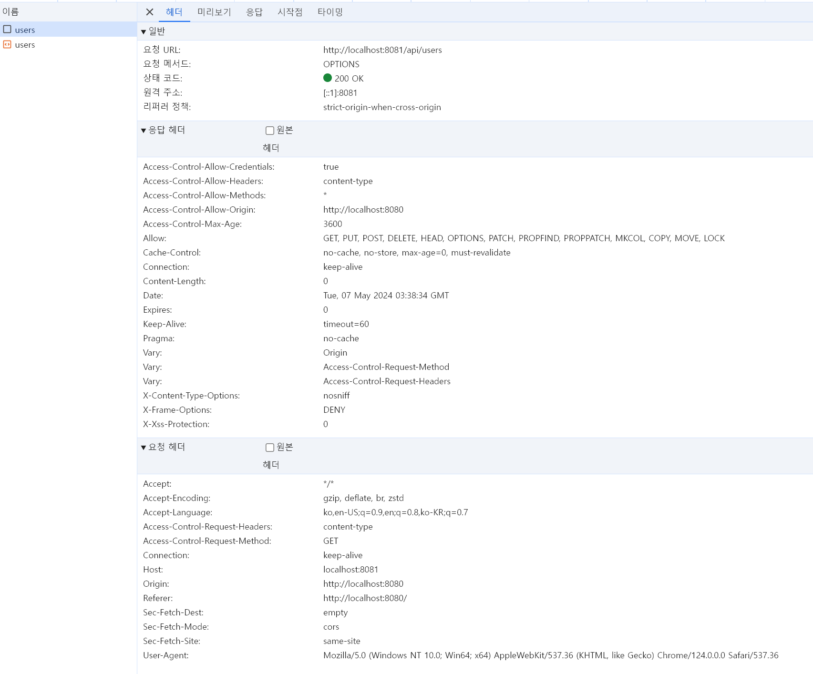

# CORS

- **Cross Origin Resource Sharing, 교차 출처 리소스 공유**
- 웹에서는 보안을 위해 기본적으로 한 웹 페이지(출처 A)에서 다른 웹 페이지(출처 B)의 데이터를 직접 불러오는 것을 제한하는데 이를 "동일 출처 정책(`Same-Origin Policy`)" 이라고 한다.
- 만약 다른 출처의 리소스를 안전하게 사용하고자 할 경우 `CORS`가 등장하며 `CORS`는 특별한 HTTP 헤더를 통해 한 웹 페이지가 다른 출처의 리소스에 접근할 수 있도록 허가를 구하는 방법이라고 할 수 있다.
    즉, 웹 애플리케이션이 다른 출처의 데이터를 사용하고자 할 때, 브라우저가 그 요청을 대신해서 해당 데이터를 사용해도 되는지 다른 출처에게 물어보는 것이라 할 수 있다.
- 출처를 비교하는 로직은 서버에 구현된 스펙이 아닌 브라우저에 구현된 스펙 기준으로 처리되며 브라우저는 클라이언트의 요청 헤더와 서버의 응답 헤더를 비교해서 최종 응답을 결정한다.
- 두 개의 출처를  비교하는 방법은 URL의 구성 요소 중 **Protocol, Host, Port** 세 가지가 동일한지 확인하면 되고 나머지는 틀려도 상관없다.


---

## CORS 종류

### 1. Simple Request

- 예비 요청(`Preflight`) 과정 없이 자동으로 `CORS`가 작동하며 서버에 본 요청을 한 후, 서버가 응답 헤더에 `Access-Control-Allow-Origin`과 같은 값을 전송하면
  브라우저가 서로 비교 후 `CORS` 정책 위반여부를 검사하는 방식이다.
- **제약 사항**
  - **HTTP Method**
    - `GET`, `POST`, `HEAD` 중 한가지
  - **Header**
    - `Accept`, `Accept-Language`, `Content-Language`, `Content-Type`, `DPR`, `Downlink`, `Save-Data`, `Viewport-Width Width` 만 가능
    - Custom Header는 허용되지 않음
  - **Content-Type**
    - `application/x-www-form-urlencoded`, `multipart/form-data`, `text/plain` 만 가능


### 2. Preflight Request(예비 요청)

- 브라우저는 요청을 한번에 보내지 않고, **예비 요청과 본 요청**으로 나누어 서버에 전달하는데 브라우저가 예비 요청을 보내는 것을 `Preflight`라고 하며 이 예비 요청의
    메서드에는 `OPTIONS`가 사용된다.
- 예비 요청의 역할은 본 요청을 보내기 전에 브라우저 스스로 안전한 요청인지 확인하는 것으로 요청 사양이 `Simple Request`에 해당하지 않을 경우 브라우저가 `Preflight Request`를 실행한다.



- **요청 예시**
- 브라우저가 보낸 요청을 보면 `Origin`에 대한 정보 뿐만 아니라 예비 요청 이후에 전송할 본 요청에 대한 다른 정보들도 함께 포함되어 있는 것을 볼 수 있다.
- 이 예비 요청에서 브라우저는 `Access-Control-Request-Headers`를 사용하여 자신이 본 요청에서 **Content-Type** 헤더를 사용할 것을 알려주거나, `Access-Control-Request-Method`를 사용하여 **GET** 메서드를 사용할 것을 서버에게 미리 알려주고 있다.


- **응답 예시**
- 서버가 보내준 응답 헤더에 포함된 `Access-Control-Allow-Origin: https://security.io`의 의미는 해당 URL 외의 다른 출처로 요청할 경우에는 CORS 정책을 위반했다고
    판단하고 오류 메시지를 내고 응답을 버리게 된다.


---

## CORS 해결 - 서버에서 `Access-Control-Allow-*` 세팅

- **Access-Control-Allow-Origin**
  - 헤더에 작성된 출처만 브라우저가 리소스를 접근할 수 있도록 허용한다.
  - `*`(모든 URL), `https://security.io`(특정 URL)
- **Access-Control-Allow-Methods**
  - `preflight request`에 대한 응답으로 실제 요청 중에 사용할 수 있는 메서드를 나타낸다.
  - 기본값은 `GET`, `POST`, `HEAD`, `OPTIONS`, `*`
- **Access-Control-Allow-Headers**
  - `preflight request`에 대한 응답으로 실제 요청 중에 사용할 수 있는 헤더 필드 이름을 나타낸다.
  - 기본값은 `Origin`, `Accept`, `X-Requested-With`, `Content-Type`, `Access-Control-Request-Method`, `Access-Control-Request-Headers`, `Custom Header`, `*`
- **Access-Control-Allow-Credentials**
  - 실제 요청에 쿠키나 인증 등의 사용자 자격 증명이 포함될 수 있음을 나타낸다.
  - Client의 `credentials:include` 옵션일 경우 `true`는 필수
- **Access-Control-Max-Age**
  - `preflight` 요청 결과를 캐시할 수 있는 시간을 나타내는 것으로 해당 시간동안은 `preflight` 요청을 다시 하지 않게 된다.

---

## cors() & CorsFilter

- `CORS`의 사전 요청(`pre-flight request`)에는 쿠키(`JSESSIONID`)가 포함되어 있지 않기 때문에 Spring Security 이전에 처리되어야 한다.
- 사전 요청에 쿠키가 없고 Spring Security 가 가장 먼저 처리되면 요청은 사용자가 인증되지 않았다고 판단하고 거부할 수 있다.
- `CORS`가 먼저 처리되도록 하기 위해서 `CorsFilter`를 사용할 수 있으며 `CorsFilter`에 **CorsConfigurationSource**를 제공함으로써 Spring Security와 통합할 수 있다.



---

### 모듈 1
```java
@Controller
public class IndexController {

    public String index() {
        return "index";
    }
}
```
```html
<!DOCTYPE html>
<html lang="en">
<head>
    <meta charset="UTF-8">
    <title>Title</title>

    <script>
        function corsTest(){
            fetch("http://localhost:8081/api/users", {
                method : "GET",
                headers : {
                    "Content-Type" : "text/xml",
                }
            })
                .then(response => {
                    response.json().then(function (data){
                        console.log(data)
                    })
                })
        }
    </script>
</head>
<body>
<button name="corsTest" onclick="corsTest()">corsTest</button>

</body>
</html>
```

### 모듈 2
```yaml
server:
  port: 8081
```
```java
@Configuration
@EnableWebSecurity
public class SecurityConfig {

    @Bean
    public SecurityFilterChain securityFilterChain(HttpSecurity http) throws Exception {

        http
                .authorizeHttpRequests(auth -> auth
                        .anyRequest().permitAll())
                .formLogin(Customizer.withDefaults())
                .cors(cors -> cors.configurationSource(corsConfigurationSource()))
        ;

        return http.build();
    }

    @Bean
    public CorsConfigurationSource corsConfigurationSource() {
        CorsConfiguration configuration = new CorsConfiguration();
        
        configuration.addAllowedOrigin("http://localhost:8080");
        configuration.addAllowedMethod("*");
        configuration.addAllowedHeader("*");
        configuration.setAllowCredentials(true);
        configuration.setMaxAge(3600L);

        UrlBasedCorsConfigurationSource source = new UrlBasedCorsConfigurationSource();
        source.registerCorsConfiguration("/**", configuration);

        return source;
    }
}
```
```java
@RestController
@RequestMapping("/api")
public class IndexController {

    @GetMapping("/users")
    public String users() {
        return "{\"name\" : \"hong gil dong\"}";
    }
}
```

### localhost:8080



- `corsTest` 버튼을 클릭하면 콘솔에 응답이 출력되고, 예비 요청과(`preflight`) 본 요청(`fetch`)을 확인할 수 있다.

### 본 요청



### 예비 요청



- **모듈 1**의 `index.html`에 **fetch** 쪽을 보면 **Content-Type**을 `text/xml`로 설정했기 때문에 `Simple Request`가 아닌 `Preflight Request`가 적용이 된 것이다.
- **Content-Type** 부분을 주석처리하면 `Simple Request`로 요청이 간다.
- **모듈 2**의 `addAllowedOrigin()` 부분을 8080이 아닌 다른 포트 번호나 다른 URL로 변경한다면 403 에러가 발생한다.