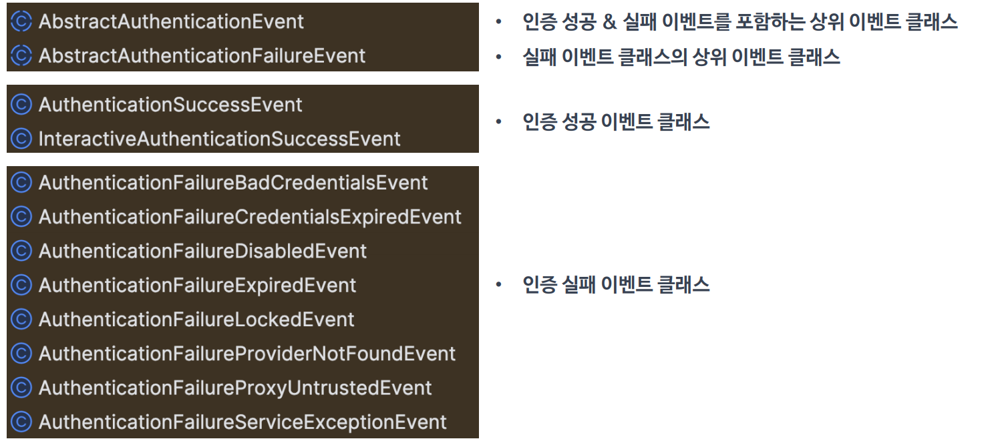
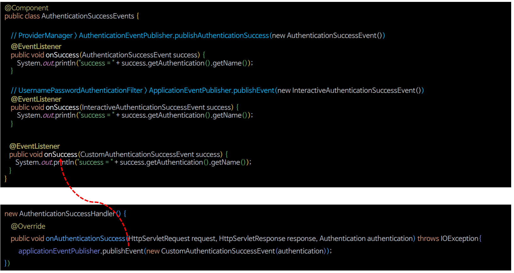
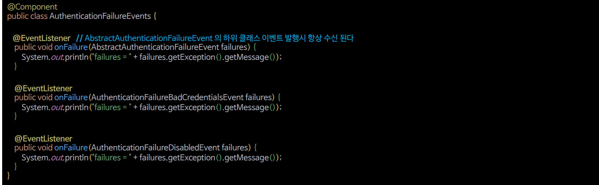

# 인증 이벤트

- 스프링 시큐리티는 인증이 성공하거나 실패하게 되면 `AuthenticationSuccessEvent` 또는 `AuthenticationFailureEvent`를 발생시킨다.
- 이벤트를 수신하려면 `ApplicationEventPublisher`를 사용하거나 시큐리티에서 제공하는 `AuthenticationEventPublisher`를 사용해서 발행해야 한다.
- `AuthenticationEventPublisher`의 구현체로 **DefaultAuthenticationEventPublisher**가 제공된다.

**이벤트 발행 방법**
1. **ApplicationEventPublisher.publishEvent(ApplicationEvent)**
2. **AuthenticationEventPublisher.publishAuthenticationSuccess(Authentication)**
   - **AuthenticationEventPublisher.publishAuthenticationFailure(AuthenticationException, Authentication)**

**이벤트 수신 방법**


- 빈 등록
- 메서드 이름 자유
- `@EventListener` 필수

---

## 인증 이벤트 종류



- 스프링의 이벤트 리스닝 메커니즘은 자바의 클래스 상속 구조를 따르기 때문에 특정 이벤트의 리스너는 해당 이벤트 뿐만 아니라 그 이벤트의 부모 클래스들로부터 발생하는 이벤트도 처리할 수 있다.

---

## 인증 성공 이벤트 발행 및 수신



- `@EventListener`를 적용한 메서드 파라미터에는 수신 받아서 처리하고자 하는 이벤트를 넣어준다.
- 주석처리 된 코드처럼 이미 정의된 이벤트 같은 경우는 스프링 시큐리티 내부적으로 이벤트를 발행하고 있으므로 사용자는 수신만 하면 된다.
- 커스텀 이벤트인 경우 직접 명시적으로 이벤트를 발행해야 한다.

---

## 인증 실패 이벤트 발행 및 수신




---

- 각 이벤트를 처리하는 클래스

```java
@Component
@Slf4j
public class AuthenticationEvents {

    @EventListener
    public void onSuccess(AuthenticationSuccessEvent success) {
      log.info("AuthenticationSuccessEvent = {}", success.getAuthentication().getName());
    }

    @EventListener
    public void onFailure(AbstractAuthenticationFailureEvent failures) {
        log.info("AbstractAuthenticationFailureEvent = {}", failures.getException().getMessage());
    }

    @EventListener
    public void onSuccess(InteractiveAuthenticationSuccessEvent success) {
        log.info("InteractiveAuthenticationSuccessEvent = {}", success.getAuthentication().getName());
    }

    @EventListener
    public void onSuccess(CustomAuthenticationSuccessEvent success) {
        log.info("CustomAuthenticationSuccessEvent = {}", success.getAuthentication().getName());
    }

    @EventListener
    public void onFailure(AuthenticationFailureBadCredentialsEvent failures) {
        log.info("AuthenticationFailureBadCredentialsEvent = {}", failures.getException().getMessage());
    }

    @EventListener
    public void onFailure(AuthenticationFailureProviderNotFoundEvent failures) {
        log.info("AuthenticationFailureProviderNotFoundEvent = {}", failures.getException().getMessage());
    }

    @EventListener
    public void onFailure(CustomAuthenticationFailureEvent failures) {
        log.info("CustomAuthenticationFailureEvent = {}", failures.getException().getMessage());
    }
}
```

- **인증 성공**
  - `AuthenticationSuccessEvent`, `InteractiveAuthenticationSuccessEvent`, `CustomAuthenticationSuccessEvent` 수신
- **인증 실패**
  - `AbstractAuthenticationFailureEvent`, `AuthenticationFailureBadCredentialsEvent` 수신


```java
public class CustomAuthenticationSuccessEvent extends AbstractAuthenticationEvent {

    public CustomAuthenticationSuccessEvent(Authentication authentication) {
        super(authentication);
    }
}
```
```java
public class CustomAuthenticationSuccessEvent extends AbstractAuthenticationEvent {

    public CustomAuthenticationSuccessEvent(Authentication authentication) {
        super(authentication);
    }
}
```

- `ApplicationEventPublisher`를 사용해 이벤트를 발행하는 클래스

```java
@Component
@RequiredArgsConstructor
public class CustomAuthenticationProvider implements AuthenticationProvider {

    private final ApplicationContext applicationEventPublisher;

    @Override
    public Authentication authenticate(Authentication authentication) throws AuthenticationException {
        if (!authentication.getName().equals("user")) {

            applicationEventPublisher.publishEvent(
                    new AuthenticationFailureProviderNotFoundEvent(authentication, new BadCredentialsException("BadCredentialsException"))
            );

            throw new BadCredentialsException("BadCredentialsException");
        }

        UserDetails user = User.withUsername("user").password("{noop}1111").roles("USER").build();
        return new UsernamePasswordAuthenticationToken(user, user.getPassword(), user.getAuthorities());
    }

    @Override
    public boolean supports(Class<?> authentication) {
        return true;
    }
}
```

- `AuthenticationEventPublisher`를 사용해 이벤트를 발행하는 클래스

```java
public class CustomAuthenticationProvider2 implements AuthenticationProvider {

    private final AuthenticationEventPublisher applicationEventPublisher;

    public CustomAuthenticationProvider2(AuthenticationEventPublisher applicationEventPublisher) {
        this.applicationEventPublisher = applicationEventPublisher;
    }

    @Override
    public Authentication authenticate(Authentication authentication) throws AuthenticationException {
        if (!authentication.getName().equals("user")) {

            applicationEventPublisher.publishAuthenticationFailure(
                     new BadCredentialsException("BadCredentialsException"), authentication
            );

            throw new BadCredentialsException("BadCredentialsException");
        }

        UserDetails user = User.withUsername("user").password("{noop}1111").roles("USER").build();
        return new UsernamePasswordAuthenticationToken(user, user.getPassword(), user.getAuthorities());
    }

    @Override
    public boolean supports(Class<?> authentication) {
        return true;
    }
}
```
```java
@Configuration
@EnableWebSecurity
@RequiredArgsConstructor
public class SecurityConfig {

    private final ApplicationEventPublisher eventPublisher;
    
    @Bean
    public SecurityFilterChain securityFilterChain(HttpSecurity http) throws Exception {

        http
                .authorizeHttpRequests(authorize -> authorize
                        .anyRequest().authenticated())
                .formLogin(form -> form.successHandler((request, response, authentication) -> {
                    eventPublisher.publishEvent(new CustomAuthenticationSuccessEvent(authentication));
                    response.sendRedirect("/");
                }))
                .authenticationProvider(customAuthenticationProvider2())
                .csrf(AbstractHttpConfigurer::disable)
        ;
        return http.build();
    }

    @Bean
    public CustomAuthenticationProvider2 customAuthenticationProvider2() {
        return new CustomAuthenticationProvider2(eventPublisher(null));
    }

    @Bean
    public DefaultAuthenticationEventPublisher eventPublisher(ApplicationEventPublisher applicationEventPublisher) {
        return new DefaultAuthenticationEventPublisher(applicationEventPublisher);
    }

   @Bean
    public UserDetailsService userDetailsService() {
        UserDetails user = User.withUsername("user")
                .password("{noop}1111")
                .roles("USER")
                .build();

        UserDetails manager = User.withUsername("db")
                .password("{noop}1111")
                .roles("DB")
                .build();

       UserDetails admin = User.withUsername("admin")
               .password("{noop}1111")
               .roles("ADMIN", "SECURE")
               .build();

        return new InMemoryUserDetailsManager(user, manager, admin);
    }
}
```