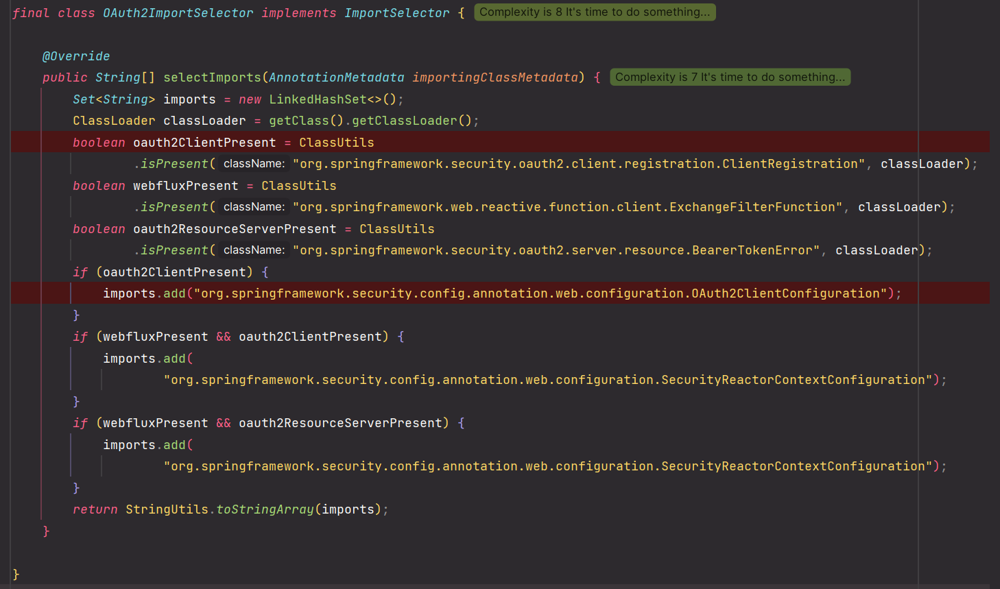
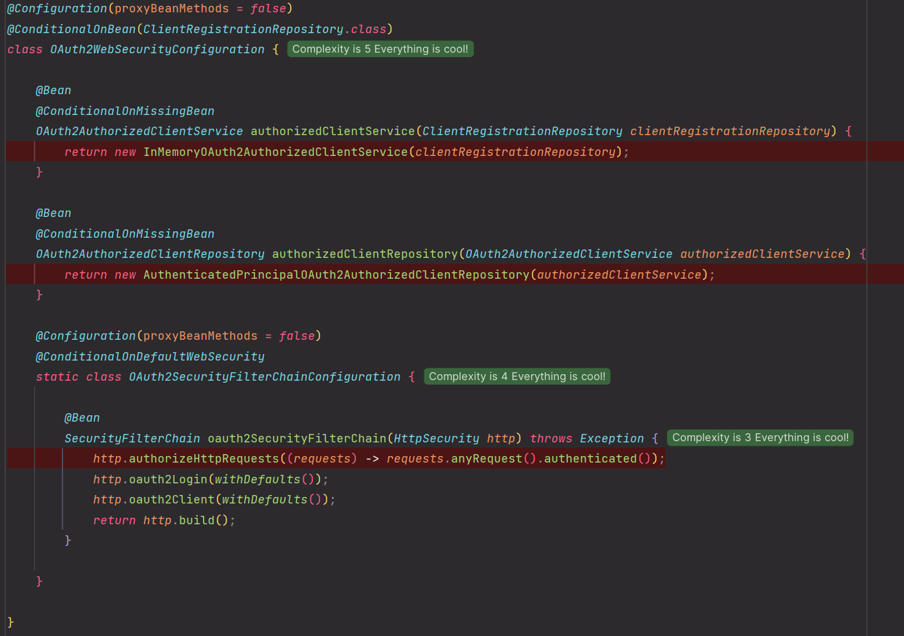
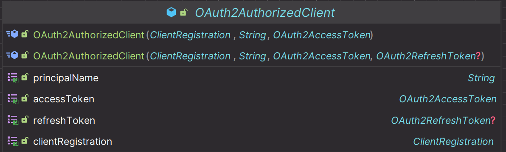

# OAuth 2.0 Client - 자동 설정에 의한 초기화 과정

---

## OAuth2ImportSelector

## OAuth2ClientAutoConfiguration

## OAuth2ClientRegistrationRepositoryConfiguration

## OAuth2WebSecurityConfiguration

---

## OAuth2AuthorizedClient

---

[이전 ↩️ - OAuth 2.0 Client - ClientRegistrationRepository]()

[메인 ⏫](https://github.com/genesis12345678/TIL/blob/main/Spring/security/oauth/main.md)
