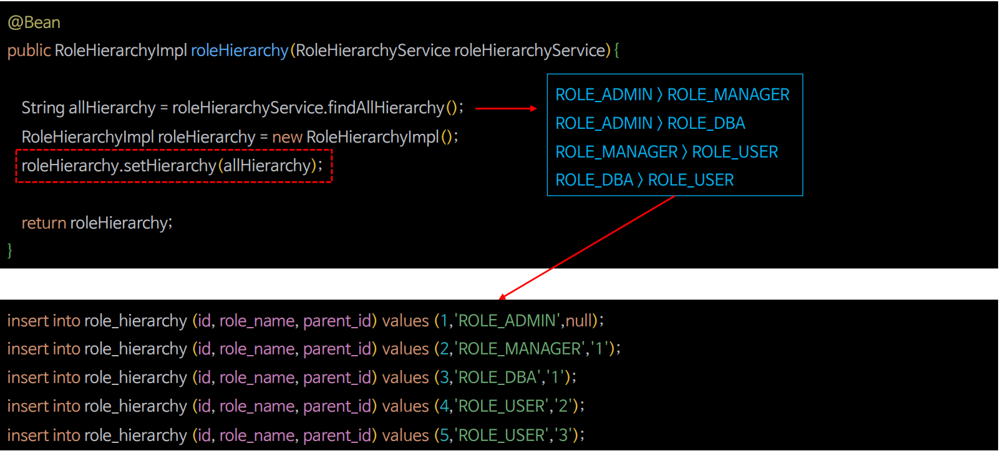

# 회원 관리 시스템 - 계층적 권한 적용




---

### RoleHierarchy Entity

```java
@Entity
@Table(name="ROLE_HIERARCHY")
@AllArgsConstructor
@NoArgsConstructor
@Getter
@Setter
@Builder
public class RoleHierarchy {
    @Id
    @GeneratedValue
    private Long id;

    @Column(name = "role_name")
    private String roleName;

    @ManyToOne(fetch = FetchType.LAZY)
    @JoinColumn(name = "parent_id", referencedColumnName = "id", insertable = false, updatable = false)
    private RoleHierarchy parent;

    @OneToMany(mappedBy = "parent", fetch = FetchType.LAZY)
    private Set<RoleHierarchy> children = new HashSet<>();
}
```

### RoleHierarchyRepository

```java
public interface RoleHierarchyRepository extends JpaRepository<RoleHierarchy, Long> { }
```

### RoleHierarchyService

```java
@Service
@RequiredArgsConstructor
public class RoleHierarchyServiceImpl implements RoleHierarchyService {

    private final RoleHierarchyRepository roleHierarchyRepository;

    @Transactional
    @Override
    public String findAllHierarchy() {

        List<RoleHierarchy> rolesHierarchy = roleHierarchyRepository.findAll();
        StringBuilder hierarchyRole = new StringBuilder();

        for (RoleHierarchy roleHierarchy : rolesHierarchy) {
            if (roleHierarchy.getParent() != null) {
                hierarchyRole.append(roleHierarchy.getParent().getRoleName());
                hierarchyRole.append(" > ");
                hierarchyRole.append(roleHierarchy.getRoleName());
                hierarchyRole.append("\n");
            }
        }

        return hierarchyRole.toString();
    }
}
```

### AuthConfig

```java
...
import org.springframework.security.access.hierarchicalroles.RoleHierarchyImpl;
...

@Configuration
public class AuthConfig {

    @Bean
    public PasswordEncoder passwordEncoder() {
        return PasswordEncoderFactories.createDelegatingPasswordEncoder();
    }

    @Bean
    public RoleHierarchyImpl roleHierarchy(RoleHierarchyService roleHierarchyService) {
        String allHierarchy = roleHierarchyService.findAllHierarchy();
        RoleHierarchyImpl roleHierarchy = new RoleHierarchyImpl();
        roleHierarchy.setHierarchy(allHierarchy);
        return roleHierarchy;
    }
}
```

### CustomDynamicAuthorizationManager

```java
@Component
@RequiredArgsConstructor
public class CustomDynamicAuthorizationManager implements AuthorizationManager<RequestAuthorizationContext> {

    private List<RequestMatcherEntry<AuthorizationManager<RequestAuthorizationContext>>> mappings;
    private DynamicAuthorizationService das;
    private static final AuthorizationDecision ACCESS = new AuthorizationDecision(true);
    private static final AuthorizationDecision DENY = new AuthorizationDecision(false);

    private final HandlerMappingIntrospector handlerMappingIntrospector;
    private final ResourcesRepository resourcesRepository;
    private final RoleHierarchyImpl roleHierarchy;

    @PostConstruct
    public void mapping() {
        das = new DynamicAuthorizationService(new PersistentUrlRoleMapper(resourcesRepository));
        setMapping();
    }

    /**
     * RequestMatcherDelegatingAuthorizationManager 클래스에 check() 메서드 그대로
     */
    @Override
    public AuthorizationDecision check(Supplier<Authentication> authentication, RequestAuthorizationContext request) {
        for (RequestMatcherEntry<AuthorizationManager<RequestAuthorizationContext>> mapping : this.mappings) {

            RequestMatcher matcher = mapping.getRequestMatcher();
            RequestMatcher.MatchResult matchResult = matcher.matcher(request.getRequest());

            if (matchResult.isMatch()) {
                AuthorizationManager<RequestAuthorizationContext> manager = mapping.getEntry();
                return manager.check(authentication,
                        new RequestAuthorizationContext(request.getRequest(), matchResult.getVariables()));
            }
        }
        return ACCESS;
    }

    @Override
    public void verify(Supplier<Authentication> authentication, RequestAuthorizationContext object) {
        AuthorizationManager.super.verify(authentication, object);
    }

    public synchronized void reload() {
        this.mappings.clear();
        setMapping();
    }

    private void setMapping() {
        this.mappings = das.getUrlRoleMappings()
                .entrySet()
                .stream()
                .map(entry -> new RequestMatcherEntry<>(
                        new MvcRequestMatcher(handlerMappingIntrospector, entry.getKey()),
                        customAuthorizationManager(entry.getValue())
                ))
                .collect(Collectors.toList());
    }

    private AuthorizationManager<RequestAuthorizationContext> customAuthorizationManager(String role) {
        if (role.startsWith("ROLE")) {

            AuthorityAuthorizationManager<RequestAuthorizationContext> authorizationManager =
                                                    AuthorityAuthorizationManager.hasAuthority(role);
            authorizationManager.setRoleHierarchy(roleHierarchy);

            return authorizationManager;
        } else {
            DefaultHttpSecurityExpressionHandler handler = new DefaultHttpSecurityExpressionHandler();
            handler.setRoleHierarchy(roleHierarchy);

            WebExpressionAuthorizationManager authorizationManager = new WebExpressionAuthorizationManager(role);
            authorizationManager.setExpressionHandler(handler);
            return authorizationManager;
        }
    }
}
```

---

[이전 ↩️ - 회원 관리 시스템 - 인가 설정 실시간 반영하기](https://github.com/genesis12345678/TIL/blob/main/Spring/security/Projects/%ED%9A%8C%EC%9B%90_%EA%B4%80%EB%A6%AC_%EC%8B%9C%EC%8A%A4%ED%85%9C/%EC%8B%A4%EC%8B%9C%EA%B0%84%EB%B0%98%EC%98%81/Main.md)

[메인 ⏫](https://github.com/genesis12345678/TIL/blob/main/Spring/security/main.md)

[다음 ↪️ - 회원 관리 시스템 - 필터에 의한 DB 연동](https://github.com/genesis12345678/TIL/blob/main/Spring/security/Projects/%ED%9A%8C%EC%9B%90_%EA%B4%80%EB%A6%AC_%EC%8B%9C%EC%8A%A4%ED%85%9C/%ED%95%84%ED%84%B0DB/Main.md)