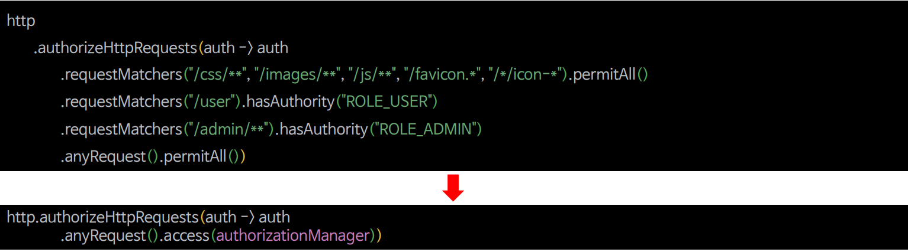
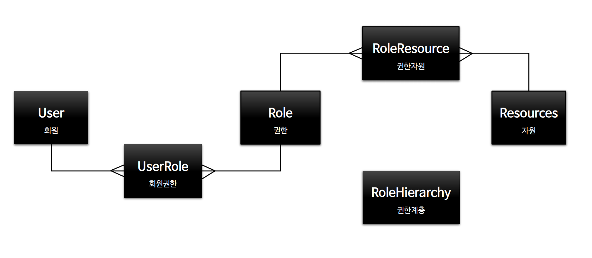
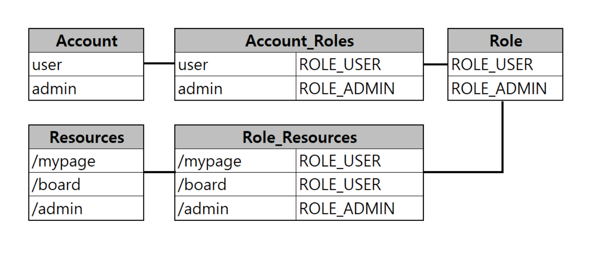
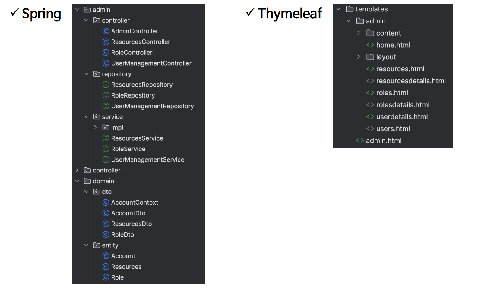

# 회원 관리 시스템 - 기본 구성

---



> 설정 클래스에서 모두 하드 코딩 되어있는 권한 규칙 코드를 모두 프로그래밍에 의한 동적 권한으로 적용될 수 있도록 한다.

> - **회원 관리**
>   - 회원 리스트, 회원 상세정보, 권한 부여
> - **권한 관리**
>   - 권한 리스트, 권한 생성, 수정, 삭제
> - **자원 관리**
>   - 자원 리스트, 자원 생성, 수정, 삭제, 권한 매핑

---

## 엔티티 관계도



> - 한 명의 사용자는 여러 권한을 가질 수 있고, 하나의 권한은 여러 사용자에게 매핑될 수 있다.
> - 하나의 권한은 여러 자원을 가질 수 있고, 하나의 자원은 여러 권한에 매핑될 수 있다.

---

## 테이블 관계도



---

## 패키지 구성



---

## 코드

### [컨트롤러](https://github.com/genesis12345678/TIL/blob/main/Spring/security/Projects/%ED%9A%8C%EC%9B%90_%EA%B4%80%EB%A6%AC_%EC%8B%9C%EC%8A%A4%ED%85%9C/%EA%B8%B0%EB%B3%B8%EA%B5%AC%EC%84%B1/code/Controller.md)
### [서비스 & 레포지토리](https://github.com/genesis12345678/TIL/blob/main/Spring/security/Projects/%ED%9A%8C%EC%9B%90_%EA%B4%80%EB%A6%AC_%EC%8B%9C%EC%8A%A4%ED%85%9C/%EA%B8%B0%EB%B3%B8%EA%B5%AC%EC%84%B1/code/Service.md)
### [엔티티 & DTO](https://github.com/genesis12345678/TIL/blob/main/Spring/security/Projects/%ED%9A%8C%EC%9B%90_%EA%B4%80%EB%A6%AC_%EC%8B%9C%EC%8A%A4%ED%85%9C/%EA%B8%B0%EB%B3%B8%EA%B5%AC%EC%84%B1/code/Entity.md)
### SetUp
```java
@Component
@RequiredArgsConstructor
public class SetupDataLoader implements ApplicationListener<ContextRefreshedEvent> {

    private boolean alreadySetup = false;
    private final UserRepository userRepository;
    private final RoleRepository roleRepository;
    private final PasswordEncoder passwordEncoder;

    @Override
    @Transactional
    public void onApplicationEvent(final ContextRefreshedEvent event) {
        if (alreadySetup) {
            return;
        }
        setupData();
        alreadySetup = true;
    }

    private void setupData() {
        HashSet<Role> roles = new HashSet<>();
        Role adminRole = createRoleIfNotFound("ROLE_ADMIN", "관리자");
        roles.add(adminRole);
        createUserIfNotFound("admin", "pass", roles);
    }

    public Role createRoleIfNotFound(String roleName, String roleDesc) {
        Role role = roleRepository.findByRoleName(roleName);

        if (role == null) {
            role = Role.builder()
                    .roleName(roleName)
                    .roleDesc(roleDesc)
                    .isExpression("N")
                    .build();
        }
        return roleRepository.save(role);
    }

    public void createUserIfNotFound(final String userName, final String password, Set<Role> roleSet) {
        Account account = userRepository.findByUsername(userName);

        if (account == null) {
            account = Account.builder()
                    .username(userName)
                    .password(passwordEncoder.encode(password))
                    .userRoles(roleSet)
                    .build();
        }
        userRepository.save(account);
    }
}
```
> 스프링은 `ApplicationContext`를 초기화 하거나 새로 고칠 때 **ContextRefreshedEvent**를 발생시킨다.<br>
> 즉, 위 코드는 애플리케이션이 실행될 때 (`admin`, `pass`)의 계정 정보와 `ADMIN` 권한을 가진 사용자 하나를 저장한다.
> 
> [참고](https://eblo.tistory.com/165)

---

[이전 ↩️ - 비동기 인증 - Rest DSLs 구현](https://github.com/genesis12345678/TIL/blob/main/Spring/security/Projects/%EB%B9%84%EB%8F%99%EA%B8%B0_%EC%9D%B8%EC%A6%9D/DSLs/Main.md)

[메인 ⏫](https://github.com/genesis12345678/TIL/blob/main/Spring/security/main.md)

[다음 ↪️ - 회원 관리 시스템 - 메모리 기반 프로그래밍 방식 인가 구현](https://github.com/genesis12345678/TIL/blob/main/Spring/security/Projects/%ED%9A%8C%EC%9B%90_%EA%B4%80%EB%A6%AC_%EC%8B%9C%EC%8A%A4%ED%85%9C/%EB%A9%94%EB%AA%A8%EB%A6%AC%EA%B8%B0%EB%B0%98/Main.md)