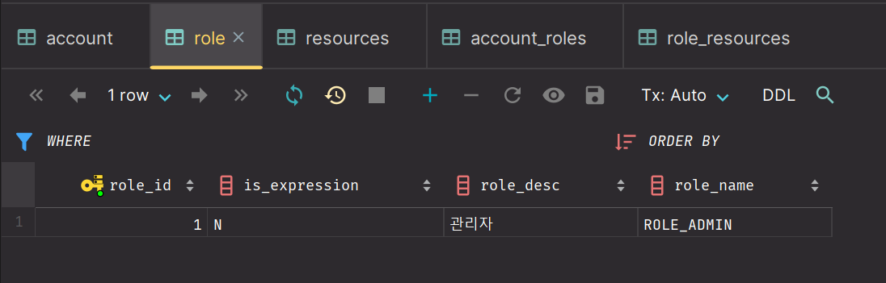
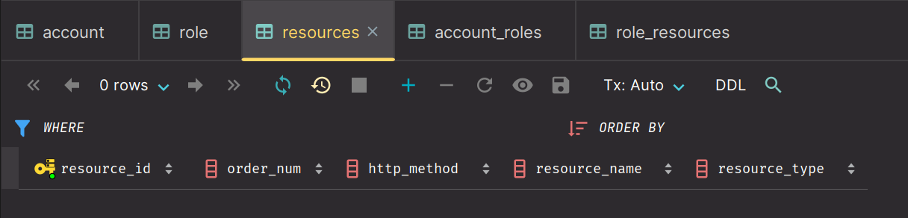

## Account - 사용자

### Entity
```java
@Entity
@Getter @Setter
@ToString
@Builder
@AllArgsConstructor
@NoArgsConstructor
public class Account {

    @Id @GeneratedValue
    private Long id;

    @Column
    private String username;

    @Column
    private int age;

    @Column
    private String password;

    @ManyToMany(fetch = FetchType.LAZY)
    @JoinTable(name = "account_roles",
               joinColumns = {@JoinColumn(name = "account_id")},
               inverseJoinColumns = {@JoinColumn(name = "role_id")})
    @ToString.Exclude
    private Set<Role> userRoles = new HashSet<>();
}
```

### Dto
```java
@Data
@Builder
@NoArgsConstructor
@AllArgsConstructor
public class AccountDto {

    private String id;
    private String username;
    private int age;
    private String password;
    private List<String> roles;
}
```

---

## Resources - 자원

### Entity
```java
@Entity
@Getter @Setter
@ToString
@Builder
@AllArgsConstructor
@NoArgsConstructor
public class Resources{

    @Id
    @GeneratedValue
    @Column(name = "resource_id")
    private Long id;

    @Column(name = "resource_name")
    private String resourceName;

    @Column(name = "http_method")
    private String httpMethod;

    @Column(name = "order_num")
    private int orderNum;

    @Column(name = "resource_type")
    private String resourceType;

    @ManyToMany(fetch = FetchType.LAZY)
    @JoinTable(name = "role_resources",
               joinColumns = { @JoinColumn(name = "resource_id") },
               inverseJoinColumns = { @JoinColumn(name = "role_id") })
    @ToString.Exclude
    private Set<Role> roleSet = new HashSet<>();
}
```

### Dto
```java
@Data
@Builder
@NoArgsConstructor
@AllArgsConstructor
public class ResourcesDto{

    private String id;
    private String resourceName;
    private String httpMethod;
    private int orderNum;
    private String resourceType;
    private String roleName;
    private Set<Role> roleSet;
}
```

---

## Role - 권한

### Entity
```java
@Entity
@Getter @Setter
@Builder
@AllArgsConstructor
@NoArgsConstructor
public class Role {

    @Id
    @GeneratedValue
    @Column(name = "role_id")
    private Long id;

    @Column(name = "role_name")
    private String roleName;

    @Column(name = "role_desc")
    private String roleDesc;

    @Column(name = "is_expression")
    private String isExpression;

    @ManyToMany(fetch = FetchType.LAZY, mappedBy = "roleSet")
    @OrderBy("orderNum desc")
    private Set<Resources> resourcesSet = new LinkedHashSet<>();

    @ManyToMany(fetch = FetchType.LAZY, mappedBy = "userRoles")
    private Set<Account> accounts = new HashSet<>();
}
```
> `@OrderBy`
> 
> 데이터베이스의 `ORDER BY`절을 사용해서 컬렉션을 정렬하며, 하이버네이트는 **Set**에 `@OrderBy`를 적용해서 결과를 조회하면
> 순서를 유지하기 위해 내부적으로 `HashSet`대신 `LinkedHashSet`을 사용한다.

### Dto
```java
@Data
@Builder
@NoArgsConstructor
@AllArgsConstructor
public class RoleDto{
    private String id;
    private String roleName;
    private String roleDesc;
    private String isExpression;
}
```

---

## 생성된 테이블







