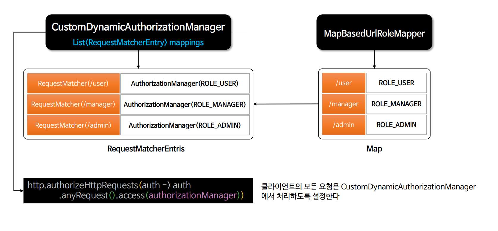

# 회원 관리 시스템 - 메모리 기반 프로그래밍 방식 인가 구현

- 프로그래밍 방식에 의한 인가 기능을 위해 `CustomDynamicAuthorizationManager` 클래스를 만든다. 이때 스프링 시큐리티의 인가 클래스인 [RequestMatcherDelegatingAuthorizationManager](https://github.com/genesis12345678/TIL/blob/main/Spring/security/AuthorizationProcess/AuthorityAuthorizationManager.md) 클래스의 인가 원리를 이해하고 참고한다.
- `Map` 방식으로 권한과 자원을 매핑하기 위해 `UrlRoleMapper` 인터페이스를 구현한 **MapBasedUrlRoleMapper** 클래스를 만든다.




---

### UrlRoleMapper

```java
public interface UrlRoleMapper {
    Map<String, String> getUrlRoleMappings();
}
```

### MapBasedUrlRoleMapper

```java
public class MapBasedUrlRoleMapper implements UrlRoleMapper{

    private final LinkedHashMap<String, String> urlRoleMappings = new LinkedHashMap<>();

    @Override
    public Map<String, String> getUrlRoleMappings() {
        urlRoleMappings.put("/", "permitAll");
        urlRoleMappings.put("/css/**", "permitAll");
        urlRoleMappings.put("/js/**", "permitAll");
        urlRoleMappings.put("/images/**", "permitAll");
        urlRoleMappings.put("/favicon.*", "permitAll");
        urlRoleMappings.put("/*/icon-*", "permitAll");
        urlRoleMappings.put("/signup", "permitAll");
        urlRoleMappings.put("/login", "permitAll");
        urlRoleMappings.put("/logout", "permitAll");

        urlRoleMappings.put("/denied", "authenticated");
        urlRoleMappings.put("/user", "ROLE_USER");
        urlRoleMappings.put("/admin/**", "ROLE_ADMIN");
        urlRoleMappings.put("/manager", "ROLE_MANAGER");
        urlRoleMappings.put("/db", "hasRole('DBA')");

        return urlRoleMappings;
    }
}
```

### DynamicAuthorizationService

```java
public class DynamicAuthorizationService {

    private final UrlRoleMapper delegate;

    public DynamicAuthorizationService(UrlRoleMapper delegate) {
        this.delegate = delegate;
    }

    public Map<String, String> getUrlRoleMappings(){
        return delegate.getUrlRoleMappings();
    }
}
```

### CustomDynamicAuthorizationManager

```java
@Component
@RequiredArgsConstructor
public class CustomDynamicAuthorizationManager implements AuthorizationManager<RequestAuthorizationContext> {

    private List<RequestMatcherEntry<AuthorizationManager<RequestAuthorizationContext>>> mappings;
    private static final AuthorizationDecision DENY = new AuthorizationDecision(false);
    private final HandlerMappingIntrospector handlerMappingIntrospector;

    @PostConstruct
    public void mapping() {
        DynamicAuthorizationService das = new DynamicAuthorizationService(new MapBasedUrlRoleMapper());
        mappings = das.getUrlRoleMappings()
                      .entrySet()
                      .stream()
                      .map(entry -> new RequestMatcherEntry<>(
                              new MvcRequestMatcher(handlerMappingIntrospector, entry.getKey()),
                              customAuthorizationManager(entry.getValue())
                      ))
                      .toList();
    }

    private AuthorizationManager<RequestAuthorizationContext> customAuthorizationManager(String role) {
        if (role != null) {
            if (role.startsWith("ROLE")) {
                return AuthorityAuthorizationManager.hasAuthority(role);
            } else {
                return new WebExpressionAuthorizationManager(role);
            }
        }
        return null;
    }

    /**
     * RequestMatcherDelegatingAuthorizationManager 클래스에 check() 메서드 그대로
     */
    @Override
    public AuthorizationDecision check(Supplier<Authentication> authentication, RequestAuthorizationContext request) {
        for (RequestMatcherEntry<AuthorizationManager<RequestAuthorizationContext>> mapping : this.mappings) {

            RequestMatcher matcher = mapping.getRequestMatcher();
            RequestMatcher.MatchResult matchResult = matcher.matcher(request.getRequest());

            if (matchResult.isMatch()) {
                AuthorizationManager<RequestAuthorizationContext> manager = mapping.getEntry();
                return manager.check(authentication,
                        new RequestAuthorizationContext(request.getRequest(), matchResult.getVariables()));
            }
        }
        
        //사용자의 요청에 해당하는 권한 설정이 존재하지 않을 경우 일단 요청을 거부한다.
        return DENY;
    }

    @Override
    public void verify(Supplier<Authentication> authentication, RequestAuthorizationContext object) {
        AuthorizationManager.super.verify(authentication, object);
    }
}
```
> 
> 
> - `RequestMatcherEntry`는 **RequestMatcher**와 제네릭으로 받을 수 있는 **entry**가 있다.
> - **RequestMatcher**의 여러 구현체 중 `MvcRequestMatcher`를 사용하고 **entry**에는 `AuthorizationManager`가 들어가면 된다.
> 
> 
> 
> - `MvcRequestMatcher`는 `HandlerMappingIntrospector`와 `pattern`을 생성자로 받을 수 있다.
> - `MapBasedUrlRoleMapper`의 **map**은 `key`로 **Url**, `value`로 **권한 정보**를 가지고 있다.

### SecurityConfig

```java
@Configuration
@EnableWebSecurity
@RequiredArgsConstructor
public class SecurityConfig {

    private final FormAuthenticationProvider formAuthenticationProvider;
    private final RestAuthenticationProvider restAuthenticationProvider;
    private final AuthenticationDetailsSource<HttpServletRequest, WebAuthenticationDetails> authenticationDetailsSource;
    private final FormAuthenticationSuccessHandler formSuccessHandler;
    private final FormAuthenticationFailureHandler formFailureHandler;
    private final RestAuthenticationSuccessHandler restSuccessHandler;
    private final RestAuthenticationFailureHandler restFailureHandler;
    private final AuthorizationManager<RequestAuthorizationContext> authorizationManager;

    @Bean
    public SecurityFilterChain securityFilterChain(HttpSecurity http) throws Exception {
        http
                .authorizeHttpRequests(auth -> auth
                        .anyRequest().access(authorizationManager))
                .formLogin(form -> form
                        .loginPage("/login").permitAll() //커스텀 로그인 페이지
                        .authenticationDetailsSource(authenticationDetailsSource)
                        .successHandler(formSuccessHandler)
                        .failureHandler(formFailureHandler)
                )
                .authenticationProvider(formAuthenticationProvider)
                .exceptionHandling(exception -> exception.accessDeniedHandler(new FormAccessDeniedHandler("/denied")))
        ;

        return http.build();
    }

    @Bean
    @Order(1)
    public SecurityFilterChain restSecurityFilterChain(HttpSecurity http) throws Exception {...}
}
```

---

[이전 ↩️ - 회원 관리 시스템 - 기본 구성]()

[메인 ⏫](https://github.com/genesis12345678/TIL/blob/main/Spring/security/main.md)

[다음 ↪️ - 회원 관리 시스템 - DB 연동 프로그래밍 방식 인가 구현]()