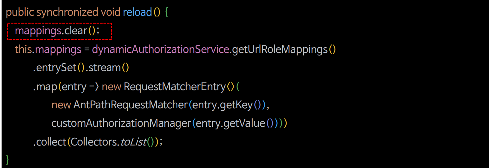

# 회원 관리 시스템 - 인가 설정 실시간 반영하기

- 자원을 추가하거나 삭제할 때 인가 규칙이 즉시 적용되도록 한다.


- 모든 인가 규칙을 담고 있는 `mappings` 속성을 업데이트 해 준다.




---

### ResourcesService

```java
@Service
@Transactional
@RequiredArgsConstructor
public class ResourcesServiceImpl implements ResourcesService {

    private final ResourcesRepository resourcesRepository;
    private final CustomDynamicAuthorizationManager authorizationManager;

    @Transactional(readOnly = true)
    public Resources getResources(long id) {
        return resourcesRepository.findById(id).orElse(new Resources());
    }

    @Transactional(readOnly = true)
    public List<Resources> getResources() {
        return resourcesRepository.findAll(Sort.by(Sort.Order.asc("orderNum")));
    }

    public void createResources(Resources resources){
        resourcesRepository.save(resources);
        authorizationManager.reload(); //추가
    }

    public void deleteResources(long id) {
        resourcesRepository.deleteById(id);
        authorizationManager.reload(); //추가
    }
}
```

### PersistentUrlRoleMapper

```java
public class PersistentUrlRoleMapper implements UrlRoleMapper{

    private final LinkedHashMap<String, String> urlRoleMappings = new LinkedHashMap<>();
    private final ResourcesRepository resourcesRepository;

    public PersistentUrlRoleMapper(ResourcesRepository resourcesRepository) {
        this.resourcesRepository = resourcesRepository;
    }

    @Override
    public Map<String, String> getUrlRoleMappings() {
        urlRoleMappings.clear(); //추가
        List<Resources> resourcesList = resourcesRepository.findAllResources();

        resourcesList.forEach(resources -> {
            resources.getRoleSet().forEach(role -> {
                urlRoleMappings.put(resources.getResourceName(), role.getRoleName());
            });
        });

        return urlRoleMappings;
    }
}
```

### CustomDynamicAuthorizationManager

```java
@Component
@RequiredArgsConstructor
public class CustomDynamicAuthorizationManager implements AuthorizationManager<RequestAuthorizationContext> {

    private List<RequestMatcherEntry<AuthorizationManager<RequestAuthorizationContext>>> mappings;
    private DynamicAuthorizationService das;
    
    private static final AuthorizationDecision ACCESS = new AuthorizationDecision(true);
    private static final AuthorizationDecision DENY = new AuthorizationDecision(false);

    private final HandlerMappingIntrospector handlerMappingIntrospector;
    private final ResourcesRepository resourcesRepository;

    @PostConstruct
    public void mapping() {
        das = new DynamicAuthorizationService(new PersistentUrlRoleMapper(resourcesRepository));
        setMapping();
    }

    /**
     * RequestMatcherDelegatingAuthorizationManager 클래스에 check() 메서드 그대로
     */
    @Override
    public AuthorizationDecision check(Supplier<Authentication> authentication, RequestAuthorizationContext request) {
        for (RequestMatcherEntry<AuthorizationManager<RequestAuthorizationContext>> mapping : this.mappings) {

            RequestMatcher matcher = mapping.getRequestMatcher();
            RequestMatcher.MatchResult matchResult = matcher.matcher(request.getRequest());

            if (matchResult.isMatch()) {
                AuthorizationManager<RequestAuthorizationContext> manager = mapping.getEntry();
                return manager.check(authentication,
                        new RequestAuthorizationContext(request.getRequest(), matchResult.getVariables()));
            }
        }
        return ACCESS;
    }

    @Override
    public void verify(Supplier<Authentication> authentication, RequestAuthorizationContext object) {
        AuthorizationManager.super.verify(authentication, object);
    }

    public synchronized void reload() {
        this.mappings.clear();
        setMapping();
    }

    private void setMapping() {
        this.mappings = das.getUrlRoleMappings()
                .entrySet()
                .stream()
                .map(entry -> new RequestMatcherEntry<>(
                        new MvcRequestMatcher(handlerMappingIntrospector, entry.getKey()),
                        customAuthorizationManager(entry.getValue())
                ))
                .collect(Collectors.toList());
    }

    private AuthorizationManager<RequestAuthorizationContext> customAuthorizationManager(String role) {
        if (role.startsWith("ROLE")) {
            return AuthorityAuthorizationManager.hasAuthority(role);
        } else {
            return new WebExpressionAuthorizationManager(role);
        }
    }
}
```

> `reload()` 메서드에 **synchronized** 키워드는 관리자가 여러 명 일때를 고려한 것이다.(동시성)

---

[이전 ↩️ - 회원 관리 시스템 - DB 연동 프로그래밍 방식 인가 구현]()

[메인 ⏫](https://github.com/genesis12345678/TIL/blob/main/Spring/security/main.md)

[다음 ↪️ - 회원 관리 시스템 - 계층적 권한 적용]()