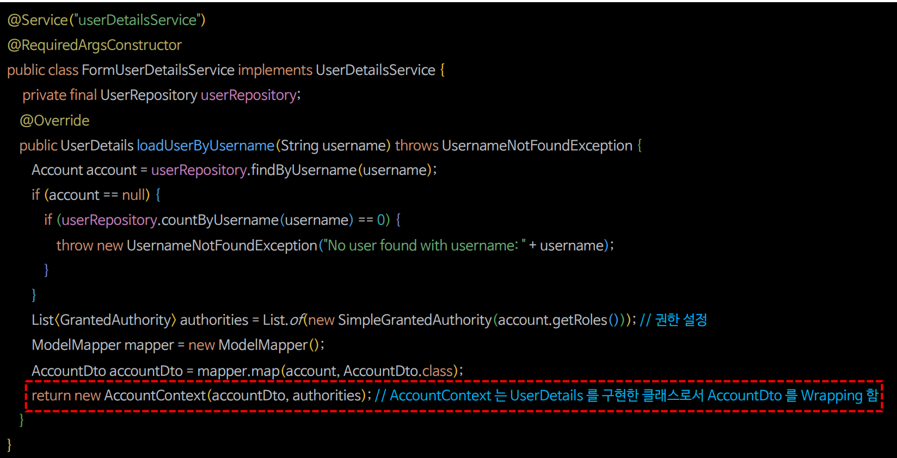

# 회원 인증 시스템 - 커스텀 UserDetailsService 구현

---

## [UserDetailsService](https://github.com/genesis12345678/TIL/blob/main/Spring/security/AuthenticationArchitecture/UserDetailsService.md) 구현



- 반환되는 타입이 `UserDetails` 이기 때문에 DTO를 감싸서 반환하도록 한다.

---

### FormUserDetailsService - 폼 인증 기반

```java
@Service("userDetailsService")
@RequiredArgsConstructor
public class FormUserDetailsService implements UserDetailsService {

    private final UserRepository userRepository;
    private final ModelMapper mapper;

    @Override
    public UserDetails loadUserByUsername(String username) throws UsernameNotFoundException {
        Account account = userRepository.findByUsername(username);

        if (account == null) {
            throw new UsernameNotFoundException("No user find with username" + username);
        }

        List<GrantedAuthority> authorities = List.of(new SimpleGrantedAuthority(account.getRoles()));
        AccountDto accountDto = mapper.map(account, AccountDto.class);

        return new AccountContext(accountDto, authorities);
    }
}
```

### AccountContext

```java
public class AccountContext implements UserDetails {

    private final AccountDto accountDto;
    private final List<GrantedAuthority> authorities;

    public AccountContext(AccountDto accountDto, List<GrantedAuthority> authorities) {
        this.accountDto = accountDto;
        this.authorities = authorities;
    }

    @Override
    public Collection<? extends GrantedAuthority> getAuthorities() {
        return authorities;
    }

    @Override
    public String getPassword() {
        return accountDto.getPassword();
    }

    @Override
    public String getUsername() {
        return accountDto.getUsername();
    }

    @Override
    public boolean isAccountNonExpired() {
        return true;
    }

    @Override
    public boolean isAccountNonLocked() {
        return true;
    }

    @Override
    public boolean isCredentialsNonExpired() {
        return true;
    }

    @Override
    public boolean isEnabled() {
        return true;
    }
}
```

### SecurityConfig

```java
@Configuration
@EnableWebSecurity
@RequiredArgsConstructor
public class SecurityConfig {

    private final UserDetailsService userDetailsService;

    @Bean
    public SecurityFilterChain securityFilterChain(HttpSecurity http) throws Exception {
        http
                .authorizeHttpRequests(auth -> auth
                        .requestMatchers("/css/**", "/js/**", "/images/**", "/webjars/**", "/favicon.*", "/*/icon-*").permitAll() //정적 자원 관리
                        .requestMatchers("/", "/signup").permitAll()
                        .anyRequest().authenticated())
                .formLogin(form -> form.loginPage("/login").permitAll()) //커스텀 로그인 페이지
                .userDetailsService(userDetailsService);

        return http.build();
    }

    @Bean
    public PasswordEncoder passwordEncoder() {
        return PasswordEncoderFactories.createDelegatingPasswordEncoder();
    }
}
```

---

[이전 ↩️ - 회원 인증 시스템 - 회원가입(`PasswordEncoder`)](https://github.com/genesis12345678/TIL/blob/main/Spring/security/Projects/%ED%9A%8C%EC%9B%90_%EC%9D%B8%EC%A6%9D_%EC%8B%9C%EC%8A%A4%ED%85%9C/%ED%9A%8C%EC%9B%90%EA%B0%80%EC%9E%85/Main.md)

[메인 ⏫](https://github.com/genesis12345678/TIL/blob/main/Spring/security/main.md)

[다음 ↪️ - 회원 인증 시스템 - 커스텀 `AuthenticationProvider`](https://github.com/genesis12345678/TIL/blob/main/Spring/security/Projects/%ED%9A%8C%EC%9B%90_%EC%9D%B8%EC%A6%9D_%EC%8B%9C%EC%8A%A4%ED%85%9C/AuthenticationProvider/AuthenticationProvider.md)