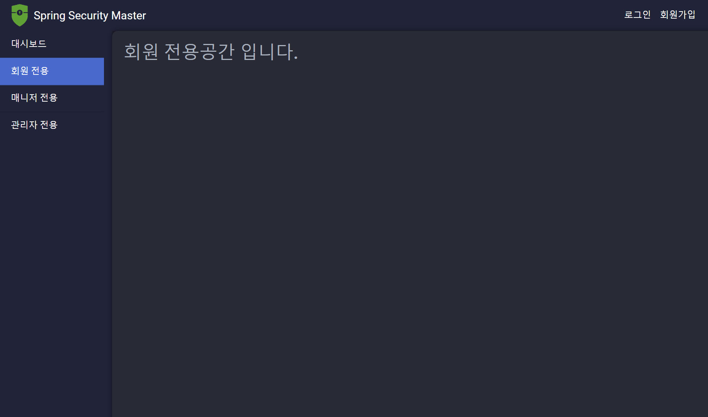
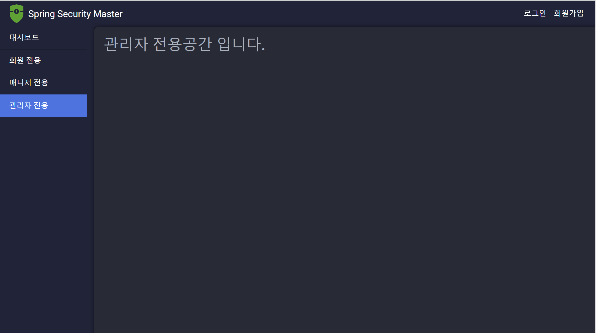

# 회원 인증 시스템 - 프로젝트 생성 및 기본 구성

---

### build.gradle
```text
plugins {
    id 'java'
    id 'org.springframework.boot' version '3.2.5'
    id 'io.spring.dependency-management' version '1.1.4'
}

...

dependencies {
    //starter
    implementation 'org.springframework.boot:spring-boot-starter-security'
    implementation 'org.springframework.boot:spring-boot-starter-web'
    implementation 'org.springframework.boot:spring-boot-starter-thymeleaf'
    
    //Lombok
    compileOnly 'org.projectlombok:lombok'
    annotationProcessor 'org.projectlombok:lombok'
    
    //DB - PostgreSQL
    runtimeOnly 'org.postgresql:postgresql'
    
    annotationProcessor 'org.springframework.boot:spring-boot-configuration-processor'
    testImplementation 'org.springframework.boot:spring-boot-starter-test'
    testImplementation 'org.springframework.security:spring-security-test'
}
```

---

### HomeController

```java
@Controller
public class HomeController {
	@GetMapping("/")
	public String dashboard() {
		return "/dashboard";
	}

	@GetMapping("/user")
	public String user() {
		return "/user";
	}

	@GetMapping("/manager")
	public String manager() {
		return "/manager";
	}

	@GetMapping("/admin")
	public String admin() {
		return "/admin";
	}
}
```

### HTML

#### dashboard.html

```html
<!DOCTYPE html>
<html xmlns:th="http://www.thymeleaf.org">
<head>
...
</head>
<body>
<div th:replace="~{layout/header::header}"></div>
<div class="container-fluid">
    <div class="row">
        <div class="col-md-2 sidebar">
            <div th:replace="~{layout/sidebar::sidebar}"></div>
        </div>
        <div class="col-md-10 content">
            <div th:insert="~{content/content}"></div>
        </div>
    </div>
</div>
<div class="footer" th:replace="~{layout/footer::footer}"></div>
</body>
</html>
```

#### user.html

```html
<!DOCTYPE html>
<html xmlns:th="http://www.thymeleaf.org">
<head>
...
</head>
<body>
<div th:replace="~{layout/header::header}"></div>
<div class="container-fluid">
    <div class="row">
        <div class="col-md-2 sidebar">
            <div th:replace="~{layout/sidebar::sidebar}"></div>
        </div>
        <div class="col-md-10 content">
            <div th:insert="~{content/usercontent}"></div>
        </div>
    </div>
</div>
<div class="footer" th:replace="~{layout/footer::footer}"></div>
</body>
</html>
```

#### manager.html

```html
<!DOCTYPE html>
<html xmlns:th="http://www.thymeleaf.org">
<head>
...
</head>
<body>
<div th:replace="~{layout/header::header}"></div>
<div class="container-fluid">
    <div class="row">
        <div class="col-md-2 sidebar">
            <div th:replace="~{layout/sidebar::sidebar}"></div>
        </div>
        <div class="col-md-10 content">
            <div th:insert="~{content/managercontent}"></div>
        </div>
    </div>
</div>
<div class="footer" th:replace="~{layout/footer::footer}"></div>
</body>
</html>
```

#### admin.html

```html
<!DOCTYPE html>
<html xmlns:th="http://www.thymeleaf.org">
<head>
...
</head>
<body>
<div th:replace="~{layout/header::header}"></div>
<div class="container-fluid">
    <div class="row">
        <div class="col-md-2 sidebar">
            <div th:replace="~{layout/sidebar::sidebar}"></div>
        </div>
        <div class="col-md-10 content">
            <div th:insert="~{content/admincontent}"></div>
        </div>
    </div>
</div>
<div class="footer" th:replace="~{layout/footer::footer}"></div>
</body>
</html>
```

> - `th:replace` : 태그 대체
> - `th:insert` : 현재 태그 내부에 추가

#### header.html

```html
<header th:fragment="header">
    <nav class="navbar navbar-expand-lg navbar-custom">
        <a class="navbar-brand" href="#">Spring Security Master</a>
        <div class="collapse navbar-collapse" id="navbarSupportedContent">
            <ul class="navbar-nav ml-auto">
                <li class="nav-item">
                    <a class="nav-link" href="/login">로그인</a>
                </li>
                <li class="nav-item">
                    <a class="nav-link" href="#">회원가입</a>
                </li>
            </ul>
        </div>
    </nav>
</header>
```

#### sidebar.html

````html
<aside th:fragment="sidebar">
    <div class="list-group list-group-flush">
        <a href="/" class="list-group-item list-group-item-action">대시보드</a>
        <a href="/user" class="list-group-item list-group-item-action">회원 전용</a>
        <a href="/manager" class="list-group-item list-group-item-action">매니저 전용</a>
        <a href="/admin" class="list-group-item list-group-item-action">관리자 전용</a>
    </div>
</aside>
````

#### admincontent.html
```html
<div th:fragment="admincontent">
    <h2>관리자 전용공간 입니다.</h2>
</div>
```
#### managercontent.html
```html
<div th:fragment="managercontent">
    <h2>매니저 전용공간 입니다.</h2>
</div>
```
#### usercontent.html
```html
<div th:fragment="usercontent">
    <h2>회원 전용공간 입니다.</h2>
</div>
```
#### content.html
```html
<div th:fragment="content">
    <h2>대시보드</h2>
    <p>환영합니다! 여기에 대시보드 관련 정보와 분석 데이터가 표시됩니다.</p>
</div>
```
#### footer.html

```html
<footer th:fragment="footer">
    <div class="container text-center">
        <span>© 2024 Your Company</span>
    </div>
</footer>
```

> `th:fragment` : 사용하려는 곳에서 호출하여 사용할 수 있다.
>
> [참고](https://github.com/genesis12345678/TIL/blob/main/Spring/springmvc_2/thymeleaf/template/thymeleaf_template.md)

---

### 화면

#### http://localhost:8080/login


- 스프링 시큐리티 의존성을 추가하고 아무런 설정을 하지 않아 기본 (Username: `user`, Password: `{UUID}`) 계정과 기본 로그인 페이지가 제공된다.

#### http://localhost:8080


#### http://localhost:8080/user



#### http://localhost:8080/manager


#### http://localhost:8080/admin



---

[메인 ⏫](https://github.com/genesis12345678/TIL/blob/main/Spring/security/main.md)

[다음 ↪️ - 회원 인증 시스템 - 사용자 정의 보안 설정 및 기본 사용자 구성]()