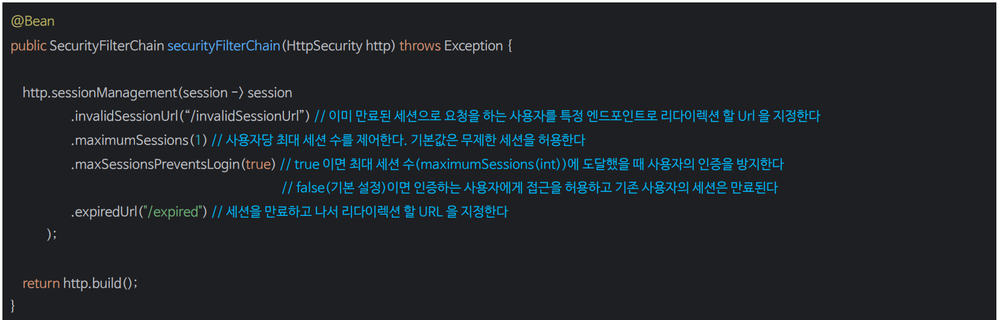
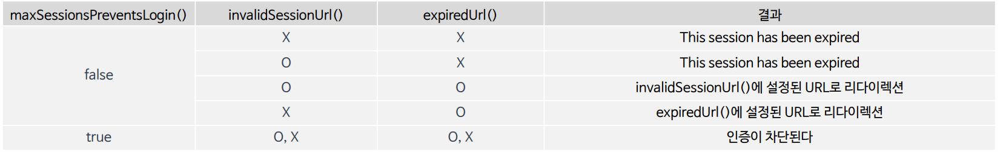

# 동시 세션 제어

- 동시 세션 제어는 사용자가 동시에 여러 세션을 생성하는 것을 관리하는 전략이다.
- 이 전략은 사용자의 인증 후에 활성화된 세션의 수가 설정된 `maximumSessions` 값과 비교하여 제어 여부를 결정한다.

---

## 동시 세션 제어 2가지 유형


---

## sessionManagement()



### 세션 만료 후 리다이렉션 전략



---

```java
@Configuration
@EnableWebSecurity
public class SecurityConfig {

    @Bean
    public SecurityFilterChain securityFilterChain(HttpSecurity http) throws Exception {

        http
                .authorizeHttpRequests(auth -> auth
                        .requestMatchers("/invalidSession", "/expiredSession").permitAll()
                        .anyRequest().authenticated())
                .formLogin(Customizer.withDefaults())
                .sessionManagement(session -> session
                        .invalidSessionUrl("/invalidSession")
                        .maximumSessions(1)
                        .maxSessionsPreventsLogin(false)
                        .expiredUrl("/expiredSession")
                )
        ;

        return http.build();
    }
}
```

- 위 코드 같은 경우 `maxSessionsPreventsLogin()`에 `false`를 설정했으므로 **사용자 세션 강제 만료** 전략을 사용한다.
- 또한 `invalidSessionUrl()`과 `expiredUrl()`을 같이 지정하면 `invalidSessionUrl()`이 우선이다.