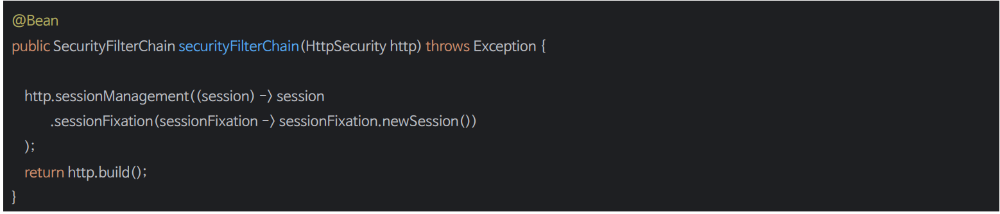

# 세션 고정 보호

- 세션 고정 공격은 악의적인 공격자가 사이트에 접근하여 세션을 생성한 다음 다른 사용자가 같은 세션으로 로그인하도록 유도하는 위험을 말한다.
- 스프링 시큐리티는 사용자가 로그인할 때 새로운 세션을 생성하거나 세션 ID를 변경함으로써 이러한 공격에 자동으로 대응한다.

---

## 세션 고정 공격


---

## sessionManagement()



### 세션 고정 보호 전략

- **changeSession()**
  - 기존 세션을 유지하면서 세션 ID만 변경하여 인증 과정에서 세션 고정 공격을 방지하는 방식이다.
  - 기본 값
- **newSession()**
  - 새로운 세션을 생성하고 기존 세션 데이터를 복사하지 않는 방식이다.(`SPRING_SECURITY_`로 시작하는 속성은 복사한다.)
- **migrateSession()**
  - 새로운 세션을 생성하고 모든 기존 세션 속성을 새 세션으로 복사한다.
- **none()**
  - 기존 세션을 그대로 사용한다.
  - 세션 고정 공격을 전혀 보호하지 못하므로 사용하면 안 된다.

---

```java
@Configuration
@EnableWebSecurity
public class SecurityConfig {

    @Bean
    public SecurityFilterChain securityFilterChain(HttpSecurity http) throws Exception {

        http
                .authorizeHttpRequests(auth -> auth
                        .anyRequest().authenticated())
                .formLogin(Customizer.withDefaults())
                .sessionManagement(session -> session
                        .sessionFixation(sessionFixation -> sessionFixation
                                .newSession()
                        )
                )
        ;

        return http.build();
    }
}
```

- 이렇게 직접 설정을 하지 않으면 스프링 시큐리티는 내부적으로 `changeSession()` 전략으로 초기화를 한다.

---

[이전 ↩️ - 동시 세션 제어(`maximumSessions()`)](https://github.com/genesis12345678/TIL/blob/main/Spring/security/SessionManagement/MaximumSessions.md)

[메인 ⏫](https://github.com/genesis12345678/TIL/blob/main/Spring/security/main.md)

[다음 ↪️ - 세션 생성 정책(`sessionCreationPolicy()`)](https://github.com/genesis12345678/TIL/blob/main/Spring/security/SessionManagement/SessionCreationPolicy.md)