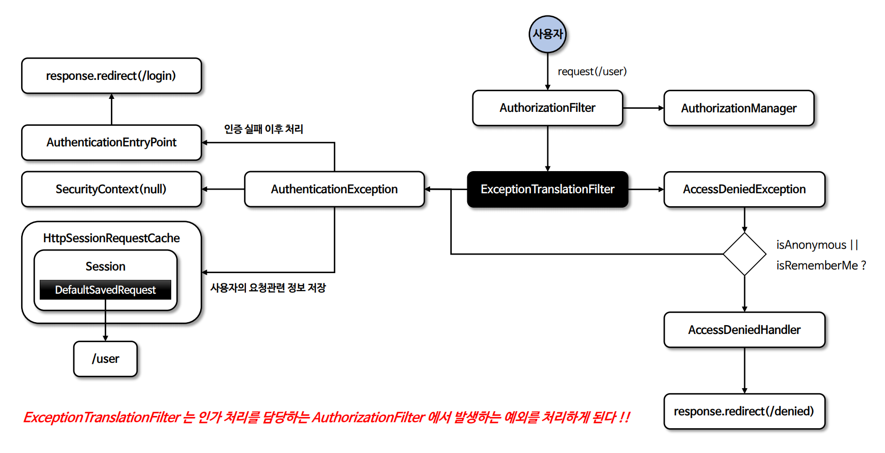

# 예외 필터

---

## ExceptionTranslationFilter

- `AuthorizationFilter`는 **FilterChainProxy**의 필터들 중에서 가장 마지막에 있는 필터고, `ExceptionTranslationFilter`는 `AuthorizationFilter` 바로 앞에 있는 필터이다.
- `ExceptionTranslationFilter`는 인증 예외는 다루지 않고, **인가 예외만 다룬다.**
- `AccessDeniedException`에서 익명 사용자나 기억하기 인증 중 하나에 해당되는 경우, 인증 예외(`AuthenticationException`) 처리로 이동 된다.
> `ExceptionTranslationFilter`는 인증 및 인가 처리를 위한 필터이다. 하지만 의도와는 다르게 스프링 MVC에서 발생한 예외를 처리하지 못하면 `ExceptionTranslationFilter`까지 다시 예외가 넘어가게 되어 
    제한적으로 예외 처리가 될 수 있다.

---

[이전 ↩️ - 예외 처리(`exceptionHandling()`)](https://github.com/genesis12345678/TIL/blob/main/Spring/security/exception/ExceptionHandling.md)

[메인 ⏫](https://github.com/genesis12345678/TIL/blob/main/Spring/security/main.md)