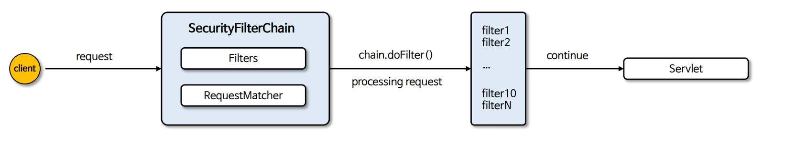

# HttpSecurity & WebSecurity

---
## HttpSecurity
- **HttpSecurityConfiguration**에서 `HttpSecurity`를 생성하고 초기화를 진행한다.
- `HttpSecurity`는 보안에 필요한 각 설정 클래스와 필터들을 생성하고 최종적으로 **SecurityFilterChain** 빈을 생성한다.

### SecurityFilterChain

- `matches()`
  - 요청이 현재 **SecurityFilterChain**에 의해 처리되어야 하는지 여부를 결정한다.
  - `true`를 반환하면 현재 요청이 이 필터 체인에 의해 처리되어야 함을 의미하고, `false`를 반환하면 다른 필터 체인이나 처리 로직에 의해 처리되어야 함을 의미한다.
  - 이를 통해 특정 요청에 대해 적절한 보안 필터링 로직이 적용될 수 있도록 한다.
- `getFilters()`
  - 현재 **SecurityFilterChain**에 포함된 `Filter` 객체의 리스트를 반환한다.
  - 이 메서드를 통해 어떤 필터들이 현재 필터 체인에 포함되어 있는지 확인할 수 있으며, 각 필터는 요청 처리 과정에서 특정 작업을 수행한다.(인증, 권한 부여, 로깅 등)

---

## WebSecurity
- **WebSecurityConfiguration**에서 `WebSecurity`를 생성하고 초기화를 진행한다.
- `WebSecurity`는 `HttpSecurity`에서 생성한 **SecurityFilterChain** 빈을 `SecurityBuilder`에 저장한다.
- `WebSecurity`가 `build()`를 실행하면  `SecurityBuilder`에서 **SecurityFilterChain**을 꺼내어 `FilterChainProxy` 생성자에게 전달한다.

