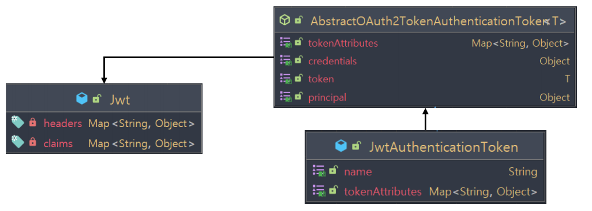

# OAuth 2.0 Resource Server MAC & RSA 토큰 검증 - @AuthenticationPrincipal 참조

## Authentication

- 리소스 서버에서 토큰 검증이 이루어지면 토큰으로부터 정보를 추출해서 인증 객체를 구성하게 된다.
- 스프링 시큐리티의 자원에 대한 접근은 인증 객체의 인증 유무와 권한 정보에 따라 결정되기 때문에 인증 객체를 생성해야 한다.
- 인증 객체는 `JwtAuthenticationToken` 타입으로 생성되고 `SecurityContext`에 저장된다.

---

## Jwt

- `JwtDecoder` 는 검증이 성공하면 토큰의 클레임으로부터 정보를 추출해서 최종 `Jwt` 객체를 반환한다.
- `Jwt` 객체는 `JwtAuthenticationToken`의 **principal** 속성에 저장된다.

---

## @AuthenticationPrincipal

- `JwtAuthenticationToken`의 **principal** 에 저장되어 있는 `Jwt` 객체를 바로 참조할 수 있다.



---

### IndexController

```java
@RestController
public class IndexController {

    @GetMapping("/")
    public String index() {
        return "index";
    }

    @GetMapping("/api/user")
    public Authentication user(Authentication authentication, @AuthenticationPrincipal Jwt principal) throws URISyntaxException {

        JwtAuthenticationToken jwtAuthenticationToken = (JwtAuthenticationToken) authentication;
        String sub = (String) jwtAuthenticationToken.getTokenAttributes().get("sub");
        String email = (String) jwtAuthenticationToken.getTokenAttributes().get("email");
        String scope = (String) jwtAuthenticationToken.getTokenAttributes().get("scope");

        String sub1 = principal.getClaimAsString("sub");
        String token = principal.getTokenValue();

        //principal 에 담겨 있는 토큰을 활용하는 코드
        RestTemplate restTemplate = new RestTemplate();
        HttpHeaders headers = new HttpHeaders();
        headers.add("Authorization", "Bearer " + token);

//        RequestEntity<String> request = new RequestEntity<>(headers, HttpMethod.GET, new URI("http://localhost:8082"));
//        ResponseEntity<String> response = restTemplate.exchange(request, String.class);

//        String body = response.getBody();

        return authentication;
    }
}
```
---

[이전 ↩️ - OAuth 2.0 Resource Server MAC & RSA 토큰 검증 - JwkSetUri 에 의한 검증(RSA)]()

[메인 ⏫](https://github.com/genesis12345678/TIL/blob/main/Spring/security/oauth/main.md)

[다음 ↪️ - OAuth 2.0 Resource Server MAC & RSA 토큰 검증 - BearerTokenAuthenticationFilter 이해]()