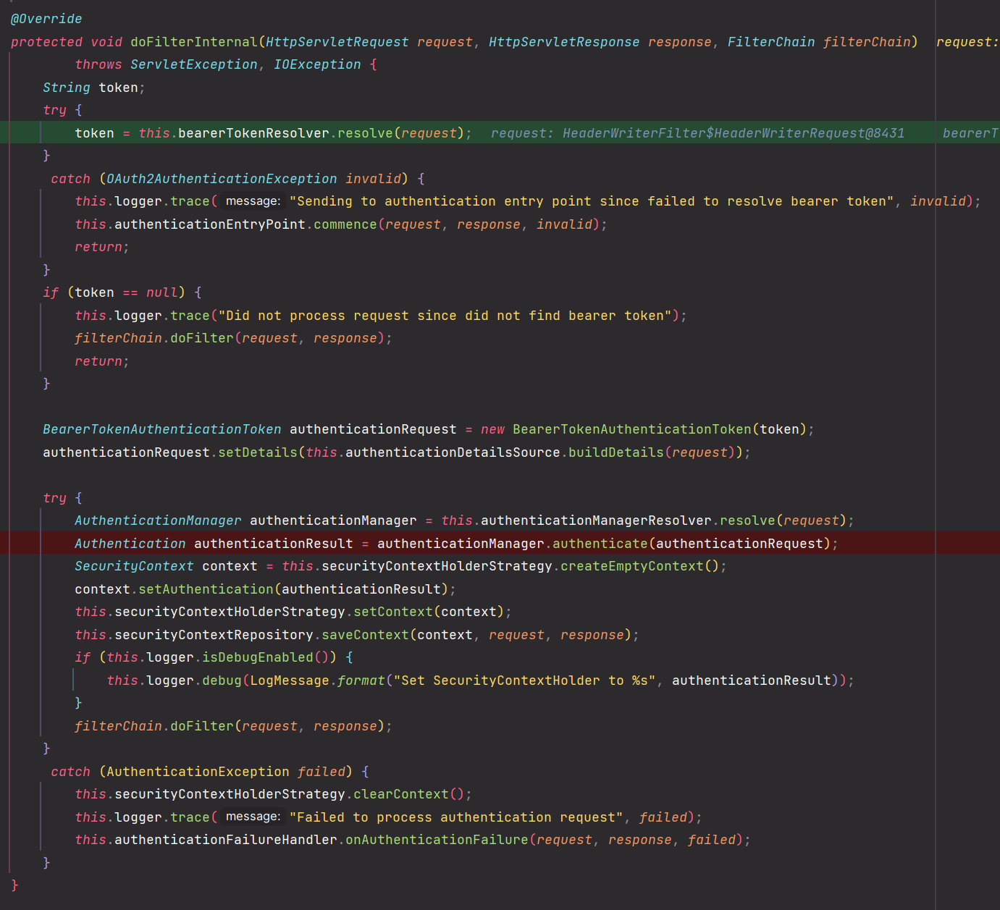
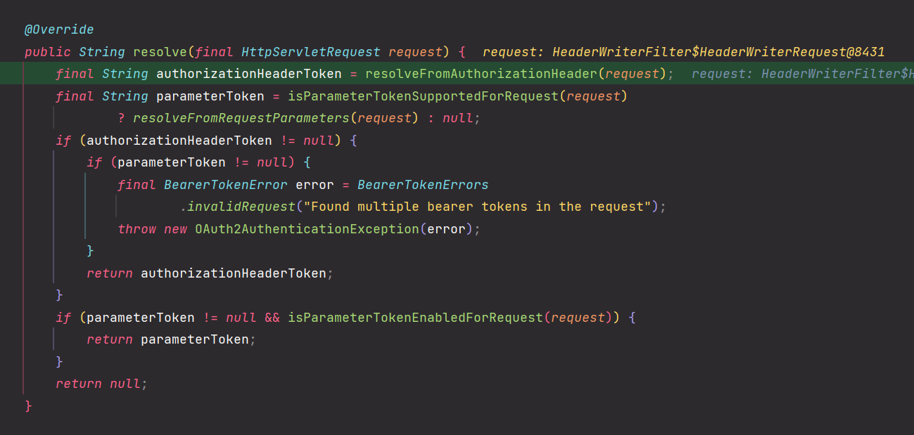
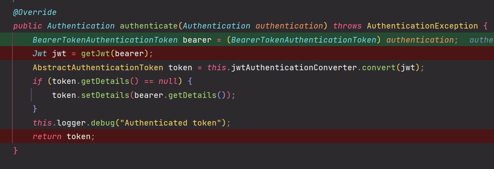
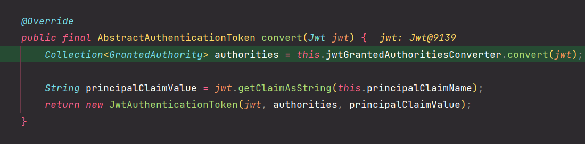
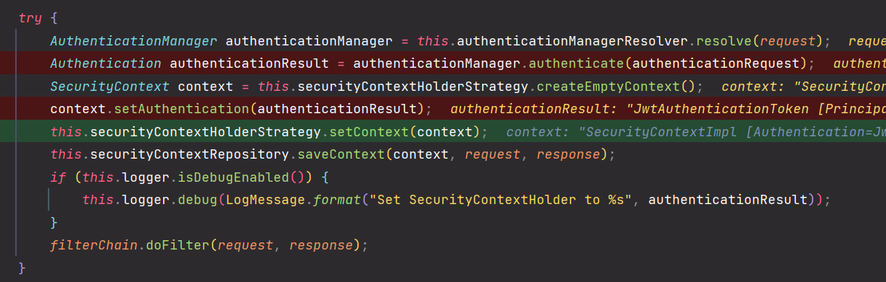

# OAuth 2.0 Resource Server MAC & RSA 토큰 검증 - BearerTokenAuthenticationFilter 이해

---

### 1. BearerTokenAuthenticationFilter

### 2. DefaultBearerTokenResolver

### 3. JwtAuthenticationProvider

### 4. JwtAuthenticationConverter

### 5. 인증 객체 저장

---

[이전 ↩️ - OAuth 2.0 Resource Server MAC & RSA 토큰 검증 - @AuthenticationPrincipal 참조]()

[메인 ⏫](https://github.com/genesis12345678/TIL/blob/main/Spring/security/oauth/main.md)