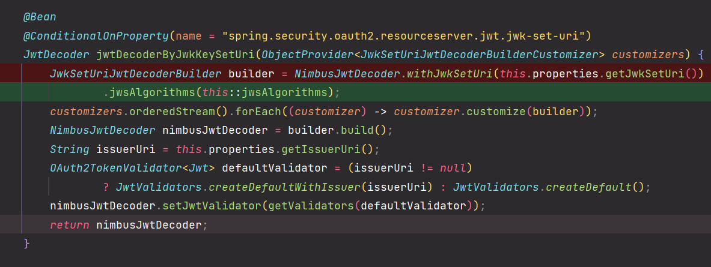
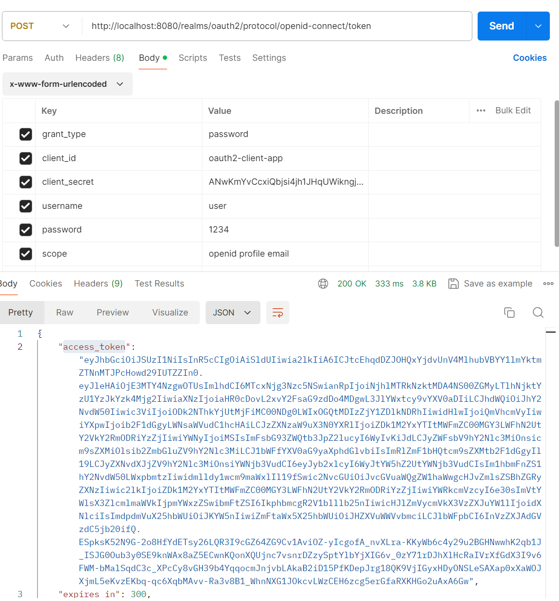
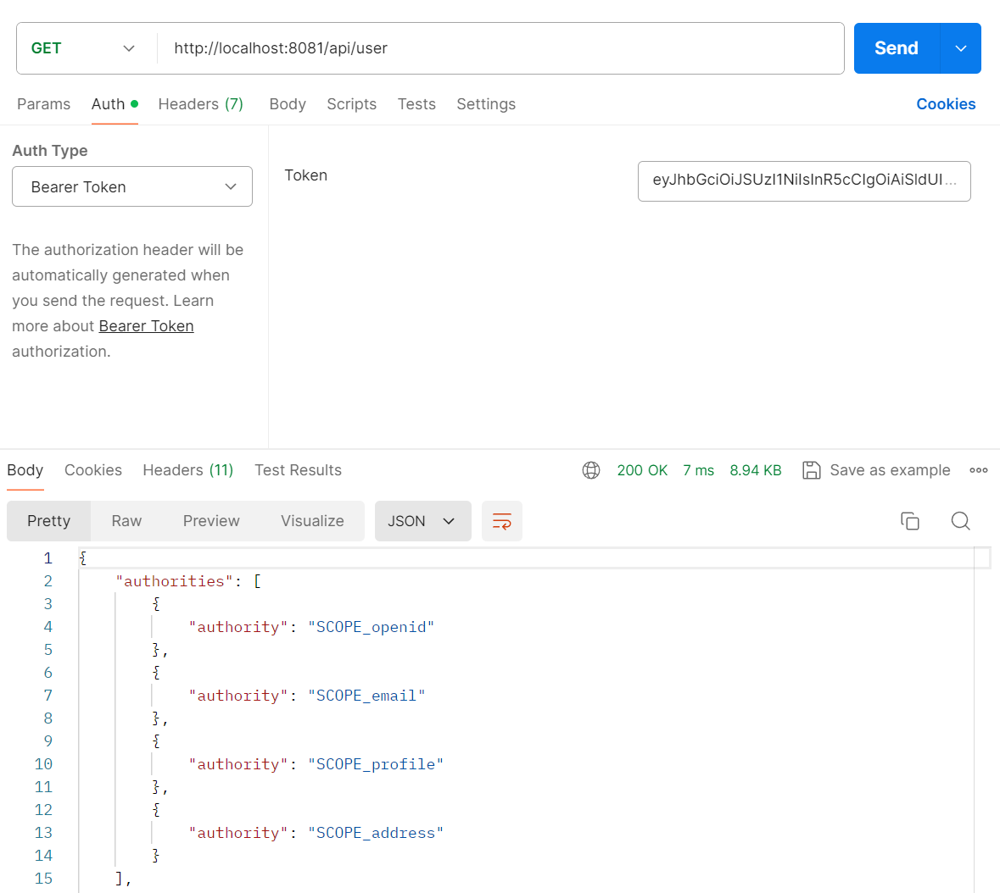

# OAuth 2.0 Resource Server MAC & RSA 토큰 검증 - JwkSetUri 에 의한 검증(RSA)

### application.yml

```yaml
spring:
  security:
    oauth2:
      resourceserver:
        jwt:
          jwk-set-uri: http://localhost:8080/realms/oauth2/protocol/openid-connect/certs
```

### OAuth2ResourceServerJwtConfiguration.JwtDecoderConfiguration



### SecurityConfig

```java
@Configuration
@EnableWebSecurity
public class SecurityConfig {
    
    @Bean
    public SecurityFilterChain securityFilterChain(HttpSecurity http) throws Exception {

        http
                .csrf(AbstractHttpConfigurer::disable)
                .sessionManagement(session -> session.sessionCreationPolicy(SessionCreationPolicy.STATELESS))
                .authorizeHttpRequests(request -> request
                        .requestMatchers("/").permitAll()
                        .anyRequest().authenticated())
                .userDetailsService(userDetailsService())
                .oauth2ResourceServer(config -> config.jwt(Customizer.withDefaults()))
        ;

        return http.build();
    }
    
    @Bean
    public UserDetailsService userDetailsService() {

        UserDetails user = User.withUsername("user")
                .password("1234")
                .roles("USER")
                .build();

        return new InMemoryUserDetailsManager(user);
    }

    @Bean
    public PasswordEncoder passwordEncoder() {
        return NoOpPasswordEncoder.getInstance();
    }
}
```

### 인가 서버에 토큰 요청



### 토큰으로 검증


---

[이전 ↩️ - OAuth 2.0 Resource Server MAC & RSA 토큰 검증 - PublicKey.txt 에 의한 검증(RSA)](https://github.com/genesis12345678/TIL/blob/main/Spring/security/oauth/MAC_RSA/PublicKey.md)

[메인 ⏫](https://github.com/genesis12345678/TIL/blob/main/Spring/security/oauth/main.md)

[다음 ↪️ - OAuth 2.0 Resource Server MAC & RSA 토큰 검증 - @AuthenticationPrincipal 참조](https://github.com/genesis12345678/TIL/blob/main/Spring/security/oauth/MAC_RSA/AuthenticationPrincipal.md)