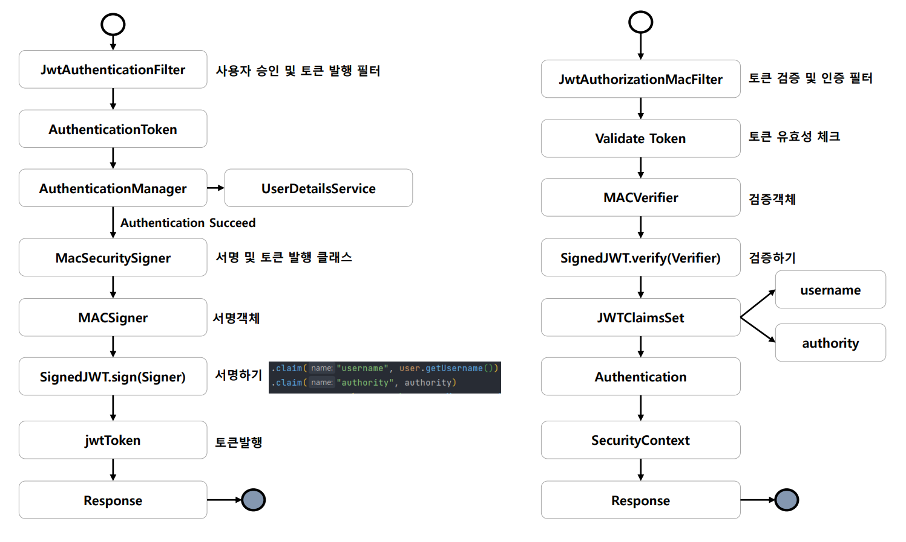

# OAuth 2.0 Resource Server MAC & RSA 토큰 검증 - JwtAuthorizationMacFilter



---

###

```java
public abstract class SecuritySigner {

    protected String getJwtTokenInternal(MACSigner jwsSigner, UserDetails user, JWK jwk) throws JOSEException {

        JWSHeader jwsHeader = new JWSHeader
                .Builder((JWSAlgorithm) jwk.getAlgorithm())
                .keyID(jwk.getKeyID())
                .build();

        List<String> authorities = user.getAuthorities().stream().map(auth -> auth.getAuthority()).toList();

        JWTClaimsSet jwtClaimsSet = new JWTClaimsSet.Builder()
                .subject("user")
                .issuer("http://localhost:8081")
                .claim("username", user.getUsername())
                .claim("authority", authorities)
                .expirationTime(new Date(new Date().getTime() + 60 * 1000 * 5)) //5분
                .build();

        SignedJWT signedJWT = new SignedJWT(jwsHeader, jwtClaimsSet);
        signedJWT.sign(jwsSigner);
        String jwtToken = signedJWT.serialize();

        return jwtToken;
    }

    public abstract String getJwtToken(UserDetails user, JWK jwk) throws JOSEException;
}
```
> MAC(대칭) 또는 RSA(비대칭) 암호화 방식에 따라 토큰을 발행하는 추상 클래스

### MacSecuritySigner

```java
public class MacSecuritySigner extends SecuritySigner{

    @Override
    public String getJwtToken(UserDetails user, JWK jwk) throws JOSEException {

        MACSigner jwsSigner = new MACSigner(((OctetSequenceKey)jwk).toSecretKey());
        return super.getJwtTokenInternal(jwsSigner, user, jwk);
    }
}
```
> MAC 방식으로 토큰을 발행하는 클래스

### SignatureConfig

```java
@Configuration
public class SignatureConfig {

    @Bean
    public MacSecuritySigner macSecuritySigner() {
        return new MacSecuritySigner();
    }

    @Bean
    public OctetSequenceKey octetSequenceKey() throws JOSEException {
        return new OctetSequenceKeyGenerator(256)
                .keyID("macKey")
                .algorithm(JWSAlgorithm.HS256)
                .generate();

    }
}
```
> `JWK`의 구현체인 **OctetSequenceKey** 생성

### JwtAuthenticationFilter

```java
public class JwtAuthenticationFilter extends UsernamePasswordAuthenticationFilter {
    
    private final SecuritySigner securitySigner;
    private final JWK jwk;

    public JwtAuthenticationFilter(SecuritySigner securitySigner, JWK jwk) {
        this.securitySigner = securitySigner;
        this.jwk = jwk;
    }

    @Override
    public Authentication attemptAuthentication(HttpServletRequest request, HttpServletResponse response) throws AuthenticationException {

        ObjectMapper mapper = new ObjectMapper();
        LoginDto loginDto;

        try {
            loginDto = mapper.readValue(request.getInputStream(), LoginDto.class);

        } catch (IOException e) {
            throw new RuntimeException(e);
        }

        UsernamePasswordAuthenticationToken authenticationToken =
                new UsernamePasswordAuthenticationToken(loginDto.getUsername(), loginDto.getPassword());

        return getAuthenticationManager().authenticate(authenticationToken);
    }

    @Override
    protected void successfulAuthentication(HttpServletRequest request, HttpServletResponse response,
                                            FilterChain chain, Authentication authResult) throws IOException, ServletException {
        String jwtToken;

        User user = (User) authResult.getPrincipal();

        try {
            jwtToken = securitySigner.getJwtToken(user, jwk);
            response.addHeader("Authorization", "Bearer " + jwtToken);

        } catch (JOSEException e) {
            throw new RuntimeException(e);
        }
    }
}
```
> - 사용자 승인 및 토큰 발행 필터
> - 대칭키 암호화 방식으로 JWT를 생성한다.

### JwtAuthorizationMacFilter

```java
public class JwtAuthorizationMacFilter extends OncePerRequestFilter {

    private final OctetSequenceKey jwk;

    public JwtAuthorizationMacFilter(OctetSequenceKey jwk) {
        this.jwk = jwk;
    }

    @Override
    protected void doFilterInternal(HttpServletRequest request, HttpServletResponse response, FilterChain filterChain) throws ServletException, IOException {

        String header = request.getHeader("authorization");

        if (header == null || !header.startsWith("Bearer ")) {
            filterChain.doFilter(request, response);
            return;
        }

        String token = header.replace("Bearer ", "");

        SignedJWT signedJWT;
        boolean verify;

        try {
            signedJWT = SignedJWT.parse(token);

            verify = signedJWT.verify(new MACVerifier(jwk.toSecretKey()));

            if (verify) {
                JWTClaimsSet jwtClaimsSet = signedJWT.getJWTClaimsSet();
                String username = jwtClaimsSet.getClaim("username").toString();
                List<String> authority = (List) jwtClaimsSet.getClaim("authority");

                if (username != null) {
                    UserDetails user = User.withUsername(username)
                            .password(UUID.randomUUID().toString().substring(0, 8))
                            .authorities(authority.get(0))
                            .build();

                    Authentication authentication =
                            new UsernamePasswordAuthenticationToken(user, null, user.getAuthorities());

                    SecurityContextHolder.getContextHolderStrategy()
                            .getContext().setAuthentication(authentication);
                }
            }
        } catch (Exception e) {
            e.printStackTrace();
        }
        filterChain.doFilter(request, response);

    }
}
```
> - 토큰을 검증하는 필터
> - MAC 방식 전용 필터이므로 구체 클래스인 `OctetSequenceKey`를 갖고 있어도 무방
> - 클레임 정보를 이용해 인증 객체 생성 후 저장

### SecurityConfig

```java
@Configuration
@EnableWebSecurity
@RequiredArgsConstructor
public class SecurityConfig {

    private final MacSecuritySigner macSecuritySigner;
    private final OctetSequenceKey octetSequenceKey;

    @Bean
    public SecurityFilterChain securityFilterChain(HttpSecurity http) throws Exception {

        AuthenticationManagerBuilder builder = http.getSharedObject(AuthenticationManagerBuilder.class);
        builder.userDetailsService(userDetailsService());
        AuthenticationManager authenticationManager = builder.build();

        http
                .csrf(AbstractHttpConfigurer::disable)
                .sessionManagement(session -> session.sessionCreationPolicy(SessionCreationPolicy.STATELESS))
                .authorizeHttpRequests(request -> request
                        .requestMatchers("/").permitAll()
                        .anyRequest().authenticated())
                .authenticationManager(authenticationManager)
                .addFilterBefore(jwtAuthenticationFilter(macSecuritySigner, octetSequenceKey, authenticationManager), UsernamePasswordAuthenticationFilter.class)
                .addFilterBefore(jwtAuthorizationMacFilter(octetSequenceKey), UsernamePasswordAuthenticationFilter.class)
        ;

        return http.build();
    }

    @Bean
    public JwtAuthorizationMacFilter jwtAuthorizationMacFilter(OctetSequenceKey octetSequenceKey) {
        return new JwtAuthorizationMacFilter(octetSequenceKey);
    }
    
    public JwtAuthenticationFilter jwtAuthenticationFilter(MacSecuritySigner macSecuritySigner, OctetSequenceKey octetSequenceKey, 
                                                           AuthenticationManager authenticationManager) throws Exception {
        
        JwtAuthenticationFilter jwtAuthenticationFilter = new JwtAuthenticationFilter(macSecuritySigner, octetSequenceKey);
        jwtAuthenticationFilter.setAuthenticationManager(authenticationManager);
        
        return jwtAuthenticationFilter;
    }

    @Bean
    public UserDetailsService userDetailsService() {

        UserDetails user = User.withUsername("user")
                .password("1234")
                .roles("USER")
                .build();

        return new InMemoryUserDetailsManager(user);
    }

    @Bean
    public PasswordEncoder passwordEncoder() {
        return NoOpPasswordEncoder.getInstance();
    }
}
```
---

[이전 ↩️ - OAuth 2.0 Resource Server MAC & RSA 토큰 검증 - 기본 환경 및 공통 클래스 구성]()

[메인 ⏫](https://github.com/genesis12345678/TIL/blob/main/Spring/security/oauth/main.md)

[다음 ↪️ - OAuth 2.0 Resource Server MAC & RSA 토큰 검증 - JwtDecoder 에 의한 검증(MAC)]()