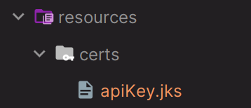
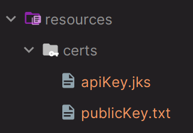
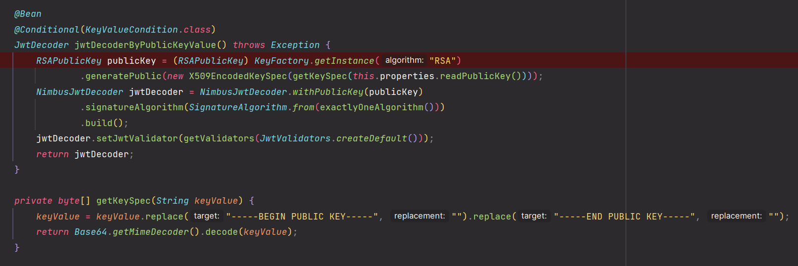

# OAuth 2.0 Resource Server MAC & RSA 토큰 검증 - PublicKey.txt 에 의한 검증(RSA)

## KeyStore 클래스

- Java는 `KeyStore` 라는 인터페이스를 통해 암호화/복호화 및 전자 서명에 사용되는 `Private Key`, `Public Key`와 **Certificate** 를 추상화하여 제공하고 있다.
- `KeyStore`에는 **SecretKey, Private Key, Pbulic Key, Certificate** 와 같은 보안 파일들이 저장되며 `KeyStore`라는 파일 시스템에 저장하고 암호로 보호할 수 있다.
- `KeyStore`는 **keytool**을 사용해서 생성할 수 있으며 기본 타입은 `jks` 이다.

---

## keytool

- `keytool`은 자바에서 제공하는 유틸리티로 `KeyStore` 기반으로 인증서와 키를 고나리할 수 있으며 JDK 에 포함되어 있다.
  - `C:\Program Files\Java\jdk-17\bin\keytool.exe`
- **KeyStore 생성 후 Private Key, Public Key, Certificate 생성**
  - **Private Key 생성** : ` keytool -genkeypair -alias apiKey -keyalg RSA -keypass "pass1234" -keystore apiKey.jks -storepass "pass1234"`
  - **Public Key 생성** : `keytool -export -alias apiKey -keystore apiKey.jks -rfc -file trustServer.cer`
  - **Certificate 생성** : ` keytool -import -alias trustServer -file trustServer.cer -keystore publicKey.jks`

---




### RsaPublicKeySecuritySigner

```java
public class RsaPublicKeySecuritySigner extends SecuritySigner{

    private PrivateKey privateKey;

    @Override
    public String getJwtToken(UserDetails user, JWK jwk) throws JOSEException {

        RSASSASigner jwsSigner = new RSASSASigner(privateKey);
        return super.getJwtTokenInternal(jwsSigner, user, jwk);
    }

    public void setPrivateKey(PrivateKey privateKey) {
        this.privateKey = privateKey;
    }
}
```
> `SecuritySigner`를 상속 받아 `RSA` 암호화 방식의 서명 및 토큰을 발행하는 클래스

### SecuritySigner

```java
public abstract class SecuritySigner {

    protected String getJwtTokenInternal(JWSSigner jwsSigner, UserDetails user, JWK jwk) throws JOSEException {

        JWSHeader jwsHeader = new JWSHeader
                .Builder((JWSAlgorithm) jwk.getAlgorithm())
                .keyID(jwk.getKeyID())
                .build();

        List<String> authorities = user.getAuthorities().stream().map(auth -> auth.getAuthority()).toList();

        JWTClaimsSet jwtClaimsSet = new JWTClaimsSet.Builder()
                .subject("user")
                .issuer("http://localhost:8081")
                .claim("username", user.getUsername())
                .claim("authority", authorities)
                .expirationTime(new Date(new Date().getTime() + 60 * 1000 * 5)) //5분
                .build();

        SignedJWT signedJWT = new SignedJWT(jwsHeader, jwtClaimsSet);
        signedJWT.sign(jwsSigner);
        String jwtToken = signedJWT.serialize();

        return jwtToken;
    }

    public abstract String getJwtToken(UserDetails user, JWK jwk) throws JOSEException;
}
```

### SignatureConfig

```java
@Configuration
public class SignatureConfig {

    @Bean
    public MacSecuritySigner macSecuritySigner() {
      ...
    }

    @Bean
    public RsaSecuritySigner rsaSecuritySigner() {
      ...
    }

    @Bean
    public RSAKey rsaKey() throws JOSEException {
      return new RSAKeyGenerator(2048)
              .keyID("rsaKey")
              .algorithm(JWSAlgorithm.RS256) //변경
              .generate();
    }

    @Bean
    public OctetSequenceKey octetSequenceKey() throws JOSEException {
      ...
    }

    //추가
    @Bean
    public RsaPublicKeySecuritySigner rsaPublicKeySecuritySigner() {
        return new RsaPublicKeySecuritySigner();
    }
}
```

### RsaKeyExtractor

```java
@Component
@RequiredArgsConstructor
public class RsaKeyExtractor implements ApplicationRunner {

    private final RsaPublicKeySecuritySigner rsaPublicKeySecuritySigner;

    @Override
    public void run(ApplicationArguments args) throws Exception {

        String path = "C:\\Users\\User\\Desktop\\oauth2-resource-server\\src\\main\\resources\\certs\\";
        File file = new File(path + "publicKey.txt");

        FileInputStream is = new FileInputStream(path + "apiKey.jks");
        
      /**
       * KeyStore 객체를 얻는다.
       * keytool을 통해 얻은 apiKey.jks 파일을 읽어오면 키와 인증서를 가져올 수 있으며 여기에는 개인 키와 인증서, 공개 키 정보를 담고 있다.
       */
        KeyStore keystore = KeyStore.getInstance(KeyStore.getDefaultType()); //기본 타입은 .jks(java key store)
        keystore.load(is, "pass1234".toCharArray()); //기존 키 저장소를 load 한다.
        String alias = "apiKey";
        Key key = keystore.getKey(alias, "pass1234".toCharArray()); //개인 키를 얻는다.

        if (key instanceof PrivateKey) {

            Certificate certificate = keystore.getCertificate(alias); //인증서를 얻는다.
            PublicKey publicKey = certificate.getPublicKey(); //인증서로부터 공개 키를 얻는다.
            KeyPair keyPair = new KeyPair(publicKey, (PrivateKey) key); 
            rsaPublicKeySecuritySigner.setPrivateKey(keyPair.getPrivate()); //개인 키 저장

            if (!file.exists()) {
                
                //공개 키를 Base64로 인코딩한 다음 문자열을 반환한다.
                String publicStr = java.util.Base64.getMimeEncoder().encodeToString(publicKey.getEncoded()); 
                publicStr = "-----BEGIN PUBLIC KEY-----\r\n" + publicStr + "\r\n-----END PUBLIC KEY-----";

                //인코딩된 공개 키 문자열을 txt 파일로 저장한다.
                OutputStreamWriter writer = new OutputStreamWriter(new FileOutputStream(file), Charset.defaultCharset());
                writer.write(publicStr);
                writer.close();
            }
        }
        is.close();
    }
}
```
> - `apiKey.jks`로부터 `PrivateKey`와 `PublicKey`를 추출하고 파일에 저장하는 클래스
> - `ApplicationRunner`를 상속하여 스프링 부트가 초기화 될 때 실행할 메서드 생성
> 
> 

### application.yml

```yaml
spring:
  security:
    oauth2:
      resourceserver:
        jwt:
          jws-algorithms: RS256
          public-key-location: classpath:certs/publicKey.txt # 추가
```

### OAuth2ResourceServerJwtConfiguration.JwtDecoderConfiguration



> `KeyValueCondition`을 통해 설정 파일에 `public-key-location`가 존재하면 `RSAPublicKey`를 사용해 `JwtDecoder`를 생성하는 초기화 과정을 거친다.

### JwtAuthorizationRsaPublicKeyFilter

```java
public class JwtAuthorizationRsaPublicKeyFilter extends JwtAuthorizationFilter {

    private JwtDecoder jwtDecoder;

    public JwtAuthorizationRsaPublicKeyFilter(JwtDecoder jwtDecoder) {
        super(null);
        this.jwtDecoder = jwtDecoder;
    }

    @Override
    protected void doFilterInternal(HttpServletRequest request, HttpServletResponse response, FilterChain filterChain) throws ServletException, IOException {
        if (super.tokenResolve(request)) {
            filterChain.doFilter(request, response);
            return;
        }

        if (jwtDecoder != null) {

            Jwt jwt = jwtDecoder.decode(super.getToken(request));
            String username = jwt.getClaimAsString("username");
            List<String> authority = jwt.getClaimAsStringList("authority");

            if (username != null) {
                UserDetails user = User.withUsername(username)
                        .password(UUID.randomUUID().toString().substring(0, 8))
                        .authorities(authority.get(0))
                        .build();

                Authentication authentication =
                        new UsernamePasswordAuthenticationToken(user, null, user.getAuthorities());

                SecurityContextHolder.getContextHolderStrategy()
                        .getContext().setAuthentication(authentication);
            }
        }

        filterChain.doFilter(request, response);
    }
}
```

### JwtAuthorizationFilter

```java
public abstract class JwtAuthorizationFilter extends OncePerRequestFilter {

    private final JWSVerifier jwsVerifier;

    public JwtAuthorizationFilter(JWSVerifier jwsVerifier) {
        this.jwsVerifier = jwsVerifier;
    }

    @Override
    protected void doFilterInternal(HttpServletRequest request, HttpServletResponse response, FilterChain filterChain) throws ServletException, IOException {
      ...
    }

    //추가
    protected String getToken(HttpServletRequest request) {
        return request.getHeader("Authorization").replace("Bearer", "");
    }

    //추가
    protected boolean tokenResolve(HttpServletRequest request) {
        String header = request.getHeader("Authorization");
        return header == null || !header.startsWith("Bearer ");
    }
}
```

### SecurityConfig

```java
@Configuration
@EnableWebSecurity
@RequiredArgsConstructor
public class SecurityConfig {

    private final RsaPublicKeySecuritySigner rsaPublicKeySecuritySigner;
    private final RSAKey rsaKey;
    
    @Bean
    public SecurityFilterChain securityFilterChain(HttpSecurity http) throws Exception {

        AuthenticationManagerBuilder builder = http.getSharedObject(AuthenticationManagerBuilder.class);
        builder.userDetailsService(userDetailsService());
        AuthenticationManager authenticationManager = builder.build();

        http
                .csrf(AbstractHttpConfigurer::disable)
                .sessionManagement(session -> session.sessionCreationPolicy(SessionCreationPolicy.STATELESS))
                .authorizeHttpRequests(request -> request
                        .requestMatchers("/").permitAll()
                        .anyRequest().authenticated())
                .authenticationManager(authenticationManager)
                .addFilterBefore(jwtAuthenticationFilter(authenticationManager), UsernamePasswordAuthenticationFilter.class)
                .addFilterBefore(jwtAuthorizationRsaPublicKeyFilter(null), UsernamePasswordAuthenticationFilter.class)
        ;

        return http.build();
    }

    public JwtAuthenticationFilter jwtAuthenticationFilter(AuthenticationManager authenticationManager) throws Exception {
        JwtAuthenticationFilter jwtAuthenticationFilter = new JwtAuthenticationFilter(rsaPublicKeySecuritySigner, rsaKey);
        jwtAuthenticationFilter.setAuthenticationManager(authenticationManager);
        return jwtAuthenticationFilter;
    }

    @Bean
    public JwtAuthorizationRsaPublicKeyFilter jwtAuthorizationRsaPublicKeyFilter(JwtDecoder jwtDecoder) {
        return new JwtAuthorizationRsaPublicKeyFilter(jwtDecoder);
    }
    
    @Bean
    public UserDetailsService userDetailsService() {

        UserDetails user = User.withUsername("user")
                .password("1234")
                .roles("USER")
                .build();

        return new InMemoryUserDetailsManager(user);
    }

    @Bean
    public PasswordEncoder passwordEncoder() {
        return NoOpPasswordEncoder.getInstance();
    }
}
```
---

[이전 ↩️ - OAuth 2.0 Resource Server MAC & RSA 토큰 검증 - JwtDecoder 에 의한 검증(RSA)]()

[메인 ⏫](https://github.com/genesis12345678/TIL/blob/main/Spring/security/oauth/main.md)

[다음 ↪️ - OAuth 2.0 Resource Server MAC & RSA 토큰 검증 - JwkSetUri 에 의한 검증(RSA)]()