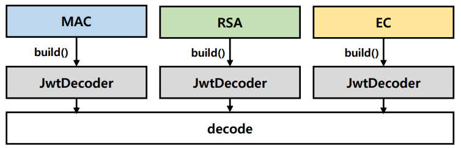
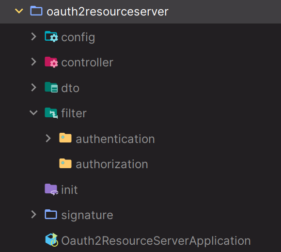

# OAuth 2.0 Resource Server MAC & RSA 토큰 검증 - 기본 환경 및 공통 클래스 구성

## 토큰 검증 방법

- **토큰 검증에 대한 다양한 케이스의 테스트를 위해 두 가지 방식으로 토큰 발행 및 검증을 진행한다.**
1. 암호화 알고리즘 방식에 따라 직접 발행한 JWT 를 대상으로 검증을 진행한다.
2. 인가 서버에서 발행한 Access Token 을 대상으로 검증을 진행한다.

`JwtDecoder` 빈은 암호화 알고리즘 및 특정한 조건에 따라 각 생성되며 디코딩이 진행되면 주어진 알고리즘에 의해 검증하게 된다.



---

## 토큰 검증 테스트

1. **MAC 방식에 의한 검증 테스트**
   - [자체 토큰 발행 및 검증](https://github.com/genesis12345678/TIL/blob/main/Spring/security/oauth/MAC_RSA/JwtAuthorizationMacFilter.md)
   - [`SecretKey` 설정에 의한 검증](https://github.com/genesis12345678/TIL/blob/main/Spring/security/oauth/MAC_RSA/MAC_JwtDecoder.md)
2. **RSA 방식에 의한 검증 테스트**
   - [자체 토큰 발행 및 검증](https://github.com/genesis12345678/TIL/blob/main/Spring/security/oauth/MAC_RSA/JwtAuthorizationRsaFilter.md)
   - [`PublicKey` 파일에 의한 검증](https://github.com/genesis12345678/TIL/blob/main/Spring/security/oauth/MAC_RSA/RSA_JwtDecoder.md)
   - [`KeyStore` 툴에 의한 검증](https://github.com/genesis12345678/TIL/blob/main/Spring/security/oauth/MAC_RSA/PublicKey.md)
   - [`JwkSetUri` 설정에 의한 검증](https://github.com/genesis12345678/TIL/blob/main/Spring/security/oauth/MAC_RSA/JwkSetUri.md)

---

## 패키지 구성



- `config` : 설정 클래스
- `authentication` : 인증 필터 (토큰 발행 담당)
- `authorization` : 인가 필터(토큰 검증 담당)
- `signature` : 토큰 서명 및 발행
- `init` : 초기화 작업

### SignatureConfig

- 서명과 검증, `MAC` 및 `RSA` 암호화 JWK 등의 빈들을 생성하는 설정 클래스

### JwtAuthenticationFilter

- 인가 서버를 대신하여 토큰을 발행하는 커스텀 필터, `UsernamePasswordAuthenticationFilter`를 상속 받는다.
- **POST**, `/login` 요청에 대해 인증 처리를 담당한다.
- 인증에 성공하게 되면 `SecuritySigner` 를 호출해서 JWT를 생성하고 클라이언트에 응답한다.
- `MAC`과 `RSA` 의 서명 및 인증에 공통으로 사용하는 필터

### SecuritySigner

- `MAC` 및 `RSA` 암호화 방식에 따라 토큰을 발행하는 추상 클래스

---

### CorsConfig

```java
@Configuration
public class CorsConfig {

    @Bean
    public CorsConfigurationSource corsConfigurationSource() {
        UrlBasedCorsConfigurationSource source = new UrlBasedCorsConfigurationSource();
        CorsConfiguration config = new CorsConfiguration();

        config.setAllowCredentials(true); // 인증 처리 허용
        config.addAllowedOrigin("*"); //도메인 허용
        config.addAllowedHeader("*"); //헤더 허용
        config.addAllowedMethod("*"); //Http Method 허용

        source.registerCorsConfiguration("/api/**", config);
        return source;
    }
}
```

### SecurityConfig

```java
@Configuration
@EnableWebSecurity
public class SecurityConfig {
    
    @Bean
    public SecurityFilterChain securityFilterChain(HttpSecurity http) throws Exception {

        AuthenticationManagerBuilder builder = http.getSharedObject(AuthenticationManagerBuilder.class);
        builder.userDetailsService(userDetailsService());
        AuthenticationManager authenticationManager = builder.build();

        http
                .csrf(AbstractHttpConfigurer::disable)
                .authorizeHttpRequests(request -> request
                        .requestMatchers("/").permitAll()
                        .anyRequest().authenticated())
                .authenticationManager(authenticationManager)
                .addFilterBefore(jwtAuthenticationFilter(authenticationManager), UsernamePasswordAuthenticationFilter.class)
        ;

        return http.build();
    }

    public JwtAuthenticationFilter jwtAuthenticationFilter(AuthenticationManager authenticationManager) throws Exception {
        JwtAuthenticationFilter jwtAuthenticationFilter = new JwtAuthenticationFilter();
        /**
         * JwtAuthenticationFilter -> UsernamePasswordAuthenticationFilter -> AbstractAuthenticationProcessingFilter
         * AbstractAuthenticationProcessingFilter 에 AuthenticationManager 를 지정해 주지 않으면 실행되지 않는다.
         */
        jwtAuthenticationFilter.setAuthenticationManager(authenticationManager);
        return jwtAuthenticationFilter;
    }

    @Bean
    public UserDetailsService userDetailsService() {

        UserDetails user = User.withUsername("user")
                .password("1234")
                .roles("USER")
                .build();

        return new InMemoryUserDetailsManager(user);
    }

    @Bean
    public PasswordEncoder passwordEncoder() {
        //암호화 하지 않는 평문 암호화 방식, Deprecated 되었다.
        return NoOpPasswordEncoder.getInstance();
    }
}
```

### JwtAuthenticationFilter

```java
public class JwtAuthenticationFilter extends UsernamePasswordAuthenticationFilter {

    @Override
    public Authentication attemptAuthentication(HttpServletRequest request, HttpServletResponse response) throws AuthenticationException {

        ObjectMapper mapper = new ObjectMapper();
        LoginDto loginDto;

        try {
            loginDto = mapper.readValue(request.getInputStream(), LoginDto.class);

        } catch (IOException e) {
            throw new RuntimeException(e);
        }

        UsernamePasswordAuthenticationToken authenticationToken =
                new UsernamePasswordAuthenticationToken(loginDto.getUsername(), loginDto.getPassword());

        return getAuthenticationManager().authenticate(authenticationToken);
    }

    @Override
    protected void successfulAuthentication(HttpServletRequest request, HttpServletResponse response,
                                            FilterChain chain, Authentication authResult) throws IOException, ServletException {
        SecurityContextHolder.getContext().setAuthentication(authResult);
        getSuccessHandler().onAuthenticationSuccess(request, response,authResult);
    }
}
```

### LoginDto

```java
@Data
public class LoginDto {
    private String username;
    private String password;
}
```

---

[메인 ⏫](https://github.com/genesis12345678/TIL/blob/main/Spring/security/oauth/main.md)

[다음 ↪️ - OAuth 2.0 Resource Server MAC & RSA 토큰 검증 - JwtAuthorizationMacFilter(MAC)](https://github.com/genesis12345678/TIL/blob/main/Spring/security/oauth/MAC_RSA/JwtAuthorizationMacFilter.md)