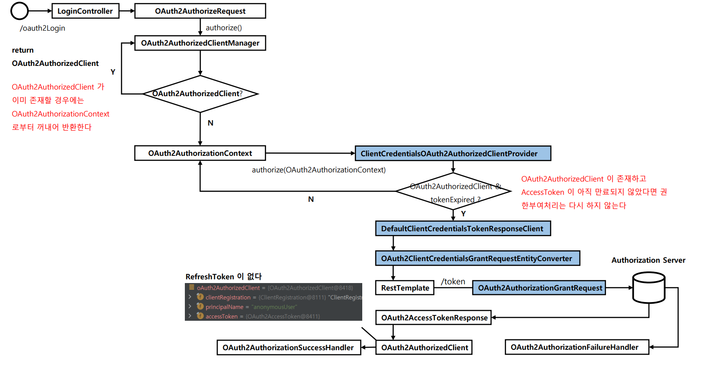
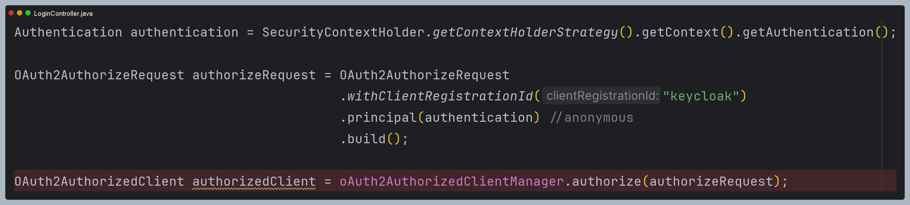
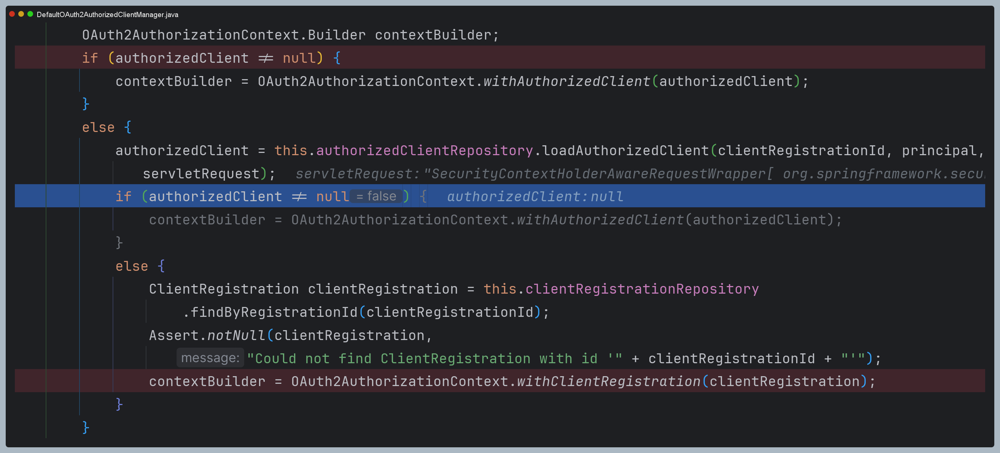
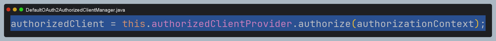
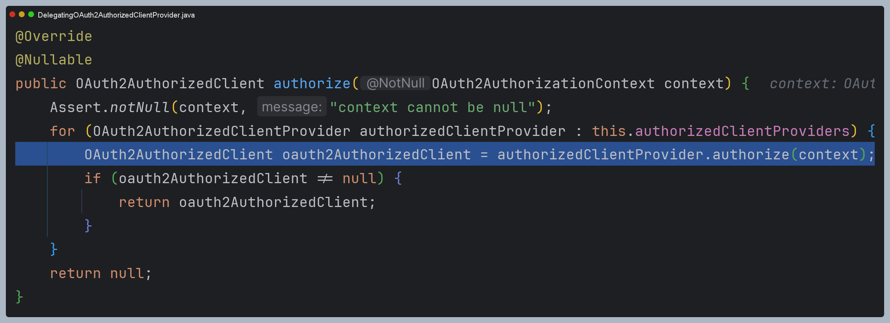
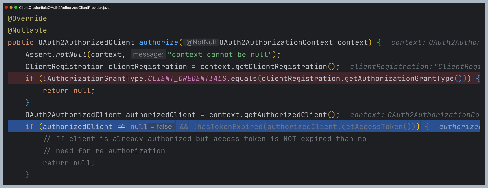
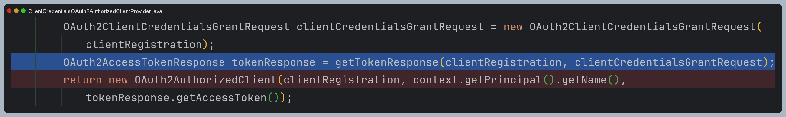
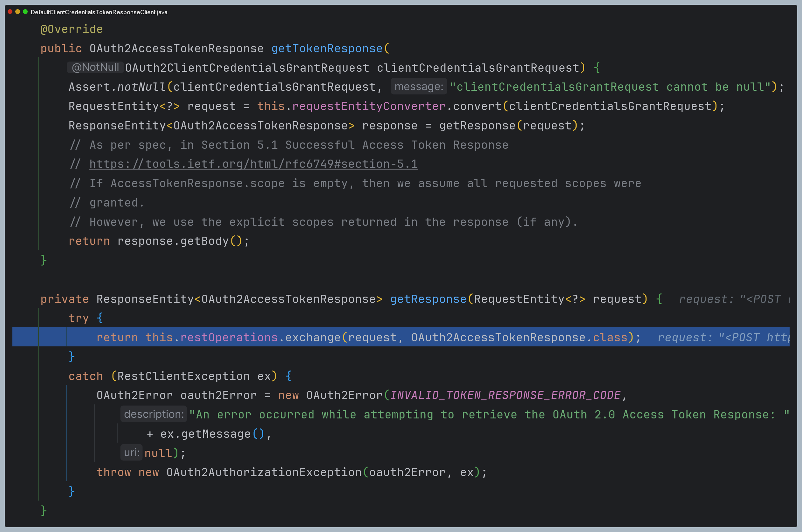
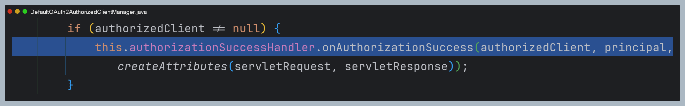
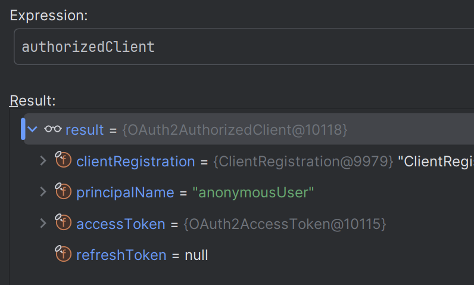

# oauth2Client() - Client Credentials

> 스프링 시큐리티의 `oauth2Login()` 필터에 의한 자동 인증 처리를 하지 않고 `DefaultOAuth2AuthorizedClientManager` 클래스를 사용하여 Spring MVC에서 직접
> 인증처리를 하는 로그인 기능을 구현한다.

### 기본 구성

- `DefaultOAuth2AuthorizedClientManager` : OAuth2 권한 부여 흐름 처리
- `LoginController` : `DefaultOAuth2AuthorizedClientManager`를 사용해서 로그인 처리

### 로그인 구현 순서

1. `DefaultOAuth2AuthorizedClientManager` 빈 생성 및 파라미터 초깃값 정의
2. 권한 부여 유형에 따라 요청이 이루어지도록 `application.yml` 설정 조정
3. `/oauth2Login` 주소로 권한 부여 흐름 요청
4. `DefaultOAuth2AuthorizedClientManager` 에게 권한 부여 요청
5. 권한 부여가 성공하면 `OAuth2AuthenticationSuccessHandler`를 호출하여 인증 이후 작업 진행
    - `DefaultOAuth2AuthorizedClientManager`의 최종 반환값인 **OAuth2AuthorizedClient**를 `OAuth2AuthorizedClientRepository`에 저장
6. **OAuth2AuthorizedClient** 에서 `AccessToken`을 참조하여 `/userinfo` 엔드포인트 요청으로 최종 사용자 정보를 가져온다.
7. 사용자 정보와 권한을 가지고 인증객체를 만든 후 `SecurityContext`에 저장하고 인증 완료
8. 인증이 성공하면 위 과정을 커스텀 필터를 만들어 처리하도록 한다.
 


---

## 예제 코드

### application.yml

```yaml
spring:
  security:
    oauth2:
      client:
        registration: # 클라이언트 설정
          keycloak:
            client-id: oauth2-client-app
            client-secret: 9KNAzAnHOBURT3vQHuJFkVqz468KJalY
            client-name: oauth2-client-app
            authorization-grant-type: client_credentials
            client-authentication-method: client_secret_basic
            provider: keycloak

        provider: # 공급자 설정
          keycloak:
            authorization-uri: http://localhost:8080/realms/oauth2/protocol/openid-connect/auth # OAuth 2.0 권한 코드 부여 엔드포인트
            token-uri: http://localhost:8080/realms/oauth2/protocol/openid-connect/token        # OAuth 2.0 토큰 엔드포인트
            issuer-uri: http://localhost:8080/realms/oauth2                                     # 서비스 공급자 위치
            user-info-uri: http://localhost:8080/realms/oauth2/protocol/openid-connect/userinfo # OAuth 2.0 UserInfo 엔드포인트
            jwk-set-uri: http://localhost:8080/realms/oauth2/protocol/openid-connect/certs      # OAuth 2.0 JwkSetUri 엔드포인트
            user-name-attribute: sub                                                            # OAuth 2.0 사용자명을 추출하는 클레임명
```

### 컨트롤러

```java
@RestController
@RequiredArgsConstructor
public class LoginController {
    
   private final OAuth2AuthorizedClientManager oAuth2AuthorizedClientManager;

   @GetMapping("/credentials")
   public OAuth2AuthorizedClient credentials() {
      Authentication authentication = SecurityContextHolder.getContextHolderStrategy().getContext().getAuthentication();

      OAuth2AuthorizeRequest authorizeRequest = OAuth2AuthorizeRequest
              .withClientRegistrationId("keycloak")
              .principal(authentication) //anonymous
              .build();

      OAuth2AuthorizedClient authorizedClient = oAuth2AuthorizedClientManager.authorize(authorizeRequest);
      return authorizedClient;
   }
}
```

> - **클라이언트 자격 증명 승인 방식**은 사용자 정보를 제공하지 않기 때문에 클라이언트 정보만 인가 서버에 보내면 되는 방식이다.
> - `OAuth2AuthorizedClient`로 사용자 정보를 얻어 인증 처리를 할 필요가 없다. (사용자 정보를 얻고 `SecurityContext`에 저장하는 등)

## 과정 디버깅

### 1. 컨트롤러



### 2. DefaultOAuth2AuthorizedClientManager

- 이미 인증 받은 클라이언트가 있는지 확인한다.
- 현재는 처음 요청이기 때문에 `clientRegistration` 정보를 담은 `OAuth2AuthorizationContext`를 생성한다.



- 최종 생성된 `OAuth2AuthorizationContext`로 `authorizedClientProvider`에게 전달한다.



### 3. DelegatingOAuth2AuthorizedClientProvider

- `OAuth2AuthorizedClientProviderBuilder`에 의해 생성된 각 `OAuth2AuthorizedClientProvider`에게 요청을 위임한다.



### 4. ClientCredentialsOAuth2AuthorizedClientProvider

- 권한 부여 타입, 이미 `authorizedClient`가 존재하고 `AccessToken`이 만료되지 않았는지 확인한다.



- 첫 요청이기 때문에 어느 것도 해당되지 않아 인가 서버와 통신한다.
- `DefaultClientCredentialsTokenResponseClient`에게 인가 서버 통신을 맡긴 후
  받은 결과로 `OAuth2AuthorizedClient`를 반환한다.



### 5. DefaultClientCredentialsTokenResponseClient

- 인가 서버와 통신 후 `OAuth2AccessTokenResponse`를 반환한다.



### 6. DefaultOAuth2AuthorizedClientManager

- `authorizationSuccessHandler`를 실행하고 `authorizedClient`를 반환한다.





---

[이전 ↩️ - OAuth 2.0 Client(oauth2Client) - DefaultOAuth2AuthorizedClientManager - `Resource Owner Password` 권한 부여 구현](https://github.com/genesis12345678/TIL/blob/main/Spring/security/oauth/OAuth2Client/Resource%20Owner%20Password.md)

[메인 ⏫](https://github.com/genesis12345678/TIL/blob/main/Spring/security/oauth/main.md)

[다음 ↪️ - OAuth 2.0 Client(oauth2Client) - DefaultOAuth2AuthorizedClientManager - `Refresh Token` 권한 부여 구현](https://github.com/genesis12345678/TIL/blob/main/Spring/security/oauth/OAuth2Client/Refresh%20Token.md)