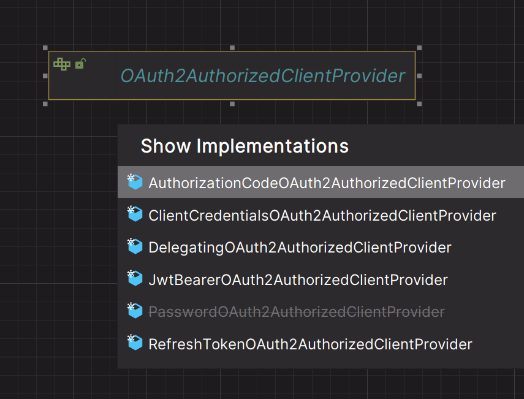
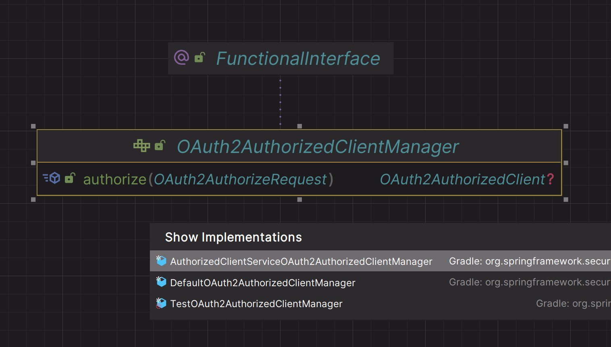
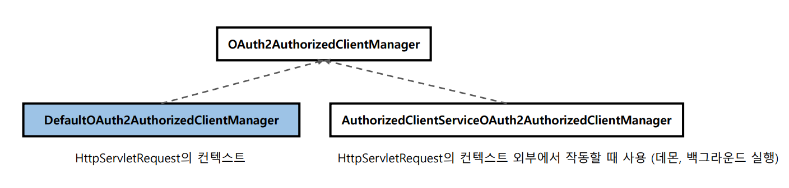
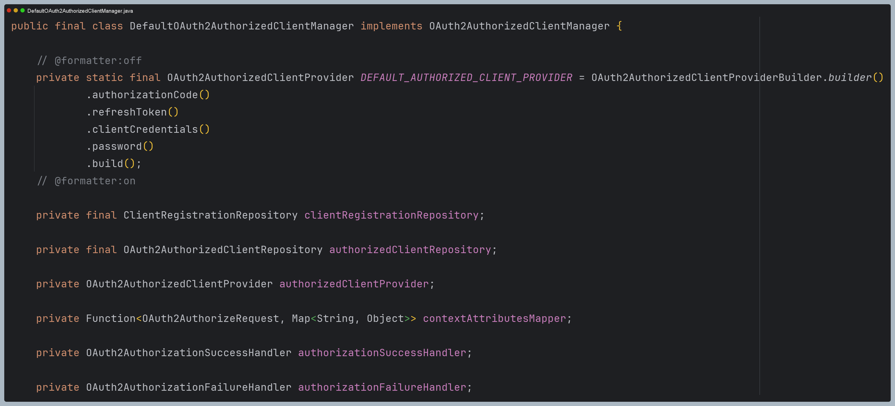
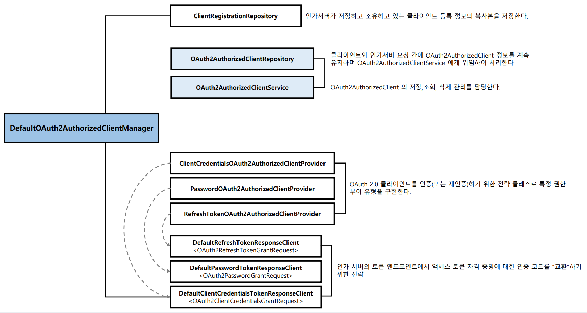
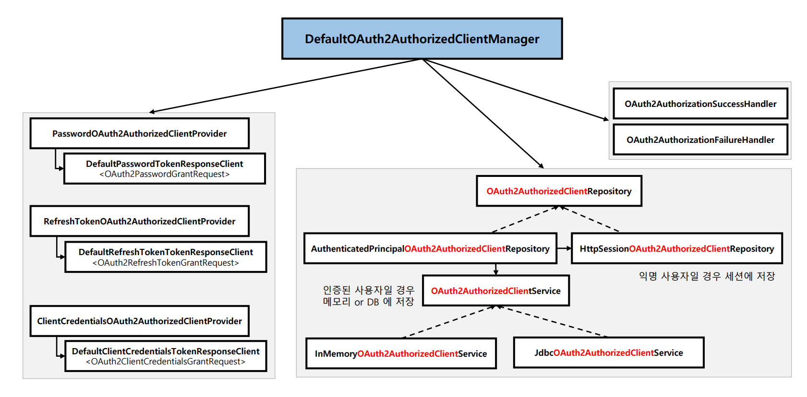

# oauth2Client() - DefaultOAuth2AuthorizedClientManager

- `OAuth2AuthorizedClient`를 전반적으로 관리하는 인터페이스
- **OAuth2AuthorizedClientManager** 는 `OAuth2AuthorizedClientProvider`로 OAuth 2.0 클라이언트에 권한 부여를 할 수 있다.

- `OAuth2AuthorizedClientService`나 `OAuth2AuthorizedClientRepository`에 `OAuth2AuthorizedClient` 저장을 위임한 후 **OAuth2AuthorizedClient** 최종 반환
- 사용자 정의 `OAuth2AuthenticationSuccessHandler` 및 `OAuth2AuthenticationFailureHandler` 를 구성하여 성공, 실패 처리를 변경할 수 있다.
- `invalid_grant` 오류로 인해 권한 부여 시도가 실패하면 이전에 저장된 **OAuth2AuthorizedClient**가 `OAuth2AuthorizedClientRepository`에서 제거된다.

---

## DefaultOAuth2AuthorizedClientManager

### 특징

### 구조

---

[이전 ↩️ - OAuth 2.0 Client(oauth2Client) - OAuth2AuthorizedClient](https://github.com/genesis12345678/TIL/blob/main/Spring/security/oauth/OAuth2Client/OAuth2AuthorizedClient.md)

[메인 ⏫](https://github.com/genesis12345678/TIL/blob/main/Spring/security/oauth/main.md)

[다음 ↪️ - OAuth 2.0 Client(oauth2Client) - DefaultOAuth2AuthorizedClientManager - `Resource Owner Password` 권한 부여 구현](https://github.com/genesis12345678/TIL/blob/main/Spring/security/oauth/OAuth2Client/Resource%20Owner%20Password.md)

