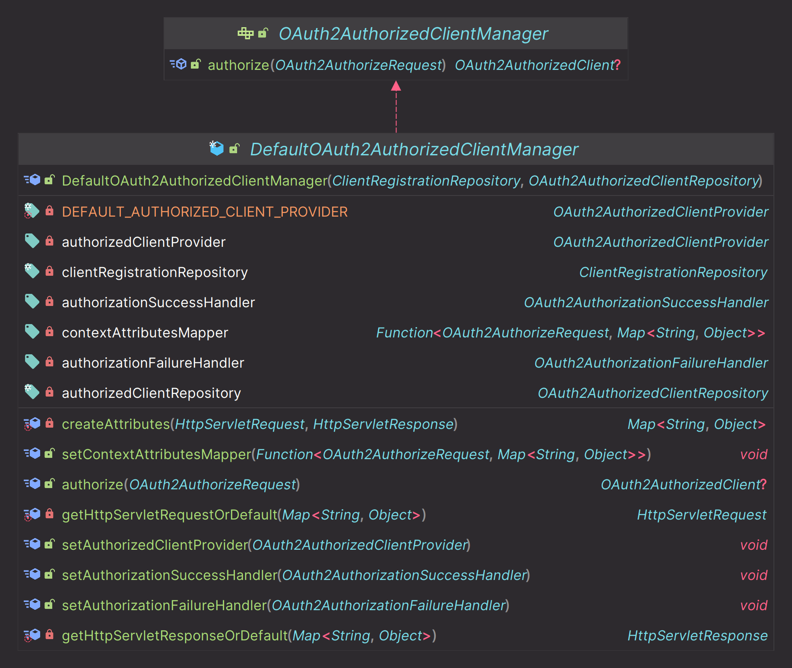
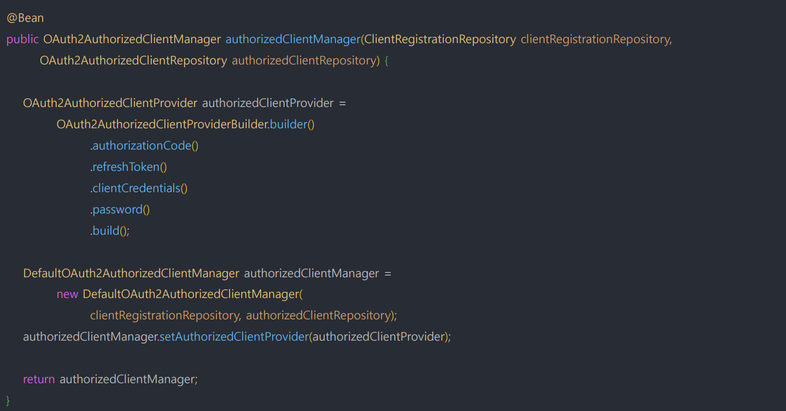

# oauth2Client() - DefaultOAuth2AuthorizedClientManager

- `OAuth2AuthorizedClient`를 전반적으로 관리하는 인터페이스
- **OAuth2AuthorizedClientManager** 는 `OAuth2AuthorizedClientProvider`로 OAuth 2.0 클라이언트에 권한 부여를 할 수 있다.


- `OAuth2AuthorizedClientService`나 `OAuth2AuthorizedClientRepository`애 `OAuth2AuthorizedClient` 저장을 위임한 후 **OAuth2AuthorizedClient** 최종 반환
- 사용자 정의 `OAuth2AuthenticationSuccessHandler` 및 `OAuth2AuthenticationFailureHandler` 를 구성하여 성공, 실패 처리를 변경할 수 있다.
- `invalid_grant` 오류로 인해 권한 부여 시도가 실패하면 이전에 저장된 **OAuth2AuthorizedClient**가 `OAuth2AuthorizedClientRepository`에서 제거된다.


---

## DefaultOAuth2AuthorizedClientManager



### 특징


### 구조


### 빈 등록



- `OAuth2AuthorizedClientProviderBuilder`를 통해 각각의 권한 부여 방식을 설정해 준다.

---

## 기본 환경 구성

- 스프링 시큐리티의 `oauth2Login()` 필터에 의한 자동 인증처리를 하지 않고 `DefaultOAuth2AuthorizedClientManager` 클래스를 사용하여 Spring MVC에서 직접 
    인증처리를 하는 로그인 기능을 구현한다.

### 기본 구성

- `AppConfig` : `DefaultOAuth2AuthorizedClientManager` 빈 생성 및 설정 초기화
- `DefaultOAuth2AuthorizedClientManager` : OAuth2 권한 부여 흐름 처리
- `LoginController` : `DefaultOAuth2AuthorizedClientManager`를 사용해서 로그인 처리
- `home.html` : 인증받은 사용자만 접근 가능

### 로그인 구현 순서

1. `DefaultOAuth2AuthorizedClientManager` 빈 생성 및 파라미터 초깃값 정의
2. 권한 부여 유형에 따라 요청이 이루어지도록 `application.yml` 설정 조정
3. `/oauth2Login` 주소로 권한 부여 흐름 요청
4. `DefaultOAuth2AuthorizedClientManager` 에게 권한 부여 요청
5. 권한 부여가 성공하면 `OAuth2AuthenticationSuccessHandler`를 호출하여 인증 이후 작업 진행
   - `DefaultOAuth2AuthorizedClientManager`의 최종 반환값인 **OAuth2AuthorizedClient**를 `OAuth2AuthorizedClientRepository`에 저장
6. **OAuth2AuthorizedClient** 에서 `AccessToken`을 참조하여 `/userinfo` 엔드포인트 요청으로 최종 사용자 정보를 가져온다.
7. 사용자 정보와 권한을 가지고 인증객체를 만든 후 `SecurityContext`에 저장하고 인증 완료
8. 인증이 성공하면 위 과정을 커스텀 필터를 만들어 처리하도록 한다.

### AppConfig

```java
@Configuration
public class AppConfig {

    @Bean
    public OAuth2AuthorizedClientManager oAuth2AuthorizedClientManager(ClientRegistrationRepository clientRegistrationRepository,
                                                                       OAuth2AuthorizedClientRepository oAuth2AuthorizedClientRepository) {

        OAuth2AuthorizedClientProvider oAuth2AuthorizedClientProvider = OAuth2AuthorizedClientProviderBuilder.builder()
                .authorizationCode()
                .password() //deprecated
                .clientCredentials()
                .refreshToken()
                .build();

        DefaultOAuth2AuthorizedClientManager oAuth2AuthorizedClientManager =
                new DefaultOAuth2AuthorizedClientManager(clientRegistrationRepository, oAuth2AuthorizedClientRepository);

        oAuth2AuthorizedClientManager.setAuthorizedClientProvider(oAuth2AuthorizedClientProvider);

        return oAuth2AuthorizedClientManager;
    }
}
```
---

[이전 ↩️ - OAuth 2.0 Client(oauth2Client) - OAuth2AuthorizedClient]()

[메인 ⏫](https://github.com/genesis12345678/TIL/blob/main/Spring/security/oauth/main.md)

[다음 ↪️ - OAuth 2.0 Client(oauth2Client) - DefaultOAuth2AuthorizedClientManager - `Resource Owner Password` 권한 부여 구현]()

