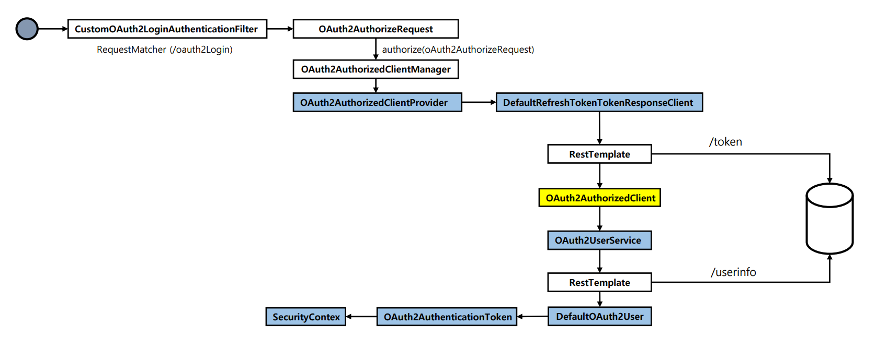

# oauth2Client() - 필터 기반 구현

> 스프링 시큐리티의 `oauth2Login()` 필터에 의한 자동 인증 처리를 하지 않고 `DefaultOAuth2AuthorizedClientManager` 클래스를 사용하여 Spring MVC에서 직접
> 인증처리를 하는 로그인 기능을 구현한다.

### 기본 구성

- `AppConfig` : `DefaultOAuth2AuthorizedClientManager` 빈 생성 및 설정 초기화
- `DefaultOAuth2AuthorizedClientManager` : OAuth2 권한 부여 흐름 처리
- `LoginController` : `DefaultOAuth2AuthorizedClientManager`를 사용해서 로그인 처리

### 로그인 구현 순서

1. `DefaultOAuth2AuthorizedClientManager` 빈 생성 및 파라미터 초깃값 정의
2. 권한 부여 유형에 따라 요청이 이루어지도록 `application.yml` 설정 조정
3. `/oauth2Login` 주소로 권한 부여 흐름 요청
4. `DefaultOAuth2AuthorizedClientManager` 에게 권한 부여 요청
5. 권한 부여가 성공하면 `OAuth2AuthenticationSuccessHandler`를 호출하여 인증 이후 작업 진행
    - `DefaultOAuth2AuthorizedClientManager`의 최종 반환값인 **OAuth2AuthorizedClient**를 `OAuth2AuthorizedClientRepository`에 저장
6. **OAuth2AuthorizedClient** 에서 `AccessToken`을 참조하여 `/userinfo` 엔드포인트 요청으로 최종 사용자 정보를 가져온다.
7. 사용자 정보와 권한을 가지고 인증객체를 만든 후 `SecurityContext`에 저장하고 인증 완료
8. 인증이 성공하면 위 과정을 커스텀 필터를 만들어 처리하도록 한다.



---

## 예제 코드

### CustomOAuth2AuthenticationFilter

```java
public class CustomOAuth2AuthenticationFilter extends AbstractAuthenticationProcessingFilter {

    public static final String DEFAULT_FILTER_PROCESSING_URI = "/oauth2Login/**";
    private final DefaultOAuth2AuthorizedClientManager oAuth2AuthorizedClientManager;
    private final OAuth2AuthorizationSuccessHandler successHandler;

    public CustomOAuth2AuthenticationFilter(DefaultOAuth2AuthorizedClientManager oAuth2AuthorizedClientManager,
                                            OAuth2AuthorizedClientRepository oAuth2AuthorizedClientRepository) {
        super(DEFAULT_FILTER_PROCESSING_URI);
        this.oAuth2AuthorizedClientManager = oAuth2AuthorizedClientManager;

        this.successHandler = (authorizedClient, principal, attributes) -> {
            oAuth2AuthorizedClientRepository
                .saveAuthorizedClient(authorizedClient, principal,
                    (HttpServletRequest) attributes.get(HttpServletRequest.class.getName()),
                    (HttpServletResponse) attributes.get(HttpServletResponse.class.getName())
                );
        };

        oAuth2AuthorizedClientManager.setAuthorizationSuccessHandler(successHandler);
        setSecurityContextRepository(new DelegatingSecurityContextRepository(
            new RequestAttributeSecurityContextRepository(),
            new HttpSessionSecurityContextRepository()
        ));
    }

    @Override
    public Authentication attemptAuthentication(HttpServletRequest request, HttpServletResponse response) throws AuthenticationException, IOException, ServletException {

        Authentication authentication = SecurityContextHolder.getContextHolderStrategy()
                                                             .getContext().getAuthentication();

       // 필터 단계에서는 Authentication이 아직 null일 수 있다.
       // 따라서 익명 객체를 선언해준다.
        if (authentication == null) {
            authentication = new AnonymousAuthenticationToken(
                "anonymous",
                "anonymousUser",
                AuthorityUtils.createAuthorityList("ROLE_ANONYMOUS")
            );
        }

        OAuth2AuthorizeRequest authorizeRequest = OAuth2AuthorizeRequest
                                                  .withClientRegistrationId("keycloak")
                                                  .principal(authentication)
                                                  .attribute(HttpServletRequest.class.getName(), request)
                                                  .attribute(HttpServletResponse.class.getName(), response)
                                                  .build();

        OAuth2AuthorizedClient authorizedClient = oAuth2AuthorizedClientManager.authorize(authorizeRequest);

        if (authorizedClient != null) {
            ClientRegistration clientRegistration = authorizedClient.getClientRegistration();
            OAuth2AccessToken accessToken = authorizedClient.getAccessToken();

            OAuth2UserService<OAuth2UserRequest, OAuth2User> oAuth2UserService = new DefaultOAuth2UserService();
            OAuth2User oAuth2User = oAuth2UserService.loadUser(new OAuth2UserRequest(clientRegistration, accessToken));

            OAuth2AuthenticationToken oAuth2AuthenticationToken = new OAuth2AuthenticationToken(
                oAuth2User,
                oAuth2User.getAuthorities(),
                clientRegistration.getRegistrationId()
            );

            SecurityContextHolder.getContextHolderStrategy()
                                 .getContext().setAuthentication(oAuth2AuthenticationToken);

            // oAuth2AuthorizedClientManager.authorize() 에서 저장해주는 로직은 있지만, 이때는 pincipal이 anonymous 상태다.
            // 완전히 인증 객체를 만들고 나서 다시 저장해준다.
            this.successHandler.onAuthorizationSuccess(
                authorizedClient,
                oAuth2AuthenticationToken,
                createAttributes(request, response)
            );

            return oAuth2AuthenticationToken;
        }

        return authentication;
    }
    
    private static Map<String, Object> createAttributes(HttpServletRequest servletRequest,
                                                        HttpServletResponse servletResponse) {
        Map<String, Object> attributes = new HashMap<>();
        attributes.put(HttpServletRequest.class.getName(), servletRequest);
        attributes.put(HttpServletResponse.class.getName(), servletResponse);
        return attributes;
    }
}
```

### SecurityConfig

```java
@Configuration
@EnableWebSecurity
@RequiredArgsConstructor
public class OAuth2ClientConfig {

    private final DefaultOAuth2AuthorizedClientManager oAuth2AuthorizedClientManager;
    private final OAuth2AuthorizedClientRepository oAuth2AuthorizedClientRepository;

    @Bean
    public SecurityFilterChain securityFilterChain(HttpSecurity http) throws Exception {
        http
                .authorizeHttpRequests(request -> request
                        .requestMatchers("/","/oauth2Login", "/client", "/favicon.*", "/error").permitAll()
                        .anyRequest().authenticated()
                )
                .oauth2Client(Customizer.withDefaults())
                .addFilterBefore(customOAuth2AuthenticationFilter(), UsernamePasswordAuthenticationFilter.class);
        ;

        return http.build();
    }

    private CustomOAuth2AuthenticationFilter customOAuth2AuthenticationFilter() {
        CustomOAuth2AuthenticationFilter oAuth2AuthenticationFilter =
                new CustomOAuth2AuthenticationFilter(oAuth2AuthorizedClientManager, oAuth2AuthorizedClientRepository);
        oAuth2AuthenticationFilter.setAuthenticationSuccessHandler((request, response, authentication) -> {
            response.sendRedirect("/home");
        });

        return oAuth2AuthenticationFilter;
    }

}
```

### 컨트롤러

```java
@RestController
@RequiredArgsConstructor
public class HomeController {

    private final OAuth2AuthorizedClientService oAuth2AuthorizedClientService;

   @GetMapping("/home")
   public OAuth2AuthorizedClient home(OAuth2AuthenticationToken authentication) {

      OAuth2AuthorizedClient authorizedClient =
              oAuth2AuthorizedClientService.loadAuthorizedClient("keycloak", authentication.getName());

      return authorizedClient;
   }
}
```
---

[이전 ↩️ - OAuth 2.0 Client(oauth2Client) - DefaultOAuth2AuthorizedClientManager - `Refresh Token` 권한 부여 구현](https://github.com/genesis12345678/TIL/blob/main/Spring/security/oauth/OAuth2Client/Refresh%20Token.md)

[메인 ⏫](https://github.com/genesis12345678/TIL/blob/main/Spring/security/oauth/main.md)

[다음 ↪️ - OAuth 2.0 Client(oauth2Client) - @RegisteredOAuth2AuthorizedClient 활용](https://github.com/genesis12345678/TIL/blob/main/Spring/security/oauth/OAuth2Client/%40RegisteredOAuth2AuthorizedClient.md)