# oauth2Client() - OAuth2AuthorizedClient

- `OAuth2AuthorizedClient`는 **인가받은 클라이언트**를 의미하는 클래스다.
- 최종 사용자(리소스 소유자)가 클라이언트에게 리소스에 접근할 수 있는 권한을 부여하면, 클라이언트를 인가된 클라이언트로 간주한다.
- `OAuth2AuthorizedClient`는 **AccessToken**과 **RefreshToken**을 `ClientRegistration`(클라이언트)과 권한을 부여한 최종 사용자인 `Principal`과 함께 묶어준다.
- `OAuth2AuthorizedClient`의 **AccessToken**을 사용해서 리소스 서버의 자원을 접근 할 수 있으며 인가 서버와의 통신으로 토큰을 검증할 수 있다.
- `OAuth2AuthorizedClient`의 **ClientRegistration**과 **AccessToken**을 사용해서 `UserInfo` 엔드 포인트로 요청할 수 있다.

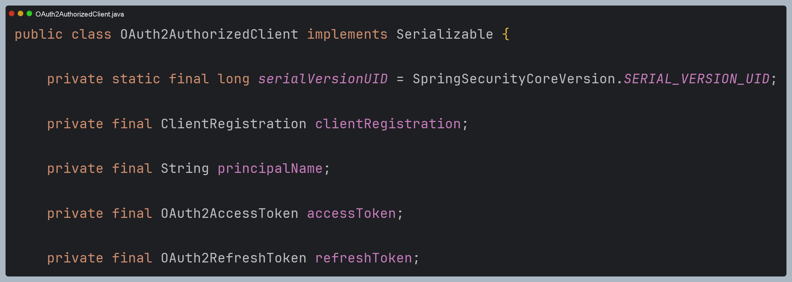

---

## OAuth2AuthorizedClientRepository

- `OAuth2AuthorizedClientRepository`는 다른 웹 요청이 와도 동일한 `OAuth2AuthorizedClient`를 유지하는 역할을 담당한다.
- **OAuth2AuthorizedClientService**에게 `OAuth2AuthorizedClient`의 저장, 조회, 삭제 처리를 위임한다.

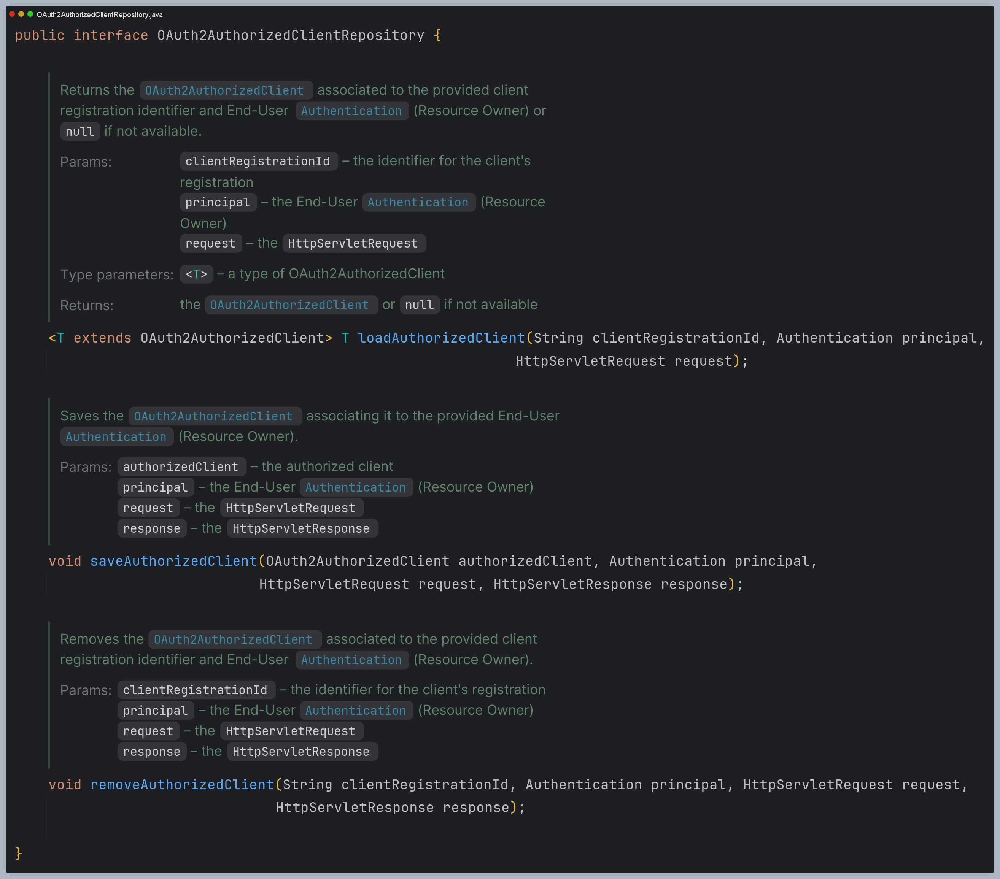

## OAuth2AuthorizedClientService

- `OAuth2AuthorizedClientService`은 애플리케이션 레벨에서 `OAuth2AuthorizedClient`를 관리(저장, 조회, 삭제)를 한다.

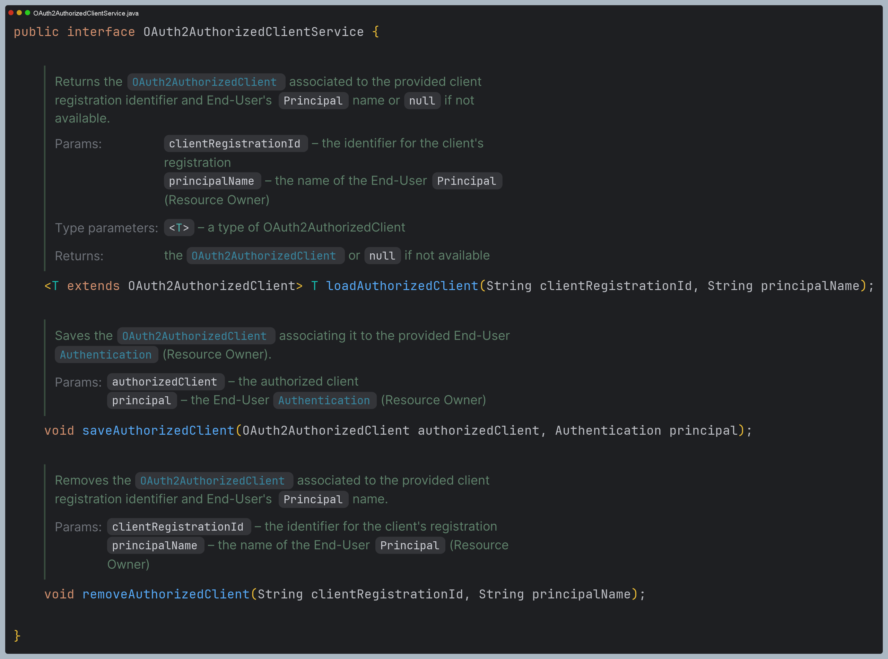

### 웹 애플리케이션에서 활용

> - [OAuth2 Client 자동 설정 초기화](https://github.com/genesis12345678/TIL/blob/main/Spring/security/oauth/OAuthClient/AutoConfig.md) 과정에서 `OAuth2AuthorizedClientRepository`과 `OAuth2AuthorizedClientService`가 스프링 빈으로 등록된다.
> - `OAuth2AuthorizedClientRepository`나 `OAuth2AuthorizedClientService`를 통해 **OAuth2AuthorizedClient**를 얻을 수 있다.
> - **OAuth2AuthorizedClient**에서 `OAuth2AccessToken`을 찾을 수 있는 기능을 제공하므로 보호 중인 리소스 요청을 시작할 때 사용할 수 있다.
> 
> 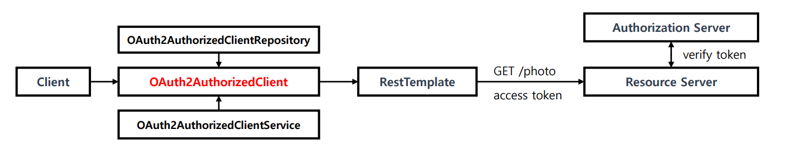

---

## OAuth2AuthorizationCodeGrantFilter

- **Authorization Code Grant** 방식으로 권한 부여 요청을 지원하는 필터
- 인가 서버로부터 리다이렉트 되면서 전달된 `code`를 인가 서버의 **Access Token**으로 교환한다.
- `OAuth2AuthorizedClientRepository`를 사용해서 **OAuth2AuthorizedClient**를 저장 후 클라이언트의 `Redirect Uri`로 이동한다.

**실행 조건**

- 요청 파라미터에 `code`와 `state` 값이 존재하는지 확인
- `OAuth2AuthorizationRequest` 객체가 존재하는지 확인

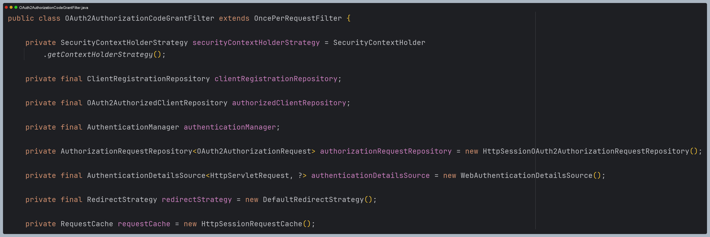

---

## 예제 코드

### Controller

```java
@Controller
@RequiredArgsConstructor
public class HomeController {

    private final OAuth2AuthorizedClientRepository oAuth2AuthorizedClientRepository;
    private final OAuth2AuthorizedClientService oAuth2AuthorizedClientService;

    @GetMapping("/client")
    public String client(HttpServletRequest request, Model model) {

        //익명 객체
        Authentication authentication = SecurityContextHolder.getContextHolderStrategy().getContext().getAuthentication();

        String registrationId = "keycloak";

        OAuth2AuthorizedClient repositoryAuthorizedClient =
            oAuth2AuthorizedClientRepository.loadAuthorizedClient(registrationId, authentication, request);

        OAuth2AuthorizedClient serviceAuthorizedClient =
            oAuth2AuthorizedClientService.loadAuthorizedClient(registrationId, authentication.getName());

        //UserInfo 엔드포인트 요청
        ClientRegistration clientRegistration = repositoryAuthorizedClient.getClientRegistration();
        OAuth2AccessToken accessToken = repositoryAuthorizedClient.getAccessToken();

        OAuth2UserService<OAuth2UserRequest, OAuth2User> oAuth2UserService = new DefaultOAuth2UserService();
        OAuth2User oAuth2User = oAuth2UserService.loadUser(new OAuth2UserRequest(clientRegistration, accessToken));

        //최종 인증 객체 생성
        OAuth2AuthenticationToken oAuth2AuthenticationToken = new OAuth2AuthenticationToken(
            oAuth2User,
            List.of(new SimpleGrantedAuthority("ROLE_USER")),
            clientRegistration.getRegistrationId()
        );

        //최종 인증 객체 SecurityContext에 저장
        SecurityContextHolder.getContextHolderStrategy().getContext().setAuthentication(oAuth2AuthenticationToken); //인증 객체 저장

        model.addAttribute("principalName", oAuth2User.getName());
        model.addAttribute("clientName", repositoryAuthorizedClient.getClientRegistration().getClientName());
        model.addAttribute("accessToken", accessToken.getTokenValue());
        model.addAttribute("refreshToken", repositoryAuthorizedClient.getRefreshToken().getTokenValue());

        return "client";
    }
}
```

### HTML

```html
<!DOCTYPE html SYSTEM "http://www.thymeleaf.org/dtd/xhtml1-strict-thymeleaf-4.dtd">
<html xmlns="http://www.w3.org/1999/xhtml"
      xmlns:th="http://www.thymeleaf.org"
      xmlns:sec="http://www.thymeleaf.org/extras/spring-security">

<head>
    <meta charset="UTF-8">
    <title>Insert title here</title>

</head>
<body>
<div>Welcome</div><p></p>
<div sec:authorize="isAuthenticated()"><a th:href="@{/logout}">Logout</a></div><br>
<div sec:authorize="isAuthenticated()">principalName: <span th:text="${principalName}">인가받은 클라이언트</span></div><br>
<div sec:authorize="isAuthenticated()">clientName: <span th:text="${clientName}">인가받은 클라이언트</span></div><br>
<div sec:authorize="isAuthenticated()">accessToken: <span th:text="${accessToken}">인가받은 클라이언트</span></div><br>
<div sec:authorize="isAuthenticated()">refreshToken: <span th:text="${refreshToken}">인가받은 클라이언트</span></div><br>
</body>
</html>
```

### yml

```yaml
spring:
  security:
    oauth2:
      client:
        registration: # 클라이언트 설정
          keycloak:
            client-id: oauth2-client-app
            client-secret: 9KNAzAnHOBURT3vQHuJFkVqz468KJalY
            redirect-uri: http://localhost:8081/client      # 수정
            client-name: oauth2-client-app
            authorization-grant-type: authorization_code
            client-authentication-method: client_secret_basic
            scope:
              - openid
              - profile
            provider: keycloak

        provider: # 공급자 설정
          keycloak:
            authorization-uri: http://localhost:8080/realms/oauth2/protocol/openid-connect/auth # OAuth 2.0 권한 코드 부여 엔드포인트
            token-uri: http://localhost:8080/realms/oauth2/protocol/openid-connect/token        # OAuth 2.0 토큰 엔드포인트
            issuer-uri: http://localhost:8080/realms/oauth2                                     # 서비스 공급자 위치
            user-info-uri: http://localhost:8080/realms/oauth2/protocol/openid-connect/userinfo # OAuth 2.0 UserInfo 엔드포인트
            jwk-set-uri: http://localhost:8080/realms/oauth2/protocol/openid-connect/certs      # OAuth 2.0 JwkSetUri 엔드포인트
            user-name-attribute: sub                                                            # OAuth 2.0 사용자명을 추출하는 클레임명
```

# 과정 디버깅

## 1. OAuth2AuthorizationRequestRedirectFilter

- 사용자 승인을 할 수 있는 url로 리다이렉트 한다.

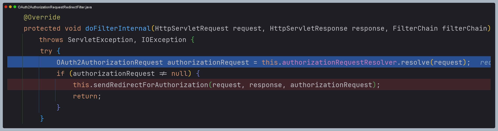

## 2. OAuth2AuthorizationCodeGrantFilter

- 리다이렉션 되어 이 필터로 왔다.
- 특정 조건에 만족하면 특정 처리를 하고 다음 필터로 가지 않고, 만족하지 않으면 다음 필터로 넘어간다.

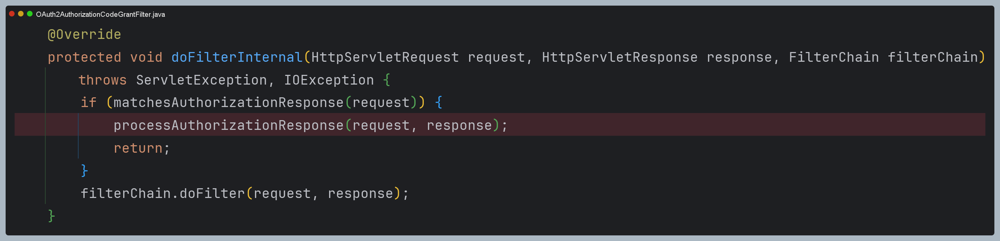

- 요청 파라미터에 `code`와 `state`가 존재하는지 보고, `OAuth2AuthorizationRequest`가 존재하는지 확인한다.

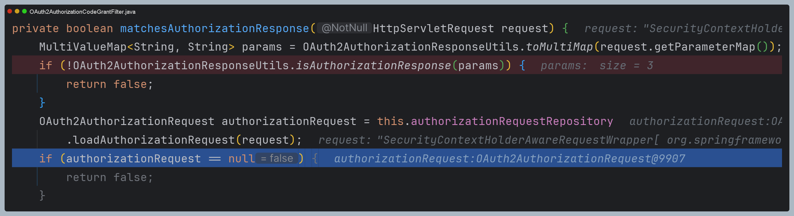

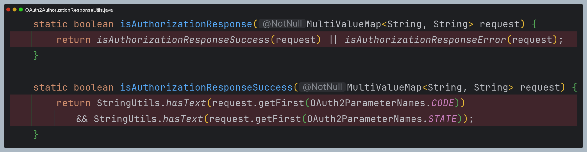

- `redirect_uri`를 비교한다.

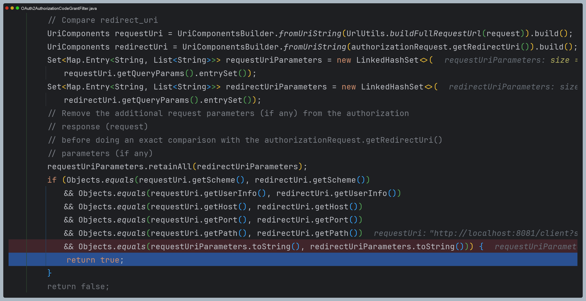

- 모든 조건을 만족하면 다음 코드를 실행한다.
- 먼저 `AuthenticationManager(ProviderManager)`에게 인증 요청을 위임한다.
- 여기서 사용되는 `AuthenticationProvider`는 `OAuth2AuthorizationCodeAuthenticationProvider`로 여기서
인가 서버와 통신하여 `Access Token` 교환이 이루어진다.

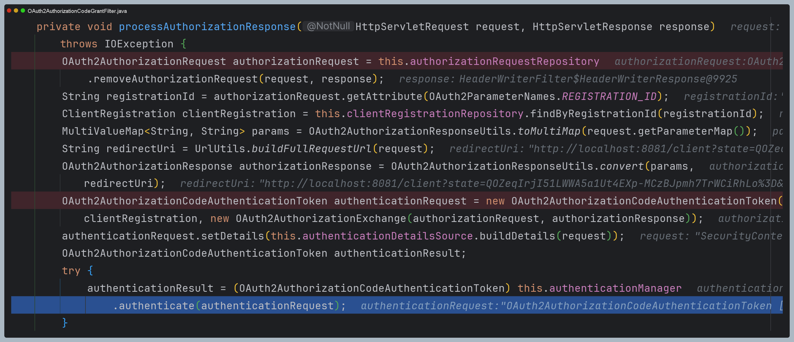

- 그리고 `OAuth2AuthorizedClient`를 저장하고, `redirectUrl`로 리다이렉트 한다.
- 여기서 `redirectUrl`은 `application.yml` 파일에서 설정한 경로이다.

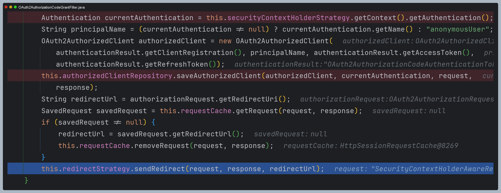

## 3. controller

- 그리고 나서 스프링 MVC로 넘어온다.
- 여기로 리다이렉션 되어 요청이 왔다는 것은 클라이언트가 인가 서버로부터 인가를 받은 상태에서 온 것이다.
- 하지만 최종 사용자의 인증 처리가 된 것은 아니기 때문에 `SecurityContextHolder` 에서 꺼낸 `Authentication`은 아직 "Anonymous" 이다.
- 그래서 `DefaultOAuth2UserService`에게 `UserInfo` 엔드포인트 요청을 보내 사용자 정보를 얻고 `SecurityContextHolder`에 저장해 주었다.
- 참고로 기본으로 빈으로 등록되는 `OAuth2AuthorizedClientRepository` 구현체는 익명 사용자이더라도 **principalName**을
`anonymousUser`로 해서 반환하지만 `OAuth2AuthorizedClientService` 구현체는 그렇지 않기 때문에 `null`이다.

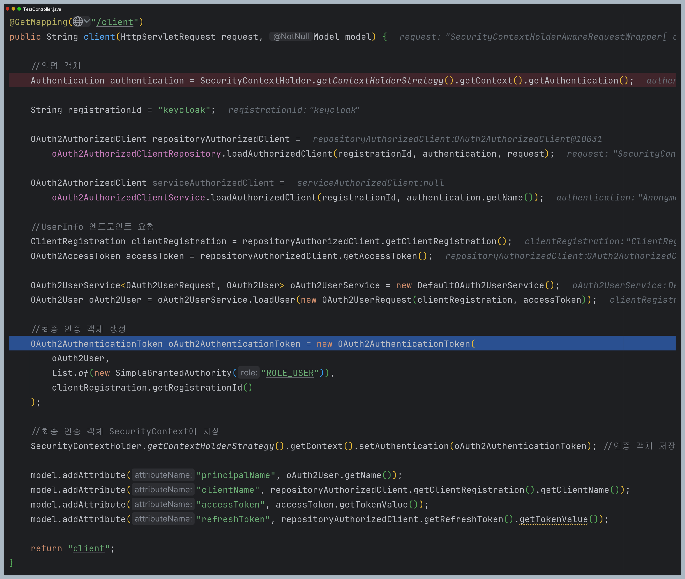

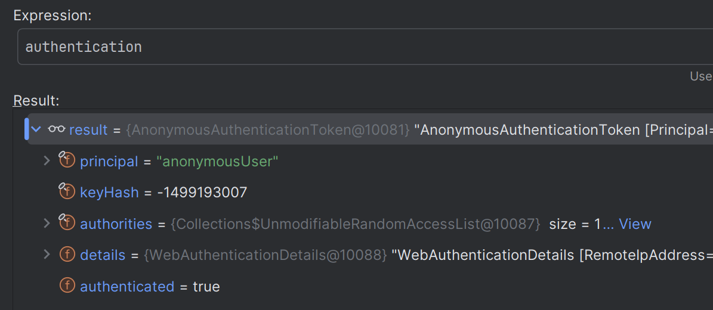

---

[이전 ↩️ - OAuth 2.0 Client(oauth2Client) - OAuth2ClientConfigurer 초기화](https://github.com/genesis12345678/TIL/blob/main/Spring/security/oauth/OAuth2Client/OAuth2ClientConfigurer.md)

[메인 ⏫](https://github.com/genesis12345678/TIL/blob/main/Spring/security/oauth/main.md)

[다음 ↪️ - OAuth 2.0 Client(oauth2Client) - DefaultOAuth2AuthorizedClientManager](https://github.com/genesis12345678/TIL/blob/main/Spring/security/oauth/OAuth2Client/DefaultOAuth2AuthorizedClientManager.md)