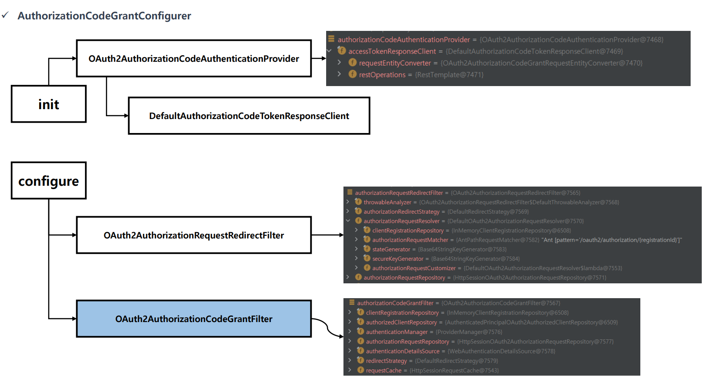
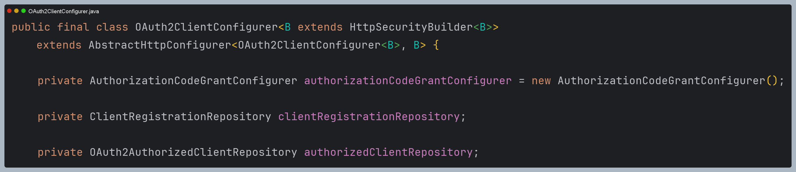
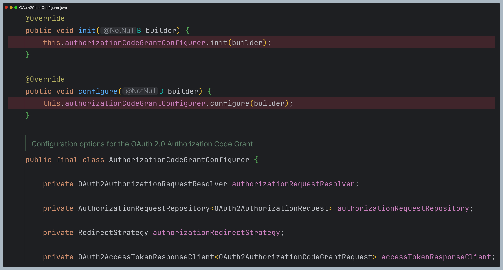
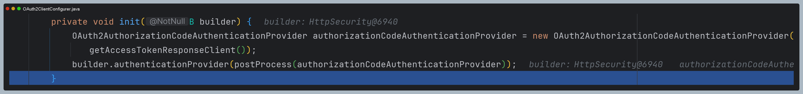
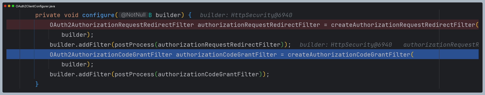
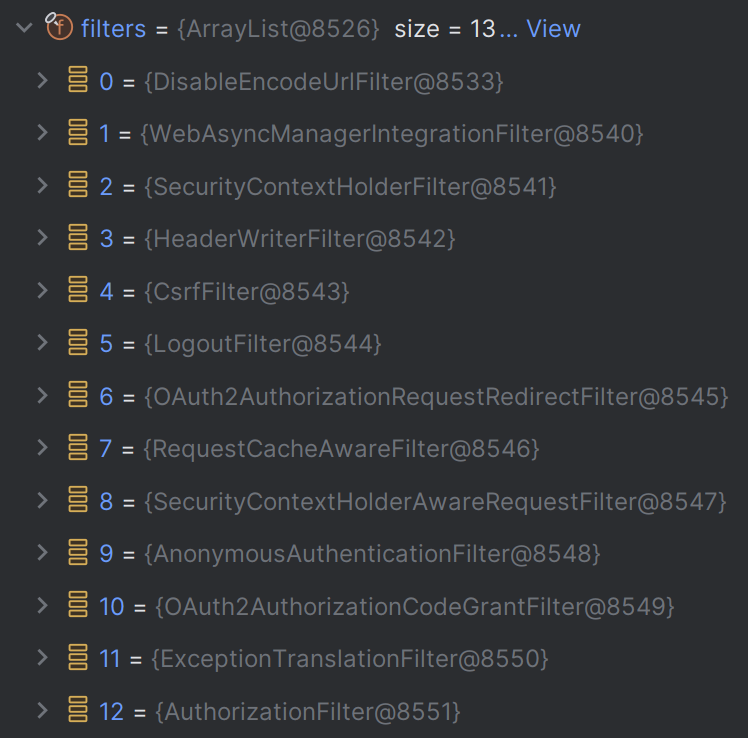

# oauth2Client() - OAuth2ClientConfigurer 초기화



> - `oauth2Client()`는 **AuthorizationCodeGrantConfigurer**를 호출하면서 위 클래스들을 생성한다.
> - `OAuth2AuthorizationCodeGrantFilter`를 제외한 나머지 클래스들은 [권한 부여 코드 승인 방식](https://github.com/geun-00/TIL/blob/main/Spring/security/oauth/%EA%B6%8C%ED%95%9C%EB%B6%80%EC%97%AC/Authorization.md)에서 인가 서버로 **권한 부여 코드**를 요청할 때 사용하는 클래스다.
> - `OAuth2AuthorizationCodeGrantFilter`는 **액세스 토큰**을 발급받기 위해 사용하는 클래스다.

---

## 초기화 과정 디버깅

```java
@Configuration
@EnableWebSecurity
public class OAuth2ClientConfig {
    
    @Bean
    public SecurityFilterChain securityFilterChain(HttpSecurity http) throws Exception {
        http
                .authorizeHttpRequests(request -> request
                        .anyRequest().authenticated()
                )
//                .oauth2Login(Customizer.withDefaults())
                .oauth2Client(Customizer.withDefaults())
        ;
        return http.build();
    }
}
```

> - `oauth2Login()` : 인가 서버로부터 클라이언트가 인가를 받고, 최종 사용자가 인증 처리를 하는 데까지 기능들을 포함
> - `oauth2Client()` : 인가 서버로부터 클라이언트가 인가를 받는 과정만 처리

- `OAuth2ClientConfigurer`는 `AuthorizationCodeGrantConfigurer`를 내부 클래스로 갖고 있으며 초기화 메서드를 호출만 한다.





- `init()` 메서드에서는 `OAuth2AuthorizationCodeAuthenticationProvider`를 초기화하고 저장한다.



- `configure()` 메서드에서는 `OAuth2AuthorizationRequestRedirectFilter`와 `OAuth2AuthorizationCodeGrantFilter`를
초기화하고 저장한다.



- [`oauth2Login(https://github.com/geun-00/TIL/blob/main/Spring/security/oauth/OAuth2Login/OAuth2LoginConfigurer.md)` 초기화로 생성되는 필터]()와 비교했을 때
`OAuth2LoginAuthenticationFilter`와 같은 인증 처리를 하는 필터가 생성되지 않는다.
- 즉 `oauth2Client()` 설정은 최종 사용자의 인증 처리는 제공하지 않는다.



---

[메인 ⏫](https://github.com/genesis12345678/TIL/blob/main/Spring/security/oauth/main.md)

[다음 ↪️ - OAuth 2.0 Client(oauth2Client) - OAuth2AuthorizedClient](https://github.com/genesis12345678/TIL/blob/main/Spring/security/oauth/OAuth2Client/OAuth2AuthorizedClient.md)