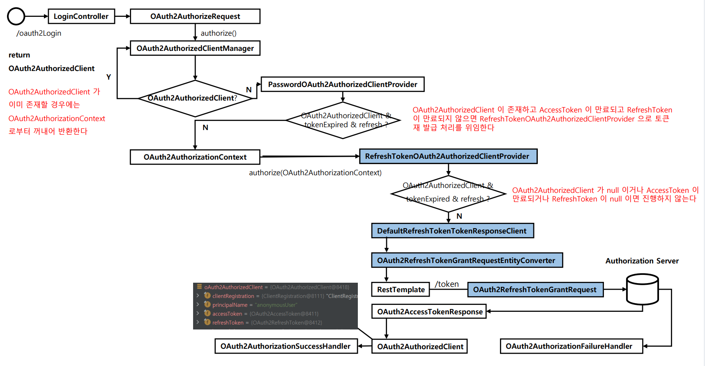
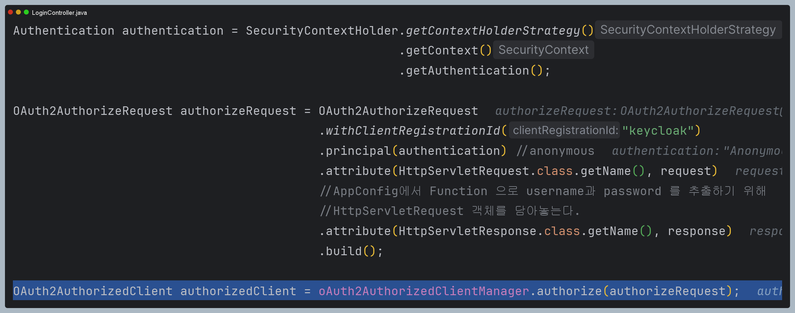
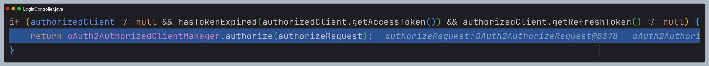
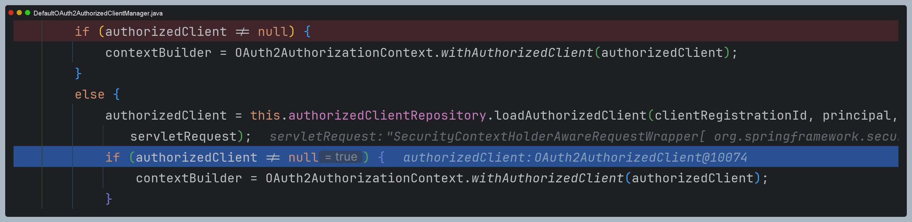
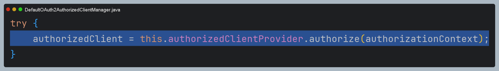
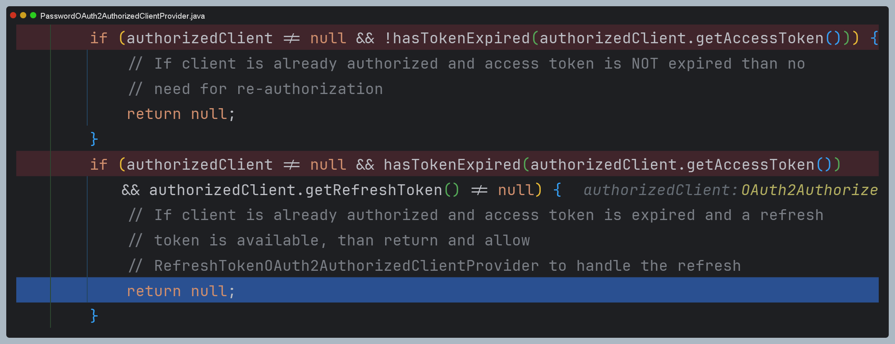
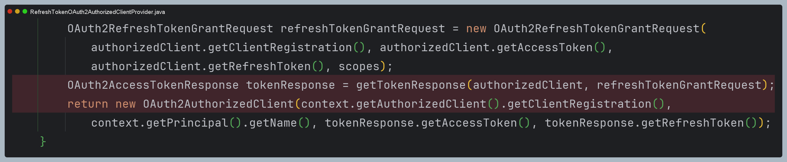
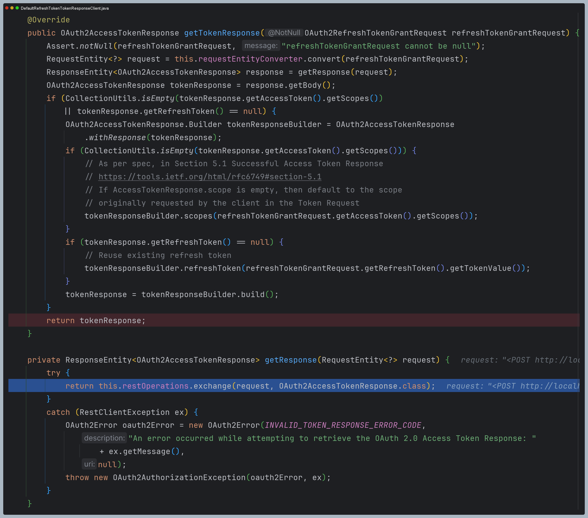
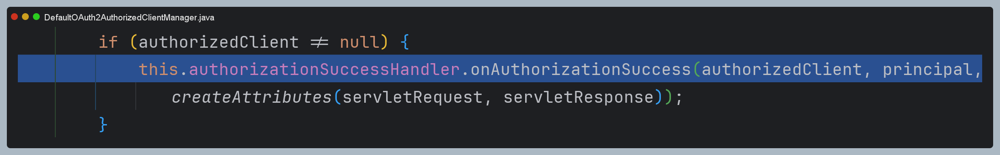
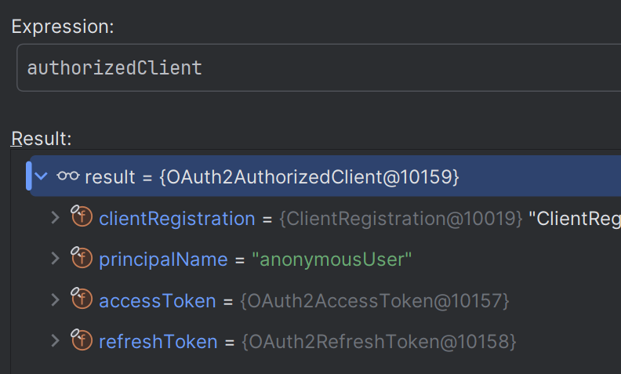

# oauth2Client() - Refresh Token

> 스프링 시큐리티의 `oauth2Login()` 필터에 의한 자동 인증 처리를 하지 않고 `DefaultOAuth2AuthorizedClientManager` 클래스를 사용하여 Spring MVC에서 직접
> 인증처리를 하는 로그인 기능을 구현한다.

### 기본 구성

- `AppConfig` : `DefaultOAuth2AuthorizedClientManager` 빈 생성 및 설정 초기화
- `DefaultOAuth2AuthorizedClientManager` : OAuth2 권한 부여 흐름 처리
- `LoginController` : `DefaultOAuth2AuthorizedClientManager`를 사용해서 로그인 처리

### 로그인 구현 순서

1. `DefaultOAuth2AuthorizedClientManager` 빈 생성 및 파라미터 초깃값 정의
2. 권한 부여 유형에 따라 요청이 이루어지도록 `application.yml` 설정 조정
3. `/oauth2Login` 주소로 권한 부여 흐름 요청
4. `DefaultOAuth2AuthorizedClientManager` 에게 권한 부여 요청
5. 권한 부여가 성공하면 `OAuth2AuthenticationSuccessHandler`를 호출하여 인증 이후 작업 진행
    - `DefaultOAuth2AuthorizedClientManager`의 최종 반환값인 **OAuth2AuthorizedClient**를 `OAuth2AuthorizedClientRepository`에 저장
6. **OAuth2AuthorizedClient** 에서 `AccessToken`을 참조하여 `/userinfo` 엔드포인트 요청으로 최종 사용자 정보를 가져온다.
7. 사용자 정보와 권한을 가지고 인증객체를 만든 후 `SecurityContext`에 저장하고 인증 완료
8. 인증이 성공하면 위 과정을 커스텀 필터를 만들어 처리하도록 한다.



---

## 예제 코드

### application.yml

```yaml
spring:
  security:
    oauth2:
      client:
        registration: # 클라이언트 설정
          keycloak:
            client-id: oauth2-client-app
            client-secret: 9KNAzAnHOBURT3vQHuJFkVqz468KJalY
            client-name: oauth2-client-app
            authorization-grant-type: password
            client-authentication-method: client_secret_basic
            scope:
              - openid
              - profile
            provider: keycloak

        provider: # 공급자 설정
          keycloak:
            authorization-uri: http://localhost:8080/realms/oauth2/protocol/openid-connect/auth # OAuth 2.0 권한 코드 부여 엔드포인트
            token-uri: http://localhost:8080/realms/oauth2/protocol/openid-connect/token        # OAuth 2.0 토큰 엔드포인트
            issuer-uri: http://localhost:8080/realms/oauth2                                     # 서비스 공급자 위치
            user-info-uri: http://localhost:8080/realms/oauth2/protocol/openid-connect/userinfo # OAuth 2.0 UserInfo 엔드포인트
            jwk-set-uri: http://localhost:8080/realms/oauth2/protocol/openid-connect/certs      # OAuth 2.0 JwkSetUri 엔드포인트
            user-name-attribute: sub                                                            # OAuth 2.0 사용자명을 추출하는 클레임명
```

### AppConfig

```java
@Configuration
public class AppConfig {

    @Bean
    public DefaultOAuth2AuthorizedClientManager oAuth2AuthorizedClientManager(ClientRegistrationRepository clientRegistrationRepository,
                                                                       OAuth2AuthorizedClientRepository oAuth2AuthorizedClientRepository) {

        /**
         * 리프레시 토큰 테스트를 위해 clockSkew의 충분히 큰 시간을 설정해 준다.
         * 인가 서버의 액세스 토큰 유효 시간은 5분이며,
         * 패스워드 방식과 리프레시 토큰 방식은 액세스 토큰의 기간에서 clockSkew 의 설정된 값을 뺀 시간으로 판단한다.
         * 액세스 토큰 만료 테스트를 위해 토큰을 받자마자 종료되게 설정한다.
         */
        OAuth2AuthorizedClientProvider oAuth2AuthorizedClientProvider = OAuth2AuthorizedClientProviderBuilder.builder()
                .authorizationCode()
                .password(passwordGrantBuilder -> passwordGrantBuilder.clockSkew(Duration.ofSeconds(3600)))
                .refreshToken(refreshTokenGrantBuilder -> refreshTokenGrantBuilder.clockSkew(Duration.ofSeconds(3600)))
                .clientCredentials()
                .build();

        DefaultOAuth2AuthorizedClientManager oAuth2AuthorizedClientManager =
                new DefaultOAuth2AuthorizedClientManager(clientRegistrationRepository, oAuth2AuthorizedClientRepository);

        oAuth2AuthorizedClientManager.setAuthorizedClientProvider(oAuth2AuthorizedClientProvider);
        oAuth2AuthorizedClientManager.setContextAttributesMapper(contextAttributesMapper());

        return oAuth2AuthorizedClientManager;
    }

    /**
     * Function<T, R>
     * T 받아서 R 리턴
     * @return : Map<String, Object>
     */
    private Function<OAuth2AuthorizeRequest, Map<String, Object>> contextAttributesMapper() {
        return oAuth2AuthorizeRequest -> {
            Map<String, Object> contextAttributes = new HashMap<>();

            HttpServletRequest request = oAuth2AuthorizeRequest.getAttribute(HttpServletRequest.class.getName());

            // OAuth2ParameterNames : 스프링 시큐리티가 제공하는 클래스
            String username = request.getParameter(OAuth2ParameterNames.USERNAME);
            String password = request.getParameter(OAuth2ParameterNames.PASSWORD);

            if (StringUtils.hasText(username) && StringUtils.hasText(password)) {
                
                //OAuth2AuthorizationContext : 스프링 시큐리티가 제공하는 클래스
                contextAttributes.put(OAuth2AuthorizationContext.USERNAME_ATTRIBUTE_NAME, username);
                contextAttributes.put(OAuth2AuthorizationContext.PASSWORD_ATTRIBUTE_NAME, password);
            }

            return contextAttributes;
        };
    }
}
```

### 컨트롤러

```java
@RestController
@RequiredArgsConstructor
public class LoginController {

    private final DefaultOAuth2AuthorizedClientManager oAuth2AuthorizedClientManager;
    private final Duration clockSkew = Duration.ofSeconds(3600);
    private final Clock clock = Clock.systemUTC();

   /**
    * Refresh Token
    */
   @GetMapping("/password")
   public OAuth2AuthorizedClient password(HttpServletRequest request, HttpServletResponse response) {

       Authentication authentication = SecurityContextHolder.getContextHolderStrategy()
                                                            .getContext()
                                                            .getAuthentication();

       OAuth2AuthorizeRequest authorizeRequest = OAuth2AuthorizeRequest
           .withClientRegistrationId("keycloak")
           .principal(authentication) //anonymous
           .attribute(HttpServletRequest.class.getName(), request)
           //AppConfig에서 Function 으로 username과 password 를 추출하기 위해
           //HttpServletRequest 객체를 담아놓는다.
           .attribute(HttpServletResponse.class.getName(), response)
           .build();

       OAuth2AuthorizedClient authorizedClient = oAuth2AuthorizedClientManager.authorize(authorizeRequest);
       
       //권한 부여 타입을 변경하지 않고 실행
        if (authorizedClient != null && hasTokenExpired(authorizedClient.getAccessToken()) && authorizedClient.getRefreshToken() != null) {
            return oAuth2AuthorizedClientManager.authorize(authorizeRequest);
        }

       //권한 부여 타입을 변경하고 실행
       if (authorizedClient != null && hasTokenExpired(authorizedClient.getAccessToken()) && authorizedClient.getRefreshToken() != null) {

           // ClientRegistration 권한 부여 타입을 refresh token 방식으로 재정의
           ClientRegistration clientRegistration = ClientRegistration
                                                   .withClientRegistration(authorizedClient.getClientRegistration())
                                                   .authorizationGrantType(AuthorizationGrantType.REFRESH_TOKEN)
                                                   .build();

           //OAuth2AuthorizedClient를 재정의한 ClientRegistration에 맞게 재정의
           OAuth2AuthorizedClient oAuth2AuthorizedClient = new OAuth2AuthorizedClient(
               clientRegistration,
               authorizedClient.getPrincipalName(),
               authorizedClient.getAccessToken(),
               authorizedClient.getRefreshToken()
           );

           //OAuth2AuthorizeRequest를 재정의한 OAuth2AuthorizedClient에 맞게 재정의
           authorizeRequest = OAuth2AuthorizeRequest
                              .withAuthorizedClient(oAuth2AuthorizedClient)
                              .principal(authentication)
                              .attribute(HttpServletRequest.class.getName(), request)
                              .attribute(HttpServletResponse.class.getName(), response)
                              .build();

           return oAuth2AuthorizedClientManager.authorize(authorizeRequest);
       }

       return authorizedClient;
   }
    

    @GetMapping("/logout")
    public String logout(Authentication authentication, HttpServletRequest request, HttpServletResponse response) {
        SecurityContextLogoutHandler logoutHandler = new SecurityContextLogoutHandler();
        logoutHandler.logout(request, response, authentication);

        return "redirect:/";
    }

    private boolean hasTokenExpired(OAuth2Token token) {
        return this.clock.instant().isAfter(token.getExpiresAt().minus(this.clockSkew));
    }
}
```

## 과정 디버깅

### 1. 컨트롤러

- 처음에는 **Resource Owner Password** 방식으로 인증이 처리된다.



- 하지만 커스텀 설정으로 인해 바로 `AccessToken`이 만료되었고, 다시 재인가 요청을 보낸다.



### 2. DefaultOAuth2AuthorizedClientManager

- 이미 인증 받았던 기록이 있다.





### 3. PasswordOAuth2AuthorizedClientProvider

- `PasswordOAuth2AuthorizedClientProvider`에 왔지만, 토큰이 만료되었기 때문에 아무런 처리를 하지 않는다.



- 그래서 다음 `OAuth2AuthorizedClientProvider`인 `RefreshTokenOAuth2AuthorizedClientProvider`로 간다.

### 4. RefreshTokenOAuth2AuthorizedClientProvider

- `DefaultRefreshTokenTokenResponseClient`를 호출해 `OAuth2AccessTokenResponse`를 반환 받는다.
- 그리고 `OAuth2AuthorizedClient`를 반환한다.



### 5. DefaultRefreshTokenTokenResponseClient

- 인가 서버와 통신 후 `OAuth2AccessTokenResponse`를 반환한다.



### 6. DefaultOAuth2AuthorizedClientManager

- `authorizationSuccessHandler`를 실행하고 `authorizedClient`를 반환한다.





> - **권한 부여 타입을 변경하고 실행**해도 결과는 같다.
> - 다만 과정에 차이가 있는데, `DelegatingOAuth2AuthorizedClientProvider`에서 `PasswordOAuth2AuthorizedClientProvider`에서
>   토큰 만료를 검사하지 않고 건너뛰어서 바로 `RefreshTokenOAuth2AuthorizedClientProvider`로 간다.
> - 왜냐하면 `ClientRegistration`의 권한 부여 타입을 새롭게 재정의했기 때문이다.
> - 즉 내부적으로 알아서 처리해주기는 하지만 이렇게 중간에 커스텀하게 필요한 값을 변경하거나 추가할 수도 있는 것이다.

---

[이전 ↩️ - OAuth 2.0 Client(oauth2Client) - DefaultOAuth2AuthorizedClientManager - `Client Credentials` 권한 부여 구현](https://github.com/genesis12345678/TIL/blob/main/Spring/security/oauth/OAuth2Client/Client%20Credentials.md)

[메인 ⏫](https://github.com/genesis12345678/TIL/blob/main/Spring/security/oauth/main.md)

[다음 ↪️ - OAuth 2.0 Client(oauth2Client) - DefaultOAuth2AuthorizedClientManager - 필터 기반 구현](https://github.com/genesis12345678/TIL/blob/main/Spring/security/oauth/OAuth2Client/Filter.md)